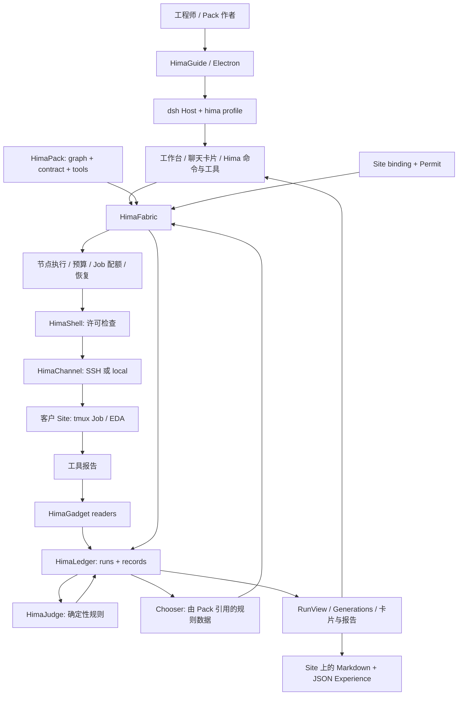

# HimaHarness：产品与代码架构初步理解

本文件保留初次调研快照。后续用户已明确：产品核心价值是扩展资深工程师可承担的跨领域研究能力，而非主要优化成熟流程的执行效率；当前目标与架构约束见 [产品访谈](/Users/lluzi/code/hima_harness_reforge_polishing/docs/product-interview.md)。

调研日期：2026-09-10，美国太平洋时间。精确采集时间见 [source-inventory.json](/Users/lluzi/code/hima_harness_reforge_polishing/docs/assessment/2026-09-10/source-inventory.json)。

当前判断：**原型已有能在真实 EDA 环境运行、恢复并记录证据的执行基础；领域方法、Pack 作者体验与 AI 参与机制仍是 Step 4 的主要工作。不能把已有执行基础等同于已经证明了客户需要的探索效果。**

## 1. 调研边界与依据

- 源目录 `/Users/lluzi/code/hima_harness_reforge_claude` 全程只读。本轮未安装依赖、构建、执行产品测试或连接 EDA Site；没有启动、停止或干预 Claude 的开发进程。
- 主体代码阅读以本地 `main` 的 `55e6ba18f5d8fa67c02fe0ac8651a28d7b5ff573` 为基线。该分支相对本地 `origin/main` 跟踪引用领先一个提交，工作区初查干净。
- Step 4 另有两个开发工作树。本轮读取了它们的提交与差异摘要，并查看 model-moment 的部分实现与 fixture 说明；未做完整分支审查。
- 用户准备的 [polishing 仓库](https://github.com/lluzi/hima_harness_reforge_polishing) 已克隆到工作区，初始提交是 `2b84ab2ca784be7c2299b866428032a26a1fe144`。本轮只新增调研材料，尚未复制产品代码。
- 阅读了用户提供的 [Engineering Constitution](</Users/lluzi/Documents/AI Coding Engineering Constitution.md>)，以事实优先、明确语义、最小可逆变更和验证依据作为工作原则。附件与源仓库内的开发指引是理解材料，不能扩大本轮请求或解除源目录只读限制。
- 产品依据是当前原型的 Product Idea、D1–D46、CONTEXT、四份 ADR 与 Step 4 Issue #55。旧 `himaharness` 的 Phase 4 是另一个版本的工作，不能代替这里的四步计划。

证据标记含义：**代码已读**表示静态实现事实；**历史实跑记录**表示原型仓库已有的验收材料，本轮没有重跑；**开发中**表示独立分支已有代码，尚不能当作主分支能力；**待验证**表示下一轮需要用运行行为回答。

## 2. 产品到底做什么

首批用户是使用商业 EDA 流程的 DTCO、后端设计工程师。客户拥有设计、PDK、许可证和计算环境；HimaHarness 帮他们把一个需要多次试验的问题组织成有目标、有边界、有预算、可追溯的 Campaign。

例如：在 AES / TSMC28 上探索定制单元与不同实现策略是否能提高 Fmax。用户选择方法、确认目标与预算后，系统运行工具、读取报告、判断是否满足条件、决定下一步，并把成功或失败的原因留下来。产品不承诺固定 PPA 提升；有依据的未达标结果也是有用交付。

可销售的核心资产有两部分：**HimaPack 承载可复用的工程方法，HimaHarness 承载执行、约束和事实链。** Pack 应包含流程、工具、报告语义、判断规则、策略选择和知识。D46 确认了边界：优先改 Pack 及其工具，只有 Pack 无法表达的通用能力缺口才进入 Harness。

另一个重要用户是 Pack 作者。目标体验是从自然语言与 Golden Flow 出发，通过 `grill → spec → fabric → test → release` 五个阶段形成可读、可检查、可版本化的 Pack。这一作者流程属于产品核心，不能只把工作台表单当作完整产品。

依据：[Product Idea](/Users/lluzi/code/hima_harness_reforge_claude/docs/product-idea.md:7)、[D46](/Users/lluzi/code/hima_harness_reforge_claude/docs/product-decisions.md:86)、[Step 4 总体规格 #55](https://github.com/lluzi/hima_harness_reforge_claude/issues/55)。

## 3. 四个 Step 的实际状态

| Step | 原计划要观察的用户行为 | 当前证据与边界 |
| --- | --- | --- |
| 1：信任链 | 真报告 → typed observation → Judge verdict | 历史实跑记录：通过真实 dsh Host，经 SSH 读取 opene902 报告；setup 全路径 FAIL、reg2reg PASS、hold PASS，并验证重启读回。这里的规则 FAIL 是被正确识别的设计结果，不是验收失败。 |
| 2：一代执行 | 准备独立 workspace → 综合 → 读取 → 判断 → 选择策略 | 历史 JSON 的 17/17 checks 通过。真实综合在请求的 2.07 ns 下得到 −0.16 ns slack，选择下一代 2.28 ns。早期缺少 tools 复制项的失败记录也被保留。 |
| 3：多代 Campaign | Loop、预算、恢复、窗口操作、报告；原验收包含达标或收敛 | 历史 JSON 的 **45/46 checks 通过**；真实运行六代，最终 `ended-budget-exhausted`，唯一失败项是 `ended-goal-met-or-converged`。D45 接受基础设施阶段完成，同时把 Pack 方法与真实收敛留给 Step 4。不能写成“真实多代收敛已完成”。 |
| 4：产品证明 | 作者流程产出 AES/TSMC28 Pack；真实模型、运行中写工具、真实探索；第二个人从窗口完成全流程 | 规格已拆分、Site 探查材料已有、两个基础机制分支正在开发。主分支尚无完整作者流程或 AES Pack，也没有本轮可据以宣称 Step 4 完成的验收记录。 |

来源：[Step 1](/Users/lluzi/code/hima_harness_reforge_claude/docs/validation/2026-09-09-step1-acceptance.md)、[Step 2 原始 JSON](/Users/lluzi/code/hima_harness_reforge_claude/docs/validation/2026-09-09-step2-acceptance.json)、[Step 3 原始 JSON](/Users/lluzi/code/hima_harness_reforge_claude/docs/validation/2026-09-10-step3-acceptance-attempt1-failed.json)、[D45](/Users/lluzi/code/hima_harness_reforge_claude/docs/product-decisions.md:84)。

**文档差异：**D45 摘要写的是 30/31 checks，而当前同名验收 JSON 为 45 pass、1 fail，`outcome` 为 `1 of 46 checks failed`。本报告使用原始 JSON 的数量；差异不改变未收敛的结论。该 JSON 记录的执行提交为 `01653b776d433e85bc86506edce9090811427cac`，并非本轮阅读的主分支 HEAD。

收敛失败的因果链在记录中很清楚：第一代请求 2.07 ns，slack 为 −0.16 ns；后续请求 2.28、2.33、2.38、2.43、2.48 ns，报告的 slack 均为 0。`timing-push` 的 PASS 分支按 `period − slack + 0.05` 计算，于是持续放宽周期。第六代的下一步决策为 2.53 ns，但没有执行。这个观察说明当前 chooser 没有完成这次探索，不应外推成任何设计或 EDA 工具的通用定律。

主分支已加入 `over-constraining-push` 和相应本地测试代码，但仍由 `opene902-timing-probe` 使用原 `timing-push`，保留既有失败证据的语义。本地替身上的行为与真实 AES Pack 的效果须分开验证。

## 4. 架构：桌面宿主、Hima 执行语义、客户 Site

技术栈在该基线中是 pnpm workspace、TypeScript/ESM、Node >=24；dsh 依赖固定为 `0.1.5-alpha.1`。`@hima/harness` 同时构建 Host 与浏览器两面，`@hima/desktop` 是 Electron 壳。版本来自仓库声明，不是本轮对上游最新版本的核验。

图表示当前主分支的执行与事实流，不表示模型已经参与每个节点。HimaMind、Workshop 与作者流程是后续增量，不能仅凭产品组件名称视为实现。

### 代码责任地图

| 责任 | 主要入口 | 已读到的实现 |
| --- | --- | --- |
| 桌面进程与 Host 生命周期 | [main.ts](/Users/lluzi/code/hima_harness_reforge_claude/packages/desktop/src/main.ts:375)、[host-launch.ts](/Users/lluzi/code/hima_harness_reforge_claude/packages/desktop/src/host-launch.ts:192)、[hima-home.ts](/Users/lluzi/code/hima_harness_reforge_claude/packages/desktop/src/hima-home.ts) | 准备 dsh home、启动 Host、交换会话、加载页面、显示启动错误；页面没有 preload/IPC，关闭窗口停止 Host。 |
| 插件装配与服务入口 | [index.ts](/Users/lluzi/code/hima_harness_reforge_claude/packages/harness/src/index.ts:199) | 打开 storage domain，初始化 Ledger/Judge，注册 HTTP routes、`/hima` 和 `hima_*` tools，启动恢复。 |
| Pack 语言与 Site 绑定 | [packs.ts](/Users/lluzi/code/hima_harness_reforge_claude/packages/harness/src/packs.ts:477)、[sites.ts](/Users/lluzi/code/hima_harness_reforge_claude/packages/harness/src/sites.ts:112)、[workspace.ts](/Users/lluzi/code/hima_harness_reforge_claude/packages/harness/src/workspace.ts) | schema、图结构、规则引用、工具 argv、输出 reader、输入绑定与 workspace 准备；check 和 prepare 分开。 |
| Campaign 推进 | [fabric.ts](/Users/lluzi/code/hima_harness_reforge_claude/packages/harness/src/fabric.ts:152)、[node-turns.ts](/Users/lluzi/code/hima_harness_reforge_claude/packages/harness/src/node-turns.ts:137)、loops/forks | 驱动 act/judge/explore/wait；revisit 开启下一代，支持一层 drill-down 与分叉后汇合。 |
| 资源、Job 与恢复 | budget、job-cap、jobs、[recovery.ts](/Users/lluzi/code/hima_harness_reforge_claude/packages/harness/src/recovery.ts:91) | 时间与代数边界、每节点重试、同一 Ledger 下 Site 的 Job/许可证计数；通过 Job identity、退出文件与 tmux 状态恢复或取消。 |
| Site 上的执行边界 | [shell.ts](/Users/lluzi/code/hima_harness_reforge_claude/packages/harness/src/shell.ts:63)、[channel.ts](/Users/lluzi/code/hima_harness_reforge_claude/packages/harness/src/channel.ts:37) | 检查读写路径、wrapper；local/SSH 通道、参数引用、命令审计。许可检查不是整个工具进程树的操作系统沙箱。 |
| 事实与判定 | [observe.ts](/Users/lluzi/code/hima_harness_reforge_claude/packages/harness/src/observe.ts:33)、readers、semantics、[ledger.ts](/Users/lluzi/code/hima_harness_reforge_claude/packages/harness/src/ledger.ts:1041)、[judge.ts](/Users/lluzi/code/hima_harness_reforge_claude/packages/harness/src/judge.ts:1) | 报告哈希、reader 身份、typed values、记录序号和引用；Judge 通过唯一 writer capability 写 verdict。 |
| 浏览与报告 | [remote.ts](/Users/lluzi/code/hima_harness_reforge_claude/packages/harness/src/remote.ts:600)、[workbench.ts](/Users/lluzi/code/hima_harness_reforge_claude/packages/harness/src/workbench.ts:1108)、client/HimaRunCard、generations、experience | Ledger 折叠为 RunView；HTTP 工作台与 React 聊天卡片各自渲染，共享数据与文案；结束时在 Site 写 md/json，读回校验哈希。 |

目录清单共 156 个 Git 跟踪文件，其中 Harness source 39 个、Desktop source 5 个、contract test 文件 27 个。数量用于定位阅读范围，不代表覆盖率或质量评分。

### 架构中值得保持的几个决定

1. **明确依赖 dsh 生态。** ADR-0001 选择直接使用稳定接口，仅封装变化较大的接口，并用真实 Host 检验。不能把“换宿主”或“全面去耦”默认当作产品优化。
2. **业务状态只有一份。** Fabric 改变 Run 状态；Ledger 通过 dsh storage domain 持久化 `runs` 和 `records`，当前 domain version 为 13。记录追加，Run 行可推进，故整个 Ledger 不能笼统称作不可变事件日志。界面与报告读取它的投影。
3. **事实与判断有明确来源。** Observation 带原报告 hash、reader 与 typed values；缺失值带原因。Judge 是确定性服务，并非当前已经存在的独立模型评审会话；其独占 verdict writer 能力提供代码层面的职责隔离。
4. **通道与 Job 生命周期分开。** SSH 不可达不能被解释为 Job 失败。恢复需要重新问 Site，而不是仅凭本机状态重启一个可能仍占用许可证的 Job。
5. **HTTP 与桌面边界已有决策。** `/hima/api/` 使用 dsh 的连接/Origin/会话拒绝检查；`/hima/` 提供工作台。两处卡片是两个渲染实现，共享 RunView、文案和测试标记，并非同一个 React 组件直接复用。

依据：[ADR-0001](/Users/lluzi/code/hima_harness_reforge_claude/docs/adr/0001-dsh-seam-coupling.md)、[ADR-0002](/Users/lluzi/code/hima_harness_reforge_claude/docs/adr/0002-hima-remote-over-webserver-routes.md)、[ADR-0003](/Users/lluzi/code/hima_harness_reforge_claude/docs/adr/0003-desktop-window-around-the-hima-profile.md)、[ADR-0004](/Users/lluzi/code/hima_harness_reforge_claude/docs/adr/0004-desktop-driver-as-the-test-seam.md)。

## 5. 一次真实业务请求怎样穿过代码

以当前 shipped Pack 为例：

1. 工程师通过工作台表单或 `/hima run` 给出 Pack、Site、Goal、初始 period、time box、重试和代数限制。HTTP 启动入口通过 `onOpened` 取得这次请求自己的 Run id。
2. `startRun` 加载 Pack/Site，检查合同能否满足。未通过时不创建 Campaign；通过后创建 Run，固定 Goal、初始 Strategy、Budget 等启动事实。
3. `prepareWorkspace` 把 flow 所需文件复制到 Campaign 独立目录，并使用该 Campaign 的容器名称。原 flow 是输入。
4. `drive` 根据 Ledger 上的 current node 分派。Act 工具先争取 Site 配额，经 Permit 检查后在 tmux 中启动 Job；等待完成或按失败类型重试/阻塞。
5. 读报告节点通过 `observe` 取得字节、生成 SHA-256、运行 reader，向同一 Run 追加 observation。
6. Judge 应用 setup 与 goal 两条规则，引用读到的记录。Explore 根据 chooser 数据和历史测量选择新 Strategy、Goal met 或 converged。
7. 若继续，revisit 同时推进节点、Strategy 与 Generation。达到代数或时间限制会报告预算耗尽，不能改写为收敛。
8. 每种最终结束都会尝试写 Experience。若结束已记录而报告未写完，重启恢复负责补齐；读取时检查 Site 文件与 Ledger 上的 hash 是否一致。

对应 Pack：[graph.yml](/Users/lluzi/code/hima_harness_reforge_claude/packs/opene902-timing-probe/graph.yml)、[contract.yml](/Users/lluzi/code/hima_harness_reforge_claude/packs/opene902-timing-probe/contract.yml)。

## 6. Step 4 正在改变什么

| 工作 | 调研快照 | 对 polishing 的含义 |
| --- | --- | --- |
| Pack 自己定义 Strategy | `task/58-pack-strategy`，HEAD `2498d1764920252aac3b72f29d945a81e1c0369b`，相对 main 10 commits；48 个文件有差异 | 已在改 knobs、类型、表单、chooser、ledger 和报告，不能按主分支的单 period 结构重复实施。 |
| 通用 model moment | `task/59-model-moment`，HEAD `8fede79df62a9ac897baa8d8dc641327af470603`，相对 main 19 commits；28 个文件有差异 | 已有 moments、agent preset、session 记录、replay 测试、live-check 脚本。脚本存在不等于真实模型验收通过。 |
| Pack 本地规则/chooser/knowledge、reader 语义 | #57、#61 仍为 open | 主分支 reader/语义/rules/choosers 仍有领域内容放在 Harness bundle 中；D46 已明确演进方向。 |
| Workshop 与作者流程 | #62、#63、#64 仍为 open | 运行中写工具、五阶段技能、版本与发布证据，是需要形成用户体验的核心能力。 |
| 真实领域 Pack 和交付证明 | #65、#67、#68、#69 仍为 open；#66 补窗口与报告 | 依次需要真实 Fmax probe、mining/library gate、完整 Campaign、第二个人完成流程。Issue 状态不能独自判定代码完成度。 |

两个分支采集时工作树均无未提交修改，但仍为独立开发分支。本轮没有执行它们的测试或评审合入条件。

**模型证据边界：**#59 分支的 `test/fixtures/moments/README.md` 明确说当前 fixtures 是手写的机制替身，并非真实会话录制。它们可以用于检查会话打开、关闭和恢复机制，不能证明模型已经能编写有效的领域工具或证明知识带来效果。

实时来源：[Step 4 #55](https://github.com/lluzi/hima_harness_reforge_claude/issues/55)、[Strategy #58](https://github.com/lluzi/hima_harness_reforge_claude/issues/58)、[Model moment #59](https://github.com/lluzi/hima_harness_reforge_claude/issues/59)。对应完整文字保存在本目录 `issue-55.json`、`issue-58.json`、`issue-59.json`，开放事项列表见 [open-issues.json](/Users/lluzi/code/hima_harness_reforge_polishing/docs/assessment/2026-09-10/open-issues.json)。

## 7. 测试体系与已知边界

仓库把 booted dsh Host 作为主要合同测试入口；Step 3 再通过 Electron 自身 driver 操作窗口和读取标记。构建先于 contract tests，因为运行的是 `lib/`。主分支没有 package source 下的 unit tests，runner 明确输出没有测试；不能把这个退出码当作单元测试覆盖。

pre-commit 文件调用 seam check、typecheck 与 unit runner；pre-push 调用 build 与 contract suite。这里只确认 hook 文件内容，没有把它们存在等同于每个 checkout 都已安装并执行了 hooks。D15 明确选择不使用 GitHub Actions；本轮不把缺少 CI 服务判为缺陷。

有真实报告的 fixtures 清单与哈希，但报告副本位于仓库外。`HIMA_FIXTURES_OPTIONAL=1` 会跳过依赖这些材料的测试；Electron 不可用也可能跳过窗口测试。因此后续建立 polishing 运行基线时必须报告 pass/fail/skip 和缺失材料，不能只看退出码。

下列事项是已有代码和文档暴露出的验证边界，**不是本轮已经复现并批准修改的缺陷**：

- **关闭桌面后的承诺。** 当前 Desktop 在关闭窗口时停止 dsh Host，而 Fabric 驱动循环在 Host 内。已启动远程 Job 的存活有设计支持，但这不构成 Host 离线时继续调度后续 Generation 的执行路径。产品说明中的“离开/关闭笔记本”需要拆成窗口关闭、Host 退出、睡眠、网络中断等可验收场景。
- **资源额度的范围。** Site schema 声明 cores 与 memoryGiB，但本轮在主分支执行代码中没有找到对应分配/计量消费点；已读到的是 Job cap、许可证份额及 licence-time、时间与代数边界。不能宣传完整 CPU/内存调度。
- **Permit 的保护范围。** 它限制 Harness 发起的路径和 wrapper 操作；Step 2 记录也明确没有全面审计 `make` 及其子工具的全部写入。更强隔离需求须通过真实威胁和客户需求定义，不应在此直接宣称“安全沙箱”。
- **卡片呈现的一致性。** 工作台与聊天的卡片分别实现，源码及开放事项已经指出 view types、文案和渲染责任的整理空间；这是维护成本信号，尚不是重写 UI 的理由。
- **验收与业务效果的区别。** 历史六代 Campaign 证明了指定 Pack 被执行及事实链被保存，但不能证明最佳 PPA、跨 Site 可移植性、长期稳定性或真实模型自修复能力。

本轮看过的窗口图片是 [Step 3 留存截图](/Users/lluzi/code/hima_harness_reforge_claude/docs/validation/2026-09-10-step3-acceptance-attempt1-failed-card.png)，不是当前应用的实时截图。它已有结果区、预算、代际趋势与记录表；是否易懂、布局是否适配真实使用，需要实际运行与用户任务检验。

## 8. 对后续打磨工作的判断

优先保持已有事实链、判断独立性、Job 恢复和 Pack-first 边界。产品化的主线应围绕三个可以观察的结果：**作者能做出有效 Pack；工程师能放心运行它；别人能从证据中理解结果并接着工作。**

下一阶段开始代码工作时，先把选定提交复制到 polishing，记录原始版本与依赖基线，再只在这里构建、测试和体验。复制前重新核对 #58/#59 的合入状态；本轮的主分支观察不能直接作为稍后实现的现状。

首轮体验应沿一条完整用户路径展开：准备本地环境、理解可运行的 Pack、确认输入与预算、启动、看懂当前状态、遇到故障后恢复/取消、查看结束原因与交付报告。每次只选择一个已复现、影响使用的具体问题，建立前后对照和回滚路径。领域策略与 Workshop 已由 Claude 开发的部分先核对整合结果，避免并行制造另一套语义。

本轮交付是这份产品和架构理解、代码哈希清单与开发事项快照。没有产生产品功能变更，也没有把尚未运行的检查报告为通过。
