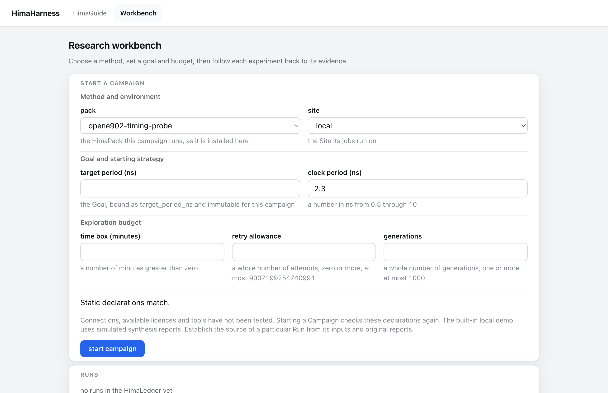
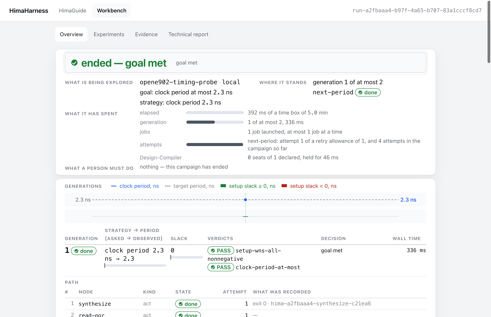
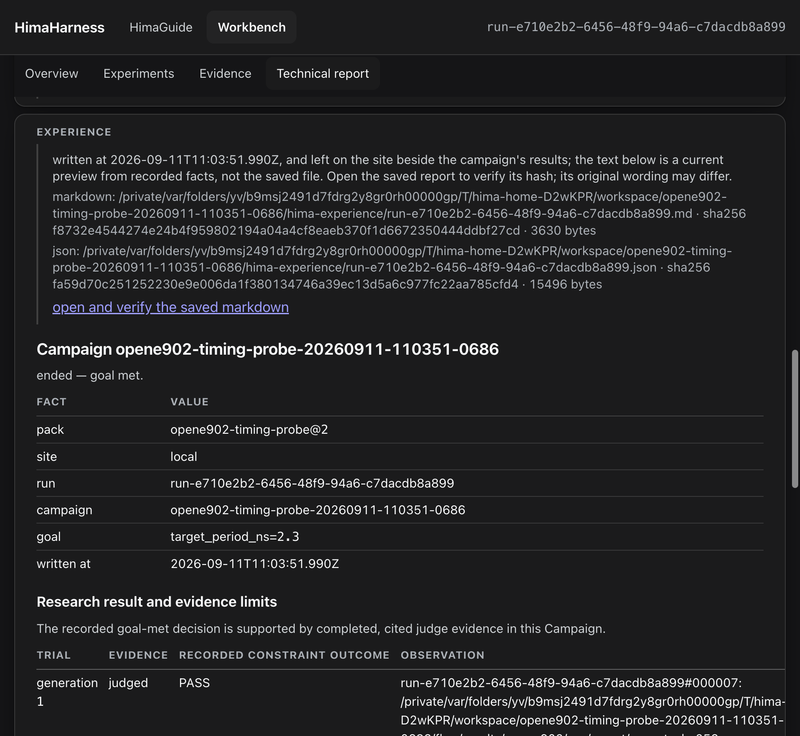

# UI-01：DeepSeek 对标后的首轮导航与阅读改进

任务：[GitHub #20](https://github.com/lluzi/hima_harness_reforge_polishing/issues/20)。基线 `c7a2a07bace44ef09f8188c83ec983a714080739`。对标来源、后续切片与明确边界见 [plan.md](plan.md)。

## 交付

现有 HimaGuide 客户端在官方 sidebar footer 中提供工作台入口；Run 卡片使用已有 `runCardPath` 将准确身份链接到运行页。工作台表单按方法/环境、目标/策略、预算分组，保留原控件与数据协议。运行页新增概览、试验、证据、技术报告的原生锚点导航；报告从证据长段落中独立出来，所有内容、原文件链接和来源声明仍在。

改动仅在原客户端、SSR 页面、样式和三处既有客户端注册断言。未升级 dsh/Electron、未引入架构组件，未修改 Fabric、Ledger、报告生成、Pack 或 Site 语义。原项目与旧项目均未写入。







截图来自实际 Electron、独立 home、local stand-in；图中的目标达到不是模型研究或真实 EDA 的验证。聊天宽栏/折叠栏入口见 [亮色](after-chat-light.png)、[暗色](after-chat-dark.png)。对照 [原始工作台](before-workbench.png)。

## 验证

| 层级 | 结果与范围 |
| --- | --- |
| L0 | 构建、类型、seam 检查通过；最后的客户端链接颜色改为继承当前主题，再次构建和类型检查 |
| L2 | `view.test.ts`、`view-run.test.ts`、`start-form.test.ts`、`experience.host.test.ts` 共 **23 pass / 0 fail / 0 skip**，90.159 s，SSH 尝试 0 |
| L2 复查 | `view.test.ts` 6 pass，17.095 s；属于上述 23 项的重跑，不重复累计独立覆盖 |
| L3 导航 | 两个实际窗口场景（1280 px 亮色、900 px 暗色）**2 pass**，9.375 s；点击聊天入口进入工作台，真实表单启动 1 代 local Campaign，报告定位、返回概览、回到聊天再打开原 Run 列表 |
| L3 表单 | 原 `start-form-window.test.ts` **2 pass**，10.825 s；迟到响应/动态控件/错误修正/防重复提交继续成立 |
| 未运行 | 全量 Desktop、真实模型、SSH/EDA、完整 DTCO pilot；未检验真实对话中的 Run 卡片点击，链接复用既有路径编码函数并经源码复核 |

两套窗口的表单与报告均 `document.scrollWidth === innerWidth`。900 px 报告顶端 127.8 px、导航底端 109 px；1280 px 对应数据见 [window-light.json](window-light.json)，实际定位未被固定栏遮挡。正文没有横向溢出，宽证据表仍在自己的区域内横向滚动。

本次总计 **10 次已知 Electron 启动**：基线截图 2 次，诊断中失败的窗口场景 4 次，最终导航 2 次，原表单回归 2 次。不能把最后 4 个通过场景说成只启动了 4 次。未新增整套 GUI 框架或将全量业务组合迁回 Desktop。

## 失败与修正记录

- 临时截图脚本首次路径位置不匹配导致导入失败，移到正确层级后启动；该次未打开 Electron。早期基线的官方界面截图仍被首次提示遮挡，仅用于记录初始状态。
- [probe-syntax-error.log](probe-syntax-error.log)：临时检查脚本的引号错误，未启动窗口，修正脚本语法。
- [notice-race.log](notice-race.log)：提示晚于侧栏出现，两个主题的点击被遮挡；改成等待提示出现。
- [model-setup-overlay.log](model-setup-overlay.log)：关闭预览提示后还有 API key 配置层；使用真实“Configure later”，并等待入口中心可点击，不填写凭据、不绕过产品状态。
- [probe-list-navigation.log](probe-list-navigation.log)：`theOneRunId` helper 会打开列表页；修正测试在拿到身份后返回对应 Run 再验证报告。
- [unavailable-ssr-probe.log](unavailable-ssr-probe.log)：尝试新增服务器端 React 链接渲染检查，但仓库未安装 `react-dom/server`。没有为简单链接引入依赖；移除该额外检查，恢复原入口测试并复查通过。该失败不计作产品回归，也不声称已验证聊天卡片的实际点击。

## 复核与后续限制

源码复核：sidebar 使用现有 list slot 所需的 `id`，两个 tool slot 仍使用 `key`；无新网络路由/状态来源；动态 Pack 表单继续以旧标记查询；段落锚点只随已有内容出现；报告证据和原始 Markdown 链接没有丢失。现有类型检查覆盖拼装，实际窗口覆盖 slot 注册、宽/窄布局和导航。此次为主代理复核，未进行额外独立 subagent review。

完整 UI 优化仍有工作：聊天卡片的摘要和状态更新提示、代码/算法/证据在侧栏阅读、长标识及密集表格的列间可读性、报告中元信息的呈现层级。当前截图中的表格仍可能拥挤，不据此宣称所有表格已经完成视觉验收。Pack 资产入口须等实际归档与引用能力落地。社区候选仅完成公开资料核对，没有完成各桌面产品的功能排名；“最佳”仍须以真实研究操作评价。

## 重现

在仓库根目录、Node 24、安装好的依赖与已验证报告 fixtures 下：

```sh
pnpm run build
pnpm run typecheck
pnpm run check:seams
pnpm run test:local --files test/contract/view.test.ts test/contract/view-run.test.ts test/contract/start-form.test.ts test/contract/experience.host.test.ts
pnpm run test:desktop --files test/contract/start-form-window.test.ts
node --test --import ./test/contract/support/no-ssh.mjs docs/assessment/2026-09-11/ui-benchmark/verify.probe.ts
```

[verify.probe.ts](verify.probe.ts) 是本轮可重现的窗口检查，沿用既有 driver 和 Chromium 的测试调试口；不计入常规 contract 分组。它会覆盖本目录的截图/窗口结果，使用自己的临时 home 并清理。最终日志：[local](local.log)、[导航](desktop.log)、[表单](form-window.log)、[复查](served-bundle-final.log)、[build](build.log)、[typecheck](typecheck.log)、[seams](seams.log)。

回滚本轮四个客户端/工作台文件及对应注册断言即可，不需要迁移用户数据。
