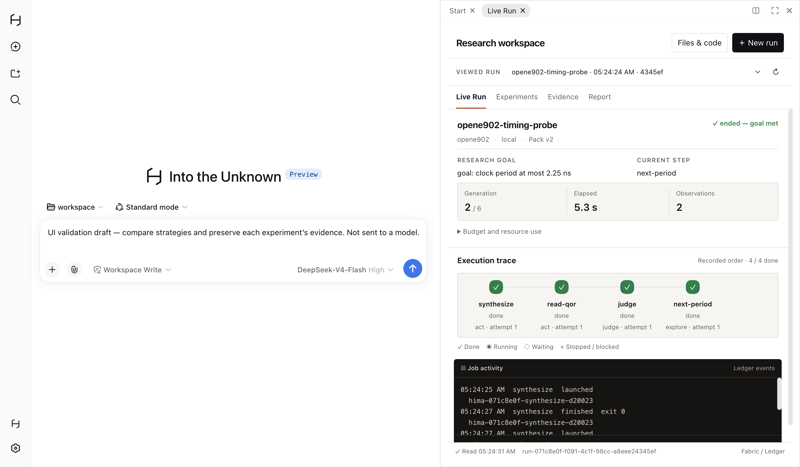
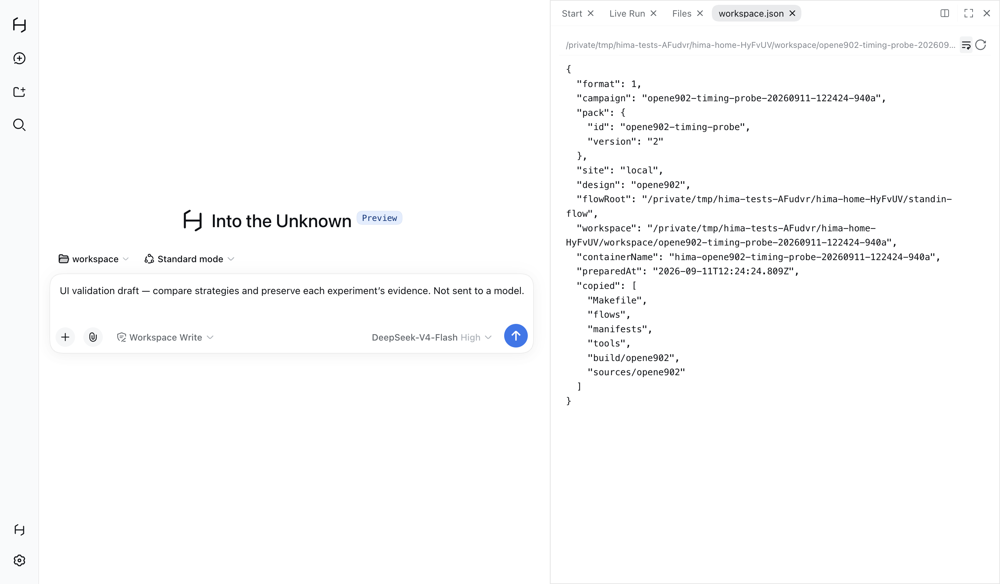
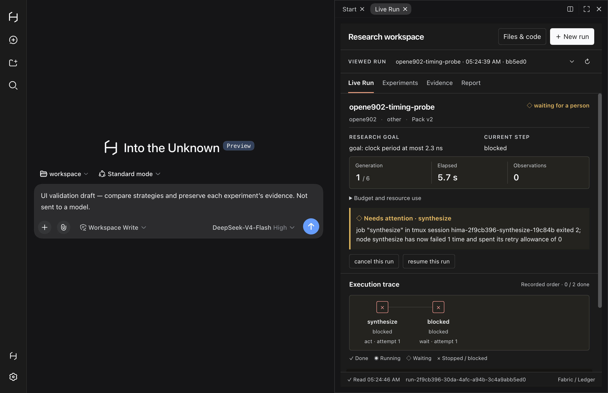

# UI-02：对话、Live Run 与代码资料的统一工程工作区

任务：[UI-02 #21](https://github.com/lluzi/hima_harness_reforge_polishing/issues/21)。起点为 `e994087133ffd2f0bf1dcc79f611b4f70a1d3ac5`。用户否定上一轮分离工作台的视觉与交互，要求以旧版 himaharness 为视觉参照，构建芯片设计工程师使用的统一桌面。

## 结果

主界面继续使用原生 DeepSeek 对话、工作区、会话和资料面板。Hima Live Run 注册为现有 dock 中的页面，与对话并排显示。开始实验、选择 Run、观察状态、取消/恢复、查证据和阅读报告均不离开当前文档；原生文件/代码浏览也在同一 dock 中打开。







这些是独立 home、真实 Electron、真实 Host 与 local stand-in 的窗口截图。左侧为明确标注的未发送测试草稿；右侧为实际本地 Job 记录。它们不是已完成真实 AI 研究或 EDA 指标验证的证明。

## 视觉参照与架构边界

只读检查的旧仓库提交：`636475cb30c7d312222b0c492872154f327d9113`。参照其 `desktop/opencode-overlay/src/renderer/hima-live-run.css`、`hima-live-run.tsx`、`docs/phase3/design/hima-live-run-redesign-brief.md`，以及 `desktop/test-results/cool3d-open-source-3dic-desktop-campaign/2026-08-14T03-22-49-914Z/recording-frames/frame-00000432.png`。

继承的重点是常驻对话与 Live Run 并排、紧凑的信息层级、形状和颜色共同表达状态、标签可读的执行轨迹，以及深色原始输出区。旧版存在 8–10 px 的字号，本轮没有照搬其过小字号或旧 Runtime/OpenCode 架构。

实现站在安装的 `@deepseek-ai/dsh 0.1.5-alpha.1` 上。以随包 types、README、实际 client bundle 和真实窗口核对接口；查询到的上游 master 源码与发布包存在差异，未直接按 master 的新布局接口改写本项目。

| 现有位置 | 本轮职责 |
| --- | --- |
| `client/index.ts` | 在 `sidebar.right.pane.tab` 和 tab registry 注册 Live Run；sidebar/hero 品牌席位显示 Hima；提供同屏导航 |
| `client/HimaWorkbench.tsx`、`client/workbench-style.ts` | 同一客户端职责内的视图与样式；选择/草稿/最后一次响应属于展示状态 |
| `client/HimaRunCard.tsx` | 原生对话中的紧凑快照；详细内容转到 dock；两种呈现共享可取消的操作逻辑、判定与报告展示 |
| `client/api.ts`、`remote.ts`、`paths.ts` | 复用原动作；增加同一会话围栏后的只读 Run 列表与开始选项 JSON，使用已有 `startChoices` |
| `desktop/src/main.ts` | 原生菜单聚焦对话或激活现有 Live Run 控件，避免主路径再次跳到独立页面 |
| `desktop/src/driver.ts` | 原有填值入口使用 DOM 原生 setter，确保 React 受控输入收到实际变更 |

没有新增服务、运行引擎、状态库、依赖或数据库表。Fabric/Ledger、Pack、Job 与报告的判定及持久化语义没有迁移。独立 `/hima/` 路由保留兼容和既有验证用途，已不是新的主产品导航。原型和旧仓库未修改。

## 使用与事实边界

1. 在准备好的工作区中新建原生会话，点击侧栏 **Live Run**。
2. 在面板中选择已存在的 Run，或通过 **New run** 选择 Pack、Site、目标、策略和预算。
3. 在 **Live Run / Experiments / Evidence / Report** 中查看同一 Run；使用 **Files & code** 打开原生资料浏览。
4. 取消可以打断仍在等待 HTTP 结束的恢复操作。切换 Run 后，迟到响应不能覆盖当前视图。

执行轨迹展示记录中的节点顺序，未伪造参考 DAG 的依赖。Job activity 是 Ledger 中的生命周期事件；只有已有 blocker log tail 才标为捕获的输出。读取失败保留明确标为过期的最后快照；“已验证原字节”只在 Host 成功校验已保存文件后显示。

Run 列表明确为这个 Host 的记录，不声称它们自动属于当前聊天会话。用户在面板内选择 Run，或通过原生工具卡打开其准确身份。原生 dock 的会话级布局在切换会话时分别持有；当前平台在页面重载后默认收起面板，本轮未增加另一套持久化布局。模型、Site、Pack 资产等后续能力继续按原 PLS 依赖推进。

## 验证

| 层级 | 结果 |
| --- | --- |
| L0 | 构建、类型和 seam 检查通过；最后一次改动为未知状态的中性符号回退，再构建/检查类型 |
| L2 | 相关 Host/视图/新只读路由/输入/报告文件/控制：20 pass，0 fail/skip，109.653 s，SSH 尝试 0 |
| L3 同屏 | `unified-workbench.test.ts` 最终 2 pass，0 fail/skip，36.385 s，SSH 尝试 0 |
| L3 旧表单 | 原 `start-form-window.test.ts` 2 pass，0 fail/skip，25.271 s；验证原生 setter 修改兼容已有 HTML 表单 |
| 未完成的证明 | 未运行完整 Desktop 套件、真实 EDA 或成功的真实模型研究；不据截图宣称已与商业 Coding Desktop 全面对等 |

同屏用例覆盖：真实 Run 启动与状态变化、聊天草稿保持、文档 URL 不变、负判定引用、成功读取已保存报告、真实改坏报告触发 hash 拒绝且无“已验证”误报、原生目录/文件浏览、准备检查 503 后保留草稿并重试、开始响应暂停时拒绝重复提交和 Run 切换、阻塞后继续、A→B→A 切换、恢复仍可取消、一次取消且无额外 Job。

窗口检查使用实际公共 Host RPC 注册独立测试工作区，再通过原生 New Session 按钮进入会话；没有通过修改内部 store 构造会话。OS 文件夹选择器未在本轮完成验收，准备好的工作区是这些用例的前提。会话切换的底层 tab occurrence 已做源码核查；本轮动态用例覆盖的是 Run 切换与原会话草稿保留。

累计已知 Electron 启动 **10 次**：人工诊断 2 次，首次失败的自动检查 2 次，修正后 2 次，旧表单回归 2 次，最终视觉密度调整后 2 次。最后 4 项独立窗口场景通过，不将重跑累计成新增覆盖。

## 首次失败、复现与审查修正

[desktop-first.log](desktop-first.log) 的两个失败来自旧 driver 对 React 输入的赋值方式：直接赋值会先改变受控输入的 tracker，随后事件不再触发 React 草稿更新。手动真实窗口输入能正常启动；修正现有 driver 使用原生 DOM setter 后，新面板输入重渲染/异步检查和旧 HTML 表单均通过。未为测试修改产品草稿或伪造成功状态。

一次人工探索曾把粘贴的 `/hima status …` 当作普通提示提交，真实原生界面返回 `MISSING_CREDENTIAL`；没有成功模型调用，也没有当作命令集成成功。本轮正式窗口测试不发送模型提示，避免借 UI 工作扩大为真实模型研究验证。

独立双轴审查发现并修正：

- **Standards**：恢复过程中取消被锁住、失败的报告仍显示验证声明、准备失败无重试；后续还修正 A→B→A 的残留 busy 状态、开始期间丢失表单的导航。最终源码复审无剩余阻塞项。
- **Spec**：报告验证声明、完整预算、判定/拒绝/失败记录关联缺失。全部修正后复审通过。

审查与执行分开：subagents 做只读源码审查，以上实测由主代理执行。详见 [review.md](review.md)。

## 重现与回滚

在仓库根目录使用 Node 24：

```sh
pnpm run build
pnpm run typecheck
pnpm run check:seams
pnpm run test:local --files test/contract/view.test.ts test/contract/view-run.test.ts test/contract/start-form.test.ts test/contract/experience-files.test.ts test/contract/run-controls.test.ts
pnpm run test:desktop --files test/contract/unified-workbench.test.ts
pnpm run test:desktop --files test/contract/start-form-window.test.ts
```

如需截图，运行窗口组时设置 `HIMA_UI_ARTIFACTS` 为输出目录。新用例加入现有 desktop 分组；`support/inspect-window.ts` 仅在既有 driver 的测试调试口上做检查和响应故障注入，不是产品接口。

回滚本次提交即可恢复 UI-01 与原 driver；没有用户数据迁移。保留旧路由及原测试，防止 UI 调整丢失已有行为覆盖。
