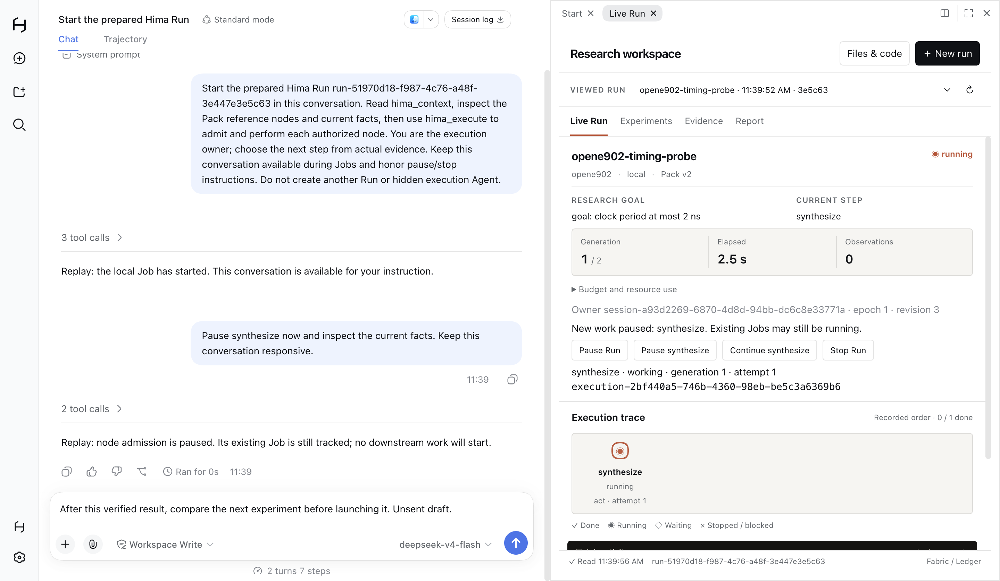
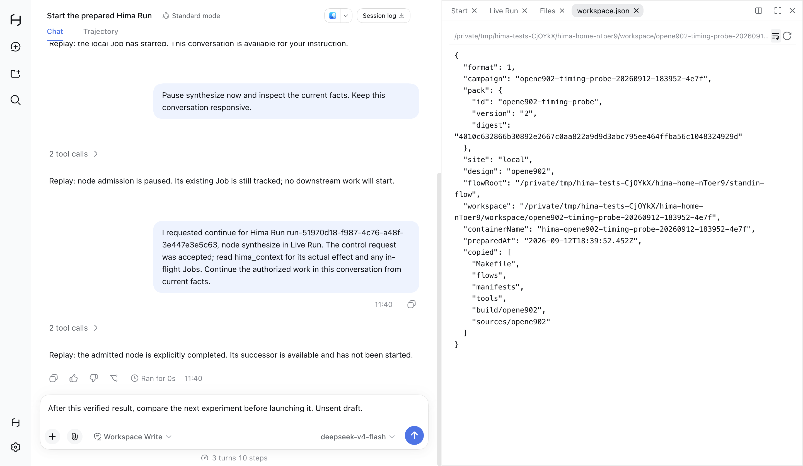

# PLS-19 native conversation, controls and execution evidence

UI work began on `9614b78650382c0d580350638b84e456a4bf219d`. The final branch
fast-forwarded to the independently verified Workshop checkpoint
`4d9a601eabeb2e19d8dfd9d85f3035e687d69c77` before checking Workshop projection.
Only polishing worktrees were changed. No new engine, service or component was added.

## Delivered behavior

- Preparing an owned Run in the existing Live Run form sends its execution request
  to the selected native conversation. Isolated legacy Runs without `control`
  do not send that message.
- The scoped dsh conversation is resolved with its actual supported
  `sessions.scope(id).get('conversation')` interface. Missing scope/service and
  submission errors reach the existing prepared-Run notice, retaining the Run ID.
- Continue actions name each recorded pause scope: `Continue Run` for `*`, or
  `Continue <node>` for a node. They use the existing control endpoint/node argument.
- Shared Workshop projection uses the resolved controlled execution, CodeRecords
  and Job facts. It does not invent model-moment session pairs or derive model
  identity from the current profile. It shows actual code author session, code
  hashes/versions and Job identity. A successful operation awaiting Agent
  completion is distinct from a completed node. Before resolved Workshop context
  exists, the Workshop projection is absent instead of guessing paths.
- DecisionView preserves the actual Agent rationale, execution and session. Both
  card and Live Run display it as the Agent's choice and identify the chooser as
  the Pack reference. Empty numeric rationale does not produce an empty `from` line.

The UI-02 native chat, dock, Run and Files layout remains in place.

## Actual native route

[The final L3 test](../../../../../test/contract/agent-execution.desktop.test.ts)
uses the existing Electron driver and native controls in one isolated home:

1. Create a workspace through the real public Host RPC; use native New Session.
2. Keep an unsent conversation draft, then prepare a Run through the Live Run form.
3. The same Agent consumes hand-authored replay model responses and calls real
   `hima_context`, `hima_execute begin` and `work`. The local Job sleeps 25 seconds.
4. Type and submit an ordinary user message asking to pause `synthesize`. The same
   Agent calls the real pause operation while the Job still has phase `working`.
5. Keep a new unsent draft while the Job finishes. Admission remains paused.
6. Click native `Continue synthesize`; the same Agent explicitly completes only
   the admitted execution. The Host exposes `read-qor`, with still one execution
   and one launched Job. No successor work is hidden in completion.
7. Open the real native Files panel and Campaign `workspace.json`. Document URL
   and unsent draft remain unchanged.





These are real window captures. The model responses explicitly say `Replay`.
They prove wiring and execution mechanics, not DeepSeek research ability or EDA
results. Job-ready notifications were silenced to keep this finite replay about
user steering; notification-driven model behavior is not claimed. The capture
`owned-after-continue.png` was taken after Host completion acceptance and before
the next Live Run polling update, so its right pane still shows the previous
`ready` snapshot. Final completion and successor/Job counts were asserted against
the actual Host; the image is not evidence of the later rendered phase.

## Checks and failure evidence

Node **24.20.0**, pnpm **11.25.0**. The worktree installed its own dependencies
from the frozen, unchanged lockfile and shared polishing's content-addressed store.
`HIMA_TEST_LEGACY_AUTO_DRIVE=0` selects the owned product path.

| Check | Actual result |
| --- | --- |
| Host/replay prerequisite before Electron | 1 pass / 0 fail / 0 skip, 19.360 s; [log](replay-host-second.log) |
| Final native L3 | 1 pass / 0 fail / 0 skip, 42.712 s; [log](desktop-live-panel.log) |
| Final Workshop projection, Agent rationale projection and replay Host subset on Workshop checkpoint | 8 pass / 0 fail / 0 skip, 45.366 s; [log](projection-replay-host.log) |
| Final build and full workspace/test TypeScript | PASS; [build](build-final.log), [types](types-final.log) |
| Seam / boundary / inventory / whitespace | PASS; [seams](seams.log), [boundary](boundary.log), [inventory](inventory.log), [whitespace](whitespace.log) |

The final L2 subset uses eight in-process Hosts. The final L3 uses one actual
Electron with its real Host. Both report zero SSH subprocess attempts. No real
model, EDA, SSH, full local or full desktop suite ran.

The readonly Workshop assertions were added to the existing actual Host case:
resolved context with no invented session; actual code author's session and exact
code record IDs; running Job identity; `awaiting-completion` after successful
work; `done` after explicit completion; and zero fake session records. Graph
assertions verify DecisionView carries the exact submitted Agent rationale.
These projection combinations were verified at L2, not by extra windows.

Six Electron launches were used in total, all for this one route:

- [First](desktop-first.log): fixture selection expected a row while the real
  workspace was in the native tree. It failed before creating a session or Job;
  the selector now uses the existing unified-workbench tree/row alternatives.
- [Second](desktop-second.log): actual owned Run prepared but no conversation
  message was delivered; no Job started.
- [Delivery diagnosis](desktop-delivery-diagnosis.log): captured the actual start
  response and rejection, `cannot get property "conversation" without inject`.
  The adapter's synchronous throw had bypassed its Promise catch.
- [First delivery fix](desktop-after-delivery-fix.log): errors now appeared in the
  prepared-Run notice, but adding a root injection alone did not permit property
  access on a session-scoped Context. The installed native conversation client
  uses `scope.get('conversation')`; the adapter was corrected to that interface.
- [Scoped send](desktop-scoped-send.log): real start/tools/Job and normal typed
  pause passed. A test selector then read an older chat-card snapshot instead of
  the current Live Run. Selectors and the clicked Continue button now explicitly
  target `.hima-studio`; business expectations were unchanged.
- [Final route](desktop-live-panel.log): passed through native Continue and Files.

Other retained preparation failures: [initial replay test](replay-host-first.log)
failed before a Host because of a helper export name; [test types](replay-types.log)
exposed that name, a branded replay call ID annotation, and the old Workshop test's
source-type import. All were corrected. [Workshop state build](workshop-state-build-failed.log)
required adding the new phase to the existing compatibility glyph table.
[Workshop prerequisite](workshop-prerequisite.log) failed on unavailable recommend
before the runtime checkpoint; its projection assertions were then unreached.
[Projection type check](types.log) used a non-exported WorkshopView type; it now
uses the exported RunView workshop type. No failing run is counted as coverage.
A temporary focused tsconfig and a JSON-comment parsing attempt were local setup
only; the final full type check passes and the temporary file was removed.

## Reproduce and rollback

```sh
export PATH=/Users/lluzi/.local/node24/bin:$PATH
pnpm --config.verifyDepsBeforeRun=false run build
pnpm --config.verifyDepsBeforeRun=false run typecheck
pnpm --config.verifyDepsBeforeRun=false run test:local --files test/contract/agent-workshop.host.test.ts test/contract/agent-desktop-replay.host.test.ts test/contract/agent-graph.host.test.ts
HIMA_UI_ARTIFACTS="$PWD/docs/assessment/2026-09-12/pls-19/desktop" pnpm --config.verifyDepsBeforeRun=false run test:desktop --files test/contract/agent-execution.desktop.test.ts
```

The replay helper writes only model-stream fixtures. Its documented
`{{fromRequest:<regex>}}` placeholders resolve identities/revisions from real
requests and tool results; it neither creates Ledger facts nor replaces tools.
Only its own recorded local Job sessions and temporary home are cleaned up.

`source-hashes.json` pins the changed sources, final built client and lockfile.
Rollback reverts this commit's existing view/adapter changes, tests/manifest entries
and this assessment. The separately committed graph, Workshop and control
implementations remain independent. This slice is not a PLS-19 or pilot completion
claim.
