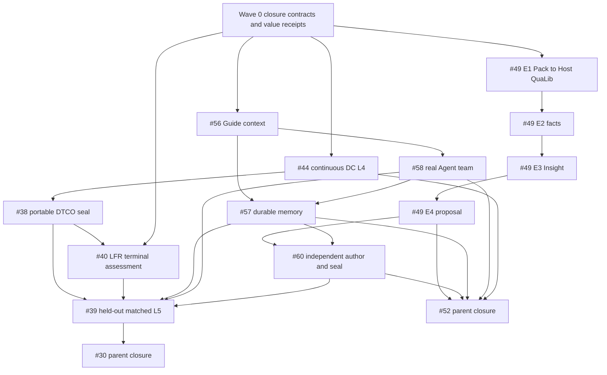

# HimaHarness open-Issue closure implementation plan

Date: 2026-09-25. Planning source: `58ac5d1e99d44f7f5b5081db8aad05fec4ea1df0`
on `main`, with the same SHA on `origin/main` when this plan was written.

Wave 0 implementation status is recorded in [wave0-authority-and-measurement.md](wave0-authority-and-measurement.md).
Wave 1 implementation status is recorded in
[wave1-hard-gates.md](wave1-hard-gates.md).
That receipt now records terminal PASS for all three Wave 1 lanes.
The plan below remains the dependency and terminal-disposition authority for later waves.

## Objective and terminal vocabulary

This plan closes every currently open Issue without converting an unproven product claim into a
PASS. Each Issue receives one terminal disposition:

- **PASS** — its declared user result and evidence gate passed;
- **TERMINAL_NEGATIVE** — the bounded experiment or study completed but the business target did
  not pass; the evidence and claim limits are retained;
- **SUPERSEDED** — another completed Issue or current product contract owns the behavior, and the
  old Issue records the exact replacement before closure.

`BLOCKED`, `PARTIAL`, `ready-for-agent`, local tests and a release ZIP are not terminal dispositions.
Parent Issues close only after every owned child or listed frontier has one of the three terminal
dispositions. Closing an Issue does not mean that every business result was positive.

## Current baseline

The XTop commercial chain is no longer an implementation blocker. Issues #55, #59, #50 and #61 are
closed. The retained Hima Run completed one generation through a qualified interactive XTop Job,
Innovus, StarRC, PrimeTime, comparison and relative-best adoption. Timing and physical cleanliness
did not pass, and the J3 value verdict was `inconclusive` because comparable human minutes were not
measured.

The remaining open set is:

| Issue | Remaining ownership | Required terminal evidence |
| --- | --- | --- |
| #44 | DTCO foundry-input commercial exit | one continuous Fabric `compile -> read-compile -> foundry-synth` L4 |
| #49 / S11 | Library Insight | actual Pack-to-Host E1, then real E2 facts, E3 report and bounded E4 proposal |
| #56 / S04 | Guide | sourced context, independent task handoff and real-model human-facing acceptance |
| #57 / S05 | Memory | compact/reopen/restart/correction recovery against current authorities |
| #58 / S06 | Agent team | bounded real-model children with effective tools, shared budget and result adoption |
| #60 / S10 | Pack authoring | independent five-stage authoring, TEST, seal, install/upgrade and rollback |
| #38 / PLS-34 | portable DTCO method | portable Pack readiness, L4 tool/model, traceability and release seal |
| #40 / LFR | function-richness method | framework assessment, Pack integration, real test Campaign and terminal verdict |
| #39 / PLS-35 | held-out matched value | one bounded held-out L5 and user-facing terminal result |
| #30 | Product Upgrade v2 parent | all owned mechanisms and the held-out value gate reach terminal dispositions |
| #52 | next-stage parent | S04/S05/S06/S10/S11 and the retained implementation frontiers reach terminal dispositions |

## Closure-contract corrections

Before new implementation, the issue tracker and current specifications must reflect these
ownership boundaries:

1. **#38 owns method readiness, not the positive held-out L5.** Its own test section assigns L5 to
   #39. #38 closes after portability, bounded L4 tool/model evidence, reporting traceability and a
   sealed Pack. A positive Fmax result remains #39's responsibility.
2. **#40 owns method assessment.** It may finish PASS or TERMINAL_NEGATIVE after the declared real
   Campaign and release evidence. A method study must not stay open forever waiting for 5%.
3. **#39 owns one bounded held-out value attempt.** A valid positive result permits candidate release
   and user sign-off. A valid negative result closes as TERMINAL_NEGATIVE and prohibits a positive
   Fmax/product-value claim. Tool failure or invalid evidence does not consume this attempt; it
   returns to the lowest owning Issue for repair.
4. **#30 and #52 are parents, not perpetual research queues.** They close when their children are
   terminal. New research after that uses a new Issue with a new budget and success criterion.
5. The #52 body and S11 status prose are stale relative to the closed XTop gates and runnable
   `library-intelligence@0.2.0`; update the status layer without rewriting historical evidence.

## Work waves

### Wave 0 — authority and measurement alignment

Goal: make the tracker safe for autonomous execution before more expensive work.

- Update #30, #38, #39, #40, #44, #49, #52, #56, #57, #58 and #60 with this plan, their wave,
  dependencies and terminal condition.
- Update current S11/frontier prose that still describes the retired `exit 139` or blocked-graph
  snapshot; keep the old records as dated history.
- Add a value-measurement contract using existing Ledger, Job, control and model-moment records:
  human business-decision time, environment-recovery time, evidence-review time, model requests and
  tokens when exposed, Job count and commercial-tool seat time. This is a projection/receipt
  improvement, not a telemetry service.

Exit: every open Issue has one current closure contract; no agent needs old comments to infer scope.

### Wave 1 — three independent hard gates

These lanes can proceed in parallel at the product level. Shared Site capacity remains serial where
required.

#### Lane A: #44 continuous DTCO commercial exit

Run one real Fabric execution through the existing graph's
`compile -> read-compile -> foundry-synth` nodes using the Site-owned, versioned and SHA-bound CDL,
the qualified Liberty/DB split and the 40-per-generation / 320-cumulative profile.

PASS requires DC exit 0, no `DB-1`, non-empty netlist, matching Run/Job/Reader identities and no
manual stage substitution. A product defect returns to #44 with the smallest failing reproduction.
Once PASS is recorded, close #44.

#### Lane B: #49 E1 actual Pack-to-Host qualification

On the approved Library Site, first recheck the live licence/client state. Use QuaLib only under
`selected=new` / port 59099 and never overlap XTop. Run the actual `library-intelligence@0.2.0`
Pack through Host/Fabric for vendor, SAED14 and TSMC28 sources.

PASS requires Host-loaded Permit identity, pinned producer/wrapper, durable launched and exit-0 Job
history, read/query/copy/re-read invariants and unchanged source hashes. No standalone worker run can
substitute for the Pack-to-Host result.

#### Lane C: #56/#58 context and real team acceptance

Use existing S01/S08 controls and the now-qualified S09 Operator contract. Complete the Guide
address/context and child lifecycle contracts, then run one bounded real-model task with at least a
Research/Coding child and an independent Reviewer. The Guide remains responsive and does not become
Run owner; children receive separate effective context/tools/workspaces and draw from one parent
budget; their output remains a candidate until the declared recipient/Judge adopts it.

PASS closes #56 when the Guide's sourced explanation, independent handoff, late-response rejection
and control receipt are verified. #58 remains open until real-model team behavior, cancellation,
budget aggregation, transcript/result visibility and one qualified Operator delegation pass.

### Wave 2 — Library vertical slice and durable work

Starts after #49 E1 PASS. It is the main next-release product slice.

1. **E2:** produce typed Library/PVT/cell/pin/arc/table facts and comparable-condition deltas with
   provenance, units, coverage and unknowns. Missing values never become zero.
2. **E3:** produce a versioned Library Insight report and render it through the existing Data Insight
   workbench. Filtering already-loaded data invokes no model/tool; recalculation creates a new report
   identity.
3. **E4:** accept one versioned rule/algorithm proposal with explicit input/output refs, private
   workspace, budget, applicability and independent-validation recommendation. It cannot mutate
   golden Library data or an already released Pack.
4. Use the same real task to complete #57: compact/reopen/restart, stale summary versus newer human
   hold, completed Job versus stale summary, user correction/experience disable, child handoff and
   cross-workspace refusal.

Exit: close #49 only after E1–E4 are each separately evidenced; close #57 after recovery always
re-reads current Run/Job/report/control authority and preserves corrections.

### Wave 3 — independent Pack authoring and portable DTCO seal

Two Pack-owned lanes may proceed in parallel; shared author/release wiring has one integrator.

#### Lane A: #60 using the Library method

Use the now-real Library Insight method as the independent authoring subject. A second author starts
from the source SOP, qualification and report requirements; Guide opens a separate authoring
session; the author walks grill, spec, fabric, test and release; creates a real TEST record; seals a
new method; previews and applies install/upgrade; proves stale review rejection, rollback and
customer-asset preservation.

Close #60 after the complete path and its negative guard cases pass. Do not count the manually
assembled pre-plan development folder as the independent authoring acceptance.

#### Lane B: #38/#40 method finalization

After #44 passes, finalize the portable DTCO method: two design bindings, no AES/fixed path/Golden
Flow invariant, current Site formats, real model algorithm variation, source-to-Cell-to-adoption-to-
DB/report traceability and a sealed Pack. Close #38 on that method evidence.

Complete #40's residual-frontier assessment using retained endpoint/cell-delay/Cell Demand and
cross-generation program differences. Approve the integrated method or record a bounded negative
assessment; run its declared real test Campaign and seal its evidence. Close #40 as PASS or
TERMINAL_NEGATIVE. More candidate count alone is not progress.

### Wave 4 — one held-out value trial

Starts only after #38 and #40 are terminal and the value-measurement receipt is working.

- Select a genuinely held-out design and record source/hash/selection reason.
- Start from a clean installed App/Pack state and rediscover the Site through the product.
- Use Guide, real child team, persistent owner, memory/recovery and the sealed portable DTCO Pack.
- Run one matched baseline/custom-cell Campaign with the new Cell/library content as the only
  intended variable; require route completion, non-zero final adoption and timing from the same
  final DB.
- Record human/model/Job/tool cost and all negative/unknown facts.

If Fmax improves with valid evidence, prepare the candidate and request user sign-off. If the valid
result is zero or negative, record TERMINAL_NEGATIVE and close #39 without a positive claim. If the
run is invalid because of an owned defect, repair that owning Issue at the lowest layer and resume
the same bounded acceptance; do not start repeated blind L5 Campaigns.

### Wave 5 — parent closure and project release

- Close #30 after #38 and #39 are terminal and its remaining product requirements have current
  evidence or an explicit SUPERSEDED mapping to completed next-stage Issues.
- Close #52 after #49, #56, #57, #58 and #60 are terminal and #44's retained frontier is closed.
- Run one final affected local integration suite, the minimum human Desktop journey and package/
  cold-start/hash checks. Do not repeat commercial EDA whose identities remain valid.
- Publish the final App/Pack set only if the release gates pass. The release notes must distinguish
  technical capability, negative/inconclusive value results and unsupported claims.

## Dependency graph

## Resource and integration order

- XTop and QuaLib API are mutually exclusive. Before every change, check live clients and service
  state. QuaLib uses `empyrean-license new` / 59099; XTop uses `old` / 59001 only after QuaLib is
  gone. Restore and verify the intended final state after the bounded work.
- `index.ts`, `remote.ts`, `tools.ts`, `fabric.ts`, `ledger.ts` and shared client wiring have one
  integrator. Guide, Memory and Team workers deliver local contracts/fixtures; they do not redefine
  shared identities in parallel.
- Pack directories can be developed independently. XTop's sealed method remains unchanged unless a
  separately reproduced defect requires a new version.
- Run L0/L2 first. L3 is one necessary human journey. L4 qualifies real model/tool boundaries. L5 is
  Wave 4 only.
- Every commit is pushed immediately and remote SHA verified. User-owned `tmp/`, historical trials,
  golden inputs and private Site evidence remain untouched.

## Project completion definition

The project reaches this plan's completion boundary when:

1. the current open-Issue list is empty;
2. every closure links to current source identity, tests/evidence, claim limits and terminal status;
3. Library Insight, Guide/team/memory and Pack authoring have one integrated customer-visible path;
4. portable DTCO has a sealed method and one terminal held-out value result;
5. the final App/Pack artifacts pass install, cold-start, identity, rollback and asset-retention gates;
6. no negative or inconclusive result is presented as positive product value.

New optimization research after this boundary requires a new Issue rather than keeping #30 or #52
open indefinitely.
