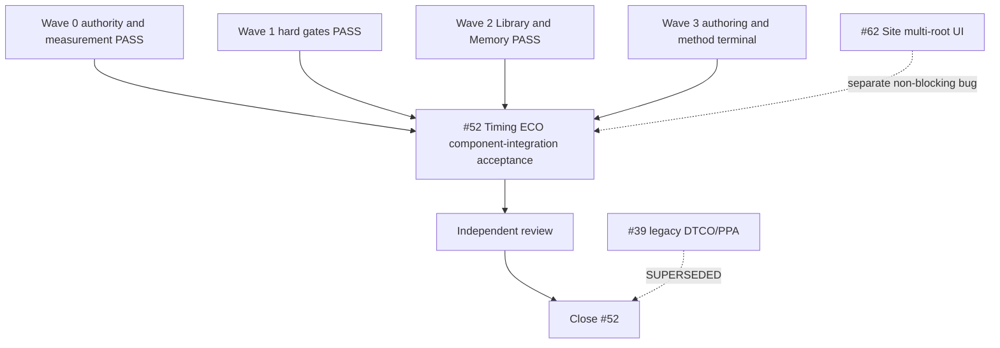

# HimaHarness Issue #52 closure implementation plan

Current authority: 2026-09-26. The original 2026-09-25 all-Issue plan and DTCO/PPA Wave 4 remain
available in Git history and retained trial evidence. This document now governs only closure of
**Issue #52: the HimaHarness architecture and feature upgrade**.

## Objective and claim boundary

Issue #52 closes when the Harness capabilities delivered in Waves 0–3 work together through one
human-facing, independently reviewed Computer Use journey.

The final acceptance proves component integration. It does not certify:

- positive Fmax or PPA;
- timing closure or clean signoff;
- DTCO scientific effectiveness;
- labor saving, ROI or replacement of an engineering team.

The final workload is sealed `xtop-timing-closure@1.0.14`, method digest
`19207d78dc3b1e9f4fd80f6bd4c21df209f1dfffc5f83fa7afd3ac5c96fd2a92`, on its qualified
`linglong-swerv28` Site and production XTop Operator binding. Timing, DRC, connectivity and closure
score are facts to retain and explain; their direction is not a PASS gate.

## Terminal vocabulary

- **PASS** — the declared capability and evidence gate passed.
- **TERMINAL_NEGATIVE** — a bounded study completed and missed its business target; evidence and
  limitations remain retained.
- **SUPERSEDED** — a newer authority owns the behavior and the old Issue records the replacement.

`BLOCKED`, `PARTIAL`, an App ZIP and local tests are not terminal dispositions.

## Current closure set

| Issue / work | Terminal state for #52 |
| --- | --- |
| #44 DTCO continuous commercial exit | PASS, Wave 1 |
| #49 Library Insight E1–E4 | PASS, Waves 1–2 |
| #56 independent sourced Guide | PASS, Wave 1 |
| #57 durable Memory and correction authority | PASS, Wave 2 |
| #58 native Agent team and Operator delegation | PASS, Wave 1 |
| #60 five-stage Pack authoring and release | PASS, Wave 3 |
| #38 portable DTCO Pack readiness | PASS, Wave 3; retained method evidence only |
| #40 LFR method study | TERMINAL_NEGATIVE, Wave 3 |
| #39 legacy DTCO/PPA acceptance | SUPERSEDED; not a #52 dependency |
| #52 Harness architecture and feature upgrade | awaiting final component-integration PASS |

Issue #62 tracks first-time Site creation with separate read/write roots. It is a separate product
bug. The #52 acceptance kit supplies an already qualified Site/Permit/Operator binding, so #62 does
not block this fixed-environment integration test. Issue #30 is a legacy Product Upgrade v2 parent
and is also not a #52 dependency.

## Completed waves

### Wave 0 — authority and measurement: PASS

The tracker received explicit terminal contracts. `valueMeasurementReceipt` projects Job count,
licence time, model sessions, human controls and explicitly measured human effort from existing
Runtime facts without creating a telemetry service.

Evidence: [wave0-authority-and-measurement.md](wave0-authority-and-measurement.md).

### Wave 1 — hard gates: PASS

- one continuous Fabric LC/DC commercial-exit path;
- actual Pack-to-Host QuaLib qualification;
- real-model Guide and bounded Agent team;
- production-qualified interactive Operator delegation.

Evidence: [wave1-hard-gates.md](wave1-hard-gates.md).

### Wave 2 — Library and durable work: PASS

- typed Library facts/delta, Insight report and bounded proposal;
- Data Insight rendering;
- compact/reopen/restart/correction/child-handoff/workspace-isolation Memory behavior.

Evidence: [wave2-vertical-slice.md](wave2-vertical-slice.md).

### Wave 3 — authoring and method delivery: terminal

- #60 independent five-stage Library Pack authoring: PASS;
- #38 portable DTCO method readiness/seal: PASS;
- #40 bounded LFR assessment: TERMINAL_NEGATIVE.

Evidence: [wave3-pack-authoring-and-portable-method.md](wave3-pack-authoring-and-portable-method.md).

The retained DTCO Attempts 1–12 remain immutable research and defect evidence. They are not rerun or
used as the final #52 acceptance.

## Wave 4 — final HimaHarness component integration

The complete authority is
+[Final HimaHarness component-integration acceptance](../../2026-09-26/next-stage/final-harness-integration-acceptance.md).

### Fixed preconditions

The integrator prepares one version-isolated kit containing:

1. the exact packaged App and manifest;
2. sealed `xtop-timing-closure@1.0.14`;
3. the qualified `linglong-swerv28` Site and Permit;
4. the administrator-qualified XTop interactive binding;
5. current Site/client/licence preflight;
6. a writable private Campaign root and read-only golden inputs.

First-time Site creation is not part of this acceptance. The fixed kit does not bypass the installed
Permit or alter golden inputs.

### Sole human-like operator

Claude Code Desktop activates `/himaharness-human-like-tester` and operates only the visible
HimaHarness/Catsights GUI through Computer Use. It does not use a headless live runner, direct HTTP,
Ledger mutation, hidden `hima_execute` calls or shell-created Runs. Codex prepares the kit and reviews
retained evidence but does not operate HimaHarness concurrently.

### Required journey

1. Launch the exact App and isolated workspace.
2. Ask HimaGuide to explain the installed product, Timing ECO Pack, Site, required inputs and next
   action from current inventory.
3. Complete Preparation without creating a Run.
4. Confirm once and create exactly one Campaign, one persistent Run and one owner distinct from Guide.
5. Inspect and interact with the Live Run reference graph, actual state, node details and evidence.
6. Open Side Talk/child context and verify Guide remains responsive and ownership is unchanged.
7. Inspect one child task, transcript/result and owner adoption.
8. Use the qualified typed Operator at the XTop node; raw Tcl/unrestricted shell is not accepted.
9. Exercise one pause/continue boundary and distinguish request receipt, actual Run state and Job state.
10. Reopen/switch at a recovery boundary and verify the same Run/owner/child history without a
    duplicate effect.
11. Open the timing/iteration report and one Data Insight loaded-data interaction.
12. Reach a declared terminal or bounded state and obtain a durable Claude report/checkpoint/handoff.

### PASS gate

PASS requires:

- exact App/Pack/Site/Permit/binding identity;
- Guide, owner, Side Talk and child context separation;
- one confirmation / one Campaign / one Run / one owner;
- Runtime-backed graph and evidence drill-down;
- scoped child and typed Operator receipts;
- authoritative pause/continue and recovery;
- no duplicate Run, Job or mutation;
- report, Data Insight and Guide explanations citing the same facts;
- a truthful final status with material limitations;
- an independently reviewable GUI-only Claude handoff.

A valid negative, unchanged, blocked or budget-limited Timing ECO outcome may pass. False success,
identity mismatch, permission bypass, missing evidence, broken recovery or an unusable required GUI
path fails the acceptance.

## Wave 5 — #52 closure

1. Independently review the Wave 4 handoff against the fixed identities and matrix.
2. Confirm all Waves 0–3 #52 children/frontiers remain terminal.
3. Record the exact PASS receipt and claim limits on #52.
4. Close #52.
5. State explicitly: Harness architecture and feature integration accepted; PPA, timing closure,
   clean signoff, ROI and DTCO scientific effectiveness unclaimed.

#39 closes SUPERSEDED as a legacy DTCO/PPA task. #30 and #62 continue under their own authority and
do not block #52.

## Dependency graph

## Resource and evidence discipline

- XTop and QuaLib remain mutually exclusive. Verify live clients and service mode before the test and
  restore the intended final state afterward.
- Reuse retained lower-level evidence when identities match; do not rerun commercial EDA merely to
  regenerate documentation.
- The final GUI trial uses one Campaign. A Claude turn ending never creates a duplicate.
- Every commit is pushed and its remote SHA verified.
- User-owned `tmp/`, historical Runs, golden inputs and private Site evidence remain untouched.

## Completion definition

Issue #52 is complete when:

1. every Wave 0–3 child/frontier has a linked terminal receipt;
2. the fixed acceptance kit has exact App, Pack, Site, Permit and Operator identities;
3. Claude completes the Computer Use component-integration matrix;
4. Guide, Campaign owner, Side Talk/child, controls, recovery, graph, reports and Data Insight agree
   with retained Runtime facts;
5. independent review accepts the handoff;
6. #52 closes with explicit non-claims for PPA, timing closure, clean signoff, ROI and DTCO benefit.

The state of #30, #39 or #62 does not block this boundary. New optimization research opens a new
Issue rather than keeping #52 open indefinitely.
