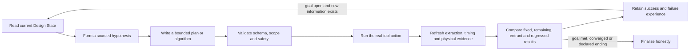

# The Development of Hima Pack

An agent-facing guide for turning a real engineering method into a transparent, executable,
evidence-backed HimaPack.

This guide is written for a senior methodology agent. The running example is physical design and
timing closure, but the authoring rules apply to any HimaPack. Read it before changing Pack files or
starting a Campaign.

## 1. What a HimaPack is

A **HimaPack is an installable business-method capability**. It tells HimaHarness:

- which engineering problem the method solves;
- which inputs and Site capabilities it requires;
- which tools may run and which licences they consume;
- what evidence each stage produces;
- how reports become typed facts;
- which constraints and goals the Judge evaluates;
- where an AI agent may research, write code or choose a strategy;
- how results feed the next iteration;
- every honest way the work can end;
- how a tested method is sealed and later reproduced.

A Pack is not a plugin, a prompt, a loose script collection, a copy of one customer's flow, or one
fixed design replay. It carries the method. A **Site** binds deployment-specific paths, wrappers,
licences, capacities and permissions. A **Campaign** applies one fixed Pack method to one business
goal on one Site. A persistent **Run** records what actually happened.

### Responsibility boundary

| Participant | Owns |
| --- | --- |
| Pack | Business semantics, method, graph, tools, Readers, rules, Choosers, Workshops, knowledge and declared endings |
| Campaign Agent | Research, planning and strategy decisions at the Pack's declared semantic boundaries |
| HimaFabric/Runtime | Graph execution, Run state, budgets, Jobs, evidence authority, retries, recovery and finalization |
| Site | Real environment, tool paths, licences, input bindings, capacity and Permit |
| EDA tool | Native engineering computation and database facts |
| Reader | Deterministic conversion of one declared artifact into typed observations |
| Judge | Deterministic constraint and goal verdicts from typed observations |
| Desktop | Human-facing projection of Runtime facts; never a second authority |

The operating principle is:

> **Runtime executes. AI decides only at declared semantic boundaries. Tools produce facts. Readers
> type those facts. Judges decide declared predicates. The Desktop explains the same facts to a
> person.**

If a method needs new business behavior, add it to the Pack. Change Harness Runtime only when the
existing domain-neutral execution model cannot express a reproduced, generally useful capability.

## 2. What “agentic” means in a HimaPack

Agentic does not mean that a model improvises commands until a metric improves. A strong Pack gives
the agent a **research envelope**:

1. the current Design State and source identities;
2. the engineering question to answer;
3. the reports and knowledge it may read;
4. the action vocabulary it may use;
5. a private code or plan workspace;
6. the budget, permissions and stop conditions;
7. deterministic validation of its output;
8. fresh tool feedback before the next decision.

Use a **Workshop** when the model must write an analysis, algorithm or plan. A Workshop declares its
inputs, knowledge, code directory, language, argv and output. The model-produced artifact remains a
hypothesis until its Reader, Judge and downstream EDA stages validate it.

The reference graph remains stable. The agent may revise strategy, revisit declared nodes and grow
bounded research work where the method permits it. It does not silently delete required checks,
change the success criterion, widen permissions or replace a measured result with its own opinion.

### A useful research loop



The loop is self-improving only when later decisions demonstrably consume refreshed evidence. More
prompts, candidates or generations do not by themselves establish learning.

## 3. Start from a Golden Flow

The **Golden Flow** is the real engineering flow from which the Pack learns and against which it is
checked. It is reference material, not a customer input and not content to copy into the Pack.

Before authoring, locate and inspect the real flow where it already lives:

- entry scripts and tool commands;
- input database, netlist, constraints and library identities;
- stage order and restart boundaries;
- generated reports and native databases;
- option sets and scenario definitions;
- success, failure and rollback behavior;
- runtime, licence and storage cost;
- at least one known negative case.

Record source pointers, versions and hashes. Keep golden inputs read-only. Campaign preparation
copies or stages only the items declared by the Pack contract into a private workspace.

If the flow cannot be inspected, stop. A Pack authored only from a prose description is a method of
guesses.

## 4. The five-stage authoring process

Run the stages in order. Each stage has one output record and a checkable completion boundary.

### Stage 1 — `/hima-grill`: establish intent

The interviewer resolves the business before discussing implementation. It writes only
`INTENT.md`.

Settle:

- the user and business result;
- what one generation is allowed to vary;
- the exact measurements and units;
- hard constraints versus optimization goals;
- every honest ending;
- the Golden Flow and disagreements with the author's description;
- what the agent may research or change;
- what remains human-controlled;
- portability boundaries and Site responsibilities;
- cheap counterexamples for the critical measurements.

Completion: `INTENT.md` contains the required `Business`, `Golden Flow`, `Answers`,
`Ambiguities resolved` and `Knowledge applied` sections, with no unresolved business decision hidden
inside implementation prose.

### Stage 2 — `/hima-spec`: define exact semantics

This stage converts accepted intent into `SPEC.md`. It does not invent missing author decisions.

Define:

- Goal parameters, constraints, units and comparison conditions;
- the Run contract and generation state;
- typed value semantics;
- Judge rule order and parameters;
- Chooser inputs and possible decisions;
- goal-met, convergence and declared terminal endings;
- Workshop contracts;
- knowledge used and the decisions it changed;
- invalid, unknown and non-comparable outcomes.

Write constraints before goals. Missing or malformed evidence must produce unknown/refusal, never a
fabricated zero or PASS.

Completion: another agent can determine every legal Run transition and every terminal claim from
the Spec without guessing.

### Stage 3 — `/hima-fabric`: compile the executable Pack

This stage creates the actual Pack method and writes `FABRIC.md`.

Typical files are:

```text
<pack>/
  INTENT.md
  SPEC.md
  FABRIC.md
  contract.yml
  graph.yml
  semantics.yml
  tools/
  readers/
  rules/
  choosers/
  knowledge/
  flow/                 # optional Pack-owned implementation
```

`contract.yml` declares inputs, outputs, wrappers, workspace staging, tools, licences, strategy,
goal words, knowledge and Workshops. `graph.yml` declares nodes and transitions. `semantics.yml`
defines the units and qualifiers of Pack-owned Reader values.

The four node kinds are:

- `act`: run a tool, execute a Workshop, or read a declared output;
- `judge`: apply deterministic rules in declared order;
- `explore`: make a bounded next-strategy or goal-met decision;
- `wait`: expose a real blocker that requires an external condition or person.

Every artifact path is relative to the Campaign workspace unless it is an explicitly permitted,
read-only Site input. Every command is an argv array using declared wrappers and inputs. Shell
composition belongs in a Pack-owned script, where it can be reviewed and hashed.

Completion: `hima_pack_check` accepts the folder; every node has a consumer-visible purpose; every
required output has a producer; every Pack-owned reading has declared semantics; every outcome path
matches the Spec. `FABRIC.md` records files written, gaps and reviews.

### Stage 4 — `/hima-test`: prove the method on a real Site

Testing starts a Campaign marked as a test. `TEST.md` is produced from actual Ledger evidence, not
written as an intended result.

Verify in increasing cost order:

1. schema and static Pack checks;
2. deterministic Reader, rule, Chooser and parser counterexamples;
3. Host/Fabric execution, identity, budget and recovery contracts;
4. one necessary human UI journey;
5. separate bounded real-model and real-tool qualifications;
6. one complete business Campaign only when the lower gates pass.

Completion: `TEST.md` records Site, Run, ending, generations, model-written code, refusals and
disagreements. Failed attempts remain evidence and are not rewritten into the successful record.

### Stage 5 — `/hima-release`: seal one tested method

Release is an identity operation, not documentation cleanup. The Harness generates `VERSION.yml`
from the current Pack bytes and the terminal TEST record. Nobody hand-edits the seal.

Completion:

- Pack id and version match the tested method;
- the TEST Run is terminal and declared;
- every method file has a computed SHA-256;
- the digest is read back successfully;
- install/upgrade preview and review hash are valid;
- rollback and customer-asset preservation are verified;
- limitations remain visible.

Any method-byte change after release requires a new version, new qualifying TEST and new seal.

## 5. Pack anatomy and evidence flow

The authoritative file-by-file schema is
[`packages/harness/skills/knowledge/pack-anatomy.md`](../../packages/harness/skills/knowledge/pack-anatomy.md).
Use it for syntax. The business Spec remains the authority for what the fields mean.

The core evidence chain is:

```text
Site-bound input identity
  -> Tool Job and native artifact
  -> Reader output
  -> typed Observation
  -> Judge verdict
  -> Chooser/Agent decision
  -> next tool action
  -> refreshed evidence
  -> terminal TEST record
  -> release seal
```

Each arrow needs an identity that can be checked. A summary, UI label or model statement cannot
replace the artifact on the left.

### Readers

A Reader consumes one declared artifact and emits a narrow typed document. A good Reader:

- checks report/tool/scenario identity before parsing values;
- rejects missing, duplicate, truncated and non-finite fields;
- preserves units, setup/hold mode, path scope, corner and group;
- emits unknown with a reason when the source did not state a value;
- binds its output to the source hash;
- has positive and negative fixtures derived from actual reports;
- performs no business decision.

### Judge rules

A Judge rule evaluates one declared predicate. It does not rank ideas or repair inputs. Put evidence
validity and hard constraints before the business goal. A goal PASS with a constraint FAIL is not
success.

### Choosers

A Chooser maps current typed facts and verdicts to a bounded decision. It must explain which values
it read. A free-form strategy agent may propose a candidate, but the adopted strategy still passes
the same schema, budget and evidence checks.

### Knowledge

Knowledge explains methods, conditions and failure interpretation. It guides the agent but does not
establish a measured fact. Cite the source and say which decision it changes. Keep Site/customer
materials outside the released method unless explicitly approved for inclusion.

## 6. A physical-design and timing-closure Pack pattern

For physical design, the minimum credible loop is more than `optDesign` followed by WNS parsing.
Use one Design State per iteration and keep every scenario and database identity aligned.

### Inputs

At minimum bind:

- one restorable implementation database or checkpoint;
- RTL/netlist lineage and top identity;
- constraints and clock definitions;
- timing libraries and operating conditions;
- RC/extraction technology and corners;
- physical libraries and technology files;
- scenario manifest;
- permitted workspace and tool wrappers;
- tool/version identities and relevant option sets.

### Baseline

Before the first strategy decision:

1. restore the input database;
2. assert constraints and scenarios;
3. export a baseline database identity;
4. run complete physical checks with declared limits;
5. extract fresh parasitics;
6. run timing for every declared setup/hold scenario;
7. create an endpoint frontier and state summary;
8. record unconstrained and non-comparable paths separately.

### Research boundary

Give the planning Workshop:

- complete current endpoint groups, not only one worst path;
- cell versus net delay, slew, load, fanout and physical locality;
- fixed, remaining, entrant, regressed and missing endpoint identities;
- prior actions and their measured outcomes;
- congestion, legalization, DRC/connectivity and hold/setup guard margins;
- the approved action vocabulary;
- action and runtime budgets.

Each proposed action should name:

```text
target object or region
action kind
setup/hold purpose
expected effect
guard metric
tool command or typed Operator operation
rollback/checkpoint
cheap falsifier
```

### Apply and verify

Apply changes only to a writable working copy. Preserve untouched routing when the tool and method
support it. After every accepted ECO:

1. legalize and route the affected design;
2. run connectivity and DRC with the same coverage as the baseline;
3. extract fresh parasitics;
4. run fresh multi-scenario timing;
5. compare endpoint identities and metrics;
6. retain the best database only if all evidence gates pass;
7. append both useful and failed experience.

Do not use an XTop estimate, in-tool incremental number or stale pre-ECO SPEF as final evidence.
Adoption is read from the implementation database's instance-to-master relation, never by grepping a
name. Run one verification tool and one option set per session, producing its own report and typed
value.

### Timing-closure success

For a declared scenario set, success normally requires:

- setup and hold goals both pass;
- no missing required scenario or constraint coverage;
- database, SPEF and timing reports identify the same generation;
- no new DRC or connectivity identity beyond the declared baseline policy;
- unconstrained paths are zero or explicitly accepted outside the Pack goal;
- the selected database is restorable and hash-bound;
- the terminal statement names remaining limitations.

If the project uses a relative-best policy on a dirty starting database, state that explicitly. A
relative improvement is not clean signoff.

## 7. Designing for portability

A portable Pack names capabilities, not one installation's paths.

Keep in the Pack:

- method logic and stage scripts;
- report schemas and Readers;
- rules, Choosers and Workshop contracts;
- method knowledge and validated tool-version guidance;
- deterministic fixtures and counterexamples.

Keep in the Site:

- absolute paths and environment setup;
- licences and concurrency;
- tool/container wrappers;
- customer design, PDK and library roots;
- write roots and deletion redlines;
- credentials and host topology.

Use multiple design/Site bindings before claiming portability. A parser or adapter must be qualified
against the complete real input corpus before a full Campaign; do not use a human-like end-to-end
trial to discover one syntax form at a time.

## 8. Characteristics of a successful HimaPack

A successful Pack is:

1. **Business-complete.** A user can state a goal in domain language and receive a terminal result
   with conditions, evidence and limitations.
2. **Transparent.** The method, graph, tools, knowledge, Readers, rules, budgets and history can be
   inspected.
3. **Agentically useful.** The agent receives real data and can form new bounded hypotheses rather
   than choose among only prewritten answers.
4. **Deterministic where truth matters.** Permissions, identities, parsing, budgets, Judge verdicts,
   adoption and finalization are enforced by code.
5. **Feedback-driven.** Later research consumes measured prior outcomes and can explain why the next
   strategy differs.
6. **Portable.** It separates method from design, Site and exact installation while naming its
   qualified capability envelope.
7. **Fail-closed.** Missing or incompatible evidence becomes unknown/refusal, never zero or success.
8. **Recoverable.** A Run can resume from authoritative state without duplicating a Job or losing a
   human hold.
9. **Resource-aware.** Independent licence-free work may run in parallel; commercial seats, time,
   attempts, model calls and closing reserve stay bounded.
10. **Evidence-efficient.** Cheap deterministic gates reject bad inputs before model, Desktop or
    commercial EDA use.
11. **Human-usable.** Guide and UI explain the engineering result, missing evidence and next action;
    internal ids remain available for drill-down.
12. **Releasable.** A real TEST record, immutable method digest, install/upgrade review and rollback
    exist for the exact bytes delivered.

## 9. Common failure modes

Stop and correct the method when you see any of these:

- the Pack copies a Golden Flow or hard-codes one design/Site path;
- the graph is a fixed script with an AI summary appended at the end;
- the model's prose is treated as a timing, DRC, adoption or completion fact;
- a Reader turns missing data into zero;
- a proxy result is presented as commercial STA or signoff;
- the result uses different scenarios, databases or constraints between arms;
- an optimization is credited because an instance name appears in text;
- a generation limit is reported as convergence;
- failed actions disappear instead of informing the next strategy;
- the agent can widen its own permissions, budgets or success criteria;
- parser and report compatibility are discovered one syntax form per full Campaign;
- a method is called released without a terminal TEST record and generated seal.

## 10. Completion checklist for the authoring agent

Do not declare the Pack complete until every item is answered with a source reference:

### Business

- [ ] User, goal, constraints, measurements, units and all endings are explicit.
- [ ] The Golden Flow was inspected and disagreements were resolved.
- [ ] The Pack states what it proves and what it cannot prove.

### Method

- [ ] Every graph node has a necessary producer/consumer role.
- [ ] Research inputs, action vocabulary, budgets and feedback are declared.
- [ ] Goal, convergence and declared-stop paths are reachable from typed evidence.

### Evidence

- [ ] Every critical artifact carries design, stage, generation, scenario and producer identity.
- [ ] Readers fail closed on actual negative fixtures.
- [ ] Judge constraints precede goals.
- [ ] Best-result retention verifies complete same-generation evidence.

### Physical design

- [ ] Baseline and candidate use the same flow, settings and coverage.
- [ ] Fresh extraction and STA follow every adopted physical change.
- [ ] Setup, hold, DRC, connectivity and unconstrained paths are reported separately.
- [ ] Adoption and physical changes come from native databases.
- [ ] A checkpoint and rollback exist for every mutation stage.

### Qualification and release

- [ ] Real-input parsers/adapters pass corpus preflight before L4/L5.
- [ ] Local, Host, UI, model, tool and business gates are reported separately.
- [ ] TEST.md comes from a terminal real Run.
- [ ] VERSION.yml is generated by the Harness and read back successfully.
- [ ] Install, upgrade, stale-review refusal, rollback and asset preservation pass.

## 11. Recommended first assignment for a timing-closure agent

Before writing Pack code, produce an authoring brief containing:

1. the design stage and restorable database boundary;
2. exact setup/hold scenarios and constraint sources;
3. the baseline extraction and STA chain;
4. the full endpoint-state schema;
5. the allowed ECO/action vocabulary;
6. physical checks and best-database adoption policy;
7. the research Workshop input/output schema;
8. goal, convergence and declared endings;
9. Site/tool/licence requirements;
10. the cheapest counterexample for every critical Reader;
11. one small real-tool qualification and one complete business acceptance plan.

Then run `/hima-grill`. Do not start from `graph.yml` or from a preferred AI prompt. The graph is a
compiled expression of an accepted business method, not the place where the method is invented.

## 12. Repository references

Use these as progressive references rather than copying them into a new Pack:

- [Pack anatomy](../../packages/harness/skills/knowledge/pack-anatomy.md)
- [Golden Flow rule](../../packages/harness/skills/knowledge/what-a-golden-flow-is.md)
- [Honest endings](../../packages/harness/skills/knowledge/end-honestly-in-more-than-one-way.md)
- [Database-relation adoption](../../packages/harness/skills/knowledge/attribute-by-database-relation.md)
- [One checker per session](../../packages/harness/skills/knowledge/one-checker-per-session.md)
- [XTop timing-closure Pack development record](xtop-timing-closure-pack.md)
- [Released XTop timing-closure example](../../packs/xtop-timing-closure/)
- [Library Intelligence development example](library-intelligence-platform/README.md)
- [Library Function Richness development method](library-function-richness/framework-development.en.md)

The examples contain both successes and bounded limitations. Reuse their contracts and evidence
discipline. Re-derive the new Pack's business decisions from its own Golden Flow and user goal.
