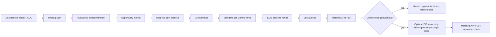

# 累计收益驱动的 Standard Cell 协同优化方法学 v3

状态：升级方案，待按本文任务切片实施。
归属：`custom-cell-fmax-dtco` HimaPack 的 Library Function Richness 开发专线。
依据：AES 单输出、20-Cell 双输出、40-Cell 双/三输出商业结果，以及 EPFL
《Technology Mapping Using Multi-output Library Cells》。

本文在当前 Framework、HimaPack、graph 和 Runtime 架构内升级方法。它不新增 Hima Runtime 组件、
Fabric 动作、商业试验管理系统或另一套资产生命周期。新增内容是现有 miner、免费评估、portfolio、
Cell generation 和 ECO adapter 内的更深逻辑。

## 1. 方法决定

优化单位从 **Cell** 改为 **当前 Design State 上具有可验证边际收益的 Action**。

Cell 不再是 miner 先产生、再交给 EDA 试用的猜测。Framework 先从 gate-level netlist、path group、
endpoint frontier 和可选物理上下文中证明一批 Action 值得执行，再把这些 Action 归纳为 Cell Demand，
最后生成所需 Cell 和 ECO。

Mapping 收益也不再定义为某条 timing path 的局部 delay 减少。它定义为一个 Action Portfolio 对整个
path group endpoint frontier 的结构化改善。局部 path 被修复、WNS 转移到另一个 endpoint 时，只有
frontier deficit、TNS 或 portfolio completion 改善；没有证据时不能声称 Fmax gain。

当前执行顺序固定为：

1. 从 DC baseline netlist 建 timing graph 和 endpoint frontier；
2. 找到单输出、多输出和物理合并机会；
3. 用免费代理比较 baseline cover 与 candidate cover，选择具有正边际收益的 Action Portfolio；
4. 由 Portfolio 反向生成 Cell Demand；
5. 在 baseline DC netlist 上先做 ECO，证明等价后重跑 APR/P&R；
6. ECO 商业结果为正时，才允许重跑一次逻辑综合，判断 single-output mapping 是否扩大收益；
7. 综合不能扩大收益时，保留 ECO 方法和已生成资产，不继续消耗商业资源。



## 2. 领域模型

### 2.1 Design State

一次优化迭代的事实快照，至少包含：

- gate-level netlist、top、module hierarchy 和 sequential boundaries；
- Liberty identity、pin capacitance、timing arcs 和当前累计 custom Library；
- SDC、clock、uncertainty 和 path-group identity；
- endpoint arrival、required、slack、TNS 和 path migration；
- 可用时的 placement、DEF、SPEF、net RC、via、sink geometry；
- 已接受 Action、当前 ECO patch 和证明身份。

Design State 是边际收益的条件。脱离 State 的“该 Cell 通常能提升多少”不构成当前 Design 的结论。

### 2.2 Endpoint Frontier

对 path group `g`，设当前最差 slack 为：

```text
WNS_g(S) = min(slack(e)), e in endpoints(g)
```

以固定窗口 `epsilon` 定义当前迭代的 frontier：

```text
Frontier_g(S, epsilon)
  = {e | slack(e) <= WNS_g(S) + epsilon}
```

Frontier 按 endpoint 去重，不按报告中的 path 行计数。同一个 endpoint 的多条 path 是其 timing cone 的
不同证据，不是多个独立优化目标。

每轮还冻结一个 frontier target `T = WNS_g(S) + epsilon`，定义 deficit：

```text
Deficit_T(S) = sum(max(0, T - slack(e)))
```

Action 即使尚未改变 WNS，只要可靠降低 `Deficit_T` 并属于一份能够覆盖剩余 endpoint 的 Portfolio，
可以成为准备动作；它不能单独宣称 Fmax 收益。

### 2.3 Opportunity、Action 和 Portfolio

- **Opportunity**：网表结构中存在的可评估改造位置，尚未授权修改设计。
- **Action**：一个已绑定位置、实现方式、影响 endpoint、边界、成本和回滚的候选修改。
- **Portfolio**：一组互不冲突、按当前 State 共同评估、目标是推动整个 frontier 的 Actions。

Action 的身份包含 module、source instances/nets、ordered leaves、roots、function vector 和 apply mode。
不同 module 中同名 instance 不是同一对象。

### 2.4 Cell Demand

一组已选 Actions 对物理 Cell 的聚合需求，包含：

- single-output 或 vector function；
- input/output pin identity 和允许的 permutation/phase；
- drive、load、pin-cap 和 required-time envelope；
- 预计采用位置和数量；
- ECO-only 或 synthesis-eligible；
- 结构共享、宽度、pin access 和 locality 要求。

一个 Cell Demand 可以服务多个 Actions。一个 Action 也可以在 single-output、multi-output 或 fusion
实现之间比较后只选择一个。

### 2.5 Commercial Label

Matched commercial flow 对一份 Portfolio 的实际观察，包括 adoption、route survival、WNS/TNS、面积、
wirelength、power model、DRC 和限制条件。它用于改善因子与排序，不反向伪造免费的预测准确率。

## 3. Timing graph 必须回答的问题

新的 timing graph 以 endpoint group 为入口，而不是以 top-N path 列表为入口。它需要回答：

1. 当前 frontier 有多少唯一 endpoint；
2. 每个 endpoint 的完整 fanin cone、dominators、reconvergence 和 shared subgraphs；
3. 一个局部 arc/net/cell 改变会传播到哪些 endpoint；
4. 哪些候选同时影响多个 frontier endpoints；
5. 哪些 endpoint 尚无机会覆盖；
6. 一个 Action 应用后，新的 WNS 落到哪里；
7. 多个 Action 的影响是否重叠、冲突或相互抵消。

对于“32 个 endpoint”的场景，优化目标不是找到一颗能改善其中三条 path 的 Cell，而是建立一份能让
32 个 endpoint 的最差 frontier 整体移动的 Portfolio。前 29 个 endpoint 未解决时，三条 path 的局部
gain 只能记为 coverage 或 deficit reduction。

## 4. Opportunity 类型

### 4.1 Single-output remapping

比较当前单输出 cone 与一个新单输出 Cell：

- exact Boolean equivalence；
- removed MFFC nodes、levels、inverters 和 nets；
- 新 Cell NLDM delay、pin cap、drive 和 boundary load；
- affected endpoints 与 required-time margin；
- mapping feasibility 和预期 occurrence。

Single-output Action 先通过 ECO 验证。商业 ECO 为正后，该 Cell 才能成为 synthesis-eligible，在可选
综合扩展阶段交给 DC 全设计 mapping。

### 4.2 Multi-output remapping

Multi-output Opportunity 由共享 ordered leaves 的多个 roots 构成，并要求：

- 全部 roots 都有完整外部用途，不产生 partially dangling output；
- 一个共同 input transform 作用于所有 outputs；
- 每个 root 分别满足 required time；
- 所有 outputs 在 candidate cover 中被引用；
- 与其他 Action 的 source instances/nets 不重叠；
- baseline single-output cover 与 vector Cell cover 可以完整比较。

当前方法中 multi-output 一律 **ECO-only**。商业综合工具不负责发现任意双/三输出 mapping。三输出继续
使用 directed ECO；whole-network 自动搜索不能冒充 pinned mockturtle 已有能力。

### 4.3 Physical serial fusion

对 placement/post-route 中物理相邻且连接的 Cell，评估把内部 net 吸收到一个新 Cell：

- chain internalization：中间 net 无外部 sink，可以生成单输出 fusion；
- side-output preservation：中间值仍有外部 sink，必须保留为多输出；
- 极少数多根共享结构可以保留三个 outputs；
- source Cell 必须同 row、height 兼容，并有合法 pin access。

物理净 margin 为：

```text
removed source-cell arc delay
+ removed extracted net/via delay
- new Cell arc delay
- added input/output pin capacitance
- external reroute penalty
```

Fusion 每次通常只内化一到两个 nets，收益上界相对固定。它不以 function novelty 排名，而以真实 RC、
locality 和 endpoint influence 排名。Fusion 一律 **ECO-only**。

## 5. Marginal Gain

每个 Action 输出完整向量，而不是一个不可解释 score：

```text
affected_endpoints
delta_slack_by_endpoint
delta_WNS_if_applied
delta_frontier_deficit
delta_TNS
removed_levels / nodes / edges / nets / vias
new_cell_delay / pin_cap / width / area
sink_divergence / locality / reroute_penalty
model_uncertainty
conflicts
```

免费模型不预测可移植的 MHz。它在当前 State 上计算相对关系和保守下界：

```text
ConservativeGain(a | S)
  = ProxyGain(a | S)
  - ModelUncertainty(a)
  - PhysicalPenalty(a)
```

Action 分为两种准入：

1. **Direct gain**：保守 WNS gain 为正，且所有 affected roots 满足 required-time 和无回归约束；
2. **Portfolio preparation**：WNS 暂未移动，但 frontier deficit 明确减少，并且 Portfolio 对剩余 endpoint
   有可执行覆盖计划。

只改善单条 path、无法定位 affected endpoint、或没有完整 Portfolio 归属的候选不得进入 Cell Demand。

## 6. Portfolio optimizer

Portfolio 采用字典序目标，避免面积或采用数量掩盖 Fmax：

1. 形式等价、全部输出使用、Site/预算和 required-time 为硬约束；
2. 最大化保守的 path-group WNS advancement；
3. 最小化冻结 target 下的 frontier deficit；
4. 最小化 TNS 和 violating endpoint 数；
5. 再比较面积、power、wire、Library cost 和 runtime。

选择过程是 stateful greedy + bounded local improvement：

1. 在 `S_k` 上计算所有 Action 的 marginal vector；
2. 选择最优非冲突 Action 或能补全 endpoint coverage 的小组合；
3. 在免费 timing graph 上应用并重新传播；
4. 更新 frontier、required time、冲突和 marginal gain；
5. 重复直到 frontier 推进、预算耗尽或没有正保守收益。

不能在同一个 baseline 上独立计算 20 个 gain 后直接求和。每次接受 Action 后都要重新计算，因为新的
critical endpoint、load、polarity 和 overlap 已经改变。

## 7. ECO-first 商业流程

### 7.1 冻结 baseline

冻结 DC netlist、SDC、foundry views、floorplan、pin plan、P&R script、工具版本和资源。已有匹配 baseline
且 hash 完全一致时直接复用，不重复运行。

### 7.2 ECO branch

1. 根据 Portfolio 只生成需要的 Cell；
2. 把 single-output、multi-output 和 fusion Actions 都落实到一份 baseline ECO netlist；
3. window proof、hierarchical proof、接口和 rollback 全部通过；
4. 使用新增 Library views 与同一 baseline 条件运行 APR/P&R；
5. 读取最终 master census、timing paths、WNS/TNS、面积、wire、power model 和 DRC；
6. 商业结果写成 Action/Portfolio/Cell Demand 的条件化标签。

ECO branch 回答“这些已证明的 mapping actions 在物理实现中是否累计产生收益”。

### 7.3 条件化 synthesis expansion

只有 ECO branch 对主要目标为正时才运行：

- single-output synthesis-eligible Cells 加入 DC Library；
- DC 可以扩大这些函数在全设计的采用；
- multi-output 和 fusion 仍在 DC 之后按原 Portfolio 或重新评估结果执行 ECO；
- 再做一次 matched APR/P&R，判断综合是否扩大收益。

若综合没有扩大收益，结论是“ECO-only 更适合当前 Demand”，不是继续修改 DC 设置寻找漂亮数字。

## 8. 免费因子与商业标签

现有 F0–F3 保持，增加 F4 Physical：

- **F0 Function**：Boolean/vector equivalence、接口、全部输出引用、generator feasibility；
- **F1 Local structure**：MFFC、levels、nodes/edges、internalized nets、共享和 function implementation；
- **F2 Design mapping**：occurrence、portfolio coverage、conflicts、single-output baseline cover 与采用；
- **F3 Timing graph**：endpoint influence、required-time、WNS/deficit/TNS counterfactual、path migration；
- **F4 Physical**：pin cap、width、locality、sink divergence、RC/via removal、reroute penalty。

F1–F4 是并列因子，不拟合一个跨 design 的 Fmax 数字。E0 继续是昂贵商业观察。历史数据用于回答哪些
因子与 adoption、route survival 和商业收益正相关。

AES 已有两类校准标签：

- 20-Cell 双输出：采用少但 Fmax、TNS、面积、wire、modeled power 小幅或明显正向；
- 40-Cell 双/三输出：采用更多但 WNS/TNS、面积、wire、modeled power 负向。

它们共同否定 `adoption_count` 作为目标，支持 endpoint influence、真实共享和物理 margin 作为新因子。

## 9. 内部证据文件

不增加对外交付件类型。现有 stage 在 workspace 内发布以下可复算 artifacts：

```text
timing-graph.json
endpoint-frontier.json
opportunities.json
action-portfolio.json
cell-demand.json
eco-patches.json
gain-evaluation.json
commercial-label.json
```

这些文件复用现有 artifact、CodeRecord、Reader、Judge 和 Pack archive 机制。它们不建立第二套状态库。

## 10. 代码修改地图

| 现有文件 | 固定升级 |
| --- | --- |
| `flow/domain/mine_timing_route.py` | 从 top-N path 扩展为 path-group endpoint frontier；构建 endpoint influence、dominator/shared-subgraph、required-time 和完整 graph counterfactual |
| `flow/domain/mine_patterns.py` | 在高影响区域发出 single-output、multi-output 和 physical-fusion Opportunity；保留 partially dangling、incompatible 和 unsupported 原因 |
| `flow/domain/multi_output_resynth/service.py` | 深化为 selected Action 的结构 ECO executor；比较 baseline/candidate cover，校验所有 roots、module-scoped conflicts、2/3-output directed patch 和 rollback |
| `flow/domain/proxy_mapping.py` | 对 single-output synthesis candidate 运行 reference/augmented mapping；保留 mapper adoption 与完整成本，不负责任意 multi-output discovery |
| `flow/library_richness.py` | 持有 Design State、marginal recomputation、Portfolio、Cell Demand 和跨轮商业标签关系 |
| `flow/domain/_generation_projection.py` | 从 Cell Demand 生成 delta-only single/multi/fusion physical jobs；累计 Library 旧 shard 不重做 |
| `flow/stages.py` | 在现有 research/merge/generate/custom-synth/P&R 职责内接线；不新增 graph node；ECO-first 后按商业结果条件化进入 synthesis expansion |
| `flow/read-stage.py` | 独立复算 frontier、portfolio completion、最终 census 和 commercial label，不复制 optimizer 判断 |

## 11. 实施任务与并行边界

本轨道使用 `CGO-*`，继续归属 Issue #40，不进入 PLS 主线。

| 任务 | 依赖 | 文件所有权 | 出口 |
| --- | --- | --- | --- |
| CGO-01 Endpoint frontier | 无 | `mine_timing_route.py` | 唯一 endpoint、path group、epsilon frontier、required/slack 和 path migration 可复算 |
| CGO-02 Action schema and gain vector | CGO-01 | `library_richness.py`、测试 fixture | single/multi/fusion 使用同一 Action contract，局部 path gain 不再冒充 WNS gain |
| CGO-03 Single/multi cover evaluator | CGO-01/02 | `mine_patterns.py`、`multi_output_resynth/` | 每个 root required-time、全部输出使用、baseline cover 和 conservative gain 完整 |
| CGO-04 Physical fusion evaluator | CGO-01/02 | `mine_timing_route.py` 的物理 helper | removed RC/via、pin cap、width、locality 和 reroute penalty 可复算 |
| CGO-05 Portfolio optimizer | CGO-02/03/04 | `library_richness.py` | 逐 Action 重传播、冲突、frontier coverage 和停止原因确定性复现 |
| CGO-06 Cell Demand and delta generation | CGO-05 | `_generation_projection.py`、generation/char adapters | 只生成 Portfolio 需要的 Cell；旧 Library 资产复用 |
| CGO-07 ECO-first AES pilot | CGO-06 | resynth、existing P&R stages | 完整 AES ECO proof 和 matched commercial label；不先跑 DC |
| CGO-08 Conditional synthesis expansion | CGO-07 positive | existing `custom-synth` stage | 只在 ECO 正向时判断 DC 是否扩大收益；否则记录 skipped-with-reason |

CGO-01 与 CGO-04 的输入解析准备可以并行；CGO-03 的逻辑 cover 与 CGO-04 的物理 margin 可以并行；
`library_richness.py` 和 `stages.py` 各由一位集成者顺序修改，避免共享状态冲突。

## 12. 分级测试

### L0：纯函数

- 32 endpoint fixture：一个 Action 只改善 3 个 endpoint 时，WNS gain 必须为零；
- 多 Action 覆盖全部 frontier 后，WNS 才允许前移；
- 两个 Action 影响相同 endpoint 时不能重复累计 gain；
- Action 应用后新 endpoint 成为最差时，path migration 必须出现；
- 三输出任一 root required-time 不满足时整颗 Cell 拒绝；
- fusion 中间 net 有 side loads 时必须保留输出；
- 不同 module 中同名 instance 不冲突。

### L1：结构 integration

- synthetic gate netlist + Liberty + SDC 形成完整 Design State；
- single/multi/fusion 三种 Opportunity 进入同一 Portfolio；
- baseline cover、candidate cover、affected endpoints、uncertainty 和回滚逐项断言；
- Portfolio preparatory Action 没有被错误写成 Fmax positive。

### L2：真实 AES 免费闭环

- 从真实 DC netlist 和 reg2reg reports 构建所有 path-group endpoints；
- 复算 20-Cell 正样本和 40-Cell 负样本的因子差异；
- 新 Portfolio 在免费层推动 frontier deficit，完成 ECO 和 hierarchical proof；
- LC/DC/Innovus job 为零。

### L3：Library acceptance

- 只为冻结 Portfolio 生成 Cell；
- multi-output、single-output 和 fusion views 通过 LC read/check/write；
- LEF pin/site/height 和 DB/Liberty function identity 一致。

### L4：商业出口

- 复用 hash 相同 baseline；
- 只运行一个 ECO generated arm；
- 若 ECO 主要目标为正，再运行一个 synthesis-expansion arm；
- 最终报告区分 adoption、route survival、WNS、frontier/TNS、PPA、DRC、模型限制和未闭合证明。

Desktop App 不参与本方法学测试。

## 13. 第一里程碑出口

第一里程碑不是 5% Fmax，也不是生成更多 Cell，而是 Framework 能在 AES 上完成以下闭环：

1. 列出完整 reg2reg endpoint frontier；
2. 说明每个 Action 影响哪些 endpoint；
3. 形成覆盖当前 frontier 的正保守收益 Portfolio；
4. 由 Portfolio 生成最小 Cell Demand；
5. ECO 完整 AES 并通过 hierarchical equivalence；
6. 商业 P&R 后说明收益是否存活、由哪些 Actions/Cells 贡献；
7. 结果为负时定位是 timing estimate、physical penalty、coverage、conflict 还是 Cell implementation；
8. 只有 ECO 正向才决定是否进行 synthesis expansion。

5% 仍是 Campaign 的最终商业目标。它来自多轮已验证正边际收益的累计，不寄希望于一颗或少数“银弹”
Cell。
