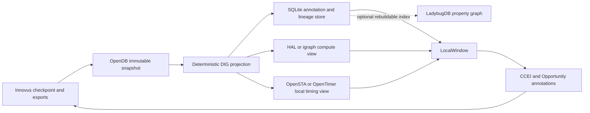

# Hima Information Graph 数据库与开源基础设施选型

日期：2026-09-16  
状态：技术选型建议；尚未完成 AES import POC，不代表组件已集成。  
归属：Library Function Richness / Post-route DIG v4，GitHub Issue #40。

## 1. 直接结论

现成项目可以显著缩短开发，但没有一个项目能独自承担我们的完整数字孪生。建议采用**分层组合**：

1. **Innovus 仍是现场事实权威。** 从 `S_place`、`S_postroute` 写出 netlist、LEF/DEF、SDC、SPEF、timing/clock/census 和 checkpoint identity。
2. **OpenDB 作为不可变物理/网表镜像。** 它负责可靠解析 LEF/DEF、对象模型、坐标、net/instance/pin、binary checkpoint 和 snapshot 内稳定 OID；不运行第二条 P&R。
3. **Hima DIG annotation/index 先以 SQLite 实现。** 它保存 snapshot identity、graph projection、CrossPhaseMap、LocalWindow、annotations 和 provenance。基础事实可由 Innovus/OpenDB 重建，SQLite 不反向修改 OpenDB。
4. **图计算采用可替换后端。** 第一候选是 HAL/igraph；Phase 1 同时用 SQLite adjacency/递归查询建立最低依赖基线。LadybugDB作为嵌入式 property-graph 候选参加 AES benchmark，但不立即成为不可替换核心。
5. **局部 STA 是独立 view。** 最快 POC 使用现场容器已有的 OpenSTA；并行评估 MIT 许可的 OpenTimer。两者只写 timing annotations，不拥有物理设计事实。
6. **HAL重点评估为 CCEI/逻辑图引擎，而不是物理数据库。** 它已经具备结构 Verilog/Liberty、图遍历、Python、igraph 和 subgraph re-synthesis，和我们的 anchored local resynthesis 高度相关。

推荐结构：



这不是五套互相竞争的数据库。只有两类持久事实：

- Innovus 原件与 OpenDB snapshot 是设计事实；
- Hima annotation store 是方法事实、推断、决策和商业响应。

HAL、OpenSTA/OpenTimer、LadybugDB都是可替换计算/查询视图。

## 2. 我们需要数据库解决什么

DIG基础设施的要求比“把 netlist 转成 graph”严格：

| 能力 | 必要性 |
| --- | --- |
| 稳定读取 gate netlist、LEF、DEF | 构建 logical/physical base facts |
| Liberty、SDC、SPEF 与 timing graph | 构建局部 STA 和 endpoint alternatives |
| instance/pin/net/module/geometry/RC identity | 支撑跨文件 join 和 LocalWindow |
| place/post-route 不可变 snapshots | 避免阶段事实互相覆盖 |
| CrossPhaseMap | 表达一对一、一对多、多对一、semantic-region 和 ambiguity |
| 自定义 annotation layers | 保存结构、proxy、decision、commercial response |
| 局部图投影与图算法 | k-hop、cut、community、matching、conflict、coverage |
| 增量失效与重算 | ECO 后只更新受影响 subgraph |
| 可哈希、离线、可归档 | 进入 Pack evidence、重放和客户现场 |
| 可替换后端 | 不把产品锁死在许可证或不成熟项目上 |

把这些职责全部压给 OpenDB、HAL或图数据库中的任何一个，都会迫使它承担并不擅长的工作。

## 3. OpenDB / OpenROAD

### 3.1 能直接复用的能力

OpenDB 是面向物理芯片设计的对象数据库，原生围绕 LEF/DEF 建模，并提供二进制数据库保存/恢复。官方文档说明对象 OID 在同一数据库 save/restore 后保持，数据库可以精确恢复和比较。[OpenDB README](https://github.com/The-OpenROAD-Project/OpenROAD/blob/master/src/odb/README.md)

它适合承载：

- technology、library、master、instance、pin、net；
- location、orientation、row/site、blockage、wire/via、extraction objects；
- snapshot 内稳定 OID；
- LEF/DEF 读写与 binary `.odb` checkpoint；
- multiple database objects，无需全局单例；
- EEQ/LEQ 等 library equivalence 信息。

OpenROAD可以通过 Tcl 读取 LEF/DEF或Verilog并保存OpenDB；Python可以读取 LEF/DEF和已有 `.odb`，但 Verilog 前端在 Python API 中有限制。[OpenROAD API](https://github.com/The-OpenROAD-Project/OpenROAD/blob/master/src/README.md)

### 3.2 Attribute能力

OpenDB提供 `dbBoolProperty`、`dbStringProperty`、`dbIntProperty`和`dbDoubleProperty`，可以附加到数据库对象。[OpenDB dbProperty API](https://github.com/The-OpenROAD-Project/OpenDB/blob/master/include/opendb/db.h)

这足以做：

- importer identity；
- source-name、phase、简单标签；
- 临时 debug property；
- 与外部 annotation ID 的反向索引。

但不适合直接承载完整 Hima annotations：

- 每个对象同名 property 唯一，不自然支持同一对象多轮、多 producer 记录；
- 值是 scalar，复杂 provenance只能塞进字符串；
- CrossPhaseMap连接两个独立 database snapshots，不属于单个dbObject；
- graph-wide annotation query、lineage和invalidations需要另写索引；
- 不应让 proxy改写作为基础事实的 `.odb`。

因此 OpenDB是**物理对象镜像**，不是完整方法知识库。

### 3.3 当前现场成熟度

Linglong已有的 `localhost/iic-osic-celluzi:2026.06` 容器包含：

- OpenROAD `26Q2-2270-g4c26918f5`；
- OpenSTA `sta`；
- Yosys；
- `+Python` OpenROAD；
- 可调用的 `dbDatabase`和四类`dbProperty` Python bindings。

这意味着我们可以直接在现有 Site 容器里做 OpenDB import POC，不需要先编译或安装新工具。源码 checkout 虽然存在，但没有发现已构建 binary，而且当前 checkout与记录的 submodule revision不一致；第一阶段应固定容器 binary及其digest，不从源码重建。

### 3.4 判断

**结论：采用，作为Phase DIG的物理/netlist对象镜像。**

继续条件：真实 AES LEF/DEF/netlist 导入后，实例、net、pin、坐标、master、单位与 Innovus export 能按明确 exclusions 对账，且相同输入两次导入产生相同 projection hash。

停止条件：专有 LEF/DEF 方言导致大量静默丢失，或 Python/Tcl API 无法无损访问构建 DIG 所需对象。发生这种情况时回退到直接解析 Innovus exports，OpenDB降为可选验证器。

## 4. HAL：最值得做的逻辑图与 CCEI 加速 POC

HAL是面向 gate-level netlist 分析、修改和逆向工程的图原生框架，使用高性能 C++ core，并提供 Python、插件、Verilog/VHDL/Liberty parser和项目持久化，采用MIT许可证。[HAL项目](https://github.com/emsec/hal)

它与我们高度匹配的能力：

- netlist/gate/net/module/grouping对象模型；
- structural Verilog与Liberty导入；
- Boolean function与subgraph操作；
- igraph-backed `NetlistGraph`、neighborhood、shortest path、components等算法；
- Python bindings，适合AI现场生成分析代码；
- gate placement metadata；
- `.hal` project保存netlist及分析数据；
- 通过Yosys进行selected subgraph re-synthesis。[HAL Graph Algorithms](https://github.com/emsec/hal/wiki/Graph-Algorithms)、[HAL Resynthesis](https://github.com/emsec/hal/wiki/Resynthesis)

这几乎覆盖 CCEI anchored local resynthesis 的逻辑半边：

```text
anchor region
-> k-hop neighborhood
-> subgraph/function extraction
-> Boolean analysis
-> Yosys remap/resynthesis
-> modified netlist
```

### 4.1 不能直接解决的部分

- 没有原生完整DEF/SPEF/SDC/STA对象模型；
- placement location是gate data metadata，不是完整物理数据库；
- 多sink net转igraph时会展开成多条edge，DIG仍要保留net hyperedge；
- gate library在netlist创建后固定，新增custom Cell需在导入前构建augmented library；
- subgraph re-synthesis会失去原gate一一对应，必须保留我们自己的provenance和proof；
- resynthesis plugin不是默认构建，需Yosys；
- 官方文档明确提示部分plugin API仍可能变化，不能让Hima外部contract直接暴露HAL类型；
- 无预构建binary，正式支持Ubuntu 22.04/24.04，macOS只是实验支持。[HAL Building](https://github.com/emsec/hal/wiki/Building-HAL)

### 4.2 判断

**结论：不作为DIG物理数据库；强烈建议做CCEI/逻辑图引擎POC。**

它可能替代我们大量自写的：

- structural netlist parser；
- graph traversal和neighborhood；
- Boolean subgraph extraction；
- 常见图算法适配；
- 一部分single-output local resynthesis。

它未证明任意multi-output custom Cell mapping、Innovus placement metadata导入和我们的hierarchical proof语义。POC通过后，HAL作为 `multi_output_resynth` 内部可替换backend，不改变外部request/result contract。

## 5. Timing engines

### 5.1 OpenSTA

OpenSTA支持Verilog、Liberty、SDC、SPEF，提供timing graph、arrival/required、incremental update和Network Adapter；OpenROAD的dbSta已经把它接到OpenDB。[OpenSTA](https://github.com/parallaxsw/OpenSTA)、[STA API](https://github.com/parallaxsw/OpenSTA/blob/master/doc/StaApi.md)

优势：

- 功能覆盖广；
- 与OpenDB已有成熟adapter；
- Linglong容器已经提供；
- 适合直接验证LocalWindow与多个path alternatives。

限制：OpenSTA是GPLv3/商业双许可证。内部Site独立进程POC可以继续，但产品分发、链接或修改必须先做许可证决定。

### 5.2 OpenTimer

OpenTimer采用MIT许可证，读取 `.lib/.v/.spef/.sdc`，支持graph/path timing、并行增量更新以及C++ builder/action/accessor API，并可dump timing graph。[OpenTimer](https://github.com/OpenTimer/OpenTimer)

优势：

- 许可简单；
- 自包含、C++17、Linux/macOS；
- local-window增量STA的接口形态很好；
- 不需要完整OpenROAD。

限制：

- 不是物理数据库；
- 当前现场没有安装；
- SDC、clock、OCV/AOCV、conditional arcs和报告一致性需要与Innovus实测；
- 公开文档不能替代专有TSMC28数据上的correlation。

### 5.3 iSTA / iEDA

iSTA支持DEF/Verilog、SDC、SPEF/SDF、Liberty，并声明NLDM/Elmore、CCS、OCV/AOCV等能力；iDB为iEDA多个物理工具读取LEF/DEF提供共享数据库。[iSTA](https://ieda.oscc.cc/en/tools/ieda-tools/ista.html)、[iEDA](https://github.com/OSCC-Project/iEDA)

它是OpenDB+STA的真实竞争方案，但iEDA是完整基础设施和工具链，采用MulanPSL-2.0，构建和集成面显著更大。当前没有发现Linglong安装。除非OpenDB/OpenSTA/OpenTimer在真实数据上失败，不建议先引入整套iEDA。

### 5.4 判断

- Phase 1：OpenSTA作为已安装proxy backend；
- 同步POC：OpenTimer作为MIT替代；
- iSTA：保留Plan B；
- Innovus timing始终是Commercial Label authority。

## 6. SQLite、LadybugDB和其他graph stores

### 6.1 SQLite

当前macOS Python已有SQLite 3.51.0、JSON和RTree。SQLite官方提供JSON/JSONB函数、R*Tree空间索引和recursive CTE。[SQLite JSON](https://www.sqlite.org/json1.html)、[SQLite RTree](https://www.sqlite.org/rtree.html)、[SQLite recursive queries](https://www.sqlite.org/lang_with.html)

建议Phase 1 schema：

```text
snapshots
nodes
edges
hyperedges / hyperedge_members
geometry_rtree
annotations
annotation_scope
annotation_lineage
cross_phase_map
local_windows
artifact_manifest
```

优势：

- 无新增服务和几乎零部署成本；
- 事务、索引、外键和schema migration成熟；
- 适合append-only annotations、provenance和hash manifest；
- RTree适合bbox/proximity；
- 一个文件便于Pack归档、复制和回滚；
- Python、Node、C/C++都能访问。

限制：

- 不是EDA parser；
- 多跳、community、dominator、matching等算法不应全部写成SQL；
- 大规模图计算需要投影到igraph/HAL或其他内存引擎；
- JSONB大多数操作仍是O(N)，不能把所有属性塞进一个巨大JSON blob。

### 6.2 LadybugDB

LadybugDB是Kuzu的活跃后继，采用MIT许可证，提供嵌入式property graph、Cypher、columnar storage、CSR adjacency、ACID和Python/Node/C++预编译包；2026年仍在发布。[LadybugDB](https://github.com/LadybugDB/ladybug)、[releases](https://github.com/LadybugDB/ladybug/releases)

它很适合以下查询：

- k-hop和pattern matching；
- CrossPhaseMap关系遍历；
- annotation lineage；
- Opportunity region查询；
- graph-native UI/AI查询。

但它不懂EDA格式，且相较SQLite/OpenDB更年轻。Phase 1把它作为**可重建query index**参加AES benchmark，不让它独占基础事实。若Cypher显著降低代码量、查询稳定且deterministic export可证明，再升级为DIG annotation store候选。

### 6.3 Kuzu、DuckPGQ、Neo4j/FalkorDB

- Kuzu功能合适但项目已于2025年10月归档，不作为新核心。[Kuzu repository state](https://github.com/kuzudb/kuzu)
- DuckPGQ让DuckDB表具备SQL/PGQ图查询，适合分析型实验，但extension和property-graph持久语义仍在演进，且没有EDA parser；只保留研究候选。[DuckPGQ](https://duckpgq.org/)
- Neo4j等服务型数据库增加客户部署、数据导入和运维责任，不符合当前Pack本地能力原则。
- FalkorDB需要Redis/module运行形态且核心采用SSPLv1，不作为产品基础依赖。[FalkorDB](https://github.com/FalkorDB/FalkorDB)

### 6.4 判断

**默认选择SQLite；用LadybugDB做可替换性能/开发效率对照。**

不要先把DIG设计成Cypher产品。先冻结node/edge/annotation/CrossPhaseMap语义，让存储后端可替换。

## 7. 其他项目为什么不作为核心

| 项目 | 有价值的能力 | 不作为DIG核心的原因 |
| --- | --- | --- |
| Yosys RTLIL | 逻辑IR、attributes、mapping、proof | 不含完整物理/timing；优化会改变结构与命名 |
| Surelog/UHDM | SystemVerilog elaboration、VPI对象、serialization | 面向RTL/elaboration，不是post-route gate/placement/RC数据库 |
| HAL | 图原生逻辑、Boolean、Python、resynthesis | 缺完整DEF/SPEF/SDC/STA；适合CCEI backend |
| OpenTimer/OpenSTA/iSTA | timing graph和STA | 不拥有完整物理与annotation生命周期 |
| OpenDB | 物理/netlist对象与checkpoint | graph algorithms和多版本annotations不是其强项 |
| LadybugDB | property graph与Cypher | 无EDA parser；新项目成熟度风险 |
| iEDA | iDB+iSTA+iPL等完整基础设施 | 采用面太大，和现有Innovus链路重复 |
| UHDM | 标准HDL对象模型 | 对当前gate-level post-route问题层次过高 |

## 8. 推荐的Phase-1数据布局

每个checkpoint保留：

```text
snapshot/
  manifest.json
  innovus-export/
    design.v
    design.def
    constraints.sdc
    parasitics.spef
    timing-facts.json
    clock-facts.json
  physical.odb
  dig.sqlite
  projections/
    graph-summary.json
    local-window-*.json
```

`physical.odb`是OpenDB镜像；`dig.sqlite`保存：

- stable Hima node/edge IDs；
- OpenDB OID、Innovus object name和source hashes；
- graph projections；
- append-only annotations；
- CrossPhaseMap；
- LocalWindow manifests。

Hima ID不能直接等于OpenDB OID，因为place/post-route是独立imports。建议：

```text
node_id = hash(snapshot_id, object_kind, canonical_native_identity)
```

CrossPhaseMap用Hima IDs连接两个snapshots，并保存证据，不修改任何一端。

图算法运行时，把指定snapshot/subgraph投影到HAL/igraph/Ladybug；结果作为annotation写回SQLite。算法后端崩溃或更换时，基础facts与历史annotations不丢失。

## 9. 有界POC

### POC-1：OpenDB import fidelity

输入：一份 retained AES `S_place`与`S_postroute` Innovus export bundle。

验证：

- LEF/DEF/netlist可读取并保存两个`.odb`；
- instance/master/net/pin/location/orientation/DBU按明确exclusions与Innovus对账；
- save/reload后OID和projection hash稳定；
- custom Cell、多输出pins、hierarchy和bus names不静默丢失；
- 相同输入重复运行产生相同graph projection。

停止条件：出现无法解释的对象缺失、连接错误、单位漂移或非确定性。

### POC-2：SQLite DIG与CrossPhaseMap

验证：

- 两个snapshots、hyperedges、geometry和annotations入库；
- exact name、stable net/register、Boolean signature和k-hop topology四层匹配；
- one-to-many、many-to-one、ambiguity和absent可表达；
- LocalWindow可以在不重读原始文件的情况下复算；
- 现有`MULTI_0103`、`MULTI_0142`、`SINGLE_0009`敏感区域可查询。

### POC-3：HAL与图算法

验证：

- HAL读取AES gate netlist和augmented Liberty；
- gate/net/module数量与DIG对账；
- placement metadata可注入并保存；
- k-hop、subgraph、community、shortest path和components在同一Hima IDs上往返；
- 选定single-output subgraph可resynthesize；
- multi-output custom Cell匹配能力明确为通过、缺口或不支持。

停止条件：build/deployment不适配Rocky/Alma、TSMC28 Liberty无法可靠导入，或ID/provenance损失超过自写backend的收益。

### POC-4：Timing backend

同一LocalWindow分别使用Innovus facts、OpenSTA和OpenTimer：

- arc、load、slew、arrival、required、slack和path alternatives逐项比较；
- 记录unsupported SDC/Liberty/SPEF语义；
- 测量局部增量更新时间；
- 不以平均误差掩盖critical arc或endpoint排序错误。

OpenTimer通过后可成为默认MIT backend；否则OpenSTA保持Site-side独立进程，许可证问题在产品化前解决。

### POC-5：SQLite与LadybugDB对照

用同一AES graph与annotation corpus比较：

- 导入时间、文件大小、cold/warm k-hop；
- CrossPhaseMap和annotation-lineage查询；
- LocalWindow projection代码复杂度；
- deterministic export、备份恢复和版本升级；
- macOS/Linux离线打包。

只有Ladybug显著减少实现复杂度且稳定性证据不弱于SQLite时，才把它从可重建index提升为annotation store。

## 10. 决策门

| 决策 | 当前建议 | 改变建议所需证据 |
| --- | --- | --- |
| 物理/netlist镜像 | OpenDB | AES import不完整或非确定 |
| annotation authority | SQLite | Ladybug在真实corpus上显著更简单且同等可复现 |
| 图算法 | HAL/igraph POC | 构建或identity代价高于自有投影 |
| 默认STA proxy | OpenSTA先行，OpenTimer候选 | OpenTimer真实correlation通过并覆盖所需语义 |
| 全栈替代 | 不采用iEDA | OpenDB/STA组合失败且iDB+iSTA POC明显更完整 |
| HDL数据库 | 不采用UHDM为core | 未来任务转回复杂SystemVerilog elaboration |

## 11. 最大风险

1. **对象身份错觉。** OpenDB OID和HAL ID只在自己的snapshot/project中稳定，不能自动跨阶段对应。
2. **格式可读不等于语义完整。** LEF/DEF读入成功不证明SPEF、clock、exceptions和multi-output pins正确。
3. **annotation污染基础事实。** OpenDB property很方便，但proxy结果必须留在独立annotation layer。
4. **多模型漂移。** OpenDB、HAL、STA和SQLite都持有某种netlist view，必须由manifest和对账阻止静默分叉。
5. **许可证。** OpenSTA分发/链接、FalkorDB SSPL等不能在实现后才处理。
6. **新数据库诱惑。** Cypher查询方便不代表值得增加依赖；先以真实AES query证明收益。

## 12. 最终建议

马上开展的最小路径是：

1. 用现有IIC-OSIC容器里的OpenROAD/OpenDB导入AES双阶段exports；
2. 用SQLite实现最小DIG schema、annotations、RTree和CrossPhaseMap；
3. 对同一graph分别做HAL和Ladybug的只读projection POC；
4. 用现有OpenSTA跑第一个LocalWindow，再用OpenTimer做MIT替代对照；
5. 只有POC证据通过后，才把backend接入现有Pack stages。

这条路线最大化复用现成能力，同时保留可回退性：OpenDB失败可以回到Innovus直接导出解析；HAL失败不影响DIG；Ladybug失败回到SQLite；OpenTimer失败继续使用OpenSTA/Innovus facts。没有任何一个外部项目成为无法替换的产品控制者。

## 13. 研究边界与证据

本报告完成了API、格式、持久化、图算法、许可证和本地可用性层面的选型。尚未证明：

- OpenDB能无损导入当前TSMC28/AES Innovus exports；
- HAL能直接消费当前foundry Liberty和multi-output custom Cells；
- OpenTimer与Innovus在当前约束/RC下的相关性；
- Ladybug相对SQLite的实际开发和性能收益。

这些未知均被转成POC gate，没有被当作已实现事实。检索协议、问题纲要、论证卡、缺口矩阵和结构化证据位于 [`research/information-graph-database/`](research/information-graph-database/)。
