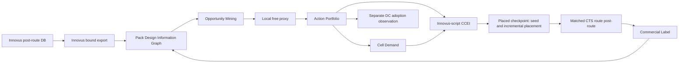
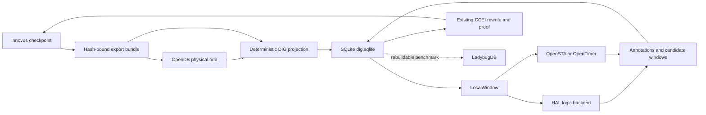

# Post-route Design Information Graph 驱动的协同优化方法学 v4

状态：免费闭环与小型 CCEI seam 已实现并验证；首个真实 local proxy 为负，完整 E0 按门禁跳过，尚未产生新 Fmax 收益。
归属：`custom-cell-fmax-dtco` HimaPack 的 Library Function Richness 开发专线，继续由 GitHub Issue #40 跟踪。
范围：升级现有 Framework、Pack domain tools、P&R adapter 和 Reader，不新增 Hima Runtime 组件、Fabric 动作、商业试验管理系统或对外交付件类型。
修订：2026-09-16 纳入 OpenDB、SQLite、HAL、OpenSTA/OpenTimer、Yosys 和 LadybugDB 的技术选型；外部项目只作为现有 DIG/CCEI 深模块内可替换的 adapter/backend。
决策修订：免费代理在完成与 E0 的相关性校准前只有观测权，没有 Action 准入/拒绝权；Mock Liberty 的简单/复杂合并分别以 source cover 全 NLDM 网格快 5%/10% 为先验。
实施证据：[AES DIG v4 免费闭环](evidence/2026-09-16-aes-dig-v4-free-closure.md)。

## 1. 方法决定

后续方法固定为：

> 用 post-route Design Information Graph 发现高价值、低风险的控制动作；用局部免费代理筛选；用 CCEI 在物理状态内落实；用商业 EDA 观察全局响应；再把响应反馈到下一轮系统辨识。

优化对象继续是 **Design State 上的 Optimization Action**，但 v4 把 Design State 的权威输入从“DC 网表加 sampled timing report”升级为“商业 post-route 数据库及其可校验导出”。Cell 仍是执行 Action 所需的资产，不是搜索起点。

v4 不追求开源工具预测最终 MHz，也不以单次免费代理结果代替商业观察。免费层只回答局部问题：

- 当前结构是否存在可证明的逻辑或电气改造机会；
- Opportunity 的逻辑边界、物理边界和 timing influence 是否完整；
- 新 Cell 在声明的 load/slew/位置范围内是否比当前局部 cover 更有余量；
- CCEI 是否能够在原 placement 状态内安全实施、证明和回滚；
- 哪些局部风险足以阻止一次昂贵商业观察。

全局 placement、CTS、route、useful skew 和优化器路径的响应不被免费层伪装成可准确预测量。它们由 E0 商业观察产生 Commercial Label，再用于下一轮局部系统辨识。



## 2. 我们过去解决错了什么问题

### 2.1 从 Cell 开始，而不是从 Design Opportunity 开始

最早的方法先枚举函数或结构，再把 Cell 交给 DC/Innovus 试用。它能证明生成、Liberty、mapping、ECO 和 P&R 机制可运行，却不能证明这些 Cell 对当前设计有必要。

后果是：

- function novelty、结构压缩和 occurrence 被误当成收益；
- Library 越大，商业工具搜索空间越大，但方向不一定更好；
- 商业工具逐渐变成试错引擎；
- 没有先回答“当前设计具体哪里需要什么 Cell”。

### 2.2 把 timing path 列表误当成 timing graph

v3 已经把目标从单条 path 提升到 unique endpoint frontier，但 AES 100-Cell 观察进一步证明：一个 endpoint 下仍可能存在多个 launch point、多个 reconvergent cone 和多个接近最差的备选 path。

Top-N 报告中每个 endpoint 只出现一次，并不意味着该 endpoint 的 timing state 完整。Action 修复已报告 path 后，同一 endpoint 内另一条 path 可以立刻接管。免费代理因此曾把 sampled frontier 错误放行到 E0。

v4 要求完整 Endpoint Frontier 至少包含：

- 每个 endpoint 的多个候选 launch paths；
- shared subgraphs、dominators、reconvergence 和 path alternatives；
- data arrival、required、clock contribution、slew、load 和 arc delay；
- Action 影响后的局部 path migration；
- 仍未被观测或覆盖的 cone。

### 2.3 只看逻辑内聚，没有看物理内聚

40-Cell 与 100-Cell 结果共同表明，多输出逻辑在 Boolean 上可合并、在商业工具中可读取和计时，不代表它适合成为一个物理 Cell。

未建模的物理问题包括：

- 多个 outputs 的 sinks 在 placement 上发散；
- 新 Cell 的输入电容和 pin density 增加；
- cell width、pin access、局部拥塞和 reroute penalty；
- 被内化 net 的真实 RC/via 收益是否足够；
- 大驱动路径上的新 Cell 是否反而成为 33～67 ps 的瓶颈。

### 2.4 把 drive variant 当成统一 delay scaling

当前 D1/D8 试验说明，drive 不能用“所有 delay 统一乘一个比例”表达。一个可信的 D1/D2/D4/D6/D8 family 必须同时改变：

- output resistance 与大负载 delay；
- input pin capacitance；
- output transition；
- area、width、leakage 和 internal power；
- LEF 几何与 pin access；
- 不同 output 的非对称 drive 需求。

大负载下更强的驱动可能有收益，小负载下未必；多输出 Cell 也可能需要 `Y0=D8, Y1=D2`，而不是全部输出统一放大。

### 2.5 没有明确 ECO-only 的保存语义

100-Cell 商业观察中，未保护时 Innovus 删除了全部 11 个 ECO Cell。该 arm 只能说明工具选择了 non-adoption，不能证明 custom Cell 的局部作用。保护后 11 个 Cell 全部保留，设计转入另一个面积、线长、功耗和 timing 状态。

因此：

- multi-output、physical fusion 和 CCEI 明确插入的 Cell 是 ECO-only Action；
- E0 必须检查初始 census、关键阶段 census 和最终 census；
- 被优化器删除的 Action 不构成采用收益证据；
- 保护范围只覆盖声明的 ECO instances，不能冻结无关 foundry logic；
- 商业报告分别记录“优化器自由选择”和“ECO preserved”的语义，不能混写。

### 2.6 物理机会实施后重新冷启动 placement

若 Opportunity 来自 post-route 或 coarse placement 的距离、方向、RC 和邻接关系，CCEI 修改网表后再从空白 init/placement 开始，会丢失生成该 Opportunity 的物理状态。

v4 的默认实施方式改为：

1. 在同一 placed database 上定位 source cluster；
2. 新 Cell 初始位置取 source cluster 的 centroid 或 bounded region；
3. 保留未受影响实例的位置；
4. 只对局部窗口进行 legalization/incremental placement；
5. 更新局部寄生与 STA；
6. 通过本地检查后继续 CTS/route/post-route。

若某个 Site 只能重新读入 ECO netlist，则必须同时携带 placement seed、unaffected-instance placement、source bounding box 和局部合法化约束；不能把重新全量 placement 冒充 physical-aware ECO。

### 2.7 没有把时钟控制与数据路径收益拆开

Useful skew 会改变 endpoint required time 和 critical path 排序。Baseline 与 generated arm 必须采用完全一致的 early clock、useful skew、skew budget 和 max allowed delay；同时报告必须拆分：

```text
DeltaSlack
  = DeltaDataArrival
  + DeltaCaptureClock
  - DeltaLaunchClock
```

Opportunity Mining 使用两个视图：

- **Data-path diagnostic view**：限制时钟补偿，识别逻辑、负载和互连本身的问题；
- **Production view**：使用最终相同的 early clock/useful-skew 策略，判断系统 QoR。

不能把时钟树替数据路径还债的结果全部归因给 custom Cell。

### 2.8 把商业 EDA 的全局响应当成局部收益

11 个 Cell 不可能直接消除约 4069 µm² 逻辑面积和约 20.8 mm wire。它们改变了 placement、sizing、buffering、clock 和 route 的全局收敛轨迹。

因此商业结果拆为：

- **Local survival**：Cell 是否保留、实际 arc delay、load/slew、局部 RC 和 source cover；
- **Global response**：placement、sizing、buffering、CTS、wire、congestion 和 path migration；
- **Business outcome**：最终 WNS/Fmax、TNS、面积、功耗、DRC 和限制条件。

Commercial Label 记录这种条件关系，不把全局变化反写成单颗 Cell 的固定收益。

## 3. 方法学的阶梯演进

| 阶段 | 核心问题 | 已得到的认识 | 不再接受的做法 |
| --- | --- | --- | --- |
| Cell Mining | 能否找到并生成新函数 | 工具链和 bounded Boolean search 可运行 | 先做 Cell，再找用途 |
| Library Richness Factors | 哪些免费指标值得观察 | F0～F4 可分层，adoption count 不是目标 | 预测跨设计 MHz |
| Endpoint Portfolio | 如何累计局部收益 | Action、frontier、marginal recomputation 比 Cell 排名更合理 | 单 path gain 简单求和 |
| Design Information Graph | 如何控制动态物理系统 | 逻辑、timing、placement、RC、clock 必须共同建模 | top-N timing report 代表完整状态 |
| Closed-loop System Identification | 如何从失败中提升 | E0 是条件化系统响应，反馈到下一轮因子和风险 | 连续商业试错或追漂亮数字 |

v4 不否定 v3 的 Action、Portfolio、Cell Demand、Commercial Label 和条件化 DC expansion。它替换的是 v3 仍然过于静态的 Design State 获取方式和 ECO 落地方式。

## 4. Post-route Export Bundle

商业 Innovus database 是现场权威。Framework 对 `S_place` 与 `S_postroute` 分别生成 hash-bound 导出束，用于构建两个阶段图，不改变原数据库：

```text
postroute-db identity
logical netlist
DEF or placement projection
SDC with units and active modes
SPEF or extracted RC projection
Liberty and LEF identities
clock/path-group/analysis-view identity
tool/version/script identity
master and instance census
```

要求：

- 每个 bundle 内所有文件来自同一个 database checkpoint 和 analysis view；
- place/post-route bundle 共享 design、constraints、Library 和 flow lineage，但各自保留独立 hash；
- netlist、DEF、SPEF 的 instance/net identity 可以互相连接；
- SDC units、clock uncertainty、propagated clock 和 exceptions 明示；
- export 前后不运行会改变设计的优化命令；
- 原始客户数据留在 Site，Git 只保存 schema、代码和非专有摘要；
- 导出不完整时，DIG 状态为 `incomplete`，不得开启 E0。

## 5. Design Information Graph

### 5.1 实现边界

Phase 1 以 Innovus 为设计事实权威和导出器，不引入第二条开源 P&R 链。开源组件在现有 Pack domain tools 内分层复用：

- Innovus 从同一个 checkpoint 写出 netlist、LEF/DEF、SDC、SPEF/RC、timing/clock facts、census 和 manifest；
- OpenDB 读取同一 bundle，形成不可变 `physical.odb` 镜像，负责物理对象、坐标和连接关系，不运行 placement、CTS 或 route；
- SQLite `dig.sqlite` 保存稳定 Hima ID、graph projection、hyperedge、CrossPhaseMap、LocalWindow、append-only annotations、lineage 和空间索引；
- HAL 只作为逻辑图和 CCEI `analyze/discover` backend，负责结构网表、局部图遍历、Boolean subgraph 和 bounded resynthesis POC；
- OpenSTA 是第一局部 timing backend，OpenTimer 是 MIT 许可的对照候选；两者只产生 timing annotations；
- Yosys 继续承担 window/module/top equivalence proof，不因引入 HAL 而改变成功门；
- LadybugDB 只参加可重建 property-graph query index 对照，不在 Phase 1 拥有任何唯一事实；
- CCEI 继续使用 Innovus Tcl/数据库命令执行 instance/net ECO、位置 seed 和 incremental placement。

因此只有两类持久事实：

1. Innovus 原件及可由原件重建的 OpenDB snapshot 是 **design facts**；
2. SQLite 中绑定 snapshot hash 的 Hima annotations、decision 与 commercial response 是 **method facts**。

HAL、OpenSTA/OpenTimer 和 LadybugDB 都是可替换计算或查询 view。任何 backend 的内部 object ID 都不能成为 Hima ID，任何 proxy 结果都不能反向覆盖 Innovus/OpenDB 基础事实。

### 5.2 开源工具与数据库实现栈

| 组件 | v4 职责 | 输入 | 输出 | 明确不拥有 |
| --- | --- | --- | --- | --- |
| Innovus | checkpoint、导出、CCEI物理实施、E0观察 | 商业 database/Library/constraints | export bundle、ECO database、Commercial Label | Hima方法结论 |
| OpenDB | 不可变物理/netlist对象镜像 | LEF/DEF、linked netlist、manifest | `physical.odb`、对象 projection | annotations、CrossPhaseMap、商业结论 |
| SQLite | DIG身份、关系、属性、lineage和RTree | deterministic projection、proxy/decision结果 | `dig.sqlite`、LocalWindow、查询结果 | EDA解析、图算法、时序计算 |
| HAL | 逻辑图与 anchored-resynthesis分析后端 | augmented Liberty、gate netlist、Hima-scoped LocalWindow | cuts、truth vectors、候选 windows、诊断 | 物理事实、最终ECO发布、proof authority |
| OpenSTA/OpenTimer | 局部STA view | Liberty、Verilog、SDC、SPEF、LocalWindow | arc/path/margin annotations | Innovus signoff label、跨阶段身份 |
| Yosys | 等价性证明 | baseline/candidate windows/modules/netlists | proof evidence | Opportunity ranking、物理收益 |
| LadybugDB | 可选可重建查询索引 | SQLite/DIG projection | Cypher查询对照 | canonical facts、Pack运行依赖 |

数据通路固定为：



每个 phase snapshot 的最小目录为：

```text
snapshot/
  manifest.json
  innovus-export/
    design.v
    design.def
    constraints.sdc
    parasitics.spef
    timing-facts.json
    clock-facts.json
  physical.odb
  dig.sqlite
  projections/
    graph-summary.json
    local-window-*.json
```

`physical.odb` 和 `dig.sqlite` 都是同一 Innovus bundle 的派生物，manifest 保存输入、工具、schema 和输出 hashes。OpenDB OID 只在单个 snapshot save/restore 内使用；跨 place/post-route 的稳定身份使用：

```text
hima_id = hash(snapshot_id, object_kind, canonical_native_identity)
```

CrossPhaseMap 连接 Hima IDs，并保存 correspondence evidence。HAL gate ID、STA vertex 和 Ladybug row ID 只能作为一次 projection 的反向索引。

采用外部 backend 前必须通过隔离 POC。OpenDB 导入失败时回退到 Innovus export 直接解析；HAL 失败时继续使用当前 native discovery；OpenTimer 失败时保留 OpenSTA/Innovus timing facts；LadybugDB 失败不影响 SQLite。详细选型与证据见 [Information Graph 数据库与开源基础设施选型](information-graph-database-technology-selection.zh-CN.md)。

当前 Linglong Site 的 pinned IIC-OSIC 容器已经提供 OpenROAD/OpenDB、OpenSTA、Yosys 和 Python bindings，可直接开始 OpenDB/OpenSTA POC；HAL、OpenTimer 和 LadybugDB 尚未成为现场依赖，分别先做隔离构建或benchmark。所有外部工具记录版本、binary/container digest、启动命令和license。OpenSTA 的 GPLv3/商业双许可证在产品分发或链接前单独审查；POC阶段只作为Site侧独立进程调用。

### 5.3 图模型

DIG 是异构有向超图，不是普通 instance adjacency graph。

节点类型：

- `Instance`：master、function、drive、area、location、orientation、lineage；
- `Pin`：direction、capacitance、slew、arrival、required、slack；
- `Net`：driver、sinks、fanout、HPWL、route length、R/C、via、congestion；
- `TimingArc`：cell/wire arc、sense、delay、transition、analysis point；
- `EndpointState`：path group、capture、clock、frontier membership；
- `PathAlternative`：launch、ordered timing cone、shared/dominator/reconvergence；
- `PhysicalRegion`：bbox、row/site、density、pin access 和 route pressure。

关系类型：

- Boolean/logic dependency；
- driver-to-sink hyperedge；
- timing propagation；
- physical proximity；
- shared support/reconvergence；
- launch/capture/clock relation；
- phase lineage：DC → coarse placement → post-route。

### 5.4 双阶段 Design Information Database

v4 不维护一个随流程覆盖更新的可变图，而是保存两个不可变 snapshot：

```text
DIG_place(k)       <- S_place(k) export bundle
DIG_postroute(k)   <- S_postroute(k) export bundle
CrossPhaseMap(k)   <- DIG_postroute(k) <-> DIG_place(k)
```

两张图使用同一 node/edge schema。Opportunity annotation 首先绑定 `DIG_postroute` 的 subgraph、endpoint alternatives 和物理区域，再通过 `CrossPhaseMap` 投影到 `DIG_place` 的候选 region。CCEI 在投影 region 内重新做 anchored local resynthesis，不把映射关系当作精确 ECO target。

Cross-phase correspondence 允许：

- `one-to-one`：instance/net/pin 在两个阶段保持；
- `one-to-many`：post-route buffer/clone/拆分对应 place 的一个 source；
- `many-to-one`：优化器合并或重构多个 source；
- `semantic-region`：对象名称变化，但 Boolean boundary、sequential anchors 和局部 topology 可对应；
- `absent`：无法可信投影，Action 不进入 place CCEI。

映射按证据强度逐级建立：

1. 完全相同的 hierarchy/module/object identity；
2. 稳定 register/port/net 与幸存 `U*` anchors；
3. ordered leaves/roots、truth-vector 和 sequential support signature；
4. 1～2 级邻域 topology、fanin/fanout 与物理 bbox 的 bounded bipartite matching；
5. 仍有多个等价 region 时保留 ambiguity，不用排序第一名冒充确定映射。

每条 correspondence 记录 source/target、relation type、evidence、confidence、unmatched reasons 和输入 graph hashes。Graph mapping 本身不删除或融合任一阶段事实。

这里的 “database” 是 Pack workspace 中版本化、可 hash、可复算的 OpenDB/SQLite artifacts 和可替换计算 view；第一阶段不新增 Neo4j 等外部服务，也不建立第二套产品状态库。JSON/columnar文件只作为确定性 projection 或证据导出，不与 `dig.sqlite` 争夺 annotation authority。

### 5.5 Graph-based analysis

DIG 不是只供 UI 展示。Framework 在其上执行有界、确定性的图算法：

- k-hop backward/forward neighborhood 与 cone extraction；
- dominator、reconvergence、shared-support 和 endpoint influence；
- k-feasible single/multi-root cuts 与 Boolean signature；
- logical/physical weighted community 和 partition proposals；
- long-net、HPWL/RC/via、sink divergence 和 proximity analysis；
- shortest-path、multi-source reachability 和 layer-removal coverage；
- cross-phase bipartite/subgraph matching；
- Action conflict graph、non-overlap set packing 和 Portfolio coverage。

Centrality、community score 或相似度只能生成 proposal/priority，不能替代 STA、Boolean proof、physical gate 或 Commercial Label。

### 5.6 Graph Annotation Layers

DIG 既是 Opportunity Mining 的输入，也是所有免费局部评估的共同计算底座。基础 graph snapshot 保持不可变；算法不修改 Innovus facts，而是向绑定 graph hash 和 subgraph scope 的 annotation layers 追加结果。

Annotation 分为五类：

| Layer | 内容 | 是否可覆盖基础事实 |
| --- | --- | --- |
| `derived-structure` | logic depth、cuts、dominators、reconvergence、community、distance、RC聚合 | 否 |
| `opportunity` | candidate region、function demand、影响 endpoints、风险和拒绝原因 | 否 |
| `local-proxy` | source/candidate cover、local STA、margin、load/slew、uncertainty | 否 |
| `decision` | Action admission、Portfolio、Cell Demand、CCEI selected window | 否 |
| `commercial-response` | adoption、实际 arc、path migration、placement response、最终 QoR | 否 |

每条 annotation 至少包含：

```text
annotation_id / type / schema_version
base_graph_sha256 / cross_phase_map_sha256
producer_code_sha256 / method_version
scope_nodes / scope_edges / phase
inputs / units / assumptions
value_vector / uncertainty / status
source_annotation_ids
run_id / iteration
```

同一对象可以在不同阶段、不同迭代拥有多条 annotation。旧结果不被覆盖；“当前采用哪一条”由明确的 graph snapshot、方法版本和 Portfolio 决定。推断、proxy 和 commercial fact 使用不同 layer，禁止把模型输出改写成 Innovus 基础事实。

### 5.7 Local Window Projection

局部代理不再各自重新读取全设计 netlist、DEF、SPEF 和 reports。它向 DIG 请求一个可复算的 bounded view：

```text
LocalWindow = project(
  graph_snapshot,
  seed_region,
  backward_hops,
  forward_hops,
  endpoint_alternatives,
  required_attributes
)
```

投影结果包含 boundary pins/nets、source cells、external loads、local RC、coordinates、path alternatives、clock/data timing 和对应 hashes。不同代理只消费自己需要的字段；缺少必需字段时由 projection fail closed。

代理输出写回原 subgraph 的 `local-proxy` annotation，因此：

- 同一 Opportunity 的逻辑、物理、timing 评估共享对象身份；
- CCEI 可直接读取已通过的 candidate region、Cell Demand 和风险；
- place/post-route proxy 可以通过 CrossPhaseMap 对齐；
- 下一轮系统辨识可查询 proxy 与 commercial response 的条件关系；
- `opportunities.json`、`gain-evaluation.json` 等文件成为 graph annotation 的确定性 projections，不再是另一套事实权威。

### 5.8 增量更新

CCEI 或商业工具改变局部设计后，不需要重新计算全部派生指标。Framework 根据 changed nodes/nets 与影响传播范围使相关 annotations 失效，并只重算：

- 修改窗口及其 fanin/fanout；
- 受影响 endpoint alternatives；
- 相邻 physical regions、RC 和 congestion；
- 冲突的 Opportunities/Actions；
- Portfolio marginal vectors。

基础 snapshot 仍不可变；局部更新产生新的 snapshot/annotation set。失效标记必须保留原因和前序 annotation identity，不能原地擦除历史。

### 5.9 完备性

DIG manifest 明示：

- loaded/missing node and edge classes；
- endpoint 数、每 endpoint 的 path alternative 数；
- unmatched netlist/DEF/SPEF objects；
- missing parasitics、coordinates 或 timing attributes；
- hierarchy flatten/unfold policy；
- data-path 与 clock-path coverage；
- identity hashes和单位。

`sampled`、`partial` 和 `complete` 是事实状态。只有满足当前 Opportunity 类型所需的局部完备性，Action 才能进入局部代理；只有 primary frontier complete，Portfolio 才能进入 E0。

## 6. Opportunity Mining

### 6.1 四象限分类

| 逻辑深度 | 物理距离/RC | 主要 Opportunity | 主要风险 |
| --- | --- | --- | --- |
| 深 | 短 | single/multi fusion，完整消除逻辑层 | input cap、pin access、备选 path |
| 浅 | 长 | 更强 drive family、非对称 output drive、受控负载拆分 | 大 Cell 牵引、sink divergence |
| 深 | 长 | 逻辑分区重构加 drive，覆盖整个 endpoint cone | 巨型 Cell、跨区合并、不可控 placement |
| 浅 | 短 | slack-harvesting compaction | 无 Fmax 直接收益、过度压缩 margin |

### 6.2 Timing Opportunity

Timing Opportunity 必须以完整 endpoint cone 为对象，而不是单 path：

- 识别该 endpoint 的主要 launch alternatives；
- 找到共享高影响 subgraph、dominator 和完整可消除层；
- 估算每条 alternative 的 local delay reduction；
- 检查优化后可能接管的 path；
- 对长线、浅逻辑优先形成 drive variant 或 local replication 需求；
- 对长线、深逻辑禁止直接跨物理区域做一个巨大 Cell，先形成分区化 Action Portfolio。

### 6.3 Slack-harvesting Opportunity

逻辑与物理都内聚、且远离 primary frontier 的区域可以形成面积/线长/功耗 Opportunity：

- 必须保留声明的 slack guard band；
- 不把面积收益写成 Fmax 收益；
- 记录释放的 density、wire 和 congestion 是否帮助邻近 critical region；
- timing margin 下降超过阈值时拒绝。

### 6.4 Community detection 的位置

Community、clustering、frequent subgraph 或 graph partitioning 只负责产生 Opportunity proposals。它们不直接授权 ECO。Proposal 还必须通过：

- Boolean boundary 和 sequential boundary；
- 全 outputs 引用；
- sink divergence；
- required-time envelope；
- physical locality 和 pin access；
- source instance/net conflict；
- rollback 和 proof feasibility。

## 7. 局部免费代理

局部代理不运行完整设计全局预测，也不独立重建输入事实。每个 Opportunity 从 DIG 投影一个 hash-bound `LocalWindow`，代理读取该 view 并把结果写回同一 subgraph 的 annotation layer：

- 原 source cells、boundary nets 和 external loads；
- local placement、route geometry、SPEF R/C 和 vias；
- 当前 input slew、output load 和 required time；
- 多个 endpoint/path alternatives 对该 window 的穿越关系；
- candidate Cell 的 D1/D2/D4/D6/D8 或非对称 outputs；
- source cover 与 candidate cover 的局部 STA。

输出向量：

```text
logic_levels_removed
source_arc_delay / candidate_arc_delay
removed_net_rc / removed_vias
input_cap_delta / output_slew_delta
width / area / power_delta
sink_divergence / pin_access / locality
endpoint_alternative_coverage
local_slack_lower_bound
model_uncertainty
```

逻辑、物理、timing 等代理可以在同一个 LocalWindow 上分别运行；它们的原始指标并列保存，不先压成一个不可解释总分。每个代理只声明“按我的指标是否成功”、指标值、适用范围和不确定性。完成与 E0 Commercial Label 的相关性校准前，`metric_success=false` 不能拒绝 Action，`metric_success=true` 也不能证明收益。

Action 的硬约束仍由非代理事实执行：逻辑等价、所有 outputs 有用途、source conflict、Site/权限、预算、CCEI 可实施性、proof 和 rollback。满足这些条件的 Action 在记录局部代理响应后进入 E0 calibration。Information Graph 将 proxy vector、阶段 graph delta 和 Commercial Label 绑定到同一 subgraph，后续再判断哪些因子具有稳定相关性。

## 8. Cell Demand 与 Drive Family

Cell Demand 由 Opportunity/Action 反向形成，至少包含：

- Boolean/vector function 和 pin phase/permutation；
- target sites、occurrence、source cover 和 endpoint influence；
- output-by-output drive requirement；
- expected slew/load envelope，尤其是大负载区；
- input cap、width、area、power 和 pin access 上限；
- single-output、multi-output 或 physical fusion；
- ECO-only 或 synthesis-eligible；
- mock/characterized/signoff view 的证据状态。

D1/D2/D4/D6/D8 是一个电气族，不是五个命名副本。Mock Library 必须保证：

- output resistance 随 drive 增强而下降；
- input cap、width、area 和 power 合理上升；
- NLDM/CCS axes 覆盖实际大负载和 slew；
- Liberty、SPICE、LEF 和 Verilog pin/function identity 一致；
- 不同 outputs 可声明不同 drive；
- 与 foundry 中晶体管数量、结构和 drive 相近的 Cell 对齐量级；
- 超出模型训练/校准范围时 fail closed。

在尚无真实 characterization 的 calibration 阶段，合并 Cell 采用明确的物理先验：

- 两颗 Cell 或简单 cover：candidate arc 在 source-cover 全 NLDM 网格上至少快 5%；
- 三颗以上或复杂 cover：candidate arc 在 source-cover 全 NLDM 网格上至少快 10%；
- 每个 slew/load 点独立计算，不从一个 transition 点推导整张表；
- 多个 Action 共用一个 master 时，每个点取满足所有采用位置的最严格 target；
- 当前 candidate 已经更快时不把它调慢；所有表标注为 optimistic mock，不冒充实测 characterization。

## 9. Custom Cell ECO Integrator（CCEI）

CCEI 是现有 `multi_output_resynth`/ECO adapter 的深化能力，不是新的 Harness 组件或第二执行系统。

### 9.1 输入

- hash-bound DIG snapshot；
- frozen Action Portfolio；
- selected Cell views；
- post-route anchors：design module、稳定 nets、幸存的 `U*` instances、boundary function、endpoint/path identity；
- source placement bbox、seed locations 和允许的 1～2 级前后 trace 半径；
- preserve/rollback/proof policy；
- Site P&R command seam。

这些输入是搜索提示和边界，不是要求 place netlist 中存在一组字节级相同的 target instances。

### 9.2 两个状态：post-route 观察态与 place 执行态

**Opportunity 分析发生在 post-route。** 此时真实 route RC、via、load/slew、clock latency、path alternatives、拥塞和最终物理邻接最完整，是 DIG 和系统辨识的主要输入。

**CCEI 合入发生在 place/coarse-placement checkpoint。** 此时设计已经有可用位置，但 destructive timing optimization 尚未大量 resize、clone、buffer 或删除目标 source logic，适合用 Innovus script 原位替换并做 incremental placement。

一次迭代保留两个有身份的 checkpoint：

```text
S_place(k): baseline coarse-placement checkpoint
    |-- reference: no ECO, continue matched flow
    |-- generated: rebind Action -> CCEI -> incremental placement -> matched flow

S_postroute(k): reference/generated final observation
    -> Innovus export -> DIG -> next Opportunity Portfolio
```

因此不是在 place 阶段重新做 Opportunity Mining。place 阶段只做 Action rebind、状态复核和执行。

目标 seam 是 coarse/global placement 已形成，而 destructive optimization 尚未改写目标 source identity 的时刻。不能仅根据命令名字假设 `place_opt_design -place` 不改网表；必须在真实 Innovus 版本上用前后 census、netlist hash 和 target identity probe 证明。

Opportunity annotation 绑定 `DIG_postroute(k)`，实施前通过 `CrossPhaseMap(k)` 投影为 `DIG_place(k)` 中的候选 region。投影不要求 post-route target cluster 逐实例复现，也不直接产生 ECO patch；它只把 CCEI 的搜索从全设计缩小到可信的 place 子图。

在 place DIG 上重新检查：

- mapped region 的 design module、sequential anchors、稳定 nets 与边界身份；
- 1～2 级 trace 内是否重新出现匹配 selected Cell function 的 cuts；
- ordered leaves、roots、Boolean boundary 和 all-output usage；
- physical locality、sink divergence、bbox、load 和 required-time margin；
- place State是否出现新的冲突、ambiguity 或不可见 load；
- reference 与 generated 是否从同一个 `S_place` checkpoint继续。

若 source 只在 post-route optimization 后出现，无法投影回 place checkpoint，该 Opportunity 有两种结局：

1. 在 clone 的 post-route database 上做 direct incremental ECO，作为最便宜的局部因果验证；
2. 拒绝 place-stage Action，等待能在较早阶段表达的结构需求。

Direct post-route ECO 证明局部动作在当前物理状态是否成立，不自动证明从 place 开始的完整流程也会保持收益。反过来，也不能用 post-route 距离证明一个重新全量 placement 后的 Action。

### 9.3 Anchored Local Resynthesis，不做 point-to-point ECO

CCEI 是一个为新功能 Cell 引用而设计的局部逻辑重综合引擎。它接收 Cell 的 Boolean/vector function 和 post-route anchors，在 place netlist 的有界邻域内重新搜索，而不是要求删除指定的几个旧 instances 再换上一颗 Cell。

place-stage 搜索顺序固定为：

1. 读取 `CrossPhaseMap` 给出的 place candidate regions、relation type 和 ambiguity；
2. 在 candidate region 内用 module、稳定 nets、幸存 `U*` names 和 sequential anchors 定位 seeds，再做 1～2 级 backward/forward trace；
3. 在邻域内枚举 single-root 与 multi-root cuts；
4. 对 selected single/multi-output Cell 做 input permutation/phase 与完整 truth-vector matching；
5. 重新计算 place-state boundary、all-output usage、load、sink divergence、距离和 required-time margin；
6. 对候选做 non-overlap selection，得到当前 place State 的实际 ECO windows；
7. 只有重新发现并通过局部 gate 的 windows 才交给 Innovus script 实施。

Post-route Opportunity annotation 和双图映射的作用是提高一次性命中率、缩短搜索时间和给出优先级，不是冻结 source instance list。即使 instance 被 resize、部分 rename 或局部改写，只要 place 邻域中仍存在匹配 Cell function 的逻辑 cut，CCEI 就可以重新综合；若找不到，Action 被记录为 `anchor-rebind-miss`，不强行替换。

现有 resynthesizer 的模式需要明确区分：

- `discover` 已具备 bounded cut、function hash join 和 local rewrite 的基础，是 CCEI 的演进起点；
- `directed` 接收精确 instance cluster，只用于单元测试、失败重放、proof/debug 和已冻结 patch 的确定性复算；
- v4 产品路径增加/深化 `anchored` 模式，把 post-route hints、place-state trace、物理局部 gate 和 single/multi-output matching 接入现有服务。

AES 10/20/40/100-Cell pilot 多数使用 `directed` 或预先选定 windows，因此它们证明了 patch/proof/P&R 能力，没有证明 place-stage anchored re-synthesis 已经实现。

HAL 不成为第四种外部 operation，也不建立第二个 resynthesizer。现有 `hima-mo-resynth --request/--result` contract 保持，内部增加可替换 backend：

```text
multi_output_resynth service
  -> native_v1   # current parser, bounded discovery and deterministic replay
  -> hal_v0      # structural graph, LocalWindow analysis and anchored discovery POC
  -> existing netlist_eco.py / proof.py / rollback publication
```

`hal_v0` 第一阶段只执行 `analyze/discover/anchored-search`：

1. 用 augmented Liberty 和 gate netlist 建立 HAL project；
2. 接收 DIG LocalWindow 的 Hima IDs、boundary、anchors 和 candidate Cell functions；
3. 在范围内做 k-hop、single/multi-root subgraph、truth-vector 和 input phase/permutation matching；
4. 返回以 Hima IDs 表达的候选 window、完整 boundary、所有 outputs、function evidence、runtime 与 peak RSS；
5. 由现有 selector、`netlist_eco.py`、Yosys proof 和 rollback 决定是否发布 changed netlist。

禁止把 HAL object ID、`.hal` project 或 Yosys resynthesis 输出直接当作可发布 ECO。HAL subgraph resynthesis 会改变内部对应关系，必须经过 Hima provenance、boundary recheck 和现有 proof。任意多输出 Cell matching 仍是 Hima CCEI 责任，不能把 HAL/Yosys 的普通 technology mapping 宣称为已经支持。

`hal_v0` 晋级为默认 discovery backend 的条件是：

- AES top-level 与至少一个 hierarchy leaf 的 instance/net/module/function counts 可对账；
- 现有 directed/discover fixtures 的 boundary、truth-vector、selection 和 rejection 语义保持；
- 已知非 FA 双输出与一个三输出 LocalWindow 能以 Hima IDs 往返；
- 完整 AES anchored search 不出现全网 root-pair 平方增长，并记录相对 native 的 runtime、RSS、cuts、hash hits 和 pair checks；
- native 与 HAL 不一致时 fail closed，并保留最小反例；
- HAL 缺失、构建失败或版本不兼容时，Pack 可以明确选择 native backend，不静默改变结果。

### 9.4 Innovus script 操作

CCEI 第一实现不需要新的 placement engine。Pack 生成并审计一份 Innovus Tcl ECO script：

1. 从 `S_place` database 读取 source instances、pins、nets、location、orientation 和 bbox；
2. 接收 anchored resynthesizer 在当前 place State 重新发现并证明的 ECO windows；
3. 原位移除该实际 window 并插入 custom Cell；
4. 新 Cell 初始位置取 source cluster centroid，或按 output sinks 做有界偏置；
5. 连接全部 inputs/outputs/PG pins；
6. 保护声明的 ECO-only instances；
7. 调用 Innovus 局部 legalization/incremental placement；
8. 更新局部寄生和 timing facts；
9. window proof、module proof、census、placement legality 和 rollback；
10. 通过后继续统一 CTS/route/post-route。

具体 Innovus 命令名和参数由 DIG-08 在当前版本上 probe 后冻结，文档不预先发明不可验证的命令。Script、目标对象、前后位置和数据库身份全部进入现有 stage evidence。

CCEI 输出仍进入现有 workspace artifacts、CodeRecord、Reader 和 Commercial Label，不建立独立状态库。

## 10. 两条商业观察支路

### 10.1 CCEI causal arm

这是 Opportunity 方法的主要验证支路：

- 同一 baseline placed state；
- 只实施 frozen Portfolio；
- ECO-only instances必须保留；
- 未受影响 placement 尽量保持；
- 最终判断 local survival、global response 和 business outcome。

### 10.2 DC adoption arm

将同一轮 synthesis-eligible single-output/drive variants 放入 DC，让综合器自由决定全设计采用。它回答“Library 能否扩大采用”，不回答“CCEI Opportunity 是否正确”。

该支路可以在 Portfolio、Library 和预算都冻结后与 CCEI arm 并行执行，但必须：

- 使用独立 Commercial Label；
- 不把 DC mapping 变化归因给 CCEI；
- multi-output/fusion 仍由 CCEI 实施；
- 不因 DC 采用更多就判定成功；
- 预算不足时优先 CCEI causal arm；
- 正式 Pack 默认仍采用 v3 的条件化 expansion，除非 Campaign 明确为方法对照分配了第二个 E0 预算。

## 11. Early Clock 与 Useful Skew

下一 matched baseline 和所有 generated arms 统一：

- placement 阶段打开已验证的 early clock/virtual clock model；
- 全流程使用同一 useful-skew 策略；
- max allowed delay/skew budget 目标先以 100 ps 进行真实工具 bring-up；
- clock buffer/inverter 保持 DCCK family；
- setup 为 Fmax 主目标，不做会牺牲 setup 的 post-route hold fix；
- 导出实际 launch/capture clock latency 和 useful-skew contribution。

100 ps 是待真实 Innovus 命令、单位和实际 clock response验证的策略值，不在文档阶段冒充已经生效。Baseline 与 generated 任一设置不同，Matched Comparison 失效。

## 12. 商业反馈与系统辨识

每次 E0 都向对应 graph snapshot、Action subgraph 和 Portfolio 写入 `commercial-response` annotations，形成 Action-level 和 Portfolio-level response：

```text
Action identity
local proxy vector
initial/final adoption
observed custom arc/load/slew
endpoint/path migration
placement displacement
buffer/sizing/clock deltas
global QoR delta
failure classification
```

系统辨识不拟合跨设计 Fmax。它更新：

- 哪类 local factor 与 survival 正相关；
- 哪类 physical locality 与 route gain 正相关；
- 哪类 drive/load envelope 经常低估；
- 哪些 Action 引起大范围 placement 牵引；
- 哪些 endpoint/path alternatives 在改造后接管；
- 下一轮 uncertainty 和 trust region。

Action 可标记为：

- `locally-positive-commercially-positive`；
- `locally-positive-path-migrated`；
- `physically-disruptive`；
- `non-adopted`；
- `timing-model-underestimated`；
- `safe-compaction`；
- `unknown-insufficient-observation`。

失败不会被压成一个负分数；分类结果通过 annotation lineage 成为下一轮 Opportunity Mining 的输入。系统辨识查询的是“同一 subgraph 上的 local-proxy annotation 与后续 commercial-response annotation”，不再用名字或散落报告人工拼接。

## 13. 现有代码架构中的修改地图

| 现有模块/文件 | v4 固定升级 | 保持项 |
| --- | --- | --- |
| `flow/domain/mine_timing_route.py` | 从 report parser 转为 DIG timing projection consumer；保留完整 endpoint alternatives、data/clock contribution 和 completeness | sampled report 继续可读，但不能开启 E0 |
| `flow/domain/mine_patterns.py` | 在 DIG 上产生 timing、drive、fusion、multi-output、slack-harvesting proposals | Boolean boundary 与现有 generation contract |
| `flow/domain/design_information_graph.py`（domain helper） | 编排 place/post-route bundle、OpenDB projection、Hima IDs、LocalWindow 和 completeness；不自行复制一套 LEF/DEF parser | 基础 facts 不被代理改写 |
| `flow/domain/build_dig_bundle.py`、`build_dig_snapshot.py` | 校验/发布 export manifest，将 OpenDB、Liberty 与 timing view 物化为可重载 snapshot | 不读取或修改商业数据库 |
| `flow/domain/opendb_dig.py`（adapter） | 用 pinned OpenROAD/OpenDB 读取 LEF/DEF/netlist、保存/恢复 `physical.odb` 并输出确定性 object projection | 不运行 P&R，不输出方法结论 |
| `flow/domain/dig_store.py`（domain helper） | 管理 SQLite schema、transactions、hyperedges、RTree、annotations、lineage、CrossPhaseMap 和 artifact manifest | JSON 只作为 projection；不建立服务数据库 |
| `flow/domain/cross_phase_graph.py`（domain helper） | 构建 one-to-one/one-to-many/many-to-one/semantic-region correspondence 与 ambiguity | 输出映射证据，不产生 ECO target |
| `flow/domain/innovus_dig_export.tcl`（tool adapter） | 从同一 checkpoint 写出 netlist/DEF/SDC/SPEF/timing/clock/census 与 manifest | 只读导出，不运行优化 |
| `flow/domain/opensta_dig.tcl` / `opentimer_dig.py`（optional adapters） | 对同一 LocalWindow 补充 timing graph、arrival/required、path alternatives 和局部 STA | backend 可替换；Innovus 仍是商业标签权威 |
| `flow/domain/dig_opportunity.py`、`innovus_ccei.py` | 通过现有 domain 函数提供 Opportunity projection 与 placed-state CCEI apply/rollback CLI | 不新增 Pack stage/Fabric 动作；仍由现有 stage 编排 |
| `flow/domain/proxy_mapping.py` | 对 bounded window 做 local cover/STA，不输出全局 Fmax 预测 | Yosys/ABC 单输出 mapping 角色 |
| `flow/domain/multi_output_resynth/service.py` | 冻结 request/result、backend选择、selection、publication 与错误收敛 | `discover`/`directed`兼容，changed rewrite继续fail closed |
| `flow/domain/multi_output_resynth/hal_backend.py`（adapter） | HAL project导入、Hima ID映射、LocalWindow图分析和 anchored candidate discovery | 不发布网表、不拥有proof、不能泄漏HAL ID |
| `flow/domain/multi_output_resynth/netlist_eco.py` / `proof.py` | 继续负责可逆结构ECO、window/module/top proof和rollback | HAL不能绕过既有发布门 |
| `flow/domain/_generation_projection.py` | 从 Cell Demand 生成非对称 drive family 和 delta-only views | cumulative Library 和旧 shard 不重做 |
| `flow/library_richness.py` | 持有 graph annotation lineage、Opportunity/Action response、trust region 和 system-identification labels | 现有 Action Portfolio 与 Commercial Label |
| `flow/domain/init.tcl.tmpl`、`pnr.tcl.tmpl`、`mmmc.tcl.tmpl` | post-route export、early clock/useful skew、placed checkpoint 和 CCEI seam | matched floorplan/pin/uncertainty/DCCK/无 hold fix |
| `flow/domain/shared_synth.tcl` | DC adoption arm 接入同一 frozen synthesis-eligible Library | 不负责 multi-output 自动 mapping |
| `flow/stages.py` | 在现有 mine/generate/P&R职责内编排 DIG export、CCEI subphase 和两支路证据 | 不新增 Fabric node或第二控制者 |
| `flow/read-stage.py` | 独立复算 DIG completeness、annotation provenance/projection、ECO census、clock/data contribution 和 Commercial Label | 不复制 optimizer 判断 |
| `contract.yml` / Site tool binding | 声明 Innovus export/ECO 能力；OpenSTA 仅在启用时声明 pinned executable | 普通用户不承担知识/服务运维 |

新增的 domain helper/adapter 都位于现有 Pack 工具职责内，不要求 Harness、Runtime、Fabric 或 Desktop 适配。SQLite 是随 artifact 归档的嵌入式文件；OpenDB、HAL 和 timing backend 均通过窄 adapter 隔离，因此不构成产品架构扩张。

## 14. 开发计划

本轨道使用 `DIG-*`，继续归属 Issue #40，不进入 PLS 主线。

| 任务 | 依赖 | 主要文件 | 出口 |
| --- | --- | --- | --- |
| DIG-01 Dual Innovus export identity | 无 | P&R templates、`innovus_dig_export.tcl`、Readers | `S_place`/`S_postroute` 各自的 netlist/DEF/SDC/SPEF/Liberty/LEF/timing/clock/hash manifest；零优化副作用 |
| DIG-02 Phase DIG substrate | DIG-01 | `design_information_graph.py`、`opendb_dig.py`、`dig_store.py` | 两张 `physical.odb`、两个 `dig.sqlite`、稳定Hima IDs、hyperedges、RTree、annotation schema、LocalWindow、units、completeness 和确定性 projection hash |
| DIG-03 Cross-phase graph mapping | DIG-02 | `cross_phase_graph.py`、`dig_store.py` | correspondence relation、semantic-region、ambiguity、unmatched reason 和双 graph hashes |
| DIG-04 Replaceable timing view | DIG-01/02 | `opensta_dig.tcl`、OpenTimer adapter、测试 fixture | OpenSTA先行、OpenTimer对照；多个path alternatives、arrival/required和局部STA；可关闭且不改核心源码 |
| DIG-05 Opportunity quadrants | DIG-02（DIG-04 可选增强） | `mine_patterns.py`、`mine_timing_route.py` | post-route graph annotation；深/浅 × 长/短；timing 与 slack-harvesting proposals 分离 |
| DIG-06 Graph-native local proxy | DIG-02/05（DIG-04 可选增强） | `proxy_mapping.py`、`library_richness.py` | 只读 LocalWindow；逻辑/物理/timing annotations 写回同一 subgraph；无全局 Fmax claim |
| DIG-07 Drive family | DIG-05/06 | `_generation_projection.py`、generation/char adapters | D1/D2/D4/D6/D8与非对称 outputs；Liberty/SPICE/LEF电气和几何一致 |
| DIG-08 CCEI/HAL anchored-resynthesis POC | DIG-02/03/06/07 | `multi_output_resynth/service.py`、`hal_backend.py`、现有ECO/proof、P&R template | native/HAL同contract；anchors、1～2级trace、single/multi-output重发现、Hima ID provenance、seed、局部legalization、proof、rollback |
| DIG-09 Useful-skew matched method | DIG-01/08 | P&R/MMMC templates、Reader | baseline/generated同设置；100 ps策略真实生效；data/clock delta分解 |
| DIG-10 AES free closure | DIG-02～03、05～09（DIG-04 可选） | existing stages/readers | 完整 frontier、Portfolio、Cell Demand、CCEI patch；零商业 Job |
| DIG-11 Commercial observation | DIG-10 | existing P&R/compare | 一次 CCEI causal E0；可选独立 DC adoption E0；Commercial Label 回灌 |
| DIG-12 Pack integration | DIG-11 | Pack docs/graph/stages/tests | 当前 HimaPack 方法、知识和资产更新；不新增 Runtime 动作 |

2026-09-16 实施状态：

| 任务 | 状态 | 真实出口/边界 |
| --- | --- | --- |
| DIG-01 | 通过 | baseline place 与负样本 post-route 各自导出 netlist/DEF/SDC/SPEF/timing/clock/census/manifest；原 checkpoint 未覆盖 |
| DIG-02 | 通过 | 两张 OpenDB mirror 与 SQLite DIG 可重载；AES 规模单事务物化；timing path list 明示 `partial` |
| DIG-03 | 通过 | baseline-place ↔ negative-postroute map 已生成；Opportunity region 只作为 candidate region |
| DIG-04 | 有界通过 | OpenSTA 真实读取 Liberty/netlist/SDC/SPEF；2,000 path 上限不冒充完整；OpenTimer 未晋级 |
| DIG-05 | 通过 | 389/389 完整结构 endpoint cones 与四象限 proposals；没有直接 admission |
| DIG-06 | 观测链通过；旧拒绝决定已失效 | 同一 Cell 出现在 30 条 OpenSTA 路径；11/14 pair 负向等数据继续保留，但不再拥有 E0 决策权 |
| DIG-07 | contract 通过，物化未完成 | D1～D8/非对称 output 单调性可拒绝错误 family；完整五档 Library/LC 未构建 |
| DIG-08 | native 路径通过 | place-state anchored search 62 opportunities/50 selected；单项 CCEI apply/proof/rollback 通过；HAL 未安装且显式不晋级 |
| DIG-09 | 配置探针通过 | Innovus 23.14 读回 useful skew=true、max delay=0.1 ns、full-flow/preCTS=true；完整 matched route 未运行 |
| DIG-10 | 完成观测，进入 calibration | AES free closure 形成 proxy observation；满足 proof/CCEI/预算的 Actions 全部放行 |
| DIG-11 | 正在重新执行 | 使用 source-cover 5%/10% Mock Library、单/多输出 Portfolio 和分阶段 DIG delta 运行 matched E0 |
| DIG-12 | Pack 内代码/Reader/文档已接入 | 保存 `place_checkpoint`；不新增 Runtime/Fabric；正式新 Pack 版本仍等待 DIG-07 与正向 Portfolio |

上述“通过”只限定于对应机制出口。它不把免费代理负结果、旧商业结果或小型 CCEI seam
写成新的 Fmax 收益。完整数据、hash 与失败记录见实施证据。

### 14.1 外部后端准入门

| Gate | 最便宜的反证 | 通过条件 | 失败回退 |
| --- | --- | --- | --- |
| OpenDB import | 一对 retained AES place/post-route bundles | instance/master/net/pin/location/DBU按exclusions对账；save/reload与重复projection确定 | Innovus export直接解析；OpenDB降为诊断器 |
| SQLite DIG | synthetic加AES graph corpus | schema migration、foreign keys、RTree、lineage、CrossPhaseMap、LocalWindow和hash重放通过 | 保留JSON projection，修正schema后再接入 |
| HAL logic backend | 一个AES leaf加top-level只读导入 | counts/function对账；已知2/3-output windows以Hima IDs往返；runtime/RSS/pair checks受控 | `native_v1`继续作为默认backend |
| Timing backend | 同一组retained LocalWindows | critical arcs、path alternatives和排序差异逐项可解释；不以平均误差掩盖缺失 | Innovus facts/OpenSTA；OpenTimer不晋级 |
| LadybugDB query index | 同一SQLite corpus重建 | deterministic export/restore，且代码量或查询性能有材料收益 | 不集成；SQLite保持唯一annotation store |

通过 POC 只允许 adapter 在现有 contract 内晋级，不自动授权替换 Pack 事实模型或增加客户运维责任。

### 14.2 可并行边界

- DIG-01 dual export 与 DIG-07 drive-family mock preparation可并行，但共享 Liberty/LEF identity 由 DIG-07 单一负责；
- DIG-02 snapshot/annotation/LocalWindow schema 冻结后，DIG-03 cross-phase mapping、DIG-04 timing view与HAL只读导入POC可并行；
- DIG-05 timing miner 与 slack-harvesting miner 可并行，共用冻结 DIG schema；
- DIG-08 HAL graph backend与Innovus placement-seam probe可并行，ECO writer等待correspondence schema冻结并继续由现有代码单一拥有；
- `library_richness.py`、P&R templates 和 `stages.py` 各保持单一 owner；
- DIG-10 前冻结共享 schema、units、identity 和 completeness，不允许各线自行发明第二套图。

## 15. 分级测试

### L0：纯逻辑与 schema

- heterogeneous node/edge identity、unit 和 hash；
- SQLite schema migration、foreign keys、transactions、hyperedge、RTree和append-only lineage；
- OpenDB OID、HAL gate ID、STA vertex不能替代稳定Hima ID；
- 基础 facts immutable，proxy/decision/commercial annotations 分层且不可越权覆盖；
- LocalWindow scope/hash/units/provenance 可复算，缺字段 fail closed；
- annotation invalidation 只影响 changed subgraph 和传播范围；
- place/post-route snapshots 不互相覆盖，CrossPhaseMap 绑定两端 graph hashes；
- one-to-many、many-to-one、semantic-region、ambiguity 和 absent correspondence；
- hyperedge fanout、physical distance、bbox、RC/via；
- endpoint 多 launch alternatives；
- sampled/partial/complete fail-closed；
- 四象限分类、community proposal 不直接 admission；
- D1～D8 monotonic electrical/physical关系；
- CCEI anchor、trace bound、source conflict、pin map、seed location 和 rollback；
- native/HAL backend共享同一request/result、rejection code与publication门；HAL缺失时明确回退且不静默改结果；
- 精确 instance name 改变但局部 function 保留时仍能重发现；邻域外 decoy 不得被选中。

### L1：Innovus export schema 与开源 backend 小图

- synthetic LEF/Liberty/DEF/netlist/SDC/SPEF/timing facts形成同一 DIG；
- OpenDB import/save/reload后对象counts、connectivity、geometry和projection hash稳定；
- OpenDB import故意丢失custom multi-output pin或单位漂移时必须失败，不允许静默完成；
- netlist/DEF/SPEF对象 join结果可由manifest复核，OpenDB失败时direct-parser fallback明示；
- HAL导入同一结构网表与augmented Liberty，gate/net/module/function与DIG对账；
- HAL在已知双/三输出LocalWindow上只返回Hima IDs、boundary和function evidence，不直接发布ECO；
- 启用 OpenSTA 时，STA pin与 DIG instance/pin/net/坐标保持双向 identity；
- OpenTimer对同一fixture的unsupported语义明确记录，不因进程成功而通过；
- logical/physical/timing proxies 共享一个 LocalWindow 并写回不同 annotation layers；
- local proxy在已知两路径 endpoint 上触发 path migration；
- community proposal 经过 required-time、sink divergence 和 locality gate；
- 零商业工具、零 Desktop、零模型调用。

### L2：真实 AES post-route 免费闭环

- 从已保存 AES database/export bundle 构建 DIG；
- 所有输入 hash、units、unmatched objects 和 completeness 明示；
- place/post-route各自产生可重载的`physical.odb`和`dig.sqlite`，CrossPhaseMap不依赖OpenDB OID偶然相同；
- SQLite完成k-hop、bbox、annotation lineage、CrossPhaseMap和LocalWindow查询；Ladybug对照不影响出口；
- HAL在AES top-level或按hierarchy分片运行，记录runtime、RSS、cuts、bucket sizes、hash hits和pair checks；
- 重放 20/40/100-Cell Commercial Labels；
- 找到 `MULTI_0103`、`MULTI_0142`、`SINGLE_0009` 等已知敏感点；
- 免费层不得把 sampled path report 放行到 E0；
- LC/DC/Innovus Job 为零。

### L3：Cell/CCEI acceptance

- D1～D8与非对称 output variants通过生成、LEF/Liberty identity 和 LC；
- coarse placement 前后 source census probe；
- post-route annotated subgraph 先映射到 place candidate region，再在改名/resize 的 place netlist中完成 bounded re-synthesis；
- 同一个request分别由native和HAL analyze；selection不一致时保留反例并fail closed，不能任选较好结果；
- 同一 placed database内插入、seed、legalize、STA update；
- window/module proof、ECO census、rollback和未影响区域检查；
- 只运行必要的小规模 Innovus seam，不跑完整 route。

### L4：商业观察

- baseline identity匹配时复用；
- CCEI causal arm只有 frozen Portfolio；
- ECO-only Cell 全阶段 census；
- early clock/useful skew/100 ps策略两边一致；
- final WNS/Fmax、TNS、area、wire、power、DRC和clock/data贡献；
- 只有预算明确时运行独立 DC adoption arm；
- 结果为负时停止 E0，回到 system identification。

Desktop App 不参与 Framework 日常验证。

## 16. 第一开发里程碑

第一里程碑不是立即达到 5%，而是用现有 AES 负样本证明以下闭环真实成立：

1. 从同一 baseline flow 保存 `S_place` 与 `S_postroute` 两个身份一致的 bundle；
2. Pack 用OpenDB形成两张不可变物理镜像、用SQLite形成两份DIG/annotation stores和可复算LocalWindow，并建立可审计的cross-phase correspondence；
3. post-route Opportunity 可以投影成 place candidate region，而不是精确 target instances；
4. DIG 能解释 100-Cell 轮为何局部代理正向而 WNS 下降；
5. Opportunity Mining 将 timing、drive、fusion 和 slack-harvesting 分开；
6. 局部代理从 DIG 读取 LocalWindow、把并列指标写回原 subgraph，只给 local margin/trust region，不预测全局 MHz；
7. HAL或native backend在同一contract内完成anchored discovery，现有CCEI ECO/proof/rollback在同一placed state原位实施并保留ECO-only instances；
8. baseline/generated 使用一致 early clock/useful skew；
9. 一个 Commercial Label 能回写到 Action、Cell Demand 和下一轮 uncertainty。

在该里程碑通过前，不启动新的完整 E0。5% 继续是 AES Campaign 的商业目标，由多轮经过系统辨识的正向 Action 累计实现，不写成 v4 第一阶段的机制验收数字。

## 17. 明确不做的事情

- 不建立第二套 Hima Runtime、Fabric graph 或商业试验调度器；
- 不把 OpenROAD 变成第二条 P&R 链，不把 OpenSTA fork 直接嵌入产品作为第一方案；
- 不要求客户部署独立知识、OpenROAD链路或外部 graph database 服务；
- 不把OpenDB、HAL、STA或Ladybug内部对象ID写成Hima稳定身份；
- 不让HAL直接发布ECO、绕过现有proof/rollback，或把普通Yosys mapping表述成任意多输出mapping；
- 不因Cypher查询方便就让LadybugDB成为新的唯一事实源；
- 不用 community score、adoption count、面积收益代替 Fmax；
- 不把 DC free mapping 与 CCEI causal result 混成一个结论；
- 不把 CCEI 产品路径实现成依赖精确 instance cluster 的 point-to-point ECO；
- 不在 physical-aware ECO 后无条件冷启动全量 placement；
- 不用 top-N timing report 声称完整 endpoint frontier；
- 不因连续失败而放宽逻辑等价、唯一变量或证据标准。

## 18. 主要技术依据

- [Information Graph 数据库与开源基础设施选型](information-graph-database-technology-selection.zh-CN.md)：组件职责、许可证、本地可用性、POC gates与回退；
- [OpenDB](https://github.com/The-OpenROAD-Project/OpenROAD/blob/master/src/odb/README.md)：LEF/DEF物理对象、binary save/load与snapshot内OID；
- [OpenDB dbProperty API](https://github.com/The-OpenROAD-Project/OpenDB/blob/master/include/opendb/db.h)：scalar properties能力与边界；
- [HAL](https://github.com/emsec/hal)：gate-level netlist、Liberty、Python、plugin和project能力；
- [HAL Graph Algorithms](https://github.com/emsec/hal/wiki/Graph-Algorithms)：igraph-backed逻辑图投影；
- [HAL Resynthesis](https://github.com/emsec/hal/wiki/Resynthesis)：selected-subgraph Yosys resynthesis及其集成边界；
- [OpenSTA](https://github.com/parallaxsw/OpenSTA)：standalone 输入能力、Network Adapter、增量 STA 及许可证说明；
- [OpenSTA STA API](https://github.com/parallaxsw/OpenSTA/blob/master/doc/StaApi.md)：Network、timing graph、delay calculation、arrival/required 和 SPEF API；
- [OpenTimer](https://github.com/OpenTimer/OpenTimer)：MIT局部STA对照backend；
- [SQLite JSON](https://www.sqlite.org/json1.html)、[RTree](https://www.sqlite.org/rtree.html)、[recursive query](https://www.sqlite.org/lang_with.html)：嵌入式annotation、空间索引和最低依赖图查询基线；
- [LadybugDB](https://github.com/LadybugDB/ladybug)：可选嵌入式property-graph query index对照；
- [OpenROAD API](https://openroad.readthedocs.io/en/latest/main/src/README.html)：OpenDB 的 LEF/DEF/Verilog/DB 读取与保存接口；
- [OpenROAD Global Placement](https://openroad.readthedocs.io/en/latest/main/src/gpl/README.html)：timing-driven placement、virtual CTS、incremental placement 和 net weighting；
- [OpenROAD Detailed Placement](https://openroad.readthedocs.io/en/latest/main/src/dpl/README.html)：增量改动后的 legalization；
- [OpenROAD Parasitics Extraction](https://openroad.readthedocs.io/en/latest/main/src/rcx/README.html)：数据库 parasitics 与 SPEF 读写接口。
