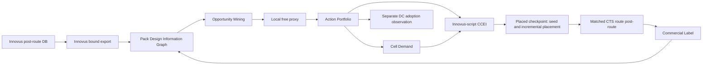

# Post-route Design Information Graph 驱动的协同优化方法学 v4

状态：开发方案，承接 v3 已完成的 CGO 实现与 AES 商业负样本；尚未宣称实现或收益。
归属：`custom-cell-fmax-dtco` HimaPack 的 Library Function Richness 开发专线，继续由 GitHub Issue #40 跟踪。
范围：升级现有 Framework、Pack domain tools、P&R adapter 和 Reader，不新增 Hima Runtime 组件、Fabric 动作、商业试验管理系统或对外交付件类型。

## 1. 方法决定

后续方法固定为：

> 用 post-route Design Information Graph 发现高价值、低风险的控制动作；用局部免费代理筛选；用 CCEI 在物理状态内落实；用商业 EDA 观察全局响应；再把响应反馈到下一轮系统辨识。

优化对象继续是 **Design State 上的 Optimization Action**，但 v4 把 Design State 的权威输入从“DC 网表加 sampled timing report”升级为“商业 post-route 数据库及其可校验导出”。Cell 仍是执行 Action 所需的资产，不是搜索起点。

v4 不追求开源工具预测最终 MHz，也不以单次免费代理结果代替商业观察。免费层只回答局部问题：

- 当前结构是否存在可证明的逻辑或电气改造机会；
- Opportunity 的逻辑边界、物理边界和 timing influence 是否完整；
- 新 Cell 在声明的 load/slew/位置范围内是否比当前局部 cover 更有余量；
- CCEI 是否能够在原 placement 状态内安全实施、证明和回滚；
- 哪些局部风险足以阻止一次昂贵商业观察。

全局 placement、CTS、route、useful skew 和优化器路径的响应不被免费层伪装成可准确预测量。它们由 E0 商业观察产生 Commercial Label，再用于下一轮局部系统辨识。



## 2. 我们过去解决错了什么问题

### 2.1 从 Cell 开始，而不是从 Design Opportunity 开始

最早的方法先枚举函数或结构，再把 Cell 交给 DC/Innovus 试用。它能证明生成、Liberty、mapping、ECO 和 P&R 机制可运行，却不能证明这些 Cell 对当前设计有必要。

后果是：

- function novelty、结构压缩和 occurrence 被误当成收益；
- Library 越大，商业工具搜索空间越大，但方向不一定更好；
- 商业工具逐渐变成试错引擎；
- 没有先回答“当前设计具体哪里需要什么 Cell”。

### 2.2 把 timing path 列表误当成 timing graph

v3 已经把目标从单条 path 提升到 unique endpoint frontier，但 AES 100-Cell 观察进一步证明：一个 endpoint 下仍可能存在多个 launch point、多个 reconvergent cone 和多个接近最差的备选 path。

Top-N 报告中每个 endpoint 只出现一次，并不意味着该 endpoint 的 timing state 完整。Action 修复已报告 path 后，同一 endpoint 内另一条 path 可以立刻接管。免费代理因此曾把 sampled frontier 错误放行到 E0。

v4 要求完整 Endpoint Frontier 至少包含：

- 每个 endpoint 的多个候选 launch paths；
- shared subgraphs、dominators、reconvergence 和 path alternatives；
- data arrival、required、clock contribution、slew、load 和 arc delay；
- Action 影响后的局部 path migration；
- 仍未被观测或覆盖的 cone。

### 2.3 只看逻辑内聚，没有看物理内聚

40-Cell 与 100-Cell 结果共同表明，多输出逻辑在 Boolean 上可合并、在商业工具中可读取和计时，不代表它适合成为一个物理 Cell。

未建模的物理问题包括：

- 多个 outputs 的 sinks 在 placement 上发散；
- 新 Cell 的输入电容和 pin density 增加；
- cell width、pin access、局部拥塞和 reroute penalty；
- 被内化 net 的真实 RC/via 收益是否足够；
- 大驱动路径上的新 Cell 是否反而成为 33～67 ps 的瓶颈。

### 2.4 把 drive variant 当成统一 delay scaling

当前 D1/D8 试验说明，drive 不能用“所有 delay 统一乘一个比例”表达。一个可信的 D1/D2/D4/D6/D8 family 必须同时改变：

- output resistance 与大负载 delay；
- input pin capacitance；
- output transition；
- area、width、leakage 和 internal power；
- LEF 几何与 pin access；
- 不同 output 的非对称 drive 需求。

大负载下更强的驱动可能有收益，小负载下未必；多输出 Cell 也可能需要 `Y0=D8, Y1=D2`，而不是全部输出统一放大。

### 2.5 没有明确 ECO-only 的保存语义

100-Cell 商业观察中，未保护时 Innovus 删除了全部 11 个 ECO Cell。该 arm 只能说明工具选择了 non-adoption，不能证明 custom Cell 的局部作用。保护后 11 个 Cell 全部保留，设计转入另一个面积、线长、功耗和 timing 状态。

因此：

- multi-output、physical fusion 和 CCEI 明确插入的 Cell 是 ECO-only Action；
- E0 必须检查初始 census、关键阶段 census 和最终 census；
- 被优化器删除的 Action 不构成采用收益证据；
- 保护范围只覆盖声明的 ECO instances，不能冻结无关 foundry logic；
- 商业报告分别记录“优化器自由选择”和“ECO preserved”的语义，不能混写。

### 2.6 物理机会实施后重新冷启动 placement

若 Opportunity 来自 post-route 或 coarse placement 的距离、方向、RC 和邻接关系，CCEI 修改网表后再从空白 init/placement 开始，会丢失生成该 Opportunity 的物理状态。

v4 的默认实施方式改为：

1. 在同一 placed database 上定位 source cluster；
2. 新 Cell 初始位置取 source cluster 的 centroid 或 bounded region；
3. 保留未受影响实例的位置；
4. 只对局部窗口进行 legalization/incremental placement；
5. 更新局部寄生与 STA；
6. 通过本地检查后继续 CTS/route/post-route。

若某个 Site 只能重新读入 ECO netlist，则必须同时携带 placement seed、unaffected-instance placement、source bounding box 和局部合法化约束；不能把重新全量 placement 冒充 physical-aware ECO。

### 2.7 没有把时钟控制与数据路径收益拆开

Useful skew 会改变 endpoint required time 和 critical path 排序。Baseline 与 generated arm 必须采用完全一致的 early clock、useful skew、skew budget 和 max allowed delay；同时报告必须拆分：

```text
DeltaSlack
  = DeltaDataArrival
  + DeltaCaptureClock
  - DeltaLaunchClock
```

Opportunity Mining 使用两个视图：

- **Data-path diagnostic view**：限制时钟补偿，识别逻辑、负载和互连本身的问题；
- **Production view**：使用最终相同的 early clock/useful-skew 策略，判断系统 QoR。

不能把时钟树替数据路径还债的结果全部归因给 custom Cell。

### 2.8 把商业 EDA 的全局响应当成局部收益

11 个 Cell 不可能直接消除约 4069 µm² 逻辑面积和约 20.8 mm wire。它们改变了 placement、sizing、buffering、clock 和 route 的全局收敛轨迹。

因此商业结果拆为：

- **Local survival**：Cell 是否保留、实际 arc delay、load/slew、局部 RC 和 source cover；
- **Global response**：placement、sizing、buffering、CTS、wire、congestion 和 path migration；
- **Business outcome**：最终 WNS/Fmax、TNS、面积、功耗、DRC 和限制条件。

Commercial Label 记录这种条件关系，不把全局变化反写成单颗 Cell 的固定收益。

## 3. 方法学的阶梯演进

| 阶段 | 核心问题 | 已得到的认识 | 不再接受的做法 |
| --- | --- | --- | --- |
| Cell Mining | 能否找到并生成新函数 | 工具链和 bounded Boolean search 可运行 | 先做 Cell，再找用途 |
| Library Richness Factors | 哪些免费指标值得观察 | F0～F4 可分层，adoption count 不是目标 | 预测跨设计 MHz |
| Endpoint Portfolio | 如何累计局部收益 | Action、frontier、marginal recomputation 比 Cell 排名更合理 | 单 path gain 简单求和 |
| Design Information Graph | 如何控制动态物理系统 | 逻辑、timing、placement、RC、clock 必须共同建模 | top-N timing report 代表完整状态 |
| Closed-loop System Identification | 如何从失败中提升 | E0 是条件化系统响应，反馈到下一轮因子和风险 | 连续商业试错或追漂亮数字 |

v4 不否定 v3 的 Action、Portfolio、Cell Demand、Commercial Label 和条件化 DC expansion。它替换的是 v3 仍然过于静态的 Design State 获取方式和 ECO 落地方式。

## 4. Post-route Export Bundle

商业 post-route database 是现场权威。Framework 在 Site 内生成一个 hash-bound 导出束，用于开源分析，不改变原数据库：

```text
postroute-db identity
logical netlist
DEF or placement projection
SDC with units and active modes
SPEF or extracted RC projection
Liberty and LEF identities
clock/path-group/analysis-view identity
tool/version/script identity
master and instance census
```

要求：

- 所有文件来自同一个 database checkpoint 和 analysis view；
- netlist、DEF、SPEF 的 instance/net identity 可以互相连接；
- SDC units、clock uncertainty、propagated clock 和 exceptions 明示；
- export 前后不运行会改变设计的优化命令；
- 原始客户数据留在 Site，Git 只保存 schema、代码和非专有摘要；
- 导出不完整时，DIG 状态为 `incomplete`，不得开启 E0。

## 5. Design Information Graph

### 5.1 实现边界

Phase 1 以 Innovus 为数据库权威和导出器，不引入第二条开源 P&R 链：

- Innovus 从同一个 post-route checkpoint 写出 netlist、DEF/placement、SDC、SPEF/RC、timing/clock facts 和 census；
- Pack 自己的 DIG builder 读取这些标准交付件并建立统一身份；
- CCEI 继续使用 Innovus Tcl/数据库命令执行 instance/net ECO、位置 seed 和 incremental placement；
- OpenSTA 可以作为局部 STA/timing-graph 查询后端；
- OpenROAD/OpenDB 只作为可选的离线 join/诊断 POC，不是必需运行链，也不替代 Innovus placement、route 或 database；
- 不先 fork 或修改 OpenSTA 核心源码。

第一阶段先证明 Innovus 导出束足以建立 DIG。只有标准导出无法表达所需 timing relation，且已有测试证明缺口时，才引入 OpenSTA API adapter；只有 DEF/netlist 身份 join 仍不够时，才评估 OpenDB。OpenSTA 的 GPLv3/商业双许可证需在产品分发前单独审核；可选分析后端不能成为客户必须运维的服务。

### 5.2 图模型

DIG 是异构有向超图，不是普通 instance adjacency graph。

节点类型：

- `Instance`：master、function、drive、area、location、orientation、lineage；
- `Pin`：direction、capacitance、slew、arrival、required、slack；
- `Net`：driver、sinks、fanout、HPWL、route length、R/C、via、congestion；
- `TimingArc`：cell/wire arc、sense、delay、transition、analysis point；
- `EndpointState`：path group、capture、clock、frontier membership；
- `PathAlternative`：launch、ordered timing cone、shared/dominator/reconvergence；
- `PhysicalRegion`：bbox、row/site、density、pin access 和 route pressure。

关系类型：

- Boolean/logic dependency；
- driver-to-sink hyperedge；
- timing propagation；
- physical proximity；
- shared support/reconvergence；
- launch/capture/clock relation；
- phase lineage：DC → coarse placement → post-route。

### 5.3 完备性

DIG manifest 明示：

- loaded/missing node and edge classes；
- endpoint 数、每 endpoint 的 path alternative 数；
- unmatched netlist/DEF/SPEF objects；
- missing parasitics、coordinates 或 timing attributes；
- hierarchy flatten/unfold policy；
- data-path 与 clock-path coverage；
- identity hashes和单位。

`sampled`、`partial` 和 `complete` 是事实状态。只有满足当前 Opportunity 类型所需的局部完备性，Action 才能进入局部代理；只有 primary frontier complete，Portfolio 才能进入 E0。

## 6. Opportunity Mining

### 6.1 四象限分类

| 逻辑深度 | 物理距离/RC | 主要 Opportunity | 主要风险 |
| --- | --- | --- | --- |
| 深 | 短 | single/multi fusion，完整消除逻辑层 | input cap、pin access、备选 path |
| 浅 | 长 | 更强 drive family、非对称 output drive、受控负载拆分 | 大 Cell 牵引、sink divergence |
| 深 | 长 | 逻辑分区重构加 drive，覆盖整个 endpoint cone | 巨型 Cell、跨区合并、不可控 placement |
| 浅 | 短 | slack-harvesting compaction | 无 Fmax 直接收益、过度压缩 margin |

### 6.2 Timing Opportunity

Timing Opportunity 必须以完整 endpoint cone 为对象，而不是单 path：

- 识别该 endpoint 的主要 launch alternatives；
- 找到共享高影响 subgraph、dominator 和完整可消除层；
- 估算每条 alternative 的 local delay reduction；
- 检查优化后可能接管的 path；
- 对长线、浅逻辑优先形成 drive variant 或 local replication 需求；
- 对长线、深逻辑禁止直接跨物理区域做一个巨大 Cell，先形成分区化 Action Portfolio。

### 6.3 Slack-harvesting Opportunity

逻辑与物理都内聚、且远离 primary frontier 的区域可以形成面积/线长/功耗 Opportunity：

- 必须保留声明的 slack guard band；
- 不把面积收益写成 Fmax 收益；
- 记录释放的 density、wire 和 congestion 是否帮助邻近 critical region；
- timing margin 下降超过阈值时拒绝。

### 6.4 Community detection 的位置

Community、clustering、frequent subgraph 或 graph partitioning 只负责产生 Opportunity proposals。它们不直接授权 ECO。Proposal 还必须通过：

- Boolean boundary 和 sequential boundary；
- 全 outputs 引用；
- sink divergence；
- required-time envelope；
- physical locality 和 pin access；
- source instance/net conflict；
- rollback 和 proof feasibility。

## 7. 局部免费代理

局部代理不运行完整设计全局预测。每个 Opportunity 建一个 bounded window：

- 原 source cells、boundary nets 和 external loads；
- local placement、route geometry、SPEF R/C 和 vias；
- 当前 input slew、output load 和 required time；
- 多个 endpoint/path alternatives 对该 window 的穿越关系；
- candidate Cell 的 D1/D2/D4/D6/D8 或非对称 outputs；
- source cover 与 candidate cover 的局部 STA。

输出向量：

```text
logic_levels_removed
source_arc_delay / candidate_arc_delay
removed_net_rc / removed_vias
input_cap_delta / output_slew_delta
width / area / power_delta
sink_divergence / pin_access / locality
endpoint_alternative_coverage
local_slack_lower_bound
model_uncertainty
```

准入不是“预测全局 WNS 为正”，而是：

1. 逻辑等价和所有 root required time 是硬约束；
2. 局部保守 margin 为正；
3. 没有遗漏已知 path alternative；
4. physical risk 在声明阈值内；
5. Portfolio 能覆盖 primary frontier 或满足 slack-harvesting guard band。

## 8. Cell Demand 与 Drive Family

Cell Demand 由 Opportunity/Action 反向形成，至少包含：

- Boolean/vector function 和 pin phase/permutation；
- target sites、occurrence、source cover 和 endpoint influence；
- output-by-output drive requirement；
- expected slew/load envelope，尤其是大负载区；
- input cap、width、area、power 和 pin access 上限；
- single-output、multi-output 或 physical fusion；
- ECO-only 或 synthesis-eligible；
- mock/characterized/signoff view 的证据状态。

D1/D2/D4/D6/D8 是一个电气族，不是五个命名副本。Mock Library 必须保证：

- output resistance 随 drive 增强而下降；
- input cap、width、area 和 power 合理上升；
- NLDM/CCS axes 覆盖实际大负载和 slew；
- Liberty、SPICE、LEF 和 Verilog pin/function identity 一致；
- 不同 outputs 可声明不同 drive；
- 与 foundry 中晶体管数量、结构和 drive 相近的 Cell 对齐量级；
- 超出模型训练/校准范围时 fail closed。

## 9. Custom Cell ECO Integrator（CCEI）

CCEI 是现有 `multi_output_resynth`/ECO adapter 的深化能力，不是新的 Harness 组件或第二执行系统。

### 9.1 输入

- hash-bound DIG snapshot；
- frozen Action Portfolio；
- selected Cell views；
- source instances/nets/pins；
- source placement bbox 和 seed locations；
- preserve/rollback/proof policy；
- Site P&R command seam。

### 9.2 两个状态：post-route 观察态与 place 执行态

**Opportunity 分析发生在 post-route。** 此时真实 route RC、via、load/slew、clock latency、path alternatives、拥塞和最终物理邻接最完整，是 DIG 和系统辨识的主要输入。

**CCEI 合入发生在 place/coarse-placement checkpoint。** 此时设计已经有可用位置，但 destructive timing optimization 尚未大量 resize、clone、buffer 或删除目标 source logic，适合用 Innovus script 原位替换并做 incremental placement。

一次迭代保留两个有身份的 checkpoint：

```text
S_place(k): baseline coarse-placement checkpoint
    |-- reference: no ECO, continue matched flow
    |-- generated: rebind Action -> CCEI -> incremental placement -> matched flow

S_postroute(k): reference/generated final observation
    -> Innovus export -> DIG -> next Opportunity Portfolio
```

因此不是在 place 阶段重新做 Opportunity Mining。place 阶段只做 Action rebind、状态复核和执行。

目标 seam 是 coarse/global placement 已形成，而 destructive optimization 尚未改写目标 source identity 的时刻。不能仅根据命令名字假设 `place_opt_design -place` 不改网表；必须在真实 Innovus 版本上用前后 census、netlist hash 和 target identity probe 证明。

Opportunity 来自 `S_postroute(k)`，实施在 `S_place(k)` 或下一次匹配 replay 的 placed checkpoint；两者不能被假设为同一物理图。DIG/CCEI 必须通过 phase lineage 或稳定的逻辑边界签名重新绑定，并检查：

- source instances/functions仍存在；
- ordered leaves、roots 和 Boolean boundary 与 post-route Opportunity 等价；
- physical locality、sink divergence 和 bbox仍满足阈值；
- place State没有新的冲突或不可见 load；
- reference 与 generated 从同一个 `S_place` checkpoint继续。

若 source 只在 post-route optimization 后出现，无法投影回 place checkpoint，该 Opportunity 有两种结局：

1. 在 clone 的 post-route database 上做 direct incremental ECO，作为最便宜的局部因果验证；
2. 拒绝 place-stage Action，等待能在较早阶段表达的结构需求。

Direct post-route ECO 证明局部动作在当前物理状态是否成立，不自动证明从 place 开始的完整流程也会保持收益。反过来，也不能用 post-route 距离证明一个重新全量 placement 后的 Action。

### 9.3 Innovus script 操作

CCEI 第一实现不需要新的 placement engine。Pack 生成并审计一份 Innovus Tcl ECO script：

1. 从 `S_place` database 读取 source instances、pins、nets、location、orientation 和 bbox；
2. 校验 source objects、稳定逻辑边界和 DIG Action identity仍匹配；
3. 原位移除 source cluster并插入 custom Cell；
4. 新 Cell 初始位置取 source cluster centroid，或按 output sinks 做有界偏置；
5. 连接全部 inputs/outputs/PG pins；
6. 保护声明的 ECO-only instances；
7. 调用 Innovus 局部 legalization/incremental placement；
8. 更新局部寄生和 timing facts；
9. window proof、module proof、census、placement legality 和 rollback；
10. 通过后继续统一 CTS/route/post-route。

具体 Innovus 命令名和参数由 DIG-07 在当前版本上 probe 后冻结，文档不预先发明不可验证的命令。Script、目标对象、前后位置和数据库身份全部进入现有 stage evidence。

CCEI 输出仍进入现有 workspace artifacts、CodeRecord、Reader 和 Commercial Label，不建立独立状态库。

## 10. 两条商业观察支路

### 10.1 CCEI causal arm

这是 Opportunity 方法的主要验证支路：

- 同一 baseline placed state；
- 只实施 frozen Portfolio；
- ECO-only instances必须保留；
- 未受影响 placement 尽量保持；
- 最终判断 local survival、global response 和 business outcome。

### 10.2 DC adoption arm

将同一轮 synthesis-eligible single-output/drive variants 放入 DC，让综合器自由决定全设计采用。它回答“Library 能否扩大采用”，不回答“CCEI Opportunity 是否正确”。

该支路可以在 Portfolio、Library 和预算都冻结后与 CCEI arm 并行执行，但必须：

- 使用独立 Commercial Label；
- 不把 DC mapping 变化归因给 CCEI；
- multi-output/fusion 仍由 CCEI 实施；
- 不因 DC 采用更多就判定成功；
- 预算不足时优先 CCEI causal arm；
- 正式 Pack 默认仍采用 v3 的条件化 expansion，除非 Campaign 明确为方法对照分配了第二个 E0 预算。

## 11. Early Clock 与 Useful Skew

下一 matched baseline 和所有 generated arms 统一：

- placement 阶段打开已验证的 early clock/virtual clock model；
- 全流程使用同一 useful-skew 策略；
- max allowed delay/skew budget 目标先以 100 ps 进行真实工具 bring-up；
- clock buffer/inverter 保持 DCCK family；
- setup 为 Fmax 主目标，不做会牺牲 setup 的 post-route hold fix；
- 导出实际 launch/capture clock latency 和 useful-skew contribution。

100 ps 是待真实 Innovus 命令、单位和实际 clock response验证的策略值，不在文档阶段冒充已经生效。Baseline 与 generated 任一设置不同，Matched Comparison 失效。

## 12. 商业反馈与系统辨识

每次 E0 都形成 Action-level 和 Portfolio-level response：

```text
Action identity
local proxy vector
initial/final adoption
observed custom arc/load/slew
endpoint/path migration
placement displacement
buffer/sizing/clock deltas
global QoR delta
failure classification
```

系统辨识不拟合跨设计 Fmax。它更新：

- 哪类 local factor 与 survival 正相关；
- 哪类 physical locality 与 route gain 正相关；
- 哪类 drive/load envelope 经常低估；
- 哪些 Action 引起大范围 placement 牵引；
- 哪些 endpoint/path alternatives 在改造后接管；
- 下一轮 uncertainty 和 trust region。

Action 可标记为：

- `locally-positive-commercially-positive`；
- `locally-positive-path-migrated`；
- `physically-disruptive`；
- `non-adopted`；
- `timing-model-underestimated`；
- `safe-compaction`；
- `unknown-insufficient-observation`。

失败不会被压成一个负分数；分类结果是下一轮 Opportunity Mining 的输入。

## 13. 现有代码架构中的修改地图

| 现有模块/文件 | v4 固定升级 | 保持项 |
| --- | --- | --- |
| `flow/domain/mine_timing_route.py` | 从 report parser 转为 DIG timing projection consumer；保留完整 endpoint alternatives、data/clock contribution 和 completeness | sampled report 继续可读，但不能开启 E0 |
| `flow/domain/mine_patterns.py` | 在 DIG 上产生 timing、drive、fusion、multi-output、slack-harvesting proposals | Boolean boundary 与现有 generation contract |
| `flow/domain/design_information_graph.py`（domain helper） | 规范化 Innovus 导出束并可选接入 OpenSTA 查询，形成 hash-bound异构图 | 仅是 Pack domain helper，不是 Runtime 组件 |
| `flow/domain/innovus_dig_export.tcl`（tool adapter） | 从同一 checkpoint 写出 netlist/DEF/SDC/SPEF/timing/clock/census 与 manifest | 只读导出，不运行优化 |
| `flow/domain/opensta_dig.tcl`（optional adapter） | 对导出束补充完整 timing graph 和局部 STA 查询 | 可选后端，不是 OpenROAD/P&R 依赖 |
| `flow/domain/proxy_mapping.py` | 对 bounded window 做 local cover/STA，不输出全局 Fmax 预测 | Yosys/ABC 单输出 mapping 角色 |
| `flow/domain/multi_output_resynth/` | 深化为 CCEI：物理 seed、selected Actions、局部 proof、rollback 和 preservation | 当前 directed ECO、2/3-output、hierarchical proof |
| `flow/domain/_generation_projection.py` | 从 Cell Demand 生成非对称 drive family 和 delta-only views | cumulative Library 和旧 shard 不重做 |
| `flow/library_richness.py` | 持有 Opportunity/Action response、trust region、system-identification labels | 现有 Action Portfolio 与 Commercial Label |
| `flow/domain/init.tcl.tmpl`、`pnr.tcl.tmpl`、`mmmc.tcl.tmpl` | post-route export、early clock/useful skew、placed checkpoint 和 CCEI seam | matched floorplan/pin/uncertainty/DCCK/无 hold fix |
| `flow/domain/shared_synth.tcl` | DC adoption arm 接入同一 frozen synthesis-eligible Library | 不负责 multi-output 自动 mapping |
| `flow/stages.py` | 在现有 mine/generate/P&R职责内编排 DIG export、CCEI subphase 和两支路证据 | 不新增 Fabric node或第二控制者 |
| `flow/read-stage.py` | 独立复算 DIG completeness、ECO census、clock/data contribution 和 Commercial Label | 不复制 optimizer 判断 |
| `contract.yml` / Site tool binding | 声明 Innovus export/ECO 能力；OpenSTA 仅在启用时声明 pinned executable | 普通用户不承担知识/服务运维 |

新增的三个 domain 文件是现有 Pack 工具内部 helper/adapter，不要求多个 Harness 模块适配，不构成架构扩张。

## 14. 开发计划

本轨道使用 `DIG-*`，继续归属 Issue #40，不进入 PLS 主线。

| 任务 | 依赖 | 主要文件 | 出口 |
| --- | --- | --- | --- |
| DIG-01 Innovus export identity | 无 | P&R templates、`innovus_dig_export.tcl`、Readers | 同一 checkpoint 的 netlist/DEF/SDC/SPEF/Liberty/LEF/timing/clock/hash manifest；零优化副作用 |
| DIG-02 Heterogeneous DIG | DIG-01 | `design_information_graph.py` | 不依赖 OpenROAD P&R，完成 node/edge schema、units、completeness 和对象 join |
| DIG-03 Optional OpenSTA timing view | DIG-01/02 | `opensta_dig.tcl`、测试 fixture | 不改 OpenSTA 核心，补充多个 path alternatives、arrival/required 和局部 STA；可关闭 |
| DIG-04 Opportunity quadrants | DIG-02（DIG-03 可选增强） | `mine_patterns.py`、`mine_timing_route.py` | 深/浅 × 长/短分类；timing 与 slack-harvesting proposals 分离 |
| DIG-05 Local physical proxy | DIG-02/04（DIG-03 可选增强） | `proxy_mapping.py`、`library_richness.py` | bounded window 的 source/candidate cover、RC/load/slew、uncertainty；无全局 Fmax claim |
| DIG-06 Drive family | DIG-04/05 | `_generation_projection.py`、generation/char adapters | D1/D2/D4/D6/D8与非对称 outputs；Liberty/SPICE/LEF电气和几何一致 |
| DIG-07 CCEI placed-state POC | DIG-02/05/06 | `multi_output_resynth/`、P&R template | coarse placement identity probe、原位 ECO、seed、局部 legalization、proof、rollback |
| DIG-08 Useful-skew matched method | DIG-01/07 | P&R/MMMC templates、Reader | baseline/generated同设置；100 ps策略真实生效；data/clock delta分解 |
| DIG-09 AES free closure | DIG-02、04～08（DIG-03 可选） | existing stages/readers | 完整 frontier、Portfolio、Cell Demand、CCEI patch；零商业 Job |
| DIG-10 Commercial observation | DIG-09 | existing P&R/compare | 一次 CCEI causal E0；可选独立 DC adoption E0；Commercial Label 回灌 |
| DIG-11 Pack integration | DIG-10 | Pack docs/graph/stages/tests | 当前 HimaPack 方法、知识和资产更新；不新增 Runtime 动作 |

### 14.1 可并行边界

- DIG-01 export 与 DIG-06 drive-family mock preparation可并行，但共享 Liberty/LEF identity 由 DIG-06 单一负责；
- DIG-02 的 Innovus-export DIG 与 DIG-03 的可选 OpenSTA timing view、DIG-07 的 placement-seam probe 可并行；
- DIG-04 timing miner 与 slack-harvesting miner 可并行，共用冻结 DIG schema；
- `library_richness.py`、P&R templates 和 `stages.py` 各保持单一 owner；
- DIG-09 前冻结共享 schema、units、identity 和 completeness，不允许各线自行发明第二套图。

## 15. 分级测试

### L0：纯逻辑与 schema

- heterogeneous node/edge identity、unit 和 hash；
- hyperedge fanout、physical distance、bbox、RC/via；
- endpoint 多 launch alternatives；
- sampled/partial/complete fail-closed；
- 四象限分类、community proposal 不直接 admission；
- D1～D8 monotonic electrical/physical关系；
- CCEI source conflict、pin map、seed location 和 rollback。

### L1：Innovus export schema 与可选 OpenSTA 小图

- synthetic LEF/Liberty/DEF/netlist/SDC/SPEF/timing facts形成同一 DIG；
- netlist/DEF/SPEF对象 join 不依赖 OpenROAD；
- 启用 OpenSTA 时，STA pin与 DIG instance/pin/net/坐标保持双向 identity；
- local proxy在已知两路径 endpoint 上触发 path migration；
- community proposal 经过 required-time、sink divergence 和 locality gate；
- 零商业工具、零 Desktop、零模型调用。

### L2：真实 AES post-route 免费闭环

- 从已保存 AES database/export bundle 构建 DIG；
- 所有输入 hash、units、unmatched objects 和 completeness 明示；
- 重放 20/40/100-Cell Commercial Labels；
- 找到 `MULTI_0103`、`MULTI_0142`、`SINGLE_0009` 等已知敏感点；
- 免费层不得把 sampled path report 放行到 E0；
- LC/DC/Innovus Job 为零。

### L3：Cell/CCEI acceptance

- D1～D8与非对称 output variants通过生成、LEF/Liberty identity 和 LC；
- coarse placement 前后 source census probe；
- 同一 placed database内插入、seed、legalize、STA update；
- window/module proof、ECO census、rollback和未影响区域检查；
- 只运行必要的小规模 Innovus seam，不跑完整 route。

### L4：商业观察

- baseline identity匹配时复用；
- CCEI causal arm只有 frozen Portfolio；
- ECO-only Cell 全阶段 census；
- early clock/useful skew/100 ps策略两边一致；
- final WNS/Fmax、TNS、area、wire、power、DRC和clock/data贡献；
- 只有预算明确时运行独立 DC adoption arm；
- 结果为负时停止 E0，回到 system identification。

Desktop App 不参与 Framework 日常验证。

## 16. 第一开发里程碑

第一里程碑不是立即达到 5%，而是用现有 AES 负样本证明以下闭环真实成立：

1. 从一个 post-route checkpoint 导出身份一致的完整 bundle；
2. Pack 从 Innovus 导出束形成包含物理位置的 DIG，可选 OpenSTA 补充多个 path alternatives；
3. DIG 能解释 100-Cell 轮为何局部代理正向而 WNS 下降；
4. Opportunity Mining 将 timing、drive、fusion 和 slack-harvesting 分开；
5. 局部代理只给 local margin/trust region，不预测全局 MHz；
6. CCEI 在同一 placed state原位实施并保留 ECO-only instances；
7. baseline/generated 使用一致 early clock/useful skew；
8. 一个 Commercial Label 能回写到 Action、Cell Demand 和下一轮 uncertainty。

在该里程碑通过前，不启动新的完整 E0。5% 继续是 AES Campaign 的商业目标，由多轮经过系统辨识的正向 Action 累计实现，不写成 v4 第一阶段的机制验收数字。

## 17. 明确不做的事情

- 不建立第二套 Hima Runtime、Fabric graph 或商业试验调度器；
- 不把 OpenROAD 变成第二条 P&R 链，不把 OpenSTA fork 直接嵌入产品作为第一方案；
- 不要求客户部署独立知识或 DIG 服务；
- 不用 community score、adoption count、面积收益代替 Fmax；
- 不把 DC free mapping 与 CCEI causal result 混成一个结论；
- 不在 physical-aware ECO 后无条件冷启动全量 placement；
- 不用 top-N timing report 声称完整 endpoint frontier；
- 不因连续失败而放宽逻辑等价、唯一变量或证据标准。

## 18. 主要技术依据

- [OpenSTA](https://github.com/parallaxsw/OpenSTA)：standalone 输入能力、Network Adapter、增量 STA 及许可证说明；
- [OpenSTA STA API](https://github.com/The-OpenROAD-Project/OpenSTA/blob/master/doc/StaApi.txt)：Network、timing graph、delay calculation、arrival/required 和 SPEF API；
- [OpenROAD API](https://openroad.readthedocs.io/en/latest/main/src/README.html)：OpenDB 的 LEF/DEF/Verilog/DB 读取与保存接口；
- [OpenROAD Global Placement](https://openroad.readthedocs.io/en/latest/main/src/gpl/README.html)：timing-driven placement、virtual CTS、incremental placement 和 net weighting；
- [OpenROAD Detailed Placement](https://openroad.readthedocs.io/en/latest/main/src/dpl/README.html)：增量改动后的 legalization；
- [OpenROAD Parasitics Extraction](https://openroad.readthedocs.io/en/latest/main/src/rcx/README.html)：数据库 parasitics 与 SPEF 读写接口。
