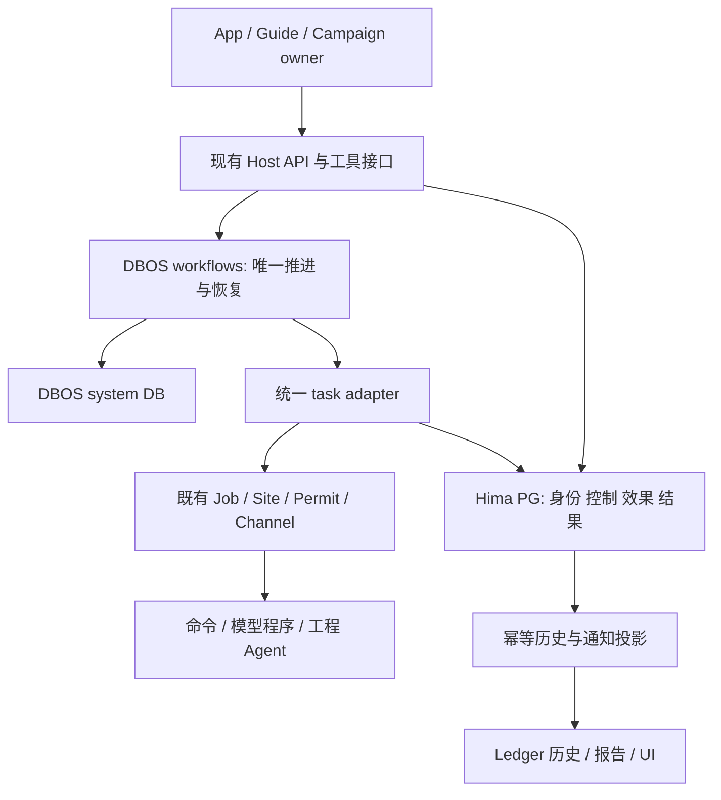
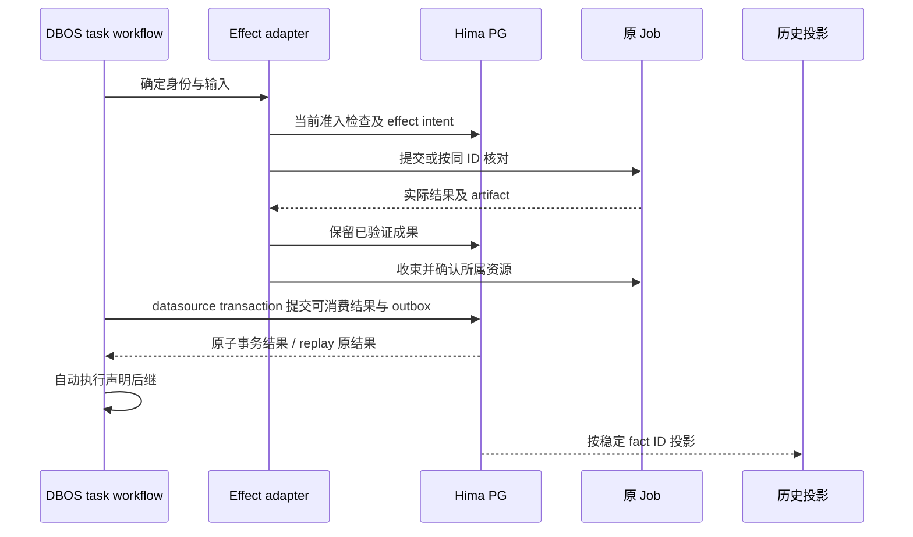
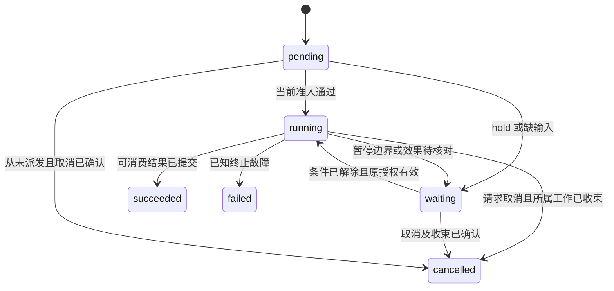
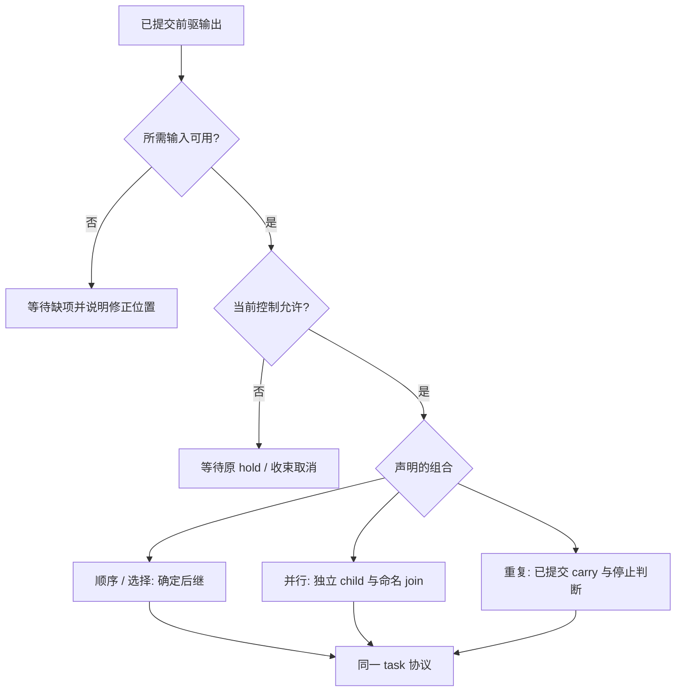
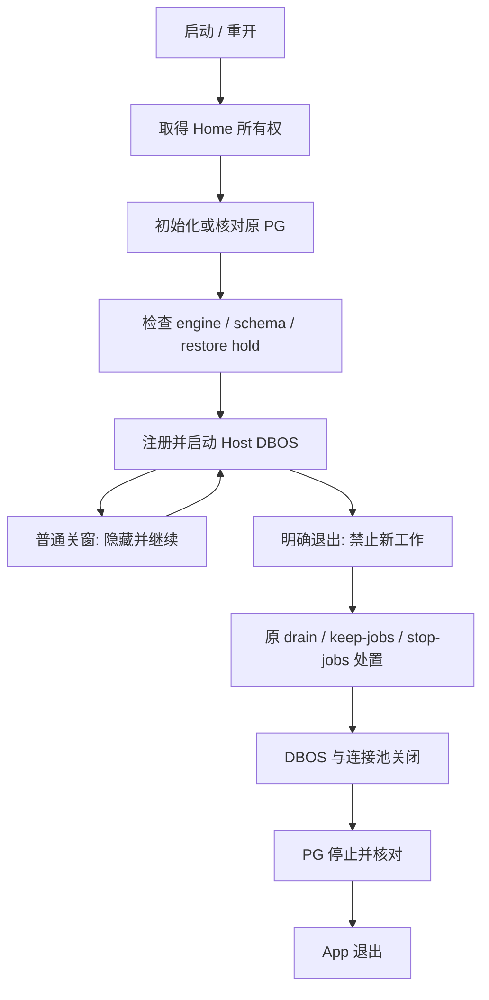
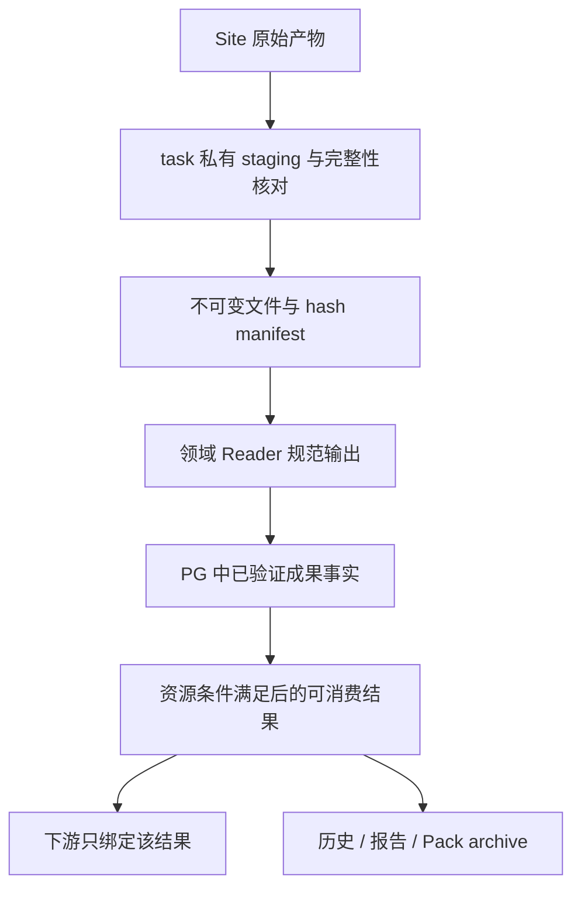

# HimaHarness DBOS Fabric and ATCS Migration - Plan

## 2026-10-05 用户调整的本轮交付范围

用户明确要求：重点业务能够运行；本轮不要求 Linux 版，Mac 版能运行即可。此决定覆盖下文原双平台验收条款，Linux 已有产物/失败/证据保留为后续参考，不计本轮阻塞。

本轮交付以当前 macOS arm64 App 承载 ATCS 的正常准备、执行、自动交接、交付、退出/恢复为准，保留身份、权限、原预算、不重复效果、历史资产与适商用的依赖材料要求。已有真实 ATCS source32a 证据保留；后续源码只验证改变的 Mac/ATCS 面，不为升级后的元数据/退出/展示修复重跑不变的商业 EDA。

旧完整 local 语料中的198个待对账条目不是198个产品缺陷，也不再整体作为本轮发布前置条件。与重点业务、可靠执行或资产保持直接相关的真实缺口仍修复并验证，其余逐条保留到维护清单。新的非管理员账户/额外 Mac 环境验证作为后续可安装性覆盖；本轮采用已验证当前 Mac 的普通非 root 运行与搬移/退出/reopen 资格，不将尚未取得的额外环境写成 PASS。

开发分配沿用用户更新：主力编码 Sol6.1 medium，架构/复杂诊断/独立复核 Sol6.1 high，固定简单操作可用 Luna；Claude review 与操作均取消。产品模型保留现有 DeepSeek API，编排/数据库/App 本地。

## Goal Capsule

- **Objective:** 工程师通过新版 HimaHarness App 完整运行 ATCS，取得可核验、可使用的工程交付；组件完成工作后，流程能自行接续，无需开发者修补交接手续。
- **Means:** 使用 DBOS 可靠执行内核和统一任务/流程合同升级 HimaFabric（KTD1–KTD7）。
- **Authority:** 本计划记录用户本轮确认的迁移范围；其余产品约束沿用 `docs/product-definition.md`、`CONTEXT.md` 和适用 ADR。U1 更新被本轮明确改变的职责描述，不把旧文档当作禁止本次迁移的理由。
- **Execution profile:** 先低成本合同与真实本地进程验证，再冻结 App/Pack/Site，最后真实 GUI、模型及 EDA 验收；遵守 `docs/agents/fast-convergence-testing.md`。
- **Stop conditions:** 出现重复外部效果、权限越界、证据失真或不可恢复数据损失即停止候选推进并保留现场；缺少真实环境时报告 BLOCKED，不用替身补成验收。
- **Ownership and shipping:** Codex Sol/High 负责实现、集成和独立代码复核；Claude Opus 5.5 负责认知隔离的实际操作；产品模型保持 DeepSeek 4.1 Flash。实施任务按 U-ID 进入本仓 GitHub Issues，提交后立即 push 并核对远端 SHA；真实验收结论由协调者核验，用户保留最终产品签收权。

---

## Product Contract

### Summary

将 HimaFabric 的推进、持久执行和恢复交给 DBOS，以一个任务协议和有限组合表达 HimaPack 的业务流程。
升级 ATCS 的完整正常路径，并交付本轮能够在 macOS 本地运行的新 App、Pack 和可复核验收证据；Linux 延后。

### Problem Frame

工程任务已经完成，编排仍可能卡在交接手续上。
当前 r5 的现场记录显示：结果已通过 Reader、工程会话已释放，但 owner 未调用显式 completion，后续流程没有开始；修复提示可以解释下一步，却没有消除这类机械依赖。
随着 Pack、工程执行器和恢复场景增加，作者需要理解的 Runtime 操作和跨节点检查不断增多，增加组件升级与业务维护的成本。
依据：`docs/assessment/2026-10-03/issue83-postdelivery-guidance/README.md`。

### Key Decisions

- **本地运行系统，保留现有模型 API。** 编排与数据不依赖厂商云，同时继续使用已有获准模型能力。Governs R1, R10. (session-settled: user-directed — chosen over fully local model replacement: 用户明确保留现有模型 API)
- **一种机制承载不同自由度。** 严格程度由任务和组合决定。Governs R2, R3, R5. (session-settled: user-directed — chosen over separate strict/loose runtime modes: 避免增加第二套业务执行政策)
- **新 Run 切换、旧记录保留。** 不把活动旧 Run 强行转为 DBOS checkpoint。Governs R9, R13. (session-settled: user-approved — chosen over live conversion of active legacy Runs: 用户确认保留历史而不做热迁移)

### Requirements

**Execution and composition**

- R1. App、编排、持久化及恢复在本地 Linux/macOS 运行，不依赖 DBOS Cloud、Conductor 或厂商激活；现有经授权的模型 API 与 Site 工具连接继续可用。
- R2. 命令、内部调用模型的程序、完整 AI 工程任务使用同一任务协议，明确输入、输出、有限执行状态及失败原因。
- R3. 支持顺序、选择、并行汇合和有界重复，以及声明位置内的动态附加任务；动态任务使用相同语义并有明确返回位置。
- R4. 已验证结果完成持久交接及必要资源收束后自动推进，不要求 owner 为机械步骤逐次 begin/work/release/complete；任务完成、工程目标达成与物理采用范围分别表达。
- R5. 节点通过结构化数据和明确引用交接；正常升级节点实现不要求下游猜测输出文件、补内部字段或修改执行内核。

**Reliability and control**

- R6. 中断后复用已提交结果与仍有效产物；外部副作用未知时核对原任务，不盲目重发命令、工程 prompt 或 ECO。
- R7. 人类与 Agent 通过同一事实与控制接口操作；保留 Guide 独立、唯一业务 owner、分支暂停、总预算、Site Permit、实际 Job 控制及显式所有权交接。
- R8. 运行绑定不可变方法、输入及执行版本；已接受 AI 决定在恢复时复用，修改任务只重做受影响消费者，保留历史和有效兄弟结果。
- R9. 所有新 Run 使用 DBOS，包括当前受支持旧 Pack 声明经兼容编译产生的 Run；旧 Run 的原始记录和方法快照保持可读，不热转换活动 Run。
- R10. 产品承担本地数据库安装、启动、退出、故障提示、备份与升级；实际分发依赖须满足闭源商业交付要求并附适用许可通知。

**ATCS and evidence**

- R11. ATCS 延续当前 0.3.3 的完整驻场工程任务，保留 common R1、原始 Timing/身份/产物校验和最佳状态交付；生产流程不执行独立 AutoFix 对照，也不新增物理签核前置条件。
- R12. 使用升级后的实际 App，从正常 Pack 安装/选择、Site/输入准备到真实修复、产物打开、报告归档、正常结束和资源收束完成一次 ATCS 验收；后台脚本和历史结果不能替代。
- R13. 如实区分运行迁移、产品路径、Timing 目标及采用范围的结论；保留失败、残余、UNKNOWN、原始证据和旧 Run 结论。
- R14. 只保留保护真实结果、身份、权限、重复效果和恢复所必需的检查；每个新增拒绝条件都有实际可通过的正例及可行动的修正路径。

### Acceptance Examples

- AE1. Covers R4, R5, R12. 工程结果合法且资源已收束，即使 owner 不再发 completion，流程也自动完成后继评估与交付；不靠开发者补指令。
- AE2. Covers R6, R7. Host 在记录执行意图后、实际启动前退出，期间用户暂停；重开后副作用计数仍为零，直到有效继续指令到达。
- AE3. Covers R6, R8. Job 已完成但回执丢失；重开查询同一 Job 并接回产物，不创建第二个 Job，也不重新调用已提交决定的模型。
- AE4. Covers R3, R7, R8. 一个严格流程仅走声明分支；另一个任务提出获准诊断片段、执行后返回原流程。两者共用内核，暂停其中一条独立分支不停止其他分支。
- AE5. Covers R9, R13. 升级后打开旧 Run，原方法、报告和结束标签不变；新建该旧 Pack 的任务走 DBOS。尚有活动旧 Run 时切换明确受阻，旧 App 仍可收束它。
- AE6. Covers R11–R13. 实测仍有 Setup 残余时可交付最佳 checkpoint、脚本和残余解释，Goal 保持 false；只有当前必需 Timing 证据满足声明目标才显示 Goal met。

### Success Criteria

维护收益以可观察行为验收：升级一个兼容输出合同的工程工具后，只更改 Pack/adapter 的既有实现归属即可接续业务；无需添加场景专用 Runtime 检查或人工 completion。
用同一组有来源的异常样例验证有效结果可接纳、错误结果会拒绝、恢复不重做无关工程工作。
不以代码行数、测试数量或减少有效检查作为成功指标。

### Scope Boundaries

包含现有 Fabric 执行职责替换、Pack 声明与作者工具、历史兼容、App 生命周期、原生本地数据库分发，以及当前 ATCS 方法的真实验证。
本轮交付平台为当前已验证的 macOS arm64 环境；Linux x64 及额外平台环境延后，不声称已完成其资格。

不建设独立业务调度服务、第二 Agent Loop、跨机 HA、通用可视化流程编辑器、账户代理或严格/宽松运行模式；这些机制不能改善本轮已确定的交接与本地运行结果。
不引入通用补偿语言或把远端副作用宣称为 exactly-once；出现具体业务补偿需求时另议。
不把正式签名/商店发布作为本轮技术迁移资格，商业分发许可材料仍须完成。

#### Deferred to Follow-Up Work

其他 CPU 架构、更多 Linux 基线、PostgreSQL 跨 major 自动迁移，以及跨操作系统迁移可继续执行的 DBOS 历史留待后续。
LibInsight 新业务、长期 memory、工程方法算法增强和外部 AutoFix benchmark 不进入本次实施单元。

---

## Planning Contract

### Current Evidence

源码基线为 `9c3a39c1907d33ceee7b45ac5873895d3c6d82ba`；计划编制期间没有执行产品测试、安装 DBOS 或运行 EDA。

| 当前归属 | 核实的行为 | 迁移处置 |
| --- | --- | --- |
| `packages/harness/src/fabric.ts` / `completeAdmittedNode` | completion 分别写 admission、决定、节点、路由、完成；中断进入 uncertain | 替换通用推进与提交链，保留真实业务验证 |
| `packages/harness/src/ledger.ts` / `advanceRun`, `#append` | DSH storage-domain 和进程内串行化，不与 DBOS 事务原子提交 | 旧读者保留；新 Run 执行事实迁至 KTD5，文件历史成为投影 |
| `packages/harness/src/jobs.ts` / `reconcileLaunchIntent` | 只按原 session/有效 exit 文件核对；消失不证明未执行 | 复用外部效果核对，不能用 SDK retry 替代 |
| `packages/harness/src/autopilot.ts`, `packages/harness/src/loops.ts`, `packages/harness/src/recovery.ts` | 自行推进区、循环和新旧多阶段恢复 | 新 Run 的推进和 checkpoint 恢复由 DBOS 接管 |
| `packages/harness/src/packs.ts` | Act/Judge/Explore/Wait、特殊 loop/fork/growth、autopilot 校验 | 编译到统一有限流程 IR，兼容源格式 |
| `packages/harness/src/release.ts` / `methodForRun` | 按原 digest 保留和读取方法 | 复用快照、封装、资产保留和安装完整性 |
| `packages/desktop/src/main.ts` | 普通关闭隐藏窗口；显式退出已有 drain/keep/stop 处理 | 接入数据库/DBOS 生命周期，保持既有用户语义 |
| ATCS `graph.yml` | 0.3.3、13 个节点、驻场工程线性流程，无 fork/loop/growth | 简化节点交接，保留真实方法；不恢复六席旧流程 |
| `test/contract/atcs-dry-path.host.test.ts` | 已有 0.3 resident case，但覆盖入口改为 fix-timing，前置状态为测试准备 | 复用 adapter/Reader 样例，补齐正常入口完整路径 |

### Key Technical Decisions

- KTD1. **DBOS 嵌入既有 Node Host。** 固定 `@dbos-inc/dbos-sdk` 与 `@dbos-inc/node-pg-datasource` 为 `5.2.11`，对应 upstream `v5.2`、SHA `3f36908f58fd8b3079cbf5372203c7a2d0ba06cc`；不使用不存在的 npm `5.2.0`。DBOS 成为新 Run 唯一推进内核，HimaFabric 保留产品语义与适配职责。Governs R1, R4, R9. (session-settled: user-directed — chosen over Temporal and other surveyed durable engines: 用户在调研后指定 DBOS)
- KTD2. **一个任务加四种组合。** `task / sequence / choice / parallel / repeat` 构成版本化、JSON-compatible 的 `graph.yml` 源语法；编译为不可变 IR。`choice` 只按已提交输出的命名枚举分支，不执行表达式字符串；parallel 固定分支排序、命名结果及 required/optional 消费语义；repeat 传递明确 carry，并受原 Run 截止时间和 Pack 声明的停止条件约束。动态片段是 task 输出，在明确扩展位置按相同语法验证、冻结、执行及返回，不修改基础方法。Governs R2, R3, R8.
- KTD3. **平台封装身份，工具返回业务值。** Pack 声明输入/输出 JSON Schema 2020-12，使用 MIT 的 Ajv `8.20.0`；既有 Zod 继续解析 Harness/图结构。只解析 Pack 内本地 schema 引用，不联网取 `$ref`、执行自定义关键字、隐式转换值或补默认事实。Runtime 填写 Run/task/effect 身份、版本和 digest，模型不手写平台账本字段。输出含业务值、不可变 artifact 引用和有来源的诊断；领域 Reader 验证真实含义，schema 不替代 Timing 判断。Governs R2, R5, R14.
- KTD4. **冻结调用顺序和恢复版本。** 启动前注册有限 interpreter/task/control workflows 与 datasource，运行时安装 Pack 只增加数据。每个 Run 固定 Pack bytes、IR、adapter manifest 和 engine `applicationVersion`；调用顺序、分支排序、child ID 与循环轮次确定。DBOS 的顺序 operation ID 才是重放身份的一部分，稳定函数名不能允许任意重排。非确定数据和 AI 决定经 Step 或事务提交后复用。Governs R3, R8.
- KTD5. **一份执行事实，异步历史投影。** 一个本地 PG cluster 内隔离 DBOS system database 与 Hima application database。后者仅存 Run 身份/控制、外部 effect 意图与事实、验证结果、artifact 引用和带稳定 fact ID 的 outbox，不复制 DBOS 调度表。使用公开 datasource 的 read/write transaction，从 workflow 直接原子提交业务结果与 outbox；其自带事务回执处理 application commit 与 system checkpoint 之间的崩溃窗口，禁止直接写 SDK 内表或把事务嵌套进 runStep。新 Run 的 Job/Site admission、Reader 和 UI 读取应用权威数据；旧 Ledger 按 fact ID 幂等投影，投影积压可见，不能选择下一节点。Governs R4, R6, R9, R13.
- KTD6. **外部执行保留原身份。** 每个逻辑调用固定 input digest 和 effect ID，提交前保留意图，恢复时原 ID 查询/重连；ID 相同但输入不同直接拒绝。关闭未证明安全的自动 effect 重试，且明确关闭 retries 仍不能防止 crash replay。命令、LLM、驻场工程分别适配同一协议；已提交 AI 结果不重问，未提交模型调用是否可重试取决于其副作用。先保留已验证产物，再独立收束所属资源，最后提交可消费结果；收束未知保留成果并阻止冲突操作。Governs R4, R6, R8.
- KTD7. **控制先落账，实际 effect 再检查当前许可。** pause/continue/cancel/handoff 使用全 Run 唯一 command ID 和当前 epoch/revision；同 ID 不同内容拒绝。控制与 effect admission 在应用事务中串行判定，暂停先于 admission 则禁止提交，已准入/在途工作到安全边界并如实呈现。真正 submit/retry/业务 message 的 adapter callback 使用未缓存的应用查询重新核对 hold、owner、截止时间及 Permit，不能依赖已重放的 allowed Step/事务结果。控制通知通过 outbox 幂等发送；独立 DBOS control workflow 可停止原 Job/children，不等待主 workflow 空闲。cancelWorkflow 或 AbortSignal 不等于远端停止证明。Governs R6, R7.
- KTD8. **本地 PostgreSQL 是 App 资源。** 首轮固定 PG `16.15`，与 DBOS upstream CI 的 PG16 major 一致；Node24 沿用当前 Host。由既有 Host 生命周期管理私有 per-Home cluster，Electron 继续管理 Host。分发完整原生 bin/lib/share，按官方源码固定构建，关闭 Readline/ICU 等无需求可选依赖，保留明确依赖清单。使用 UTF8/C locale、非 root 用户、私有目录、随机凭据、loopback-only SCRAM；凭据不进日志、argv、Pack 或交付 manifest。所有者锁、数据库身份查询和进程身份共同验证启动/接管，超时不导致重复启动或随意删 PID。Governs R1, R10.
- KTD9. **切换与回滚以版本为边界。** 新 Run 明记 engine/schema discriminator；旧活动/可恢复 Run 先由原 App 正常收束，再切换同一 Home。新 App 不启动旧 Fabric recovery/dispatcher，不在 PG 故障时回退旧调度器。DBOS 不兼容升级先 drain 旧任务，保留原可执行版本；不自动 rewind、fork 或用相同 applicationVersion 掩盖改序。备份时冻结写入、退出 Host 写者并干净停止 PG，保存整 cluster、方法/运行时与引用产物 manifest；恢复到新 Home，先检查兼容性和远端效果，再解除恢复 hold。物理备份仅承诺同兼容平台/PG major。Governs R8–R10, R13.
- KTD10. **ATCS 按五项业务工作呈现。** `prepare-inputs → prepare-baseline → fix-timing → evaluate-timing → deliver` 为目标组织；准备内部继续执行实际 binding/readiness/native context/common R1。`fix-timing` 保留 task-local OpenCode/XTop 会话和完整 playbook，通过 KTD6 自动接回产物。评估消费已验证规范输出，独立给出 Timing Goal 与 collateral/采用限制；最终交付产生明确 terminal result，不依赖补一个 Explore 来使 endRun 看见“结束”。这些是 Pack 工作，Harness 不出现 ATCS 专用规则。Governs R4, R11–R14.

公开机制依据：[DBOS 注册与编程模型](https://docs.dbos.dev/typescript/programming-guide)、[固定 datasource 事务实现](https://github.com/dbos-inc/dbos-transact-ts/blob/3f36908f58fd8b3079cbf5372203c7a2d0ba06cc/packages/nodepg-datasource/index.ts)、[外部并发保证边界](https://docs.dbos.dev/explanations/concurrent-executions)、[版本升级](https://docs.dbos.dev/typescript/tutorials/upgrading-workflows)、[单服务器恢复](https://docs.dbos.dev/production/workflow-recovery)。
许可与分发依据：[DBOS MIT](https://github.com/dbos-inc/dbos-transact-ts/blob/3f36908f58fd8b3079cbf5372203c7a2d0ba06cc/LICENSE)、[PostgreSQL license](https://www.postgresql.org/about/licence/)、[支持周期](https://www.postgresql.org/support/versioning/)、[原生构建](https://www.postgresql.org/docs/16/install-make.html)、[冷备份](https://www.postgresql.org/docs/16/backup-file.html)、[Ajv schema 支持](https://ajv.js.org/json-schema.html)、[Ajv 8.20.0 元数据](https://registry.npmjs.org/ajv/8.20.0)。核心宽松许可不代表最终二进制依赖清单已经完成审查。

KTD9 的恢复 hold 只有在核对依据覆盖备份之后该 Run 新增的决定和外部效果时才能解除；仅查询备份内已知 Job 不足以证明恢复安全。
依据可以来自原 Home 可核验的较新记录与对应 Site 事实，或能完整覆盖该时间段的保留记录；缺失时保持只读/阻塞，说明应提供的记录或恢复的较新备份，不提供“忽略并继续原 Run”入口。
恢复 hold 同时禁止重新调用模型作业务决定和派发工具；历史查看、产物提取与同身份只读核对仍可用。

### High-Level Technical Design

**Component ownership — KTD1, KTD5–KTD8**



**Handoff protocol — KTD5, KTD6**



**Finite task state — R2, R4, KTD6**



这六个状态是产品投影，不另存一份可驱动执行的状态机。
`waiting` 附结构化原因；已验证但尚未释放的成果仍可读。
`succeeded` 表示任务合同完成，业务 `goalMet` 与 `PASS/FAIL/UNKNOWN` 证据属于输出值（R4, R13）。

**Flow grammar — KTD2, KTD3**

以下为方向性语法示意，实施时冻结 schema 字段与错误格式；不是可直接执行的配置。

```text
Flow := task(tool, inputBindings, inputSchema, outputSchema)
      | sequence(ordered Flows)
      | choice(committedOutput.field, exhaustive named cases)
      | parallel(named Flows, required/optional results)
      | repeat(body, carry, stopCondition, original budget)

InputBinding := literal | runInput | goal | strategy | committedOutput | artifactRef
Extension := committed task output containing Flow + return binding
HumanWait := builtin task awaiting a durable human response
```

**Routing decisions — KTD2, KTD7**



**App lifecycle — KTD8, KTD9**



**Artifact data flow — KTD3, KTD5, KTD6**



schema 验证在输入绑定与输出交接边界执行；同一 immutable result 被下游消费不再启动重复 Reader Job。
下游对自身业务条件的判断仍由其合同承担，不因上游执行成功而被跳过（R5, R14）。

### Compatibility and Retirement

旧 Pack 的受支持语义矩阵包含 Act tool/observe/Workshop、Judge 全部声明规则、Explore strategy/goal/stop/convergence、Wait、人类干预、fork/join、loop、growth 和 revision。
U5 将这些声明编译到 KTD2；兼容目标是用户可见结果、证据与控制，不是保留旧内部 action 次序。
所有受当前 loader 支持的形态须有迁移去向；不能以静默拒绝旧 Pack 冒充兼容完成。

| 保留 | 改造 | 从新 Run 删除 |
| --- | --- | --- |
| Site/Channel、Job 身份/真实停止、license/cap、原始 Reader/规则、OpenCode adapter | adapter 返回结果而不修改路由；新 Run repository | `driveOn`、自制 loop/fork 推进和 generic completion uncertain 链 |
| Pack 目录、资产、digest、安装/封装与历史读者 | 源格式兼容编译、有限 IR、作者文档 | 单独 autopilot 驱动、轮询“轮到谁”、owner 机械 complete |
| Guide/owner/child、现有 UI 与 API 入口 | 共用事实投影、命令回执、生命周期 | 新旧引擎同时 claim 同一 Run 的接线与恢复 sweep |

### Alternatives and Sizing

仅在旧 `completeAdmittedNode` 外包一层 DBOS Step 会留下跨 store 多写与机械动作，不能满足 R4/R14，因此不采用。
为每个 Pack 动态注册 workflow 会遇到启动后禁止注册及版本恢复问题，选择固定 interpreter + 不可变数据。
把所有业务记录直接塞入 SDK 私有表会绑定其内部 schema，选择公开 datasource + 小型应用事实表。
上述取舍已由现有代码和固定 SDK 机制决定，无需再开发多个竞争方案才能作出选择。

### Sequencing and Ownership

U1 冻结共同合同；U2 与 U5 可并行；U3 → U4 → U6 构成运行链；U7 接入产品，U8 升级 ATCS，U9 收口分发/切换，U10 完成真实验收。
`packages/harness/src/index.ts`、`packages/harness/src/remote.ts`、`packages/harness/src/tools.ts`、`packages/harness/src/paths.ts` 和共享 repository 接线始终由一名集成者修改。
并行只用于明确文件归属的工作，最多主任务加三个 worker；进度在 Issue/验收记录中维护，不改写本计划为状态日志。

### Risks and Implementation Gates

| 风险 | 本轮决定 | 何时取得运行证据 |
| --- | --- | --- |
| PG 原生二进制及依赖不便分发 | 原生固定构建、SBOM/NOTICE、明确 OS 基线，不要求客户装 Docker | U2/U9 干净用户安装与依赖检查 |
| DBOS 全局实例与现有 in-process 测试 Home 混用 | DBOS 集成优先真实独立 Host 进程和私有 PG；纯解析测试保持轻量 | U3 多 Home/双启动反例 |
| crash replay 重复外部效果 | KTD6/KTD7 同身份核对、实际 callback 的当前准入 | U4 真实本地 Job 故障矩阵 |
| 投影迟到导致假等待或重复结果 | KTD5 权威读取、稳定事实 ID、可见积压 | U3/U7 commit 与投影故障窗口 |
| 旧 DSL 只在 ATCS 上“看起来兼容” | 独立 fork/loop/growth/Workshop/Team/revision 语义矩阵 | U5/U6 原合同迁移测试 |
| live 环境缺失、许可证或副屏被占用 | 现场前按原 Site/协调规则盘点，单一操作员；缺资格暂停该验收 | U10 冻结前，只读预检 |

运行时内存、磁盘增量、恢复耗时和 PG 打包体积在实现中记录，不先承诺数值。
初始 OS 最低版本、固定源码包/依赖 hash、当前 Site 实际可用性在 U2/U9/U10 取得；未验证不阻止前置开发，但阻止对应交付声明。

---

## Implementation Units

| Unit | 交付结果 | 主要文件 | Depends on |
| --- | --- | --- | --- |
| U1 | 统一合同与责任定义 | product-definition、ADR、task-contract | — |
| U2 | 本地 PG 与 Host 生命周期 | local-database、desktop launch、package-trial | U1 |
| U3 | DBOS 与事务事实仓库 | durable-runtime、run-store、Ledger | U1, U2 |
| U4 | 同身份工具执行与交接 | node-turns、jobs、engineering-executor | U3 |
| U5 | Pack 编译与作者入口 | packs、flow compiler、作者 skills | U1 |
| U6 | 组合执行、控制与恢复 | flow-workflow、fabric facade、recovery | U3, U4, U5 |
| U7 | App/Agent 共用事实与操作 | remote、tools、client、host-exit | U6 |
| U8 | 新 ATCS 与完整 dry path | ATCS Pack、resident fixtures | U5, U6, U7 |
| U9 | 旧数据切换及原生产品交付 | release、package-trial、backup、文档 | U2, U3, U7, U8 |
| U10 | 冻结候选实际运行与验收 | live/Desktop seams、assessment | U4, U6, U8, U9 |

下列标为“新增”的路径是计划输出，不是声称当前已有实现。

### U1. Freeze the execution contract

- **Goal / Requirements:** 让作者、工具适配者和 UI 使用同一交接语义；R2–R5、R7、R9、R14。
- **Dependencies:** 无。
- **Files:** 修改 `docs/product-definition.md`、`CONTEXT.md`、`docs/agents/polishing-discipline.md`、`docs/polishing-backlog.md`；新增 `docs/adr/0018-dbos-owns-durable-execution.md`、`packages/harness/src/task-contract.ts`、`test/contract/task-contract.test.ts`；登记 `test/contract-groups.json`。
- **Approach:** 按 KTD2/KTD3 定义任务数据、artifact 引用、有限投影状态、业务 outcome 与错误。ADR 明确替代 ADR-0008/0016 中机械推进分工，保留业务 owner 与 Guide；把数据库例外与旧数据策略写清。冻结输入/output binding 和 task identity 供后续单元使用。
- **Patterns to follow:** `packages/harness/src/packs.ts` 既有 Zod 边界、`packages/harness/src/engineering-executor.ts` 的通用任务身份、`CONTEXT.md` 词汇。
- **Test scenarios:**
  1. 命令、模型程序、工程 Agent 的合法业务输出均能进入同一 envelope，身份由 Host 提供。
  2. 缺少必需输出、错 schema 版本、错误 artifact 身份被明确拒绝；一个完整正例可以通过。
  3. Goal false/UNKNOWN 输出不被误判成协议失败，且不能显示 Goal met。
- **Verification:** 后续消费者无需追加每类业务自己的 Runtime 状态或人工动作；新规则附正反例和可行动错误。

### U2. Own the local database lifecycle

- **Goal / Requirements:** 本地用户无需部署数据库即可启动、关闭和重开；R1、R10。
- **Dependencies:** U1。
- **Files:** 新增 `packages/harness/src/local-database.ts`、`scripts/package-postgres.mjs`、`test/contract/local-database.host.test.ts`；修改 `packages/harness/src/index.ts`、`packages/harness/src/paths.ts`、`packages/harness/src/host-exit.ts`、`packages/desktop/src/host-launch.ts`、`packages/desktop/src/hima-home.ts`、`packages/desktop/src/main.ts`、`scripts/package-trial.mjs`、`test/contract/host-lifecycle.host.test.ts`、测试清单。
- **Approach:** 实现 KTD8 的单 Home 生命周期，先提供 Headless Host 也能使用的同一入口，再接 Desktop。原生运行目录以固定 manifest 输入 packager，移除用户特定 Node 路径要求。PG 超时、启动失败和身份冲突通过既有启动错误界面反馈。
- **Patterns to follow:** `launchHimaHost`、`HostLaunchError`、`packages/harness/src/host-exit.ts`、`packages/desktop/src/hima-home.ts`。
- **Execution note:** 优先验证实际进程和搬移后的安装目录；内存数据库替身不能证明此单元。
- **Test scenarios:**
  1. 新私有 Home 自动初始化，关闭/重开后身份与数据保持。
  2. App 崩溃留下 PG 时只接管核实的原实例；双 Host、端口被占或假 PID 不杀陌生进程。
  3. 初始化中断、磁盘不可写、启动/停止超时显示真实失败，不把半成品目录当成功。
  4. 普通关窗保留 Host，显式退出等待 DBOS/PG 的正确次序；日志及 argv 不含凭据。
- **Verification:** Mac/Linux 私有测试 Home 的真实数据库生命周期可重复，清理仅限该例所属进程/目录。

### U3. Commit results through DBOS and one repository

- **Goal / Requirements:** 崩溃不丢结果、不重复落事实，也不产生第二推进权威；R4、R6、R8–R10、R13。
- **Dependencies:** U1, U2。
- **Files:** 新增 `packages/harness/src/durable-runtime.ts`、`packages/harness/src/run-store.ts`、`packages/harness/src/run-store-migrations.ts`、`test/contract/dbos-runtime.host.test.ts`、`test/contract/dbos-commit.host.test.ts`；修改 `packages/harness/src/ledger.ts`、`packages/harness/src/index.ts`、`packages/harness/package.json`、`pnpm-lock.yaml`、`test/contract/support/boot-host.ts`、测试清单。
- **Approach:** 按 KTD1/KTD4/KTD5 注册并启动 DBOS，建立最小应用表和唯一约束。结果提交与 outbox 共事务，投影按稳定 fact ID 去重。新 Run 的 repository 不从旧投影读取控制或 Job admission；无需把所有历史文件转成 SQL。
- **Patterns to follow:** `Ledger` 的现有消费者接口和 `release.ts:methodForRun`；事务实现只使用固定 SDK 的公开 datasource。
- **Execution note:** 先以真实子进程 kill 与真实 PG 证明提交窗口，再扩展业务适配。
- **Test scenarios:**
  1. 应用事务提交后、system checkpoint 前杀 Host，恢复只产生一个结果和一个事实事件。
  2. 投影成功但 ack 未写时重开，记录不重复；暂时投影失败不重新执行工具。
  3. 重复 Run/command ID 相同 digest 返回原对象，不同 digest 拒绝。
  4. datasource 回滚无部分业务提交；另一个 Home 的运行和凭据完全隔离。
  5. PG 中断使新 admission 停止，重连后按原版本恢复；不调用旧 Fabric driver。
- **Verification:** 可从持久结果追到唯一逻辑调用、原方法和原证据，所有 crash 窗口都有低成本反证。

### U4. Adapt tools and resident engineering

- **Goal / Requirements:** 现有执行能力通过同一任务协议可靠接回，消除机械交接卡点；R2、R4–R8、R14。
- **Dependencies:** U3。
- **Files:** 修改 `packages/harness/src/node-turns.ts`、`packages/harness/src/jobs.ts`、`packages/harness/src/job-cap.ts`、`packages/harness/src/interactive-job.ts`、`packages/harness/src/engineering-executor.ts`、`packages/harness/src/recovery.ts`、`packages/harness/src/fabric.ts`、`sites/linglong-atcs28/templates/resident-engineering-wrapper.py`（仅接口确需时）；新增 `test/contract/task-effects.host.test.ts`；修改 `test/contract/resident-engineering.host.test.ts`、`test/contract/agent-recovery.host.test.ts`、`test/contract/fabric-licences.test.ts`、测试清单。
- **Approach:** KTD6/KTD7 下分别包裹 command、模型程序、Workshop/Team 与驻场任务。复用 Site/Channel/Permit/lease、Reader 和 native task-local 交互；移出 node-turns 的路由修改。资源占用仍按 Site 及真实 Job 汇总，不以 workflow 并发数代替 license 数。
- **Patterns to follow:** `reconcileLaunchIntent`、`engineeringJobStatus`、`materializeEngineeringResult` 和原 wrapper 的身份/收束证据。
- **Test scenarios:**
  1. Covers AE1. 合法 delivery、Reader 与真实释放后，不调用 owner complete 也可返回已提交 task result。
  2. Covers AE3. 发送后丢 ack、完成后丢回执均复用原 session；找不到可靠证据则 waiting，不再启动。
  3. delivery 合法但 release unknown 时产物仍可打开，冲突 Job 不能获得资源。
  4. Reader 拒绝后同任务修复仅重收/验证变化产物，不重做 baseline 或已完成 ECO。
  5. 同 Site 两个 workflow 抢一份 license、暂停后的 retry、过期 owner message 均不能绕过原边界。
  6. 工程 Agent 内部多轮操作保留同一 native session，不增加平台固定轮数配额。
- **Verification:** 三类 executor 的已提交结果和未知效果行为一致；当前 r5 卡点以真实 Host 的确定性例子被消除。

### U5. Compile Pack declarations and update authoring

- **Goal / Requirements:** 用有限语义表达当前 Pack 能力，作者不用理解 DBOS API；R2、R3、R5、R8、R9、R14。
- **Dependencies:** U1。
- **Files:** 修改 `packages/harness/src/packs.ts`、`packages/harness/src/release.ts`、`packages/harness/skills/hima-fabric/SKILL.md`、`packages/harness/skills/hima-spec/SKILL.md`、`packages/harness/skills/hima-test/SKILL.md`、`packages/harness/skills/knowledge/pack-anatomy.md`；新增 `packages/harness/src/flow-definition.ts`、`packages/harness/src/flow-compiler.ts`，新增 `test/contract/flow-compiler.test.ts`；修改 `test/contract/pack.test.ts`、`test/contract/pack-method-assets.test.ts`、`test/contract/pipeline-stages.host.test.ts`、测试清单及依赖锁。
- **Approach:** KTD2/KTD3 的新声明和受支持旧 graph 均编译到同一 IR，方法 digest 包含声明与 schema；兼容表按本计划 Compatibility 一节逐项落到 fixture。输入绑定先检查可达性和命名引用，再在实际交接处校验值；不试图构建通用静态类型证明系统。
- **Patterns to follow:** `validatePack`、`validateEdgeLabels`、`validateForkShape`、`validateAutopilot`、五阶段作者工具和不可变方法快照。
- **Test scenarios:**
  1. 合法五种元素、嵌套组合及旧声明产生稳定 IR；同字节多次编译 digest 一致。
  2. 无来源输入、无映射分支、重复 ID、非法循环或越界 schema 引用在 effect 前指出具体字段。
  3. 旧 Act/Reader/Judge/Explore/Wait/Workshop/Team 与 fork/loop/growth/revision 的含义不丢失。
  4. 更换同合同工具实现后，下游声明不变；破坏性输出变化在交接处给修正位置。
  5. 旧 sealed Pack 原字节、用户资产和历史 methodForRun 仍可读取；作者示例通过正常测试/封装入口。
- **Verification:** 一个严格样例和一个允许动态诊断样例共用 grammar；作者只声明业务信息及其合同。

### U6. Execute compositions and durable control

- **Goal / Requirements:** 顺序、并行、分支、重复、附加工作和人类控制由同一 DBOS 内核可靠推进；R3、R4、R6–R9。
- **Dependencies:** U3, U4, U5。
- **Files:** 新增 `packages/harness/src/flow-workflow.ts`、`test/contract/dbos-flow.host.test.ts`、`test/contract/dbos-control.host.test.ts`；修改 `packages/harness/src/fabric.ts`、`packages/harness/src/loops.ts`、`packages/harness/src/autopilot.ts`、`packages/harness/src/recovery.ts`、`packages/harness/src/budget.ts`、`packages/harness/src/index.ts`；迁移 `test/contract/branch-autopilot.host.test.ts`、`test/contract/growth.host.test.ts`、`test/contract/revision.host.test.ts`、`test/contract/run-budget.host.test.ts`、`test/contract/agent-controls.host.test.ts` 的对应行为断言。
- **Approach:** 按 KTD4/KTD7 执行 IR、固定 child 身份并汇合命名输出；冻结动态片段再调度。revision 建立新的 invocation 版本，只复用同身份有效输入，失效消费者从依赖关系推导。旧图驱动入口不再接到新 Run；删除其新路径控制循环，纯历史读者保留。
- **Patterns to follow:** 当前 branch-local holds、`test/contract/revision.host.test.ts` 的局部失效行为及 `packages/harness/src/job-cap.ts` 的资源合同。
- **Test scenarios:**
  1. Covers AE2. 缓存过 admission 后杀 Host、提交 pause、重开，真正 callback 不发送 effect；继续后仅发送一次。
  2. Covers AE4. 独立分支实际重叠运行，单支暂停不阻止兄弟；required 失败不能被 optional 成功掩盖。
  3. choice/repeat/extension 决定提交后崩溃，恢复选相同分支/轮次/片段；child 不额外获得父预算。
  4. cancel 在主 workflow 等待 Job 时仍能停止原任务树；仅 cancelWorkflow 不能将 unknown 显示为 stopped。
  5. 同时 pause/结果到达、handoff/旧 owner 回执、重复及乱序通知，不会获得新的越权 admission。
  6. 修改一支已完成任务后仅其消费者失效；方法原图和已验证兄弟结果仍保留。
  7. 硬截止跨重启不延长，进入收束后不发新实验；未知副作用持续可见而非无限重试。
- **Verification:** 严格与动态样例均有确定性 replay 和控制反证；代码中不存在第二套新 Run 下一步选择者。

### U7. Integrate App, Guide and execution views

- **Goal / Requirements:** 用户和 Agent 能看见同一当前事实并通过正常产品操作完成业务；R4、R7、R12、R13。
- **Dependencies:** U6。
- **Files:** 修改 `packages/harness/src/index.ts`、`packages/harness/src/tools.ts`、`packages/harness/src/remote.ts`、`packages/harness/src/guide-context.ts`、`packages/harness/src/guide-sessions.ts`、`packages/harness/src/host-exit.ts`、`packages/harness/src/client/api.ts`、`packages/harness/src/client/HimaWorkbench.tsx`、`packages/harness/src/client/CampaignTab.tsx`、`packages/harness/src/client/FabricCanvas.tsx`、`packages/harness/src/client/FabricNode.tsx`、`packages/harness/src/client/HimaRunCard.tsx`；修改 `test/contract/guide-context.host.test.ts`、`test/contract/agent-controls.host.test.ts`、`test/contract/agent-execution.desktop.test.ts`、`test/contract/campaign-graph.desktop.test.ts`、`test/contract/campaign-workspace.desktop.test.ts`。
- **Approach:** 原有界面位置展示任务合同、实际执行与可行动阻塞；进度刷新不抢焦点。去掉新路径 Agent prompt 中机械生命周期指令，保留消息/目标/控制能力。新 Run 读取 KTD5 权威记录，历史链接按 engine discriminator 选读者。
- **Patterns to follow:** 当前 `controlOperation` / `controlRun`、Guide independent session、工程产物卡片和既有 App exit API。
- **Test scenarios:**
  1. Guide 保持对话可用，owner/child 任务和产物可打开；切换视图不接管 Run。
  2. UI 暂停与 Agent 查询显示相同 hold 和实际 Job 状态，旧快照不覆盖新控制。
  3. 人类看到请求已接收、正在收束、已停止或未知的区别，能从缺项说明找到具体修正入口。
  4. Covers AE1. 正常用户只提出工程目标，结果返回后 UI 自动前进并可打开成果，无内部 completion 操作。
  5. 关闭窗口、退出、重开、PG 启动失败和历史只读入口都走真实窗口验证。
- **Verification:** 保留必要 L3 操作/视觉证据；HTTP 成功不能替代窗口或产物可用性。

### U8. Upgrade ATCS and complete the current dry route

- **Goal / Requirements:** 新 Pack 以简化合同完整执行现行 Fix Timing 方法；R4、R5、R11–R14。
- **Dependencies:** U5, U6, U7。
- **Files:** 修改 `packs/agentic-timing-closure-system/contract.yml`、`graph.yml`、`packs/agentic-timing-closure-system/INTENT.md`、`packs/agentic-timing-closure-system/SPEC.md`、`packs/agentic-timing-closure-system/FABRIC.md`、`packs/agentic-timing-closure-system/tools/read-atcs.py`、`packs/agentic-timing-closure-system/flow/atcs_cli.py`、`packs/agentic-timing-closure-system/flow/atcs/` 中受影响模块、`packs/agentic-timing-closure-system/readers/atcs-engineering-result.yml`、`packs/agentic-timing-closure-system/rules/` 的适用规则、`packs/agentic-timing-closure-system/knowledge/resident-timing-playbook.md`；修改 `packs/agentic-timing-closure-system/flow/tests/test_engineering_result.py`、`packs/agentic-timing-closure-system/flow/tests/test_resident_native_context.py`、`test/contract/agentic-timing-closure-system.test.ts`、`test/contract/atcs-dry-path.host.test.ts`；新增 `packs/agentic-timing-closure-system/TEST.md` 和 `test/fixtures/atcs-resident-dry/` 正反产物。
- **Approach:** 发布新的 Pack 版本和最低 Harness 版本，按 KTD10 聚合业务工作，不修改 legacy 或活动方法。复用现有 0.3 dry case 的真实 wrapper/ACP stand-in/materialization/Reader，扩展到正常入口，不预写权威 baseline/common 状态。与新语义无关的 EDA 算法、native auth 和 wrapper 保持原职责。
- **Patterns to follow:** 当前 0.3.3 contract/playbook、原始报告重算、完整 checkpoint/support tree digest、保留 no-op/best-effort 反例。
- **Test scenarios:**
  1. 正常 dry 输入经 binding/readiness、baseline/native context、common R1、工程任务、评估和交付结束；没有 entry overlay、人工推进或独立 benchmark 文件。
  2. Covers AE6. setup/hold 达标与 best-effort 残余分别产生正确 Goal 和报告；broader UNKNOWN 不变成 PASS。
  3. 缺场景、伪造 Timing、错 input/R1/hash、缺 checkpoint 或脚本在原责任边界拒绝；空模型列表不能隐藏实测回归。
  4. 同一规范输出不触发重复 Reader Job；交付中断只重收必要文件，不再启动 XTop。
  5. common R1 的保存/重开状态由有来源的 stand-in 模拟并验证，不能用理想化固定正 slack 掩盖错误。
- **Verification:** 当前完整 dry route 有 PASS 正例和诚实 Goal-false 例；旧六分支例仅保留其历史/兼容用途。

### U9. Cut over safely and package both platforms

- **Goal / Requirements:** 客户能安装、升级、保留资产并在故障时恢复；R1、R8–R10、R13。
- **Dependencies:** U2, U3, U7, U8。
- **Files:** 修改 `packages/harness/src/release.ts`、`packages/harness/src/ledger.ts`、`packages/harness/src/paths.ts`、`packages/desktop/src/hima-home.ts`、`scripts/package-trial.mjs`、`test/contract/trial-package.test.ts`、`test/contract/pack-method-assets.test.ts`；新增 `packages/harness/src/run-backup.ts`、`test/contract/dbos-migration.host.test.ts`、`test/contract/dbos-backup.host.test.ts`、`docs/operations/local-runtime.md`、`THIRD_PARTY_NOTICES.md`；更新 `README.md`、版本及测试清单。
- **Approach:** 落实 KTD8/KTD9 的 cutover manifest、恢复 hold、完整冷备份与同平台恢复。打包输出分别固定 App/Node/PG/SDK/Pack 及依赖身份；源码构建关闭的可选库也以实际链接审计验证。历史保留原位置和读者，新生产入口只使用新内核。
- **Patterns to follow:** 原 method snapshots、`previewPackTransfer` / `applyPackTransfer` 的精确内容确认、trial manifest 和资产校验。
- **Test scenarios:**
  1. Covers AE5. active legacy Run 拒绝切换但数据不变；已结束历史报告/方法 hash 不变，新建旧 Pack 运行 DBOS。
  2. 不兼容 engine/helper 或 PG major 不直接打开旧 checkpoint/PGDATA；保留原 App 与可操作的收束/恢复说明。
  3. 冷备份包含 DBOS、应用、datasource、outbox 及引用文件；断途中止不产生“完整备份”标签。
  4. 备份后原 Run 接受新的动态决定并启动 Job B，随后原 Home 丢失；恢复不能仅因备份内已知 Job 核对成功而解除 KTD9 的 hold，模型和新增 Job 调用均为零。补齐完整较新记录后方能按原身份核对继续；原 Home 和恢复 Home 不能同时成为写者。
  5. 两个平台的新非管理员账户、搬移安装目录、无开发 checkout/全局 Node/PG 时完成启动和 reopen。
  6. 禁止工作流厂商网络访问时本地机制仍运行；模型/获准 Site 流量单独声明；SBOM、通知和实际依赖一致。
- **Verification:** Mac arm64、Linux x64 各有安装与升级证据；完整分发物的许可核查完成，不能以核心 MIT 代替依赖审查。

### U10. Prove the frozen App with real ATCS

- **Goal / Requirements:** 用真实产品与当前业务结果证明迁移；R11–R14。
- **Dependencies:** U4, U6, U8, U9 的相关资格全部通过。
- **Files:** 复用 `test/contract/resident-engineering.live.test.ts`、`test/contract/resident-engineering-release.live.test.ts` 的改变面资格；必要时补低层失败回归。新增 `docs/assessment/dbos-atcs-migration/README.md`、`docs/assessment/dbos-atcs-migration/candidate-manifest.json`、`docs/assessment/dbos-atcs-migration/acceptance.json` 及证据索引；更新 Pack `packs/agentic-timing-closure-system/TEST.md`、按实际测试/发布资格新增 `packs/agentic-timing-closure-system/VERSION.yml`，更新 App 发布记录。
- **Approach:** 依 Verification Contract 冻结一次候选，独立操作员只收到普通用户任务、入口、已声明 Site/输入/权限与可见预期，不接收源码地图、旧 ECO 答案、预期 benchmark 数字或内部救援动作。工程 Agent 从 Pack 正常取得专业知识。先完成一次完整运行，再根据实际缺陷做最近安全边界修复与必要再验收。
- **Patterns to follow:** `docs/specs/resident-engineering-agent/issue83-acceptance.md`、`docs/agents/codex-claude-coordination.md` 及 fast-convergence 原则。
- **Test scenarios:**
  1. 实际 App 正常安装/选择 Pack、检查 Site/输入、Guide 提出并确认工程任务，创建全新 owner/Run。
  2. 真实 DeepSeek/OpenCode/XTop 执行 common R1 和完整工程修复；正常产品中可追问、查看原始记录及当前控制。
  3. 在已确认安全边界做一次正常退出保留/重开，接回同一 Run；若该候选的完整业务不适合此时中断，用同版本已通过 L3 生命周期证据注明覆盖，绝不强杀昂贵 EDA 来凑矩阵。
  4. 工程交付通过合同后自行进入评估/报告/归档/明确终态，用户能打开 checkpoint、ECO、脚本、原始 Timing 和复现说明。
  5. 正常结束与退出后核实本次所属本地/远端进程；实际未知收束不能记录为 PASS。
- **Verification:** 四项验收分别下结论，真实样本与 candidate digest 一一对应；失败保留并成为最低层回归，不修改旧运行结论。

---

## Verification Contract

### Layered Gates

| Gate | 对应单元与入口 | 通过含义 |
| --- | --- | --- |
| L0 | U1–U9；现有 `check:node`、`check:seams`、`check:boundary`、`build`、`typecheck`，测试清单核对 | 新构建、声明、类型及架构边界正确 |
| L1/L2 | U1–U6；真实函数、PG、Host 子进程、可查询本地 Job，`test:local` 精确文件组 | 合同/事务/控制/恢复与不重复效果成立 |
| Current ATCS dry | U8；`test/contract/atcs-dry-path.host.test.ts` 当前方法完整路径与 Python Reader 测试 | 新编排连线完整；不证明模型研究和 EDA 效果 |
| L3 | U7/U9；`test:desktop` 精确组，两平台安装/退出/reopen | 用户能实际操作并取得一致事实 |
| L4 | U4/U8 改变的 native/model seam；已有 live-site/live-model 入口 | 真实协议、认证、wrapper 与产物格式资格 |
| L5 | U10；同一冻结候选的实际新 App + 当前完整 ATCS | 本次真实业务和产品路径证据 |

使用 `test/contract-groups.json` 的实际归组，不按文件名或过时文档计数推断；新增文件必须登记。
测试读取 `lib/` 前构建一次，后续复用对应构建；`test:unit` 的零用例退出不计覆盖。
具体文件见各 U-ID，命令入口以当前 `package.json` 和 `test/README.md` 为准。
计划本身不运行这些测试。

### Required Fault Matrix

| 注入位置 | 不变量 | 首选证据 |
| --- | --- | --- |
| admission 后、dispatch 前，期间 pause | 没有新的外部效果 | DBOS Host + 本地计数 Job |
| dispatch 后、ack 前 | 原 Job 重连或真实 unknown，不重复 launch | Job 身份/exit/调用计数 |
| artifact 收取后、release 前 | 已验证成果不丢，冲突资源不释放 | 文件 hash + 当前资源事实 |
| 应用 commit 后、system checkpoint 前 | 结果只提交一次，自动继续 | PG 唯一记录 + 后继计数 |
| 投影后、outbox ack 前 | 无重复证据，无新 EDA | fact ID + 历史投影 |
| child 并行、动态决定提交后 | 相同 child/分支/返回点，预算不放大 | 冻结 IR + DBOS 公共历史 |
| cancel/timeout/owner handoff 竞争 | 控制优先级和原身份成立，未确认停止保持 unknown | 真实 Host 控制回执 |
| 旧备份恢复 / 不兼容版本启动 | 核对范围覆盖备份后新增决定/效果，缺证据不解除 KTD9 hold | 备份后新 Job 反例 + 零新模型决定/Job |

故障矩阵用廉价可查询的真实本地进程完成，真实 EDA 只验证改变的协议和完整业务。
不按“多跑几次变绿”消除失败，不重做未变化商业产物。

### Frozen Candidate and Live Procedure

候选 manifest 固定 source/remote SHA、App/Harness/Node/DBOS/PG、Pack/IR/flow、Site/Permit、wrapper/native capabilities、输入/库/SDC/scenarios、模型配置标识和测试范围，不包含密钥。
运行期间字节不变；必要升级形成新候选，旧失败与原 Run 保留。

当前目标使用 `sites/linglong-atcs28/site.yml` 指定的 `sites/linglong-atcs28/inputs/designStateManifest-postroute-final.json`、`sites/linglong-atcs28/inputs/nativeTimingContext-v1.json`、`sites/linglong-atcs28/inputs/siteCapabilities-v5.json` 和 resident capability；设计为 `swerv_wrapper` 的 postroute 状态及其四个声明场景。
实施时逐项只读核实真实路径/hash/授权，不能把版本化清单当作 Site 已可用的证据。
声明 setup/hold WNS 目标均为 0 ns，Timing-clear 以当前 Pack 原始报告规则为准。
本次现场使用已存在验收协议的六小时外层上限、至少十五分钟 closing reserve，由正常配置冻结；不改变 Pack 默认预算、不加固定模型/工程轮数配额、不静默续期。

真实验收使用专用空 Home/Workspace，只允许事先声明的模型认证和一次站点配置；不复制旧 Ledger、Campaign 或成功结果。
桌面操作遵守 Catsights 副屏要求，一次只运行一个 App/窗口/GUI 操作员，实际本地 Linux 安装验证使用其声明的隔离桌面环境并记录与 macOS 的区别。
现场缺陷交由开发者在低层复现；不把内部 completion 命令、schema 补丁或已知 ECO 答案交给操作员营救当前结果。

### Acceptance Verdicts

| 项目 | PASS 所需证据 | 不足时的结论 |
| --- | --- | --- |
| Durable migration | 故障矩阵、自动交接、单一执行权威、版本与数据保留通过 | FAIL/BLOCKED，不由 GUI 启动成功代替 |
| Product journey | 本次新 App 正常完整路径、可打开交付、明确终态与实际收束 | FAIL/BLOCKED，不能借历史 live 或后台接回资格 |
| Timing result | 当前 raw-verified setup/hold 指标、残余与声明目标判定；实测修复收益另列 | Goal false、NEGATIVE 或 INCONCLUSIVE，不能写成清零 |
| Adoption scope | 如实列已测回归/collateral、UNKNOWN 与适用限制 | XTop-only 始终不冒充最终物理签核 |

完整执行 ATCS 不等于保证所有设计都能清零；正常、充分的真实修复可以诚实 best-effort 结束（R11/R13）。
迁移成功必须同时通过 Durable migration 和 Product journey，并实际完成当前工程任务及交付。
若 Timing 未达标，最终报告须醒目标明该事实；任何“全部 Timing 修复成功”的声明仍不成立。
无需为迁移制造额外 benchmark Campaign，也不要求新的物理签核。

---

## Definition of Done

1. U1–U9 对应行为及其正反测试通过，U10 有本次冻结 App 的完整真实 ATCS 结果；未跑、跳过、失败均单列。
2. 新 Run 只有 DBOS 推进与恢复，旧 Fabric/autopilot 通用 driver 不再参与；所有仍保留的检查有实际消费者和可通过路径。
3. 已验证成果不会因 owner 少一次机械调用而卡住，也不会因重启、投影或传输重做已完成工程工作。
4. Pack 作者示例、兼容矩阵与 ATCS 使用同一语义；组件升级样例证明兼容合同下不需要改 Runtime。
5. 当前 Mac 的本地运行、搬移、生命周期/升级与商业分发材料完成；Linux 与额外账户/硬件环境依用户调整延后，不声称其通过。
6. 旧方法、旧 Run 和客户资产可读且原始 hash 保持；备份恢复及新旧版本隔离有真实证据。
7. 报告包含四项验收结论、实际修复结果、限制和产物索引；无开发者救援的操作证据与用户最终签收分别说明。
8. 删除废弃尝试、双调度接线和测试专用产品绕路；更新产品定义、ADR、Pack 作者说明与运维文档。
9. 每个已实施切片完成一次对应独立复核，提交与远端 SHA 一致；候选发布仅引用其真实资格和证据。

---

## Appendix

### Source Map

- 产品与约束：`docs/product-definition.md`、`CONTEXT.md`、`docs/agents/polishing-discipline.md`、`docs/agents/model-policy.md`、`docs/testing-strategy.md`、`docs/agents/fast-convergence-testing.md`。
- 已接受职责：`docs/adr/0008-visible-campaign-agent-and-side-talk.md`、`docs/adr/0014-guide-is-independent-from-task-execution.md`、`docs/adr/0015-window-close-and-app-quit-have-distinct-lifetimes.md`、`docs/adr/0016-fork-branches-drive-themselves.md`、`docs/adr/0017-resident-engineering-agent-owns-engineering-execution.md`。
- 现场问题与正常路径：`docs/assessment/2026-10-03/issue83-postdelivery-guidance/README.md`、`docs/specs/resident-engineering-agent/issue83-acceptance.md`。
- 外部选型背景：`docs/product-review/2026-10-03-local-durable-workflows/report.zh-CN.md`。其候选比较已经由本轮 DBOS 选择收束；没有继承任何“运行验证已通过”的结论。
- 固定 npm 身份：[DBOS SDK 5.2.11](https://registry.npmjs.org/@dbos-inc%2fdbos-sdk/5.2.11)、[node-pg datasource 5.2.11](https://registry.npmjs.org/@dbos-inc%2fnode-pg-datasource/5.2.11)。版本 metadata 与 GitHub v5.2 指向同一已核实源码；Hima 集成、故障恢复和 native 分发仍需本计划中的实现证据。
