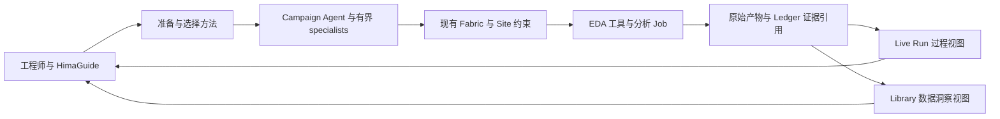

# HimaHarness 下一阶段产品评审与升级建议

2026-09-22｜评审基线：`b032bb031703cc4fd73f3a073e5d543035e17e99`｜状态：**建议，尚未转为实施承诺或 accepted ADR**。

本报告回答：现有系统怎样成为工程师愿意持续使用、CAD 团队愿意接入、客户愿意付费的产品。覆盖 sub-agent 团队、HimaGuide、Pack 开发、Library Intelligence、竞争定位与真人使用体验。依据是当前源码、保留的真实试用与录屏，以及本日打开阅读的官方竞品资料。本次没有重新启动测试、Campaign、模型试验或商业 EDA。

## 1. 核心判断

**HimaHarness 已经有承载复杂 EDA 工作的骨架，下一阶段要把它打磨成可独立使用、可交接、能解释每次决策价值的工程产品。** 最值得保留的是 Pack 的完整方法表达、Campaign 的持续身份、Fabric 的执行约束与证据记录、Site 的工具边界，以及工程师随时查看与介入的工作区。

我建议采用这样的定位：

> **把芯片工程师的复杂方法，变成在客户环境中可执行、可复核、可接续的工程能力；用经过验证的 EDA 工具和逐次反馈，帮助团队更快作出有依据的设计决策。**

这一定义同时覆盖 timing closure、定制 Cell 探索、Library 分析及后续更多业务。客户购买的产出可以是更好的设计，也可以是一次足够可靠、足够便宜的排除或交付决定；负结果只有减少了实际不确定性、避免重复无效作业，才构成价值。

现阶段最需要警惕三件事：

1. **把活动量当能力。** Agent 数、节点数、研究代数、生成 Cell 数，都不能直接证明效率或创新。
2. **把熟悉产品的测试 agent 成功当客户成功。** 过去 tester 常依靠精确目录、长手册、外部 improver 催促与修复。它是很好的工程证据，但不能替代新用户独立上手证据。
3. **把工程机制当独特壁垒。** 通用 coding agent、专业 AI 创业公司、主流 EDA 厂商都在提供多 agent、上下文分工和工具编排。Hima 必须在具体业务上的正确性、适配成本、可恢复性和结果解释上赢得客户。

建议优先顺序是：**人类控制与结果有效性 → 运行与上下文可靠性 → HimaGuide 的首个价值闭环 → 有界 specialist 团队 → Pack 作者闭环与 Library 洞察并行推进 → 跨设计、跨人员的客户验证。** Liberty 原生 API qualification 应作为独立前置事项尽早解决，避免整个洞察方向等待 UI 完成后才发现入口不可用。

## 2. 当前能力：已具备什么，证明到了哪里

| 能力 | 当前依据 | 可以确认 | 尚不能推出 |
| --- | --- | --- | --- |
| 持久 Campaign、Run、工具 Job、owner handoff | `fabric.ts`、`jobs.ts`、`recovery.ts`，ADR-0008，trial24 | 长流程、恢复和多代业务已有实现及部分真实证据 | 任意中断均可自动恢复，或已不需要外部盯守 |
| 复杂 Pack | DTCO 5.2.10、XTop 1.0.5 的 graph、contract、工具与读数 | 同一框架能表达不同业务和商业工具闭环 | 任意客户流程都可无适配迁移 |
| DTCO 研究 | trial24 七代完成的研究与第八代未完记录 | 保留一次完整 matched pair，生成库确有采用 | 已证明持续正向 Fmax，或 mock Cell 可作为签核 IP |
| Timing Closure | trial30 已保留的多代数据与 best DB 更新 | 存在实际 timing 改善，工具边界和保路 ECO 已推进 | setup/hold 已 clean、最终收敛或 signoff 已完成 |
| HimaGuide 与作者能力 | 产品上下文、Preparation、Pack 技能、独立作者会话 | 已有相当多可复用入口；不是从零开发 | 已有完善的专用角色生命周期，或陌生用户已能独立完成 |
| 工作区与运行图 | 真人式中文录屏、节点下钻和证据截图 | 可缩放、平移、看 Job/代码/规则/证据 | 大图可理解性、第一次使用和长期操作体验已验收 |
| Library Intelligence | 已接受 ADR-0012，研究文档、#49 | 三类用户分析与实现边界已定义 | Liberty 原生 API、查询、洞察面板已可用 |

**DTCO 的数字边界。** trial24 第七代 foundry 为 1773.05 MHz，generated 为 1721.17 MHz，matched Fmax **−2.93%**，有 374 个采用实例；第八代未完成。因此可以证明真实闭环、采用和诚实负结果，不能宣传达到 +5%。原 42 项 demand 后缩为 38 项并全部通过，也不能被表述为原 42 项都已解决。[trial24 报告](../../validation/trial-release/2026-09-21-trial24-result-review.md)

**XTop 的数字边界。** 演示材料截至 generation 8 为 175.62；本轮进一步独立核对本地 Ledger 与 retained compare 原字节/hash，确认 baseline 至 generation 9 的 closure score 为 **243.58 → 172.47**，bestDatabaseIteration 为 9。该代 setup WNS/TNS 为 −0.04/−0.12 ns，hold 为 −0.14/−5.95 ns，unconstrained endpoints 为 3。它是 Pack 的加权综合指标，不是频率、绝对违例数或 signoff 分数。`closure.py` 将跨 scenario 的 violation counts、TNS 与最差 WNS 组合；跨 scenario 同一个 endpoint 可能重复计数，不能直接称为唯一寄存器数。比较界面必须同时展示 setup/hold 原始指标、scenario、固定 endpoint 集合变化、DRC/connectivity 和约束覆盖。[录屏证据边界](../../product-demo/2026-09-22-himaharness-full-demo/README.zh-CN.md)；[计算实现](../../../packs/xtop-timing-closure/flow/closure.py)

**运行状态的时间边界。** 早期 trial30 报告只记录到第二代，后续 cycle、checkpoint、录屏又记录了新的控制状态。本次本地 Ledger 记录为 generation 10、revision 528、`control.paused=["*"]`，业务 status 仍为 `running`；这两个字段分别描述生命周期与控制状态。最新 checkpoint 和演示记录均说明无 open Job。第十代没有 compare 结果，最后完整测量仍是第九代。checkpoint 自述的 179.80 与 hash-bound compare 的 172.47 不一致，本报告采用后者。[冻结读数](retained-run-snapshot.json)不能用早期报告的 “running” 覆盖较新的暂停事实，也不能把本次静态阅读写成再次登录 Site 核实。后续产品必须让用户直接看到“这条状态来自何时、哪个 Run、哪个版本”。

### 2.1 当前源码暴露的三个具体打磨点

- **Guide 的专用性尚未落地。** `index.ts:327–364,459–474` 将简短产品身份和 inventory 注入普通 root Agent。作者会话及五阶段技能存在，但 `skills.ts:18–22,101–106` 规定由用户调用阶段；当前主要靠命令与卡片导航。下一阶段应补专用角色上下文和连续交接，不能声称已有完整 Guide agent 团队。
- **发布完整性与业务成熟度须分开。** DTCO 当前 `TEST.md` 明确是 publication smoke，未启动商业作业；XTop 是 compiled/development。版本封装完整是有价值的事实，但不会自动提升业务证据等级。Guide 推荐和 Catalog 应显示二者，而不是据 `released` 推断可交付 QoR。
- **XTop 的建议与完成门存在不一致。** `node-turns.ts:1881` 取 judge 的前两条规则作为 chooser 的 constraint/goal；XTop 顺序为 evidence、setup、hold。因此存在 setup PASS/hold FAIL 时建议 goal-met 的静态路径。**但 `fabric.ts:2565` 明确要求全部 verdict PASS 才接受 goal-met，现行 Agent 执行路径有保护。** 本次没有发现实际错误完成证据；应以 setup/hold 四种组合加缺证据用例检查建议、UI 可用动作和最终门的一致性，避免无谓拒绝与反复试错。不要只调整规则顺序，否则可能反过来遗漏 setup。

来源：[Guide 注入](../../../packages/harness/src/index.ts)、[作者技能](../../../packages/harness/src/skills.ts)、[DTCO 测试边界](../../../packs/custom-cell-fmax-dtco/TEST.md)、[XTop 图](../../../packs/xtop-timing-closure/graph.yml)、[chooser 证据选择](../../../packages/harness/src/node-turns.ts)、[完成门](../../../packages/harness/src/fabric.ts)。均为静态审查，本次未跑新产品测试。

### 2.2 应先于扩大团队解决的信任与入口问题

| 优先级 | 已见证据与当前代码 | 影响和最小升级方向 |
| --- | --- | --- |
| **P0：人类暂停的优先权** | trial30 Ledger 的控制请求记录先为 revision=523、`origin=human` 的 pause，后为 revision=524、`origin=agent` 的 continue；再暂停请求 revision=526/527 均为 Agent 来源。checkpoint 补充了 Job 结束后 Guide 自行继续的经过。`RunControl.paused` 只保存 scope；`fabric.ts:2080–2129` 的普通 continue 会移除 scope，只有 Pack Wait 的 human-clearance 有专门保护 | 人类暂停必须持久，不能依赖一句“以后请记住”。在现有控制记录中保存人类 hold 及可信来源，只有 Host 验证的人类恢复请求或其明确授权关联才能解除；Agent 的战术暂停另行区分。自然语言暂停也须由 Host/交互入口保留原始用户请求关联，不能让模型自报 origin 充当授权 |
| **P0：Site 探测不应改写管理政策** | `sites.ts:188–248` 从探测生成 capacity、`forbidden: ['deletions']` 与新 permit 路径；`index.ts:760–794` 保留 bindings，但不能据此认为全部原政策都保留。历史 trial25/26 记录过此问题 | 自动发现是事实，管理员设置是政策。再发现默认完整保留已保存管理员政策（容量、Permit 各字段、bindings、Permit 路径/身份），只更新探测事实；已实现的 roots/wrappers/bindings 保留应维持，容量/forbidden/permit identity 缺口需补齐。任何政策放宽展示完整 diff 并确认 |
| **P1：Guide 缺少“用户正在看哪个 Run”的上下文** | `index.ts:342–364` inventory 不含 Run ID；`hima_context` 要求精确 ID。保留的 `04-generations.png` 中，右侧已有 Run，左侧却将 Pack ID 当 Run ID，失败后搜索目录/账本 | 用现有 session/Workbench seam 注入获准的 selected/owned Run 身份、版本和最后状态；明确选择不等于 owner。用户问“这一代”时，不应重新搜索全盘 |
| **P1：配置错误被 loading 隐藏** | `ConfigurationPage.tsx:290–305` 读取失败设置 error；`411–416` 在无 draft 时却只返回 Reading 文案，错误/重试区在其后 | 在同一页面显示错误字段、修复和重试出口；不要求用户检查浏览器或改内部文件才能知道原因 |
| **P1：best DB 尚缺物理安全比较** | XTop `closure.py:700–759` 按 timing/endpoint 选择 best，`evidence_valid` 主要检查 best 记录就绪；历史 trial29/30 出现 72,799 DRC，却没有可比 baseline DRC 来证明其来源 | baseline 与每代采用相同 DRC/connectivity 检查，按明确允许项比较新增/退化；更好 timing 不能覆盖新增短路、断路或未解释 DRC。相同总数也不证明是同一批违例；先验证对象/类别差异，再谈签核 |

这不是本轮已复现并修好的 bug 清单：暂停及配置问题有历史观察与当前源码交叉支持，Site/结果有效性需要其最小反例继续确认。所有条目是下一阶段的优先验证与修复方向。当前 trial30 已暂停；本报告没有解除任何暂停。签核还需处理约束覆盖等条件，setup/hold clean 也不能单独代表完整 signoff。

来源：[控制实现](../../../packages/harness/src/fabric.ts)、[控制记录](../../../packages/harness/src/ledger.ts)、[Site 探测](../../../packages/harness/src/sites.ts)、[配置页面](../../../packages/harness/src/client/ConfigurationPage.tsx)、[身份查找的保留画面](../../product-demo/2026-09-22-himaharness-full-demo/screen-recording/04-generations.png)。历史证据身份与审查记录见 [research-notes.md](research-notes.md)。

## 3. 竞争定位：哪些已经是基线，哪些可能成为优势

### 3.1 客户面对的真实选择

| 选择 | 有证据的能力或合理优势 | 对 Hima 的压力 | Hima 应怎样应对 |
| --- | --- | --- | --- |
| Design House 自有 CAD flow + 内部 agent | 团队拥有私有工艺、脚本、队列和组织知识；已有开源 flow tuning 框架证明参数探索不必依赖专有 Harness | 稳定窄流程的内部改造可能比采购更便宜；客户不愿替换已有系统 | 接入其现有脚本、调度和审批，交付可导出、可嵌入的合格业务方法；把适配工时列进报价和验收 |
| Claude Code | 官方文档提供独立上下文、专用提示词/工具/权限的 subagent，以及恢复和交互机制 | “我也有 subagent、skill、代码能力”不足以收费 | 让 coding agent 成为 Pack 作者或客户端；Hima 保留 EDA 事实、Run 权限和业务验证 |
| Codex | 官方文档提供并行 specialist、自定义配置和 agent 结果汇总 | 多 agent 与上下文隔离正在成为通用能力 | 不重做通用 coding 工作台；用可验证领域任务证明附加价值 |
| Cadence ChipStack / Cerebrus 体系 | 2026-02 官方发布覆盖前端设计/验证、多虚拟工程师与自家工具；当时为 early access | 对方同时有工具深度、客户渠道和方法资产 | 不能仅凭“EDA + AI”自称差异化；选择我们工具有优势、客户现有组合尚有摩擦的任务 |
| Synopsys AgentEngineer | 2026-07 官方材料描述长运行 orchestrator、验证与 AMS 工作流；当时客户评估中、计划 2026 下半年提供 | 长期运行、闭环学习、自家工具结合也已是竞品方向 | 按具体 use case 对照，不将演示/公告当全面生产覆盖，也不假设对方只有单点助手 |
| Siemens Fuse / Solido | Fuse 官方声明多工具、多 agent 和第三方集成；Solido 已有库检查、比较、绘图及规则生成 | 通用“开放 + AI + Library 曲线”也不独特 | Library 方向聚焦“变化对当前设计的影响、最便宜的验证、行动后的响应”，并实测相对现有产品的增量 |
| ChipAgents 等专业厂商 | 官方文章公开跨工程步骤的多 agent 闭环方向 | 小团队也在争夺领域工作流入口 | 竞争单位应是客户完成一项任务的总代价与结果质量 |

官方来源：[Claude subagents](https://code.claude.com/docs/en/sub-agents)、[OpenAI subagents](https://learn.chatgpt.com/docs/agent-configuration/subagents)、[Cadence 发布](https://www.cadence.com/en_US/home/company/newsroom/press-releases/pr/2026/cadence-unleashes-chipstack-ai-super-agent-pioneering-a-new.html)、[Synopsys 2026-07 发布](https://news.synopsys.com/2026-07-26-Synopsys-Showcases-Comprehensive-Autonomous-Engineering-Workflows-from-Silicon-to-Systems%2C-Developed-with-NVIDIA-Technology)、[Siemens Fuse](https://news.siemens.com/en-gb/siemens-fuse-eda-ai-agent/)、[Solido](https://www.siemens.com/en-us/products/ic/solido/characterization/)、[ChipAgents](https://chipagents.ai/blogs/multi-agent-orchestration-ic-design-autonomy)、[ORFS AutoTuner](https://github.com/The-OpenROAD-Project/OpenROAD-flow-scripts/blob/master/docs/user/InstructionsForAutoTuner.md)。

这里的发布范围与性能描述是厂商材料，不是本次实测。不采用其倍数作为 Hima 目标或收益证据。对 Design House 的判断是机制分析；没有把任何公司的内部系统当作已经调查过。开放工具链的存在只证明 DIY 可行，不证明它在商业 signoff 上与 Hima 等价。

### 3.2 双重黏性应由两种可持续价值形成

**工具层的价值：** 提供可靠、深入、版本可验证的领域能力，包括工具内的数据对象、合法动作、错误分类、增量操作和真实结果。以现有项目为例，XTop 的修复及保路脚本、Liberty API 的条件化数据查询，比通用 shell wrapper 更可能形成差异；但 API 稳定性未通过前，这还只是资产潜力。

**方法与组织层的价值：** Pack 中沉淀经过验证的方法、客户允许的策略、Site 适配、历史失败、审阅记录和可复用分析。随着工程师重复使用，下一次能更快定位、少重复错误、更容易交接。这种黏性来自业务知识积累和持续服务，而不是无法导出数据。

建议商业策略是“**工具深度优先，流程保持互操作，客户资产可携带**”。客户可以从自己的内部 Harness 或 coding agent 发起、查询 Hima 能力；真正的设计修改继续通过同一 Fabric/Site/Run 授权边界。外部客户端不得成为第二个 Run owner。

反向约束也很重要：如果客户已经有成熟、可靠、成本很低的固定脚本，Hima 不能只在外面加一层聊天收费；只有跨工具诊断、策略调整、例外处理、交接或新方法开发带来可衡量改善，采购才有理由。我们也不应一开始与大厂争夺完整 RTL-to-GDS 主控制面。

## 4. Sub-agent 团队：减轻主 agent 的负担，而责任保持清晰

用户提出这个方向是正确的，但需要分清三种并行：**模型研究并行、确定性计算并行、商业作业并行**。六个 miner 能并行运行不等于六个独立研究员；增加 agent 也不能突破一个 Innovus license、共享数据库写入或后续依赖。

推荐先做一个可见 owner 带有界 specialist 的团队。Guide 帮助设定任务与解释结果；Campaign Agent 继续持有 Run owner/epoch；specialist 对自己收到的任务负责，交回证据和候选产物，由 owner 选择后通过现有 Fabric 采取行动。机械等待、身份检查、schema 校验、哈希、去重和资源限制交给代码。

### 4.1 首批角色与各自上下文

| 角色 | 合适的工作 | 应获得的上下文 | 交付 | 权限边界 |
| --- | --- | --- | --- | --- |
| Evidence Analyst | 提取日志、定位失败、比较 endpoint 或 Library 差异 | 精确节点/代际、输入身份、所需报告、数据字典 | 类型化观察、出处、未知与最小复现 | 只读；不把日志解释直接写为 Judge PASS |
| Strategy Researcher | 针对残余问题提出假设和可执行试验 | 固定目标、未解决集合、商业反馈、历史否定例、预算 | 假设、改变变量、预期信号、反证、成本 | 不能自行降低目标或抹去失败 |
| Pack / Node Coder | 把选定策略变为局部算法或 Pack 修改 | 输出合同、允许文件、失败夹具、工具版本 | 隔离代码、测试结果、hash 与影响范围 | 只写指定 workspace；不覆盖已安装方法或活动 Run |
| Independent Reviewer | 检查证据充分性、方法/数据泄漏、需求分母变化 | 原需求、候选产物、原始测量与判据 | 可复现异议或受限通过意见 | 不是第二个业务指挥者，也不是确定性 Judge 的替代品 |

这些是可复用任务模板，不要求每一步启动四个 agent。第一版先验证 Analyst + Reviewer 的读多写少任务，再开放隔离 Coding，最后验证多假设研究。小任务留在 owner 内，机械工作使用并行程序。

### 4.2 委派合同必须随任务持久保存

每项工作至少绑定：`runId / nodeId / generation / attempt / inputDigest / roleTemplateVersion`，以及明确问题、输出 schema、允许工具、读写范围、时间/token/并发预算、完成与失败条件、产物引用。只传必要的局部上下文；大报告存为带 hash 的文件，摘要保留结论依据和缺项，不把整段主会话复制给所有 worker。

回收结果时检查输入是否仍有效。如果 owner 已接受了新的 design state、切换代际或失去 epoch，旧 worker 结果只能进入历史，不能直接驱动当前动作。错误输出应明确为不可采纳，不静默填零。重复投递、主会话 compact、worker 崩溃、用户暂停后返回结果，都要有确定语义。

**减少对主 agent 的依赖，至少有两层工作：** 专业分析不再全部挤在一个上下文；owner 休眠/重连后由持久 Run 与完成事件恢复责任，而不是依靠它记住聊天历史。保留单 owner 与消除脆弱单会话依赖并不冲突。全面让任意 agent 自主改 Run 会改变 ADR-0008，目前没有必要这样做。

### 4.3 如何判断值得做

冻结同一批真实问题，对照 owner-only 与 owner + specialist。比较正确定位率、首次可执行产物率、人工干预次数、总 token、等待时间与有效试验成本。至少包含：旧输入返回、缺字段、重复完成事件、取消时在途任务、互相矛盾的候选结果。

只有在相同输入与预算条件下有稳定增益才扩大团队。避免用多个模型一致投票当真理，也不要用更多廉价调用制造更高总代价。

## 5. HimaGuide：让一个专用角色贯穿首次价值和持续使用

HimaGuide 应成为产品的主要入口。用户应当能说：“我有这个数据库，请先告诉我能优化什么、需要什么、下一步会花什么。”产品主动发现已安装 Pack、Site、可读输入和历史，只询问真正缺失的业务判断。

### 5.1 四类工作，共用一个连续体验

| 用户意图 | Guide 的责任 | 可见结果与完成条件 |
| --- | --- | --- |
| 认识产品 | 按用户职业与手头输入解释可做的任务，区别可用/开发中/受阻 | 两三条相关任务建议，每条说明输入、产出和证据成熟度 |
| 开始或恢复工作 | 发现输入、检查 Site、估计范围与成本、给简短 proposal；已有 Campaign 优先定位同一 Run | 用户确认后恰好创建一次；恢复不重复创建、不重复交付相同 Job |
| 编写 Pack | 从现有脚本、SOP、报告反推数据合同和反馈逻辑，进入既有作者会话 | 一个可检查、可试运行、可发布的 Pack 候选及其适用边界 |
| 研究与解释 | 从当前设计/Library/历史证据出发，解释变化、提出有边界的下一问题 | 引用当前数据的判断；执行建议与实际执行分别呈现 |

“专用”意味着独立身份、稳定职责、上下文装配、允许工具、任务恢复和专属验收，而不只是把通用 system prompt 中的名称换成 HimaGuide。应复用现有 DSH Agent/Session，不增加一个新的 Agent Loop。

Guide 与执行 owner 的关系要让用户明白：准备阶段由 Guide 服务；启动后打开该 Campaign 的 owner 会话；另开的 Guide 会话可以继续研究和查看，但必须通过明确的 handoff 才接管同一 Run。上下文交接携带事实引用和任务目标，不要求用户再次粘贴全部历史。

### 5.2 需要加深的产品接口

- **能力回答有事实依据。** 小型 inventory 直接返回 Pack 身份、成熟度、适用输入、最近验证范围、工具就绪状态；Guide 不必全文扫描 repository 才能回答“能做什么”。
- **准备过程可见。** “已发现”“需要你判断”“尚未实测”“被阻塞”各有明确原因与下一动作。静态 contract 匹配不能显示为已验证工具可用。
- **上下文恢复以事实为准。** 进入会话时装配当前任务、固定约束、最后一次有效观察、未解决问题、待办控制与最近产物身份。compact 摘要辅助理解，不能决定活动版本和授权。
- **来源及范围随解释显示。** “依据 gen 7 的 compare.json”与“我提出的假设”清楚分开；找不到证据就指出缺少什么。
- **错误转为可完成动作。** 显示问题位置、影响、已保留状态、最便宜的修复或交给 CAD/作者的材料，而不是返回一段内部 stack trace。

### 5.3 首次使用的验收设计

让没有仓库背景的工程师，仅拿到 App、一个真实输入和合法 Site 访问，完成“了解用途 → 选择任务 → 准备 → 第一个可检查结果 → 看懂局限”。记录任务完成、人工求助、配置往返和耗时。先建立当前基线，再给改进版本设目标。

另设失败用例：工具缺失、Site 不可达、Pack 不兼容、输入歧义、现有 Run 已在运行、模型失联。Guide 必须在产品内指出下一步；不靠测试手册里的隐藏命令和修正内部 JSON 才能继续。并不要求新用户承担管理员的一次性 Site 配置职责。

## 6. Pack 开发：把复杂方法变成可执行合同

现有 Pack 体系已经包含 Intent、Spec、Contract、Graph、Tools、Readers、Rules、Choosers、Knowledge 和发布身份。应该加深现有作者流程，避免再建立一套与它平行的 DSL 或运行时。

建议 HimaGuide 引导一个明确的作者闭环：

**业务样例与目标 → 输入/输出和判断合同 → 方法分解与反馈 → 最小可执行样本 → 受支持真实环境验证 → 发布与复用。**

### 6.1 七条作者原则

1. **先写客户交付物。** “一个可以重新打开的 improved Innovus DB + fresh STA + best/last 差异”比“调用四个工具”更准确。必须给完成、未完成和受阻的实例。
2. **纯机械工作和研究工作分开。** 稳定导出、parser、单位处理用代码；研究节点允许提出新策略，但规定输入、产出、改动范围和验证方式。
3. **节点粒度围绕可重试/可观察边界。** 一个独立商业工具阶段、一次明确测量或一次研究决策通常适合作节点；不为每个 shell 命令建节点，也不把整个多工具闭环藏进一个黑盒脚本。
4. **Reader/Judge 使用同一份数据合同。** 字段类型、单位、对象身份、缺失和 unsupported 明确；缺字段不能当零。真实“零违例”与空文件/截断日志必须不同。
5. **失败和恢复是方法的一部分。** 已生成产物、可复用边界、工具退出码与业务有效性、重试安全、best DB 保留、取消在途作业分别定义。
6. **反馈必须改变下一次可观察的选择。** 每代记录上一轮信号、未解决集合、本轮假设、算法/参数/demand 的差异、昂贵验证的理由。如果选择不变，要说明证据为何支持它。
7. **方法版本与客户资产分离。** 已发布方法不可原地漂移；新代码进入候选版本，方法升级不会覆盖旧 Run 的证据。共享 Pack 默认不带客户 design 或私有历史。

### 6.2 给作者的工件应比长手册更具体

Guide 在原有 authoring 入口中生成或补全：一份输入输出数据字典；一对正常/失败真实报告夹具；节点摘要和依赖预览；tool wrapper 最小环境探针；schema/引用/覆盖报告；一次模型节点的冻结输入 A/B；方法升级和回滚说明。所有材料继续放在 Pack 既有结构中。

重新进入作者会话时，按当前 `packStage` 和已有文件恢复，不重新访谈或覆盖已确认阶段。发布后由 Guide 生成只读交接：方法目录、测试范围、版本/digest、目标安装位置和保留资产；打开已有 PackOwnerPanel，由用户按原机制审阅确认。Guide 当前不能直接调用该安装/升级写入口，不应靠扩大权限抹平这个边界。安装完成后刷新 inventory，确认实际生效版本。

已有节点、工具与发布检查要尽量复用。新增内容应对应实际消费端，例如 `when/unit/missing` 用于 Reader、画图和模型输入；不要为整齐而发明无人读取的元数据。

**建议的低成本作者验收任务：** 由非原作者用 Guide 将一份有 baseline/revision 两份报告的时序比较 SOP 转为小 Pack，包含 read、judge、一次有界研究和报告；断网后恢复仍引用同一产物。通过后再扩大到新工具接入。作者完成一个 schema 并不等于做成可用 Pack；至少要能执行、失败、解释、发布和重新安装。

当前用户手动调用五阶段 skill、Pack owner 手工确认安装是已有行为。建议先让 Guide 自动准备下一阶段所需材料、解释检查结果和打开精确入口。以后若允许“一次授权后连续生成候选”，必须明确它只覆盖候选写入与低成本检查；安装、改变活动 Run 或增加商业作业权限仍按现有边界。不能通过提示词偷偷绕过作者工具限制。

### 6.3 研究质量不能只看“代码变了”

为每代保留四种状态：复用了有效方法、修复了实现问题、尝试了新业务假设、重复但未带来新证据。对新颖性的检验应落到选择的机会、函数/drive、拓扑、endpoint 群、动作或实验条件的实质变化，不能只比较文本或代码 hash。

冻结 candidate pool 的反馈 A/B 能检验模型是否使用反馈；商业 EDA 能检验所选动作是否有效；跨任务重复才能支持“自我改进提高了成功率”。这三层不应合成一个 PASS。原 demand/frontier 的历史分母始终保留，缩小范围需要理由，不能把消失的困难项算成成功。

## 7. Library Intelligence：第二种工作模式，共用证据与行动框架

已接受 ADR-0012 给出了正确方向：同一对话，右侧 Workbench 同时支持运行过程与数据洞察。无需把数据图表硬塞进 Live Run DAG，也无需独立 BI 产品和第二套事实库。

**Live Run 回答“工作怎样进行”；Library Intelligence 回答“数据说明什么、应该做什么”。** 两者通过同一分析产物与 Campaign 引用连接：从异常 Cell/arc 跳到生成它的分析节点，也可以将选中的 finding 和条件带入后续受控试验。

### 7.1 三类任务与最小可用交互

| 用户任务 | 第一版应帮助用户完成的决定 | 需要的交互 |
| --- | --- | --- |
| 库健康与发布风险 | 新库相对基线多了哪些缺项/异常，哪些必须先复查 | revision/corner/类型筛选，差异表，top finding，coverage 与 unknown，原始表/规则来源 |
| 库性能与竞争力 | 同功能、同条件下的 delay/area/power 取舍在哪里 | family/drive/VT/PVT 对齐，load/slew 切换，多维散点与曲线联动，保留选中对象 |
| 设计影响与行动 | 哪些变化真的影响当前已采用 Cell、关键 endpoint 和工作点 | actual usage、slew/load 覆盖叠加，Library severity 与 design relevance 分列，建议最便宜验证 |

表、图、过滤、注释、证据和报告是这些任务的公共能力，不应成为一排需要先学习的新功能入口。客户端不下载整个大库供模型任意读；使用有预算的聚合、分页和对象下钻，保留查询条件和数据快照身份。

### 7.2 数据语义比图表样式更关键

同名 Cell 不等于同功能/同视图；一个 timing arc 至少需要 pin、related_pin、timing_type、sense、when、mode 等上下文；PVT、单位、模型类型、rise/fall、slew/load 和 interpolation 范围必须显示。约束表不是传播 delay；NLDM、CCS、LVF 也不能直接混为同一个量。

缺失、未支持、解析失败、没有采样到、真实零值分别处理。所有派生图表能回到 source hash、查询/算法版本和输入条件；大库的索引可以重建，原始 Library 与商业工具输出仍是权威。客户 Python 分析在受控输入/输出、workspace、预算和 fixture 下运行，不能让任意 HTML/脚本或生成图表变成执行入口。

### 7.3 现实前置条件

保留的 2026-09-22 qualification 记录显示：合适的 Python/edarun 环境中，import 与 `readTmlib` 后在 `lib.name()` 退出 **139**。根因尚未定位，本次也没有重跑。因此“用 Liberty API 做洞察”的第一个门是可用的 parse/query 和有边界的失败处理，不是多建几个图。[环境证据](../../package-development/library-intelligence-platform/environment-qualification.md)

当前 #49 首切片规定 qualification 通过后才进入真实 UI/批量 corpus；应遵守它。本评审可先设计数据与交互合同，但不把 fixture 图表宣称为 API 已打通。首个只读产品闭环建议仍是**同族 baseline/revision 的 design-conditioned delta triage**。写回修库留待 read-only 准确性和用户价值证明后，任何 candidate copy 都不能覆盖 golden Library。[首切片](../../package-development/library-intelligence-platform/first-slice-spec.md)

Solido 官方资料已包含检查、比较、自定义图和规则生成。这意味着我们不能以“增加 AI 曲线”自称领先。真正值得验证的是：工程师能否更快从一项库异常定位其设计影响，选择验证，并将验证结果带回同一分析。[Solido 官方](https://www.siemens.com/en-us/products/ic/solido/characterization/)

## 8. 从人的角度看，最需要打磨的地方

| 观察与证据性质 | 对人的影响 | 最小产品改进 |
| --- | --- | --- |
| 录屏中图可以操作，但完整图是横向细长链、节点名截断，画布大量空白；属于截图走查 | 用户不容易先理解业务阶段，必须放大和逐个点开 | 复用同一图投影增加阶段分组、节点搜索、当前/失败定位、适配选区和清楚的图例；保留细节下钻 |
| 录屏中证据卡优先显示路径/规则 ID；业务结论分散于聊天、Evidence、Generations | 想知道“改善了什么”需要自行拼接 | 顶部摘要显示目标、当前/best、对比、未解决、预算与下一动作；每个指标可下钻原证据 |
| 过去长期 Campaign 有需要催促的停顿；issue #48 的通知堆积已修，不应作为未修缺陷重复列入 | 人不知道是在等工具、等模型、等自己，还是已经无进展 | 统一显示等待原因、最后有效活动、下次检查与谁负责；关键完成事件可靠送达且合并；保留已修路径回归 |
| 中文对话可用，但配置和节点大量英文缩写、内部字段；属于截图观察 | 上手成本来自概念翻译，不只来自按钮位置 | 业务中文标签配保留技术原名；默认短解释，专家可展开字段、版本和哈希 |
| Files 工作区与活动 Pack 版本可能不同，录屏已有显式版本说明 | 用户容易把看到的源码当本 Run 实际执行内容 | 打开文件时展示“来自当前 Run/已安装 Pack/工作区草稿”；提供一键打开实际执行版本 |
| README、词汇表、老 trial 手册和当前产品定义有时间差 | 人和 Guide 都可能恢复到旧规则 | 给当前入口与历史材料清楚身份；知识装配按版本与权威来源，不盲目全文混合 |
| 真人式测试由熟悉系统的 AI 加外部 improver 完成 | 隐藏了客户实际需要的支持工作量 | 新用户无内部补丁验收；人工补救单独计成本；产品内反馈与恢复取代外部 session 粘贴 |
| 对比指标和 endpoint 口径较复杂 | 综合分数改善可能掩盖局部退化 | 并列展示固定全集上的 fixed/remaining/entrant/regressed、关键 guardrail 与比较条件，不只绿色完成节点 |

截图来源：[运行图](../../product-demo/2026-09-22-himaharness-full-demo/screen-recording/03-live-graph.png)、[证据卡](../../product-demo/2026-09-22-himaharness-full-demo/screen-recording/15-evidence-gate-verdicts.png)、[配置](../../product-demo/2026-09-22-himaharness-full-demo/screen-recording/23-pack-config-contract.png)。这是保留画面的可用性判断，没有假装本次做了新真人实验。

用户界面应让工程师随时回答六个问题：**我在处理哪个设计和版本；当前在做什么；谁在负责；结果比之前怎样；需要我决定什么；下一步会花什么并改变什么。** 图、聊天和表单都围绕这些问题组织。

企业导入还需要一张清楚的数据流说明：现场原件默认保留，不代表选送给外部模型的对话和工具输出也完全离线。部署合同应说明模型服务、可外发数据、Site 权限、凭据管理与审阅导出。公司级 SSO、多用户治理和队列集成按实际首批客户需要逐步做，不把尚未验证的 enterprise-ready 当当前卖点。

两项容易被低估的非视觉工作也应纳入：长期任务在重启/compact 后的恢复；客户能否导出包含方法、版本、输入身份、best DB、结果、未知和复现条件的交付包。前者决定敢不敢放手，后者决定结果能不能进入客户工程流程。

## 9. 如何让客户看见并愿意购买价值

| 场景与角色 | 客户实际得到什么 | 应与什么比较 | 如何验证 |
| --- | --- | --- | --- |
| PD/STA 工程师的夜间 timing closure | 次日可恢复的 best DB、已改善/退化 endpoint、下一步理由 | 同工具、同输入、同预算的熟练工程师现有 flow | 人工介入分钟、有效轮次、setup/hold/DRC、重复 Job、best DB 能否独立打开 |
| Library/QA 工程师评审新库 | 一份可审阅的变化、风险、覆盖、设计影响与待验证清单 | 现有商业工具/脚本及其完整审阅成本 | 查明问题时间、漏检/误报、unknown 处理、报告重建时间 |
| CAD/方法学团队交付新流程 | 可版本化、可测试、可接入自有 Site 的 Pack | 现有脚本 + 文档 + 人工支持 | 首次移植工时、后续版本适配成本、作者之外的人成功比例 |
| 设计负责人组织 DTCO 探索 | 条件明确的机会、Cell demand、真实商业响应与否定例 | 相同工具资源下的人工/固定搜索策略 | 每个有效假设的成本、独立改善、采用、跨代决策差异；mock 与真实库结果分开 |
| 项目交接或资深专家休假 | 接任工程师知道当前状态、证据、未决项和下一合法动作 | 读聊天、找脚本、询问原作者 | 找到 best 结果和继续工作的时间、误用旧数据次数 |

建议先用 **Timing Closure 的交付闭环作为执行价值样板，Library Intelligence 的问题到决定闭环作为交互价值样板，DTCO 作为研究能力上限试验**。它们承担不同证明任务，不能用其中一个成功替另一个背书。

客户经济账应计：导入适配 + 方法维护 + 工程师审阅/干预 + 模型 + compute + 许可占用/等待 + 失败重跑与返工。许可 token-hour 与现金成本的换算取决于客户合同，不能直接相加成虚构 ROI。时间到结果与人工投入分列；自动化可能减少盯守却增加总计算量。

收费建议属于待验证商业假设：平台收取运行治理与持续服务价值，合格业务 Pack/工具组合按支持范围与业务价值定价。首批付费试点约定输入、适用工具、支持边界和验收产物，不承诺对任意设计提升固定百分比。先访谈工程使用者、CAD 管理者和预算负责人各自的接受条件，再确定席位/项目/并发等计费单位。

## 10. 开发顺序与验收切片

以下是建议顺序与依赖，不是本次已批准开始的实现清单。正式派工前按仓库纪律写 GitHub Issue，绑定当前源码与失败样例；不从旧 Issue 的 open 状态直接推断当前缺陷。

| 顺序 | 最小切片与现有归属 | 最低反证 / 验收 | 放大条件 |
| --- | --- | --- | --- |
| A0 | 人类 hold 与 Site 政策保留：`ledger.ts`、`fabric.ts`、`sites.ts`、既有控制/发现视图 | Job 结束或 owner compact 后不能自行清除人类 hold；Site 再发现完整保留已保存管理员政策及 Permit 身份，探测事实单独更新。L2 + 对应 L3，权限审查；旧记录迁移保守处理 | 扩大团队前先保证用户和 CAD 的约束可依赖 |
| A1 | 对齐当前知识入口与版本事实：product context、Pack words、文档索引、实际方法身份 | 同一个能力问题在新会话/恢复会话答复一致；旧 proxy 决策语义不进入活动 Pack；历史仍可追溯。文档/投影检查 + 有界模型验证 | 当前入口不再需要维护者口头纠正 |
| A2 | 多目标判据与建议对齐：XTop chooser、`node-turns.ts`、既有完成门 | setup/hold 四组合及缺证据，建议不得与最终门冲突；保留全 verdict 检查。L1/L2，先证明不一致再修；不靠新 P&R 发现它 | 同类 Pack 的规则顺序不再隐含业务目标 |
| A3 | owner 生命周期与进度解释：`index.ts`、`fabric.ts`、`recovery.ts`、`remote.ts`、当前节点面板 | 受控 Job 完成后 owner 繁忙/重启/重复事件均不漏接、不重复 Job；pause 在途结果可落账但不启动下一步。L2 + 关键 L3，真实 Site 恢复需另批预算 | 一次受控长任务不需要外部 tester 催促 |
| A4 | best DB 的物理证据：XTop `closure.py`、Readers/Rules 与现有 compare | timing 改善但新增 DRC/connectivity 问题时不得选为 best；相同总数但不同对象也能检出。先真实报告 fixture，后最小 Site 验证 | 可恢复 best 与物理合法性具有同代证据 |
| B1 | HimaGuide 专用上下文与 Preparation 体验：既有 Session、Guide/context、`packs.ts`、Site、配置面板 | 不懂内部 YAML 的用户得到正确短 proposal；缺失条件可解释；反复点击只创建一次 Campaign。L2/L3 + 小型 L4 模型 | 首个结果与失败恢复可由新用户独立完成 |
| B2 | Analyst + Reviewer 委派：DSH subagent tool/filter、现有 analysisRecord/RunView/Evidence 与 owner 综合 | 输入身份、权限、取消、过期结果、并发预算；冻结任务 owner-only A/B；Workshop 留给后续有界 Coding。先 L2，再小型真实模型 | 净正确率/成本/干预改善，才加入 Coding 与策略并行 |
| C1 | Guide 辅助作者闭环：Pack authoring skills、`authoring.ts`、`release.ts`、测试夹具 | 非原作者完成一个小 Pack；正常、缺字段、真实零值、失败可解释；验证 act 节点 retry-safe/block 行为、packStage 恢复、publication handoff 与精确安装确认；不污染已发布方法 | 两个不同业务作者可复用同一流程 |
| C2a | Liberty API qualification：沿用 #49 的 Site-local worker | 安装夹具与代表性真实库完成查询；crash 不产生半成品 facts；后续写副本需独立 round-trip 门。L0/L1 + 只读 L4 | API 真实可用、语义与错误边界可验证 |
| C2b | Library 同族版本差异 + Workbench 洞察：已有 Panel/route seam、Pack Reader/Archive | 可切 load/filter、表图联动、恢复分析、回到源对象；未知不消失；与已有方法同样本比较。L2/L3 + 合格真实输入 | 从 finding 到设计影响再到一次验证的用户闭环成立 |
| D1 | 每代变化与客户交付：`experience-report.ts`、record views、Generations、Pack 专属投影 | 未变策略、需求缩小、负结果、部分完成均正确显示；另一工程师能从报告打开正确 best DB | 两设计/两操作者/第二个受支持 Site 的迁移记录 |

A0/A1/A3 是团队能力的安全基础；B1 与 B2 可以在接口冻结后独立推进；C1 与 C2 可以由不同人员并行，Liberty API 阻塞不必拖住 Guide。共享接线文件继续单一 owner。无需等所有方向完成才给客户试用，也不应六条线同时重构核心。

尚不建议：全面替换 DSH/Fabric、无限递归 agent、从聊天内容自动修改活动 Pack、先建通用 BI 服务、默认自动修写 golden Library、构建 Pack 市场、以多跑 EDA 代替定位 root cause。上述项目都缺少当前客户收益和最小必要性证据。

## 11. 下一阶段的产品验收应怎样设计

采用三组对照，全部保留失败，不用单次漂亮演示定论：

- **使用对照：** 新用户完成任务，记录 first useful result、人工补救、状态理解、报告查证与恢复。代操作可以提前暴露问题，最终仍需真实工程师评价。
- **机制对照：** owner-only 与有界 specialists，在同输入、工具、预算下比较；包括错误/取消/重启、权限与上下文污染反例。
- **业务对照：** 客户现有合格 flow 与 Hima，在同工具/设计/约束/预算下比较结果、工时、计算和许可占用。DTCO 另保留 mock 模型校准边界，不能靠改模型制造收益。

建议立项时先测当前基线，再商定“何种改善足以发布”。唯一必须立即满足的底线是：没有未经授权的副作用、没有重复商业 Job、没有丢失或错认输入/证据、没有把未知或未完成说成成功。具体延迟、成功率和成本目标由测量校准，不在本报告虚构已经达到的数值或开发工期。

**近期最值得交付的组合：** 一个能独立完成准备与恢复的 Guide；一个可靠的 owner + 两种 specialist；一个别人也能使用的 Pack 作者流程；一个以真实数据回答具体问题的 Library 洞察切片；一页可解释的业务结果。这个组合直接对应客户使用和采购判断，也为以后更强的自主研究提供稳固基础。

## 12. 边界与后续决策

本次没有证明客户付费意愿、跨设计效果、通用代理优劣或完整产品安全。没有重新运行历史试验，源码存在与测试文件存在也不等于本次通过测试。竞品结论限定于已读取官方范围，非独立 benchmark。当前 trial30 继续暂停。

同目录的 [证据与研究记录](research-notes.md) 保存检索范围、竞争判断的反例、关键缺口、独立审查和实际验证方式。正式实施应沿用现有产品定义、ADR 与 GitHub tracker；本报告的建议不悄悄改变它们。
