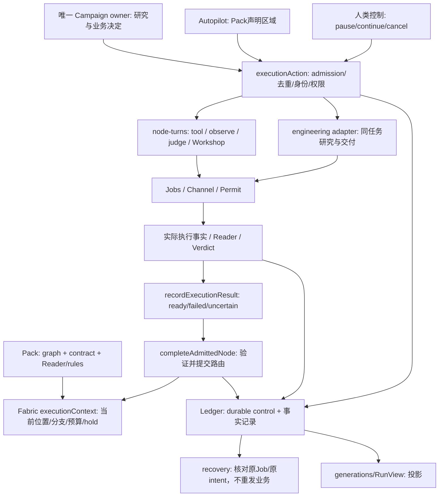

# Fabric 业务图评审：把业务结果留在图上，把执行手续收回内部

评审对象：本项目当前最新版 `77223febe236df94d4db4eb006b6c9e612c62206`，分支 `future`。用户已澄清“原版”指本项目最新版，因此本报告只评价这一快照，不提出恢复旧版设计。评审者：GPT-6 Astra / high，fresh context，单人主审，无再派工。2026-10-02。

**结论：保留“业务图 → 节点 → 动作 → 必要属性”这个方向，先加深现有 Fabric 的节点完成 interface。当前最值得删除的不是四种节点，而是调用者为完成一个业务节点必须理解的执行手续，以及图靠位置和顺序暗示结果含义的约定。** 不建议重写成通用工作流引擎，也不建议把所有差异压进 `attributes`。

五个主要判断：

1. 当前业务图仍是 `act / judge / explore / wait`，但 `act` 包含工具、Reader、Workshop，工具还可以走 interactive 或 Resident。这本身可成立；问题是同一“执行节点”对调用者有几套步骤，完成事实也未形成一个足够深的统一 interface。
2. **图语义包含了过多特定研究流程假设。** 分支必须是 `act` 链、join 必须是 `judge`；Judge 第一条规则决定路由，Explore 把第一/第二条规则当 constraint/goal，并消费最近的 Reading/Judge。它们支持现有一类实验循环；更复杂任务仍可封装在一个 act/Resident 内执行，不能把“图中不能直接展开某种结构”说成“任务不能执行”。是否需要拓宽图，取决于用户是否真的需要跨节点观察、复用、介入与恢复。
3. ADR-0016 已让声明区域自行推进，ADR-0017 已把工程研究收进一个工程节点。不能再次以“新增自动推进”“再建团队”作为答案。但区域外 Reader/Judge 仍要求机械 begin/work/complete；autopilot 内部也在模拟这套对话协议。
4. 保留原始身份、唯一 owner、human hold、去重、Reader、unknown 是可靠性的实质。**请求回执、attempt、Job 存活和执行阶段应由代码保存，不能因此要求模型逐项担任流程管理员。** 同时，删字段并不能删去这些事实。
5. 第一项建议是一个有明确反例的**节点完成契约设计切片**：用数值结果与当前 ATCS 终端判定，明确“已执行 / 结果已验证 / 业务 Goal 达成”各由哪个现有声明决定；随后才决定窄实现。不要先从 Resident status、文件数量或节点数量入手。

## 证据范围与读法

- **F：当前源码事实。** 本轮读了当前源码、Pack 和相关测试定义，未运行测试/build/GUI/模型/SSH/EDA。测试存在只代表有相应断言，不代表本轮通过。
- **I：静态推论。** 可以从路径推导，但未现场复现；以下明确标记。
- **P：提案。** 不是已批准产品决定，也不是实施承诺。
- 阅读了当前 AGENTS、model-policy、polishing-discipline、product-definition、CONTEXT、ADR-0001/0002/0003/0008/0014/0016/0017、testing-strategy、fast-convergence-testing；应用 codebase-design 的 depth、interface、seam、locality、leverage 和 deletion test。
- 所有下面的源码链接固定当前 SHA。没有用另一架构、旧分支报告或旧验收结果证明新结论；不覆盖此 SHA 之后及其他分支的变化。未访问两个只读源仓库。独立研究稿最初保存在 ignored 目录；本目录由主会话归档，只新增报告与核对记录。

## 1. 当前 Fabric 实际是什么

### 1.1 业务概念与实现事实分层

| 层次 | 当前内容 | 判断 |
|---|---|---|
| 方法/业务表达 | 不可变参考图；节点动作；参数与输入；输出/Reader；规则与 outcome 边；Explore 策略和 revisit；可选附加研究 | 应让 Pack 作者和 owner 看懂。边必须表示实际依赖/结果路径。 |
| 一次执行的事实 | Run、节点 execution、attempt、generation、loop/branch 身份、输入版本、结果引用、supersession | 必须持久化；不应全部成为每次业务操作的手填字段。 |
| 确定性执行 | admission、owner/epoch、hold、预算、Site Permit、launch intent、Job 观察、Reader 验证、路由落账 | Fabric/Host 的 implementation；模型不能补造。 |
| 执行适配 | batch Job、Workshop 作者、Team/interactive、Resident wrapper/native session | 真实差异，应在现有 seam 后隔离。模型选择策略不等于选择 transport 协议。 |
| 呈现 | GenerationView、运行图、状态摘要、可操作入口 | 从以上事实投影；不是新的完成权威。 |

`PackNode` 的四个 kind 是分类语法；`ExecutionActionRequest.action` 的 begin/work/complete/read/write/engineering 等是操作协议。它们不能都叫“节点动作”而混为一个层次。节点的业务动作应是“读这份成果”“生成这个方案”“修复这个设计”；begin、receipt、release 是实施该动作时的内部操作。某个检查只有独立的用户问题、跨动作消费者、复用需求或介入/恢复价值时，才值得单独成图节点；仅为完成 producer 的交付验收而存在的检查，可以作为该节点的 completion implementation，保留完整可下钻的 Reader 事实。[E1]、[E2]

### 1.2 当前职责/控制路径



**F：生产没有三套竞争的自动主脑。** `drive()` 和旧 `runFork/driveBranch` 路径受 `legacyAutomaticAllowed()` 限制，只在明确开启的 Node 回归夹具内运行；受控 Run 也被拒绝。当前生产 owner 和 autopilot 共用 `executionAction`、`completeAdmittedNode`、fork/loop helpers。旧 driver 是维护与测试负担候选，不是生产重复调度的证据。[E3]

**F：可运行集合不是一般 DAG 调度。** `executionContext` 从 `currentNode` 或 `run.fork.branches.currentNode` 产生候选，再套预算、hold、未完成 receipt 和 execution 筛选。`run.loop`、`run.fork`、growth 是专门的结构状态；图和状态相互解释。此实现够支撑受限图；这不是要求把任意结构都搬进 Fabric。动作内部完全可以自行处理复杂流程，图只需呈现用户关心的业务承诺。[E4]

### 1.3 多种“状态”并非全都重复，但交界很浅

- `Run.status` 表示整次活动是否运行/等待/结束；`NodeRecord.state` 是节点发生了什么的历史；`NodeExecution.phase` 是本次 admission 到可路由的操作阶段；`Job.state` 是进程事实；`request.state` 是一次操作是否确定提交。不能简单压成一个 `status`。[E5]
- 真正应收回内部的是 caller 要知道 `ready` 还必须 `complete`、`done` 的 NodeRecord 不表示路由已提交、工程 delivery verified 不表示 wrapper 已结束。`completeAdmittedNode` 先写 admitted/uncertain，再追加决定、移动位置、最后写 completed；重启遇到半途 completion 会保守停在 unknown。这不是假问题：现有恢复测试专门断言“前一 Job 成功不能证明 route 提交”。[E6]
- **I：目前用可解释的保守停机换取不重发副作用，但纯确定性路由提交也可能需要人工查账。** 改进应使同一提交可按固定身份核对/收尾，而不是一遇 unknown 就重跑，也不是让模型猜 route。

## 2. 三类任务与结构反例

### 2.1 读取、判断、纯转换

**实际 consumer 1：数值 Workshop 夹具。** `analyze → read-analysis → judge`；数值研究 Pack 则是 `prepare → analyze → observe → judge → next-limit`。Workshop 负责生成程序/结果，Reader 负责验证结果，Judge 负责业务判定。这些职责的独立性有价值，并不因想少节点就该删除。[E7]

**实际 consumer 2：OpenE902 timing probe。** `synthesize → read-qor → judge → next-period`。批量 EDA、报告读取、数值判定、下一策略有清楚的业务差别。[E8]

**F：观察与新实验被 kind 混淆。** admission 对所有 `act` 统一计 `attempts: 1`；closing reserve、attemptLimitSpent 会阻止所有 act 的 begin，work 也按 act 拒绝。`observes` 本身也是 act，所以“工具已产生成果，只需 Reader 收取”的节点仍进入这个门。Pack Reader 的确会作为 Job 写验证输出，不能凭名称当成没有任何副作用，但它不等于再启动一轮设计试验。[E4]、[E9]

**I：在实验刚好用完 allowance/进入 closing 后，未开始的 Reader 可能无法形成后续 Judge 所需事实。** 这可能让“预留收尾”不能完成正常证据收取。当前代码可支持这个推论，本轮没有实跑；不能把它报成已复现故障。建议区分“受控成果验证”与“新实验”，仍保留 Reader 的 Permit、Job cap、执行成本和硬 deadline。

### 2.2 有副作用且异步等待的 Job

调用链为 `executionAction(begin) → work → toolNode → launchAndWait → claimSlotAndLaunch → Job`，返回 pending 后由 `observeExecution → resumeNode/waitForJob` 收取结果，owner/autopilot 再 complete。launch intent、session、method/input digest 防止意外重发；Site 资源分配继续由同一 claim 路径负责。[E9]、[E10]

最小节点 interface 可以隐藏 begin/work/complete，**却必须保留至少 admission 身份、effect 身份、可核对的结果和提交身份**。例如 SSH 在发出命令后断开，不能因为模型没拿到成功响应就再启动一份。读取尾日志也不能授予重发权。这里“只需节点和动作”成立的条件是可靠执行细节在内部承担，不是将细节删除。

### 2.3 Workshop 与 Resident 自主研究

Workshop 的作用是受控生成/运行程序。owner 路径要 begin、recommend、read/knowledge、write、work、complete；autopilot 分支让 child 产出结构化 entry 并由 Host 写入和运行。`recommend/read` 首次进入时还可能初始化 Workshop scope；这说明某些表面读操作带准备副作用，但不能据此获得额外业务权限。[E11]

Resident 用同一个 `act tool` 的 outsourcing 声明，在节点内自主学习、Coding、工具操作、内部协作。Hima 接回目标与成果，继续守原 Reader/Goal，而不复制其内部工程图。这个粒度是已实现的改进。[E12]

**F：工程完成协议仍漏到 owner。** `engineering start/message/status/cancel/delivery/release` 加普通 complete；delivery 路径已经构造临时 observe-node 并运行该输出的 Reader，当前 ATCS 图随后又执行 `read-engineering-result`。这不是“两个独立验证器”：静态路径显示两次调用同一 declared output 的读取。第二次可能重验当前文件，并非当然可删；可复用的必须是同方法、同结果字节、同 Reader、同执行/输入范围的验证事实。[E12]、[E13]

### 2.4 并行、循环、暂停与重启

| 场景 | 当前行为与实际限制 | 应保留/应拆分 |
|---|---|---|
| 并行 join | forkFrom 只接受 act 链；同一 fork 的所有分支汇入一个 Judge；Judge 用同一规则逐分支评价，再按 all-PASS/any-UNDETERMINED 折叠 | 等齐分支与作业务判断不是同一件事。异质成果 A/B 汇入 Workshop 合成，不该为了同步再造一条同题判定。暂不解除嵌套限制。 |
| 循环 | Explore 的 revisit 开新 generation；drill-down 用独立 RunLoop；只有一层，Loop 内不能 fork | generation 是结果版本/策略演进身份，attempt 是同节点执行次数，二者不能合并。任意回边仍需明确失效范围与预算。 |
| 回溯/growth | revise 计算非 revisit 下游 closure，保留 superseded；growth 保留原图并增加有输入/返回条件的附图 | 不可把“回到 node”简化成移动指针；保持有效结果复用、失效传播和原方法不变。grow/revise 工具已代填部分身份，不应重新要求模型手算。 |
| 人类 pause | hold 沿依赖传播；一支暂停不阻塞无依赖的 sibling；human/unknown hold 不能被 agent continue 清除 | 保留 code enforcement；自动推进也须每次 admission 检查，不能把 owner 批准一段当作永远绕过 hold。 |
| 重启 unknown | 核对原 launch intent/Job；无确切事实继续 uncertain；Resident 检查 native/container quiescence | 副作用未知不重发；局部完成落账若能按已存事实确定性恢复，应由 Fabric 做，不让模型补叙述。 |

源码：[E6]、[E14]、[E15]。现有测试定义覆盖并行零 owner 回合、单支 hold、Host 重启与 receipt 丢失；本轮未运行。[E16]

## 3. 当前最重要的隐式业务约定

### 3.1 “第一条规则 / 最新 Reading”代替显式结果消费

`judgeNode` 以规则数组第一项的 outcome 路由；`exploreEvidence` 找当前 generation/loop 最近完成的 Judge，取其前两条规则当 constraint/goal，再找相应范围的最新 observation。它确实检查 verdict 的 cites，不能说它完全不验证身份；问题是**何者应被消费，先由执行顺序推断**。并行 join 也取每支最新 observation。为避免错用某支最后落账的 Reading，`exploreAfter` 要求 join 后再产生一个未分支 Reading 和 Judge。[E14]、[E17]

这组检查在现有约定下是必要的保护；直接删掉会错。简化方向是让方法明确判定消费的成果与角色，在 load 时解析，执行时绑定当前有效 execution 的事实。这样可以删掉依赖“最后发生的是谁”的特殊推断；真实的 aggregate 计算仍必须做，不会凭 join 造出合并成果。

### 3.2 Campaign 结束还依赖 Explore Decision

当前 ATCS 0.3.1 图终端是 `check-engineering-goal` Judge，列五条规则，没有 Explore。`endRun` 只在 `latestDecision` 的 chosen 是 goal-met 时写 ended-goal-met；没有这种 Decision 就 ended-goal-not-met。[E8]、[E18]

**I：即使这五条 Judge verdict 都 PASS，此图自然终止仍不会通过该路径得到 ended-goal-met。** 这是静态路径推论，未复现，也不是本轮真实 ATCS 达标的声明。

这暴露的是完成语义缺口，**不能改为“最后一个 Judge PASS 就全局成功”**。当前 schema 并没有把这个 terminal Judge 的 rules 明确声明为 Campaign 的全部 Goal；节点名称不能充当授权。数值夹具的 `sum-valid` 也只是局部有效性。正确的窄设计应给现有 contract/graph 一个明确的最终判定责任，保留旧 Pack 的 Explore 语义；只有明确声明且全部必需事实齐备，才能自动结算 Goal。不要为凑当前实现而添加一个没有业务决定的 Explore。

### 3.3 外围协议泄漏的证据与限度

- owner 的 `hima_execute` interface 明示 epoch/revision/requestId、executionId 及 begin/work/complete 的顺序；这是代码级并发控制暴露给模型的证据，不代表这些控制可删。[E2]
- autopilot 按 execution phase 轮询，模拟 begin/work/complete；Team 的部分修复分流还正则匹配 refusal 文案（`satisfy|JSON object|refused` 等）。文案改动不应决定修复策略，但这是 Host 结果分类 seam 的问题，不是 graph 业务节点。[E19]
- 通用 Reader 路径调用 library qualification adapter，adapter 按 Pack/node 字符串匹配特例。保护的是实际 license/native qualification 的来源，不能仅删除验证；可以将选择归属移到现有 adapter/declaration seam。尚未找到第二个等价 consumer，不建议本轮借它建设通用插件注册体系。[E20]
- Resident 的完整交付、代码与支持树校验有真实用途；请求帧、receipt、release 应尽量留在 adapter。把工程节点继续拆成大量 Hima 内部步骤会抵消 ADR-0017 已取得的简化。

## 4. 最小可靠业务图：建议概念模型

**P：节点代表一个可定位、可独立验收或介入的业务承诺，不是一次工具调用。动作代表实现这个承诺的能力。** 例如“修复 timing 并交付可复现工程结果”是一节点；其内部数十次工具操作不是每次都需变成 Fabric 节点。“读取和判断成果”是否独立成节点，取决于是否有独立消费者、分支、复用、介入或失败恢复价值，而不是统一强制合并。

必要信息分三层，不能混进任意 flags：

| 信息 | 放在哪里 | 谁填写 |
|---|---|---|
| 稳定 node id、动作引用、业务参数、明确成果输入/输出、完成判据/结果端口 | Pack 的现有 graph/contract，沿用 typed schema | Pack 作者；owner 只填写业务选择 |
| 执行位置与上下文：当前策略、generation、branch/loop、有效输入版本、完成结果引用 | 当前 Run/execution/Ledger | Fabric 从方法和事实产生 |
| 权限、预算、idempotency、Job/session、request/receipt、adapter恢复记录 | 现有 Host/Fabric/Jobs/adapter implementation | 代码产生，按需可审计 |

概念草图（不是拟实施 schema）：

```text
业务图：
  准备输入 ─→ 工程研究[动作=resident；成果=engineeringResult]
           ─→ 验收成果[消费=该执行的engineeringResult；Reader=原Reader]
           ─→ 最终判定[明确列出Campaign必需Goal；输出=达成/未达成/未知]

内部：
  admit execution → 执行或等待原effect → 验证结果 → 提交结果及路由
                     ↘ unknown：核对同effect；禁止重发

真正的owner决定：
  补充未确定的目标/上下文、改变策略、采纳可选研究、超范围调整、诚实停止。
  给定事实和方法已唯一决定的Reader/Judge/路由，不再要求owner转抄。
```

边先表达依赖与接受的结果，**不凭进程退出、自然语言成功或缺边猜业务成功**。join 只表达等待哪些上游已结算；采用何种合并/判据由下一动作明确承担。失败结果可以被已声明的分支消费；unknown 不可冒充业务 FAIL 后自动进入另一个副作用路径。

“动作统一”不意味着“一种动作 implementation”。batch Job 和 Resident 是两个真实 adapter；Workshop 作者与确定性 Reader 也确实不同。现有 seam 应藏住各自的启动/观察/结果/收束差异，暴露共同的执行结果。这里只是概念模型，不建议现在增建全新的 executor registry、DSL 或通用 scheduler。

### 两种方向，只推荐第一种

| 方向 | 获益 | 成本与取舍 |
|---|---|---|
| **A. 保留当前 Pack 语法，深入现有 Fabric interface，逐项显式化成果/完成责任** | 先减少模型手续和隐式判定；保留现有图、Ledger、权限和恢复；旧 Pack 可按原语义解析 | 需要在少数真实 consumer 上明确可复用验证事实与 completion；不能一次解除所有图结构限制。推荐。 |
| B. 直接改成任意 node/action、任意 DAG/循环的通用图引擎 | 从语法上更一般，可能让异质 join 自然 | 需要重做 branch/loop/growth 身份、恢复、预算、UI投影及旧 Pack 语义；当前证据不足以证明必要。少枚举不等于少复杂性。暂不选。 |

A 的成功标准是调用者学习的顺序约束减少，保证留在代码里，失败更容易从原事实继续。不是 schema 行数、节点个数或 class 数量下降。

## 5. 最高价值简化候选

以下是候选，不是打包实施任务。应按最便宜反证逐项决定，每项都可在现有 module 开始。

| 优先级与最小切片 | 删除/合并/下沉什么 | 必须保留 | 两个 consumer 或具体反例 | 迁移与推翻条件 |
|---|---|---|---|---|
| **1. 明确节点结果及终端完成责任**。从 packs 的判定声明、node-turns 的证据选择、fabric 的 completion/endRun 入手 | 去掉“只有 Explore Decision 才能表达全局目标”“规则位置天然代表角色”的新方法依赖；不再用节点名猜 Goal | 局部 PASS ≠ Goal；全部必需规则、当前输入/成果身份；旧 Explore 决定仍可用 | ATCS terminal 五规则；numeric sum-valid 只表有效性、不能直接报业务成功 | 新声明可选、旧 Pack 原样解释；新 Run 固定新方法摘要，旧 Run 不重释。若明确 completion 必须改写大半执行模型，或不能区分局部 PASS 与全局达成，则缩小/推翻此方案 |
| **2. 加深一个节点的执行 interface**。在 fabric/node-turns 复用现有 admission/completion，让 caller 一次请求执行既定动作，返回执行句柄/结果/真正待决定事项；autopilot 用同一内部入口 | owner 的机械 begin/work/complete 回合；autopilot 模拟同样手续的重复编排；Host代持真实身份，而非让模型转抄所有协议字段 | durable intent、幂等、owner epoch、每次副作用前hold/预算检查；异步仍返回句柄，不能长阻塞调用 | OpenE902 read-qor+judge；数值 observe+judge。反例是Workshop代码未写好或Explore策略未选，不能自动跨过去 | 先支持确定性tool/Reader/Judge，旧动作保留compat；每节点/明确区域推进，不默认为旧Pack整图自动。若只是wrapper包三次调用而caller仍需补手续，deletion test失败；若把unknown自动重发则立即否定 |
| **3. 从节点kind下沉到动作效应判断预算**。先只区分已产生成果的受控Reader验证与新实验，复用budget/job-cap | 删除“所有act都是实验”的错误概念，让closing reserve能收取结果；不减少实际Job成本记录 | Permit、工作区写范围、硬deadline、资源占用、未知效应不重复 | synth结束后read-qor；数值Workshop完成后observe。反例是Reader脚本偷偷启动设计修改，不能只靠字段自称read-only | 在已解析动作路径派生效应，不能让Pack任填bypassBudget。若无法限定Reader验证写范围/行为，先不放宽预算；本轮不把纯读取等同免授权 |
| **4. 待真实需求确认：将join同步与Judge业务合并分开**。先在forkFrom/openForkAt/judgeNode中设计“原fork仍原样，另一个明确join接收两份成果”的窄例 | 去掉为等齐异质结果而插入同规则Judge的要求；后续显式成果绑定可减少latest推断 | 所有必需上游已结算、拒绝/unknown可见、单支hold、资源限额；不凭同步生成汇总证据 | 现有双分支autopilot夹具须完全兼容；反例“两支分别产出候选代码与测量报告，然后Workshop合成”目前不能直接以Workshop为join | 比前3项成本高；涉及branch evidence/graph validation。若必须开放嵌套并重做scheduler才可承接这个窄例，暂缓；不为了理论通用性先实现 |
| **5. 验证事实复用，而非重复Reader节点充手续**。从engineering delivery与observe接口开始，复用同一个输出的已验证结果 | 合并同一delivery的内嵌Reader与随后的重复读取；把transport收束留在adapter。图上的“验收成果”仍可见 | 同成果bytes/tree、Reader版本、方法、输入与execution身份；交付后篡改必须拒绝；best-effort不等Goal | ATCS delivery→read-engineering-result；resident Host fixture的普通qorReport outsourcing。反例是release后文件变了、Reader升级、跨generation借用 | 需要确切验证事实引用，不能按output名缓存；保留旧记录读取。若第二次验证实为不同输入/时间或独立必要检查，则不得合并 |

第2与第3不是“再做一次 ADR-0016”：它已解决声明区域的 owner 等待；这里要收回节点内部协议、改善区域之外同一确定性动作的 interface，并修正观察/实验的分类。第4目前只有结构反例，尚无已核实的用户路径必须把异质合成展开在 Fabric 中，因此只是值得探索，不能作为已证明必要的产品改造；如果可合理藏在一个工程动作内，就保持现状。第5不让本轮重新偏成 Resident 生命周期改造。

低优先级：旧自动 driver 的隔离/删除仅在证明所有有价值断言已经穿过当前受控 interface 后考虑；字符串分流移到 typed Host result 只做局部修改；没有第二个真实 adapter 的变化需求时不造注册体系。

## 6. 哪些可靠性不能以“简洁”为名删掉

| 保证 | 合理归属与可删除的手续 |
|---|---|
| 原方法/输入/成果身份 | Pack snapshot、execution input binding、Reader/Ledger原件；代码计算并校验，不让模型背hash清单 |
| 唯一owner | Run control与Host实际调用身份/epoch；autopilot在原授权内执行，child/Resident不取得第二份Campaign权力 |
| human hold不可绕过 | 每次业务admission、routing前的现有控制检查；读取事实不会清hold；unknown来源保守处理 |
| 重复副作用不重发 | execution/intent/effect/request固定身份与ledger去重；丢receipt核对原Job/native task，不能重新start |
| Job存活不等业务完成 | Job负责进程，节点结果由执行契约和Reader负责，Goal由明确必需判定负责 |
| 读取不等授权 | 查看context/log/result只取事实；Workshop初始化显式受已有admission范围约束，不扩大权限 |
| 确切Reader结果 | 对绑定的成果与实际Reader版本验证；保留树/报告身份；模型自述、exit0、schema合法都不能独立代表业务成功 |
| unknown不猜 | 副作用未知继续封锁冲突工作；确定性ledger提交可按唯一身份核对恢复，证据不足仍unknown |

这些分别有单独职责，并非每项都要设成 owner 或人的审批节点。工程师应只在真的缺业务授权、必须改变范围或确实无法从事实恢复时介入。

## 7. 建议先做的验证/设计切片：确定“一个节点何时完成”

**本轮不实施。建议下一步先冻结一页完成契约和最小反例，再决定代码切片。** 行为归属仍是 `packs.ts → node-turns.ts → fabric.ts`，不增加产品 module。

1. 取当前数值 `analyze → read-analysis → judge(sum-valid)` 与 ATCS `fix-timing → read-engineering-result → check-engineering-delivery → check-engineering-goal`，列每个节点的成果、实际验证者、消费者和结束责任。特别标出局部有效性与全局Goal的区别。
2. 在现有 graph/contract 上给出最小声明差异：怎样明确“这些是最终必需Goal”，怎样指向被消费的验证成果。不要同时设计任意DAG、通用属性袋或全面新动作语法。原四种kind与旧Pack保持可读。
3. **最低反证（先L1/契约夹具，后必要L2；当前未运行）**：
   - 明确声明的最终Goal全部PASS、无Explore，应可据同一结果结束为达成；不需要模型做机械确认。
   - 只有sum-valid PASS、并未声明全局Goal，绝不能变成Goal达成。
   - 最终Goal任一FAIL/UNDETERMINED、缺成果、旧generation、错误Reader/输入身份，不能报达成。
   - 加一份无关Reading或调换互不相关节点完成顺序，不应改变所消费成果；否则显式绑定设计无效。
   - 在“结果已验证、route未提交”中断，重启不得再运行副作用；若尚不能确定提交，则清楚保留unknown，不能用通过测试掩盖未闭合恢复。
4. 设计被以上反例推翻时，先修改契约；不要补一个人为 Explore 或默认last-PASS规则来让示例过关。若既有Pack没有足够声明，明确补充的是业务完成语义，不把猜测固化为兼容行为。
5. 只有该契约成立，才选一个最小实现：先让两个consumer产生诚实一致的结果，之后再把确定性节点的机械轮转下沉。相应L2必须穿过真实Host现有interface；不用EDA或GUI发现这类语义错误。模型工具interface若改变，后续单独做小L4，不能从零模型fixture推断真实模型已更可靠。

验收看三件事：用户业务路径能否直接到达正确结果；没有业务选择的步骤是否还需owner往返；失败后能否围绕原结果/原effect安全恢复。少了多少节点，只是观察数据，不是成功条件。

## 源码索引（全部固定本轮SHA）

- [E1：PackNode / PackGraph 与 outsourcing声明](https://github.com/lluzi/hima_harness_reforge_polishing/blob/77223febe236df94d4db4eb006b6c9e612c62206/packages/harness/src/packs.ts#L874)；[outsourcing](https://github.com/lluzi/hima_harness_reforge_polishing/blob/77223febe236df94d4db4eb006b6c9e612c62206/packages/harness/src/packs.ts#L265)。
- [E2：ExecutionActionRequest](https://github.com/lluzi/hima_harness_reforge_polishing/blob/77223febe236df94d4db4eb006b6c9e612c62206/packages/harness/src/fabric.ts#L1330)；[模型工具实际interface](https://github.com/lluzi/hima_harness_reforge_polishing/blob/77223febe236df94d4db4eb006b6c9e612c62206/packages/harness/src/tools.ts#L550)。
- [E3：legacy drive guard](https://github.com/lluzi/hima_harness_reforge_polishing/blob/77223febe236df94d4db4eb006b6c9e612c62206/packages/harness/src/fabric.ts#L812)；[仅测试环境启用](https://github.com/lluzi/hima_harness_reforge_polishing/blob/77223febe236df94d4db4eb006b6c9e612c62206/packages/harness/src/runs.ts#L56)。
- [E4：executionContext候选/预算/未提交门](https://github.com/lluzi/hima_harness_reforge_polishing/blob/77223febe236df94d4db4eb006b6c9e612c62206/packages/harness/src/fabric.ts#L2085)；[begin admission及act计数](https://github.com/lluzi/hima_harness_reforge_polishing/blob/77223febe236df94d4db4eb006b6c9e612c62206/packages/harness/src/fabric.ts#L2322)。
- [E5：NodeExecution/Request/RunControl](https://github.com/lluzi/hima_harness_reforge_polishing/blob/77223febe236df94d4db4eb006b6c9e612c62206/packages/harness/src/ledger.ts#L1506)；[NodeState](https://github.com/lluzi/hima_harness_reforge_polishing/blob/77223febe236df94d4db4eb006b6c9e612c62206/packages/harness/src/ledger.ts#L447)；[generation投影](https://github.com/lluzi/hima_harness_reforge_polishing/blob/77223febe236df94d4db4eb006b6c9e612c62206/packages/harness/src/generations.ts#L227)。
- [E6：completeAdmittedNode](https://github.com/lluzi/hima_harness_reforge_polishing/blob/77223febe236df94d4db4eb006b6c9e612c62206/packages/harness/src/fabric.ts#L3394)；[controlled recovery](https://github.com/lluzi/hima_harness_reforge_polishing/blob/77223febe236df94d4db4eb006b6c9e612c62206/packages/harness/src/recovery.ts#L188)；[中断completion测试定义](https://github.com/lluzi/hima_harness_reforge_polishing/blob/77223febe236df94d4db4eb006b6c9e612c62206/test/contract/agent-recovery.host.test.ts#L95)。
- [E7：纯数值Workshop图](https://github.com/lluzi/hima_harness_reforge_polishing/blob/77223febe236df94d4db4eb006b6c9e612c62206/test/fixtures/pipeline/workshop/graph.yml)；[已有数值研究consumer](https://github.com/lluzi/hima_harness_reforge_polishing/blob/77223febe236df94d4db4eb006b6c9e612c62206/docs/assessment/2026-09-12/pls-22/chooser-equivalence/model-authored-checkpoint/graph.yml)。后者只作为当前仓库保留的方法示例，不借用其历史通过记录。
- [E8：OpenE902图](https://github.com/lluzi/hima_harness_reforge_polishing/blob/77223febe236df94d4db4eb006b6c9e612c62206/packs/opene902-timing-probe/graph.yml)；[当前ATCS 0.3.1图](https://github.com/lluzi/hima_harness_reforge_polishing/blob/77223febe236df94d4db4eb006b6c9e612c62206/packs/agentic-timing-closure-system/graph.yml)。
- [E9：actOnExecution预算/dispatch](https://github.com/lluzi/hima_harness_reforge_polishing/blob/77223febe236df94d4db4eb006b6c9e612c62206/packages/harness/src/fabric.ts#L3287)；[observeNode](https://github.com/lluzi/hima_harness_reforge_polishing/blob/77223febe236df94d4db4eb006b6c9e612c62206/packages/harness/src/node-turns.ts#L930)。
- [E10：toolNode](https://github.com/lluzi/hima_harness_reforge_polishing/blob/77223febe236df94d4db4eb006b6c9e612c62206/packages/harness/src/node-turns.ts#L231)；[Reader真实Job与readback](https://github.com/lluzi/hima_harness_reforge_polishing/blob/77223febe236df94d4db4eb006b6c9e612c62206/packages/harness/src/node-turns.ts#L1586)；[observer/result phase](https://github.com/lluzi/hima_harness_reforge_polishing/blob/77223febe236df94d4db4eb006b6c9e612c62206/packages/harness/src/fabric.ts#L3222)。
- [E11：Workshop scope与操作](https://github.com/lluzi/hima_harness_reforge_polishing/blob/77223febe236df94d4db4eb006b6c9e612c62206/packages/harness/src/fabric.ts#L3501)；[autopilot作者路径](https://github.com/lluzi/hima_harness_reforge_polishing/blob/77223febe236df94d4db4eb006b6c9e612c62206/packages/harness/src/autopilot.ts#L607)。
- [E12：工程节点执行/互斥/接回](https://github.com/lluzi/hima_harness_reforge_polishing/blob/77223febe236df94d4db4eb006b6c9e612c62206/packages/harness/src/fabric.ts#L2771)；[ADR-0017当前责任](https://github.com/lluzi/hima_harness_reforge_polishing/blob/77223febe236df94d4db4eb006b6c9e612c62206/docs/adr/0017-resident-engineering-agent-owns-engineering-execution.md)。
- [E13：delivery内置observe](https://github.com/lluzi/hima_harness_reforge_polishing/blob/77223febe236df94d4db4eb006b6c9e612c62206/packages/harness/src/fabric.ts#L2973)；[Host consumer测试定义](https://github.com/lluzi/hima_harness_reforge_polishing/blob/77223febe236df94d4db4eb006b6c9e612c62206/test/contract/resident-engineering.host.test.ts#L478)。
- [E14：fork形状与结果折叠](https://github.com/lluzi/hima_harness_reforge_polishing/blob/77223febe236df94d4db4eb006b6c9e612c62206/packages/harness/src/packs.ts#L2609)；[Judge及branchesAt](https://github.com/lluzi/hima_harness_reforge_polishing/blob/77223febe236df94d4db4eb006b6c9e612c62206/packages/harness/src/node-turns.ts#L1862)。
- [E15：loop打开/代际/关闭](https://github.com/lluzi/hima_harness_reforge_polishing/blob/77223febe236df94d4db4eb006b6c9e612c62206/packages/harness/src/loops.ts#L51)；[revision closure](https://github.com/lluzi/hima_harness_reforge_polishing/blob/77223febe236df94d4db4eb006b6c9e612c62206/packages/harness/src/fabric.ts#L1403)；[hold依赖传播](https://github.com/lluzi/hima_harness_reforge_polishing/blob/77223febe236df94d4db4eb006b6c9e612c62206/packages/harness/src/fabric.ts#L2006)。
- [E16：autopilot并行测试定义](https://github.com/lluzi/hima_harness_reforge_polishing/blob/77223febe236df94d4db4eb006b6c9e612c62206/test/contract/branch-autopilot.host.test.ts#L389)；[单支hold](https://github.com/lluzi/hima_harness_reforge_polishing/blob/77223febe236df94d4db4eb006b6c9e612c62206/test/contract/branch-autopilot.host.test.ts#L518)；[receipt丢失恢复测试](https://github.com/lluzi/hima_harness_reforge_polishing/blob/77223febe236df94d4db4eb006b6c9e612c62206/test/contract/agent-recovery.host.test.ts#L285)。
- [E17：Explore证据选择](https://github.com/lluzi/hima_harness_reforge_polishing/blob/77223febe236df94d4db4eb006b6c9e612c62206/packages/harness/src/node-turns.ts#L1994)；[join后必须新Reading/Judge](https://github.com/lluzi/hima_harness_reforge_polishing/blob/77223febe236df94d4db4eb006b6c9e612c62206/packages/harness/src/packs.ts#L2855)。
- [E18：endRun决定整体结果](https://github.com/lluzi/hima_harness_reforge_polishing/blob/77223febe236df94d4db4eb006b6c9e612c62206/packages/harness/src/fabric.ts#L1289)；[latestDecision不从Judge推导](https://github.com/lluzi/hima_harness_reforge_polishing/blob/77223febe236df94d4db4eb006b6c9e612c62206/packages/harness/src/fabric.ts#L1140)。
- [E19：autopilot节点轮转](https://github.com/lluzi/hima_harness_reforge_polishing/blob/77223febe236df94d4db4eb006b6c9e612c62206/packages/harness/src/autopilot.ts#L310)；[文案匹配修复分流](https://github.com/lluzi/hima_harness_reforge_polishing/blob/77223febe236df94d4db4eb006b6c9e612c62206/packages/harness/src/autopilot.ts#L582)；[autopilot区域验证](https://github.com/lluzi/hima_harness_reforge_polishing/blob/77223febe236df94d4db4eb006b6c9e612c62206/packages/harness/src/packs.ts#L2804)。
- [E20：qualification adapter按名称选择](https://github.com/lluzi/hima_harness_reforge_polishing/blob/77223febe236df94d4db4eb006b6c9e612c62206/packages/harness/src/adapters/library-qualification.ts#L76)；[Reader正结果来源校验](https://github.com/lluzi/hima_harness_reforge_polishing/blob/77223febe236df94d4db4eb006b6c9e612c62206/packages/harness/src/adapters/library-qualification.ts#L203)。

## 本轮核对

独立 Agent 开始与结束时产品基线均为上述 SHA，非 ignored 状态干净；研究稿仅写入 `.hima-tmp/fabric-review/`。主会话随后核对最新分支身份、关键源码和引用，并将报告与 [verification.json](verification.json) 归档到 `future`。归档只增加文档，不修改产品、依赖或 ADR；没有测试、构建、模型、GUI、SSH 或 EDA 运行。任何简化都仍是提案，不是已实现或已获现场验证。


[E1]: https://github.com/lluzi/hima_harness_reforge_polishing/blob/77223febe236df94d4db4eb006b6c9e612c62206/packages/harness/src/packs.ts#L874
[E2]: https://github.com/lluzi/hima_harness_reforge_polishing/blob/77223febe236df94d4db4eb006b6c9e612c62206/packages/harness/src/fabric.ts#L1330
[E3]: https://github.com/lluzi/hima_harness_reforge_polishing/blob/77223febe236df94d4db4eb006b6c9e612c62206/packages/harness/src/fabric.ts#L812
[E4]: https://github.com/lluzi/hima_harness_reforge_polishing/blob/77223febe236df94d4db4eb006b6c9e612c62206/packages/harness/src/fabric.ts#L2085
[E5]: https://github.com/lluzi/hima_harness_reforge_polishing/blob/77223febe236df94d4db4eb006b6c9e612c62206/packages/harness/src/ledger.ts#L1506
[E6]: https://github.com/lluzi/hima_harness_reforge_polishing/blob/77223febe236df94d4db4eb006b6c9e612c62206/packages/harness/src/fabric.ts#L3394
[E7]: https://github.com/lluzi/hima_harness_reforge_polishing/blob/77223febe236df94d4db4eb006b6c9e612c62206/test/fixtures/pipeline/workshop/graph.yml
[E8]: https://github.com/lluzi/hima_harness_reforge_polishing/blob/77223febe236df94d4db4eb006b6c9e612c62206/packs/opene902-timing-probe/graph.yml
[E9]: https://github.com/lluzi/hima_harness_reforge_polishing/blob/77223febe236df94d4db4eb006b6c9e612c62206/packages/harness/src/fabric.ts#L3287
[E10]: https://github.com/lluzi/hima_harness_reforge_polishing/blob/77223febe236df94d4db4eb006b6c9e612c62206/packages/harness/src/node-turns.ts#L231
[E11]: https://github.com/lluzi/hima_harness_reforge_polishing/blob/77223febe236df94d4db4eb006b6c9e612c62206/packages/harness/src/fabric.ts#L3501
[E12]: https://github.com/lluzi/hima_harness_reforge_polishing/blob/77223febe236df94d4db4eb006b6c9e612c62206/packages/harness/src/fabric.ts#L2771
[E13]: https://github.com/lluzi/hima_harness_reforge_polishing/blob/77223febe236df94d4db4eb006b6c9e612c62206/packages/harness/src/fabric.ts#L2973
[E14]: https://github.com/lluzi/hima_harness_reforge_polishing/blob/77223febe236df94d4db4eb006b6c9e612c62206/packages/harness/src/packs.ts#L2609
[E15]: https://github.com/lluzi/hima_harness_reforge_polishing/blob/77223febe236df94d4db4eb006b6c9e612c62206/packages/harness/src/loops.ts#L51
[E16]: https://github.com/lluzi/hima_harness_reforge_polishing/blob/77223febe236df94d4db4eb006b6c9e612c62206/test/contract/branch-autopilot.host.test.ts#L389
[E17]: https://github.com/lluzi/hima_harness_reforge_polishing/blob/77223febe236df94d4db4eb006b6c9e612c62206/packages/harness/src/node-turns.ts#L1994
[E18]: https://github.com/lluzi/hima_harness_reforge_polishing/blob/77223febe236df94d4db4eb006b6c9e612c62206/packages/harness/src/fabric.ts#L1289
[E19]: https://github.com/lluzi/hima_harness_reforge_polishing/blob/77223febe236df94d4db4eb006b6c9e612c62206/packages/harness/src/autopilot.ts#L310
[E20]: https://github.com/lluzi/hima_harness_reforge_polishing/blob/77223febe236df94d4db4eb006b6c9e612c62206/packages/harness/src/adapters/library-qualification.ts#L76
