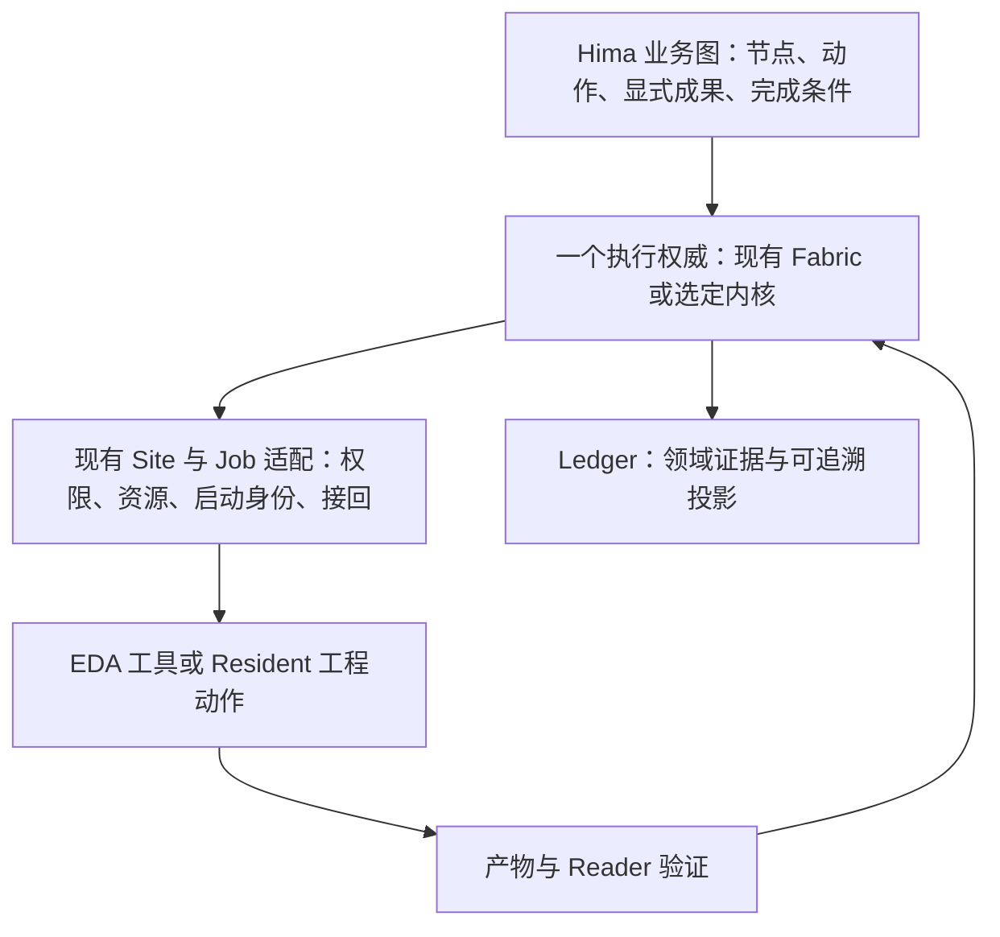

# Fabric 的开源基础：保留业务图，认真比较可恢复的执行内核

调研日期：2026-10-02（美国太平洋时间；来源查询跨至 UTC 10-03）。本项目产品基线：`77223febe236df94d4db4eb006b6c9e612c62206`；研究在 `future` 分支进行。本文是选型建议，没有安装候选、修改 Fabric、运行产品或 EDA，也没有批准架构迁移。

**有值得借用的基础，而且不必从头发明可靠工作流。但目前最值得验证的是两个不同方向：DBOS TypeScript 承担持久执行，LangGraph JS 承担显式图推进。它们应分别与现有 Fabric 比较，不应先叠成一套新平台。** 如果产品接受独立执行服务，Temporal 是重要对照；Restate 的单服务形态也很有吸引力，但其服务端是 BSL 源码可用许可，不能称为完整开源方案。

我的建议是：先明确“一个节点交付什么、何时算完成、下一节点消费哪份成果”，再用同一小段业务比较自研与一个候选。Hima 的“灵魂”应掌握在自己的业务契约中；框架承接恢复、等待、重放等通用机械工作。是否引入框架，要由删除了多少重复职责、减少了多少人工转抄和实际恢复结果来决定，不能由示例代码行数决定。

## 1. 需要借用的是哪一部分

当前问题有两层，换框架只能自动解决其中一部分。

业务层仍有隐含约定：Judge 第一条规则决定路由；Explore 从最近完成的 Judge、前两条规则和相应范围的最新 observation 中拼出决策输入。现有代码有 generation、branch 和 cites 校验，不能删掉这些保护；真正需要改变的是让**消费关系显式声明**。`endRun` 的成功路径依赖 Explore Decision，也说明“执行结束”与“业务目标达成”需要清楚分开。这些是当前源码的静态观察，不是本轮复现的运行故障。[Pack 规则](https://github.com/lluzi/hima_harness_reforge_polishing/blob/77223febe236df94d4db4eb006b6c9e612c62206/packages/harness/src/packs.ts#L897)、[证据选择](https://github.com/lluzi/hima_harness_reforge_polishing/blob/77223febe236df94d4db4eb006b6c9e612c62206/packages/harness/src/node-turns.ts#L1994)、[结束判定](https://github.com/lluzi/hima_harness_reforge_polishing/blob/77223febe236df94d4db4eb006b6c9e612c62206/packages/harness/src/fabric.ts#L1289)。

执行层则包含可复用的通用问题：已完成步骤的结果如何保存；重启后从哪里继续；怎样等待远端结果；并行分支怎样汇合；人工暂停与完成如何竞争；旧 Run 怎样在代码升级后继续。这是持久工作流和图执行库的价值所在。

图中是职责示意，不是批准的新模块。执行内核不获得业务选择权：owner 的决定与 Pack 已声明的自行推进区域，仍构成它可以调度的范围。一个 Resident 工程节点仍可承载完整研究过程，不必把内部每次工具调用展开成 Fabric 节点。DSH 继续承载业务 owner；纯确定的落账与路由由代码完成。若引入内核，应让它取代相应执行职责，避免 Fabric 与内核都能独立决定下一步。

## 2. 候选结论与当前版本

以下版本、发布记录与许可已核对官方仓库和具体组件。近期发布只证明仍在维护，不证明适合 Hima 或无恢复缺陷。完整固定 SHA、许可来源、资料冲突见 [持久执行证据](durable-evidence.md) 和 [图与状态机证据](embedded-evidence.md)。

| 候选 | 本轮核对版本 / 核心许可 | 最值得借用的能力 | 主要代价 | 本轮位置 |
|---|---|---|---|---|
| **DBOS TypeScript** | [release v5.2，09-29](https://github.com/dbos-inc/dbos-transact-ts/releases/tag/v5.2)；npm `@dbos-inc/dbos-sdk` 5.2.11（同 SHA）；MIT | 在现有 TS 进程中保存步骤结果、恢复流程、持久等待 | PostgreSQL；确定性步骤序列；旧版本执行器；多实例接管另有要求 | **持久执行的第一对照，前提是接受 PostgreSQL** |
| **LangGraph JS** | [1.4.18，09-25](https://github.com/langchain-ai/langgraphjs/tree/ec8cb378e3c7846b2a4aea31dfc4aff8f1cbf2fb)；MIT core | 图、条件边、循环、分支汇合、节点结果与路由、checkpoint | shared state/reducer 设计；checkpoint 与 Ledger 的边界；旧图兼容 | **业务图表达的第一对照** |
| **Temporal** | [server 1.32.0，09-11](https://github.com/temporalio/temporal/releases/tag/v1.32.0)、[TS 1.24.0，09-15](https://github.com/temporalio/sdk-typescript/releases/tag/v1.24.0)；MIT | 长流程、Activity、持久事件、异步完成、Worker 版本管理 | Service、数据库、Worker 的部署与运营；业务图仍需解释 | 接受独立执行服务时进入比较 |
| **Restate** | [server 1.7.13，10-01](https://github.com/restatedev/restate/releases/tag/v1.7.13) BSL 1.1；[TS 1.17.2](https://github.com/restatedev/sdk-typescript/releases/tag/v1.17.2) MIT | 单 binary 服务、持久 journal、按 key 串行状态、外部事件 | 服务端许可边界；常驻服务；旧 endpoint 与状态兼容 | 服务型备选，严格开源要求下排除服务端 |
| **XState** | [5.33.2，09-15](https://github.com/statelyai/xstate/tree/fbee62e7c1586315ed478c2fedf530d7e0ff5a3e)；MIT core | 节点内部状态、事件、合法转换、actor 生命周期 | 持久化由应用承担；snapshot 不是副作用日志 | 局部采用或借设计，不作完整可靠执行内核 |
| **Effect Workflow** | [Effect 4.0.0，10-01](https://github.com/Effect-TS/effect/tree/67ba4e46a11ccda0b6761578bfd22c04ae00167d)；MIT | typed Activity/Exit、持久 deferred、结构化并发 | Effect 编程体系与 SQL storage；当前 workflow API 标注 unstable | 借设计、观察成熟度，暂不列核心首选 |

另看了三个对照：**Dagster 1.13.25、Prefect 3.8.7、Argo Workflows 4.1.4**，其对应核心版本许可证均为 Apache-2.0。Dagster 的成果/依赖/版本模型很值得借鉴；Prefect 的 Python 编排、Argo 的 Kubernetes 容器编排会改变当前 TS Host 的接入与部署形态，所以本轮没有把它们作为优先替换方案。这是适配判断，不是能力优劣排名。[Dagster 发布](https://github.com/dagster-io/dagster/releases/tag/1.13.25)、[Prefect flows](https://docs.prefect.io/v3/concepts/flows)、[Argo 定位](https://github.com/argoproj/argo-workflows/blob/v4.1.4/docs/README.md)。

## 3. 最值得深入的方向

### DBOS：用持久步骤承担执行手续

DBOS 的吸引力是无需把现有 TS 程序迁出 Host：workflow 仍是代码，外部或非确定性动作包在 step 内，结果保存到 PostgreSQL，恢复时重跑流程代码并读回已保存的步骤结果。当前包要求 Node ≥20；最小形态是**Node 应用进程加 PostgreSQL**，不是纯文件内嵌库。无需 Conductor 也能在同 executor 身份重启后恢复；跨 executor 的自动故障探测/接管不能据此推定已有。可选的自托管 Conductor 是 proprietary 产品，需要许可。[TS guide](https://docs.dbos.dev/typescript/programming-guide)、[固定版恢复实现](https://github.com/dbos-inc/dbos-transact-ts/blob/3f36908f58fd8b3079cbf5372203c7a2d0ba06cc/src/dbos-executor.ts#L389)、[Conductor 部署](https://docs.dbos.dev/conductor/self-hosting/hosting-conductor)。

对 Hima，最有价值的窗口是：Reader 结果已作为 DBOS 步骤返回值被确认保存，进程却在路由前崩溃。若结果消费与路由是确定的，恢复可以继续，不必要求模型再做一轮机械确认。但 DBOS 按 workflow ID 与步骤调用序列识别结果，不会自动理解 nodeId、generation 或 Reader 来源；这些身份仍须明确绑定。两个异步步骤链交错会让序号不确定，复杂并行需要 child workflow 等明确结构。[Workflow 约束](https://docs.dbos.dev/typescript/tutorials/workflow-tutorial)、[升级](https://docs.dbos.dev/typescript/tutorials/upgrading-workflows)。

它最有力的反证也来自官方：step 可能至少执行一次，恢复期间还可能有 zombie executor；旧 owner 的 checkpoint 被拒不代表它之前发出的远端操作被撤销。因此不能用 `runStep(launchEDA)` 就删除 Hima 的启动身份、核对与 unknown。[并发执行边界](https://docs.dbos.dev/explanations/concurrent-executions)。**这里的推荐是接入形态最值得比较，不是已经证明维护量或故障率更低。**

即使部署可接受，若 DBOS 接入后仍要自写 Ledger/步骤日志对账、几乎删不掉现有恢复代码，它的优先级也应下降。

### LangGraph JS：借图推进，不必更换 Agent

LangGraph 的 node 和 edge 可以是普通函数，不要求采用 LangChain Agent 或更换 DSH。它提供条件路由、分支、循环、汇合，`Command` 可以同时表达状态更新与下一步。因此，它最接近“节点做业务动作、成果推动图前进”的方向。不过 shared state 也可能重新制造“取最后值”的隐含依赖，Hima 仍要显式指定生产者、执行身份及成果版本。[Graph API](https://docs.langchain.com/oss/javascript/langgraph/graph-api)。

实际可靠性取决于持久 checkpointer 和写入模式。内存 saver 不抗重启；同步 checkpoint 能缩小保存窗口，却不能把 EDA 与数据库变成一个事务。`interrupt()` 恢复会重新执行整个 node；把 `launchEDA()` 放在 interrupt 前仍可能再启动。任务级结果保存只能避免**已保存的任务**重做。[Checkpointers](https://docs.langchain.com/oss/javascript/langgraph/checkpointers)、[Interrupts](https://docs.langchain.com/oss/javascript/langgraph/interrupts)。

更大的升级问题是：resume 使用部署的最新图，并不会自动保留启动时的代码。暂停处节点改名、状态类型收紧，都可能破坏旧 Run。Hima 必须自己保留方法/运行实现版本，不能把 checkpoint 当不可变程序快照。[向后兼容](https://docs.langchain.com/oss/javascript/langgraph/backward-compatibility)。

如果 LangGraph 能够在保持一个执行提交权威的前提下，显著减少现有图推进与结果绑定代码，它可能比 DBOS 更直接解决 Fabric 的结构问题；如果仍要维护两套状态、两套恢复和大量转换器，就应只借设计。当前未验证其生产持久层、Hima 适配量与净收益。

### Temporal 与 Restate：服务能否换来更少的自研正确性工作

不能仅因“多一个服务”就排除已有持久执行引擎。若未来 Hima 要承载长时间、多 worker、多 Site 的 Run，持久消息、异步 Activity、旧版本执行和恢复运营可能比少一个进程更重要。

Temporal 能固定 Workflow 的 Worker Deployment Version，异步 Activity 可以让外部完成事件交回执行；其代价是保留旧 worker 与管理真正的生产 Service/数据库。开发用单 binary 不等于生产免运维。Activity 重试仍要求外部幂等或核对。[Worker Versioning](https://docs.temporal.io/production-deployment/worker-deployments/worker-versioning)、[异步完成](https://docs.temporal.io/develop/typescript/activities/asynchronous-activity)、[自托管](https://docs.temporal.io/self-hosted-guide)、[幂等边界](https://temporal.io/blog/idempotency-and-durable-execution)。

Restate 则提供单 binary 加持久磁盘的服务形态，官方明确允许在可容忍短停机的生产环境使用；无需外部数据库。按 key 的单写者状态与 journal 可以共同承载一个 Run 的控制。不过长时间独占 handler 会阻挡同 key 的控制请求，必须正确使用 workflow/shared handlers，而不是再建一套旁路控制。旧 invocation 固定旧 endpoint，也意味着升级时要保留旧实现。[自托管形态](https://docs.restate.dev/server/overview)、[外部事件](https://docs.restate.dev/develop/ts/external-events)、[版本](https://docs.restate.dev/services/versioning)。

Restate 服务端许可必须单独评估。当前 BSL 附加授权有允许和限制的托管形式，不能以 SDK 的 MIT 概括整套产品；本轮不对未来商业交付形态作法律结论。另外，1.7.13 刚修复多副本状态更新在 leader 切换后回退的问题；DBOS 5.2 也含恢复一致性修复。活跃维护值得肯定，但恢复承诺仍要用自己的故障样例验证。[固定版 LICENSE](https://github.com/restatedev/restate/blob/5ab87a6b5eabb70d5ba09738e281edc69b6ae10e/LICENSE)、[Restate 修复](https://github.com/restatedev/restate/releases/tag/v1.7.13)、[DBOS 修复](https://github.com/dbos-inc/dbos-transact-ts/releases/tag/v5.2)。

## 4. 三个不能被“可靠工作流”宣传省略的现场

下表是基于文档和源码的推演，**没有执行故障实验**。“已保存”指候选内核已确认保存对应步骤返回值或节点写入；只有产物文件或 Hima Ledger 记录已落盘，还不能推定内核知道它已完成。Promise 返回或内存中有结果也不满足该条件。

| 现场 | 候选能做什么 | Hima 必须定义的行为 |
|---|---|---|
| **A：EDA 已启动或改动已生效，结果记录前崩溃** | 未记录完成的 Activity/step/node 可能再执行；持久引擎无法凭日志知道外部到底发生了什么 | 先持久化启动意图与稳定 effect/Job 身份；重启核对原 Job。无可靠身份或查询依据时保留 unknown，不能盲目重发 |
| **B：成果已持久保存，提交路由前崩溃** | DBOS/Temporal/Restate 可重用结果并恢复确定性逻辑；LangGraph 已保存的节点写入/checkpoint 能避免相应重算 | 确定唯一的成果/路由提交权威；涉及 Ledger 的副作用用固定提交身份去重。避免两份日志各自判定下一步 |
| **C：人按暂停/取消，同时远端完成** | 引擎可记录事件和停止后续工作；取消常在 await、heartbeat 或 checkpoint 边界被处理 | 保存控制请求和真实完成两个事实。暂停阻止新 admission；迟到结果可入证据但不得清除 hold。取消请求不等于远端已停止 |

A 的限制有直接官方反例：Restate 文档展示数据库已更新但 journal 未记录时会重复更新；DBOS 说明并发/zombie steps；XState 则明说恢复会重启 invocation。不能把“完成的结果不会重算”扩大为“真实世界效果只会发生一次”。[Restate 数据库边界](https://docs.restate.dev/guides/databases)、[DBOS 并发](https://docs.dbos.dev/explanations/concurrent-executions)、[XState persistence](https://stately.ai/docs/persistence)。

C 也有容易忽略的例子：LangGraph drain 等在途步骤结束，并不取消在途 async；Temporal Activity 通过 heartbeat 感知取消；DBOS timeout signal 若被忽略，原函数仍可后台运行。这些都是适配器必须兑现的现实动作，不能以框架状态替代 native Job 的停止核对。[LangGraph drain](https://docs.langchain.com/oss/javascript/langgraph/fault-tolerance)、[Temporal 取消](https://docs.temporal.io/develop/typescript/workflows/cancellation)、[DBOS step reference](https://docs.dbos.dev/typescript/reference/workflows-steps)。

## 5. 值得立即借鉴的设计，以及不宜直接照搬的地方

- **显式成果传递**：下游消费某个执行的确定成果引用，包括输入/方法/Reader 版本，不靠“最后一次发生什么”。Dagster 的 asset lineage 很有启发，但自动 data version 是代码与输入版本的函数，非确定性输出可能不同却得到同版本，不能替代 Hima 对实际产物字节与来源的校验。[固定版资产版本文档](https://github.com/dagster-io/dagster/blob/1.13.25/docs/docs/guides/build/assets/asset-versioning-and-caching.md)。
- **技术完成与业务验收分开**：流程返回、进程退出、节点有输出、Reader 验证、Goal 达成是不同事实。Prefect 官方例子甚至允许子任务失败而 flow 正常返回 COMPLETED；这不是框架错误，而是业务组合必须显式负责。Hima 不能用通用引擎 SUCCESS 代替 Goal 判定。[Prefect 终态语义](https://docs.prefect.io/v3/concepts/flows#final-state-determination)。
- **节点内部可以有严密协议，节点外部只暴露业务动作与结果**：XState 可借来表达状态转换，避免模型转抄 epoch/receipt；但 snapshot 恢复跳过 actions、重启 invocations，不提供外部效果事务，不能用它替代现有 Ledger/Job 恢复。[XState persistence](https://stately.ai/docs/persistence)。
- **步骤身份与等待身份稳定，旧 Run 保留原语义**：Effect 的 typed Activity、持久 deferred token 值得借鉴。当前版本已是 `effect/workflow`，并有 SQL SingleRunner，可嵌入单进程；不能误称它必须部署独立集群。但源码仍标 unstable，采用还会带入 Effect 的运行与类型体系。本轮以设计参考为主。[Workflow 源码](https://github.com/Effect-TS/effect/blob/67ba4e46a11ccda0b6761578bfd22c04ae00167d/packages/effect/src/workflow/Workflow.ts)、[SingleRunner](https://github.com/Effect-TS/effect/blob/67ba4e46a11ccda0b6761578bfd22c04ae00167d/packages/effect/src/cluster/SingleRunner.ts)。

## 6. 三条可选路线与建议顺序

| 路线 | 适用前提 / 预期收益 | 成本转移与最强反对理由 | 继续或停止的依据 |
|---|---|---|---|
| **A：保留 Fabric，借机制加深现有接口** | 优先减少产品与部署扰动；显式成果/完成条件，将确定的手续收回代码 | 自己长期承担恢复/并发正确性；可能只是整理旧复杂性 | 继续：同业务所需机械确认和隐含状态减少。停止扩展：不断补通用调度/重放设施仍无法收敛 |
| **B：采用一个可嵌入内核** | 接受局部依赖/持久层变化；先选 DBOS 或 LangGraph 之一与 A 比较 | DBOS 需 Postgres且图解释仍在Hima；LangGraph需checkpointer与版本兼容；可能新增双日志 | 继续：三类故障窗口与旧 Run 升级均满足语义，能明确删除旧职责。停止：靠第二套控制状态修补，或改变Pack/Reader事实才能通过 |
| **C：执行职责交给独立服务** | 接受长期服务运营；复杂长Run/多worker使恢复能力更重要 | Temporal 的服务/版本运营；Restate 的服务许可/endpoint运营；迁移与退出成本 | 继续：恢复操作与维护负担的实测收益超过新增运维。停止：现有部署难支持，或业务正常流程变得更繁琐 |

**建议下一步是设计一个比较样例，而不是现在宣布选型。** 当前部署偏好的异步问题尚未得到回复，因此不能把“无数据库”或“可以加服务”当已定约束。接受 PostgreSQL 时优先 DBOS；若不接受，先比较 A 与 LangGraph 的本地持久方案，但官方对 SQLite saver 的本地/实验定位不能当作生产合格证明；若目标是集中式长流程平台，再把 Temporal 放到首轮。[LangGraph checkpointers](https://docs.langchain.com/oss/javascript/langgraph/checkpointers)。

无论哪条路线，全采用时只能有一个负责下一步调度与完成提交的权威。Ledger 保留领域证据；若成为投影，要定义固定 execution/commit 身份、幂等投影与恢复，不宣称跨存储原子。局部采用则只放进一个已有复杂 action 内部，父 Fabric 只看 Job handle 和交付，不复制内部步骤状态；这种局部方式也**不能**解决父 Fabric 的路由提交窗口。

## 7. 最小、可逆的验证提案

在 `future` 上先写清一个样例：`输入 → 异步工程动作 → Reader → 显式 Goal 判定`，外加一个两支异质成果汇合场景。与现有实现共用成果身份和验收条件，不调用真实 EDA、产品模型或线上 Site。

先作 A 的基线，再选 B 或 C 中**一个**候选。同一 fake Site 持久化 Job ID，支持按原身份 query/reconcile，并另设“非幂等且不可查询”的反例；这能分辨框架恢复与真实效果保证。

必须比较四组故障：上文三类窗口，以及旧 Run 等待期间升级代码、旧结果随后返回。记录重复 effect 数、纯路由自动恢复数、unknown 保留情况、hold 后非法 admission 数、迟到证据是否丢失、人工机械确认次数，以及维护了几套执行状态、新增哪些持久实体/进程/运维步骤。不预先许诺性能收益或虚构百分比门槛。

任何重复外部启动、绕过 hold、误把技术完成当 Goal、丢失来源或升级破坏旧 Run，都否决该接线。正确性满足后，才比较是否真正更简单；代码行数仅作补充。先只让新 Run 使用候选，旧 Run 保持原实现与恢复路径；不在运行中强迁移，保留报告/证据与稳定业务身份的导出。是否实施这一试验，留给下一次明确的开发切片。

## 8. 证据边界与研究停止点

本轮深入六个 TS 相关候选，另以三个数据/容器编排系统作对照；核查官方文档、具体 release、LICENSE 和关键恢复源码。没有测性能、运行故障注入或证明净维护收益，生产稳定性及 EDA 接回有效性仍须实际验证。

资料中的版本差异已保留：Temporal 取消默认值在教程/API页不一致，实施应显式配置；DBOS 最新文档的 cancelSignal 与固定 v5.2 支持范围未完全闭合，本文不以它作决定依据；Effect workflow 仍 unstable。来源失败和重定向有记录，未把404/TLS失败当能力不存在。

继续泛搜更多相似框架不太可能改变当前取舍。下一项能改变决策的证据，是部署约束和同一业务样例的比较。支撑材料包括 [研究问题与演进](research-contract.json)、[差距矩阵](gap-matrix.md)、[判断与反证](argument-cards.md)、来源台账及检索记录；最终核对见 [verification.json](verification.json)。
