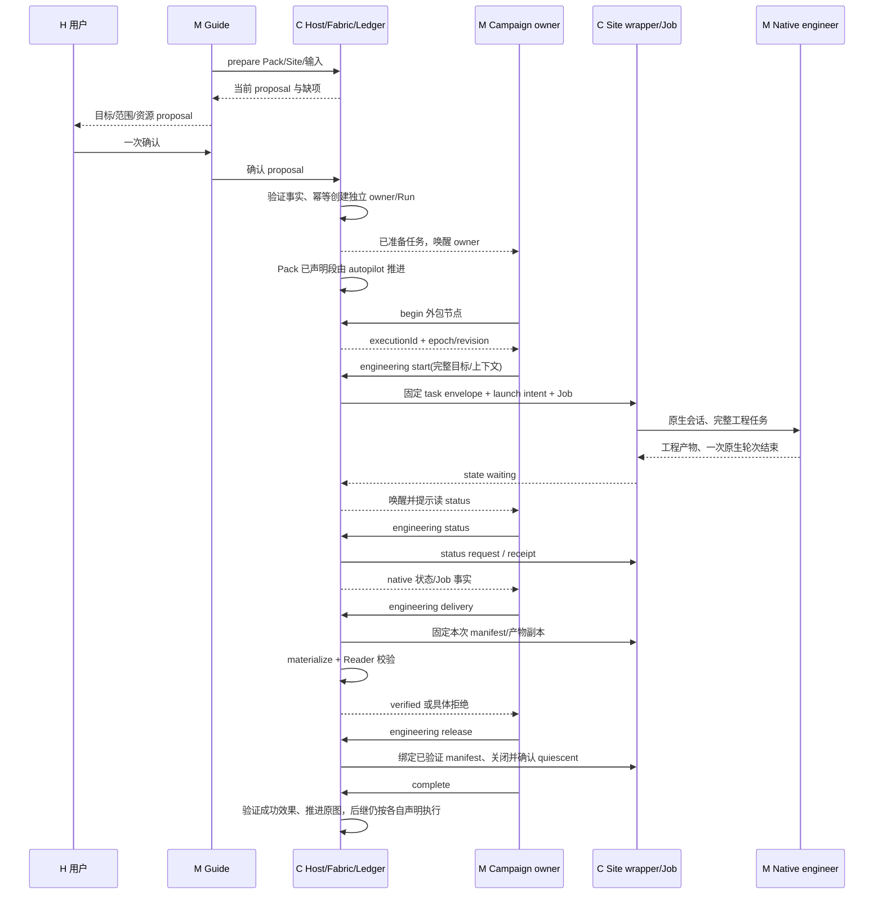
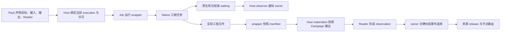
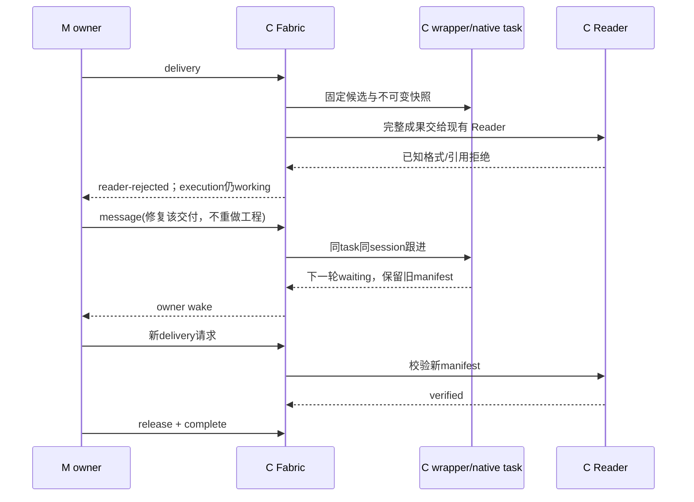
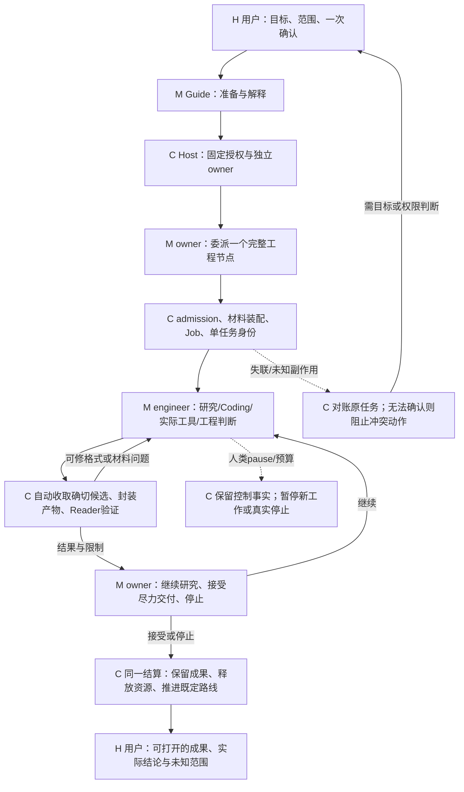

# Hima Harness 核心流程简洁性复核

评审：GPT-6 Astra / xhigh，独立上下文，单一主审；主会话核对实际开发基线、关键源码与实施依赖并归档。只读调查与设计提案；没有执行产品测试、构建、模型、GUI、SSH 或 EDA，没有修改产品、ADR、依赖或任何 Run。

## 判断先行

**用户的担忧有实证，但当前应简化的重心已经变了。** 旧版把节点轮转、Team 结果搬运和许多机械确认交给 owner 模型，确实使模型成为协议操作员。ADR-0016 已用自动推进消除大部分分支内往返；ADR-0017 又将 Fix Timing 的内部小团队换成一个完整 Resident Engineering Agent 任务。不能把这些已发生的改进再列为待实施建议。

在最新已提交实现中，主要残余复杂性是：**一个工程任务的完整生命周期还没有被封装成足够深的 Module。** 模型仍要操作 begin、start、status、delivery、release、complete 的顺序，理解不同层的完成含义，并为机械状态带上 epoch/revision/requestId。native executor 还负责准备本可由代码生成的交付清单/hash。Host、wrapper、Ledger 各自有必要事实，却把它们之间的同步责任泄露到模型和操作员。最近两次现场故障——原生轮次结束没有唤醒 owner，以及生产者拿不到消费者要求的完整交付格式——都发生在这个交接 Interface 上。[E2]、[E3]

我不建议减掉独立 Reader、文件完整性、单一 owner、真实停止或未知副作用隔离。那些检查保护可复现结果，删除后风险会转移给人。目标应是：**模型给完整任务、做必要的工程判断；代码收取、核验、记账、通知、释放；人只处理目标/权限变化和无法自行恢复的不确定性。** 正常路径缩短，异常路径更准确，不靠把所有状态叫作完成来显得简单。

“测试不顺”不能整体归因于架构官僚化。记录同时包含真实协议缺陷、测试自身错误、Pack 输出预算问题、实际工程负结果和交付范围漂移。现有证据足以支持有针对性的 Interface 加深，不足以支持重写 Harness、删除全部 gate，或承诺简化后一定提高 timing 修复效果。

## 1. 评审基线与证据等级

本轮只产出设计复核，不启动实施。归档核对见 [verification.json](verification.json)、[固定快照身份](review-snapshot.json) 和 [排除的在途工作](live-work-excluded.json)。上游背景另见 [DSH 变化调查](../2026-10-02-dsh-upstream-delta/report.zh-CN.md)，其范围不是本轮简洁性结论的替代。

主基线为 **`fa9ffcdc79aff0ac9e471c8d09df380bf0827d5c`，`codex/issue82-opencode-design`**。这是本轮冻结时核对的 Issue #82/#83 最新已提交产品源码，含 `a5fd4043` 的 resident owner wake 和 `fa9ffcdc` 的 delivery contract 修正。采用 Git 固定文本快照，未读取该活跃工作区的未提交修改作为当前实现。

起初指定的 `57b2058d` 仅在 `0626bba3` 产品源码上增加上游研究文档；其产品源码是旧 main。它用于演进对照，不能代表 resident 当前实现。调查中发现基线差异后已切换，不将旧版逐节点 owner 结论套在新版 autopilot 区域。

- **[S] 静态确认：** 在固定提交的源代码、接口与测试定义中直接可见；不等于本轮实跑。
- **[H] 历史实跑记录：** 仓库 assessment/ADR 中记录的现场与低层复现；注明原候选、修复状态及验证范围。本轮没有重新读取其外部 Home/远端原始日志。
- **[P] 提案/假设：** 对收益、简化方向或待构造反例的判断，尚未实施或运行。

引用的路径与行号除特别注明外全部指 `fa9ffcdc`。固定快照在 `.hima-tmp/simplicity-review/fa9ffcdc79af/`；这不是可运行 checkout。源代码链接可按附录的固定 GitHub 提交核对。

没有证明的范围：最新 dirty 改动（包括正在进行的artifact-access/report及相关client/index/remote工作，不在本报告重复派修）、当前运行 App 的实际部署字节、其他在途分支、通用生产负载的协议回合/耗时分布、简化后的模型成功率。本报告不重评 #83 的 timing 胜负，不把回合/时间追加为业务验收 gate。

## 2. 已发生的简化与仍必要的复杂性

| Module / Interface | 当前事实 | deletion test 与判断 |
| --- | --- | --- |
| `Autopilot` | Pack 声明区域内由代码驱动同一 Fabric 操作，分支并行，结果按既定规则收取/采纳，离区才交回 owner。[S1] | 删除后 owner 又要逐节点轮转；复杂性重回调用者。它已经赚回价值。保持旧 Pack 消费者，不为 resident 再复制一套内部 Team。 |
| Resident task Adapter | task-local OpenCode 承担完整工程工作，内部协作不映射为 Hima 的每个节点。[S2] | 删除后 Host 或 owner 必须重建原生会话、消息、权限、产物与进程管理。Module 本身必要；当前模型 Interface 仍偏浅。 |
| Ledger / Job / Channel | Ledger 存权威事实；Job 识别真实进程效果；Channel 区分读探测与可能有副作用的远程命令。[S3] | 删除会把幂等、证据身份、停止判断散落到每个调用者。保留。hash 和 receipt 数量本身不是过度设计证据。 |
| 两种权限 | DSH/原生 executor 的工具能力与 Site 的实际文件/执行范围保护不同对象。resident 已删除 broker/token/permission-kind 第二策略层。[E4] | 不能因统一 native allow-once 就删掉目录隔离、Site Permit。也不能重新推荐已删除的账户代理。 |
| Guide / owner / executor | Guide 长期交互；owner 决定 Campaign；executor 完成委派工程。独立会话是已确认需求。 | 三个角色不等于三个业务 controller。若 Guide 转发每个机械回执才会变成负担；目前主要主动通知阻塞/结束，方向合理。 |
| legacy `drive` / `moments` | 当前受控 Run 拒绝 separate model moment，历史自动路径受 legacy gate 限制。`moments.ts:523–531`。 | 看到旧实现不能断言生产存在第二执行主脑。退休旧兼容路径可以另议，不能为减少文件数破坏历史消费者。 |

**已有收益证据。** ADR-0016:13–15 引用两个历史 fork 窗口：T02 每分支运行 12%、等 owner 44%、等人 31%、Host 停顿 13%，owner 调用 103 次；T03 运行 15%、等 owner 30%、等人 54%，调用 114 次。这是特定旧场景的历史记录，足以解释为何删除逐节点轮转，不是新版的性能统计，也不是未来 timing 胜负标准。[E1]

## 3. 三条当前路径与一条必要反例

图中 H=人类判断，M=模型判断，C=代码机械步骤。当前的确认并非全部来自人：大量是模型与代码间的协议往返。

### 3.1 准备、一次确认、独立 owner、工程节点交付

准备不是缺少机制。`index.ts:startGuidedRun` 使用 proposal 事实和确定的独立 session，`guide-sessions.ts:91–168` 幂等创建/恢复 native root；`fabric.ts:startRunOnce` 重新检查 Pack/Site/输入并创建 workspace。重复检查分别覆盖提交前后事实漂移与唯一 Run，不应把它们一概当重复审批。准备投影与身份组装仍有重复，但本次没有证据支持把它排在 resident 交接之前。

**精确计数：[S]** `resident-engineering.host.test.ts:341–416` 的公开工具场景发出 7 次正常动作：begin、start、message、status、delivery、release、complete；另有非 owner 反例和重复请求检查，不计正常路径。message 是此测试刻意加入的真实业务跟进，不能归为无意义回合。去掉可选 message/status，单个已就绪工程节点的当前骨架仍需 **5 次**调用：begin→start→delivery→release→complete。不计 preparation、context 刷新、原生内部工具、Reader Job 或失败重试。它不是全 Campaign 实测。

其中真正的语义通常是两项：①这个节点要委派什么完整工程任务；②对眼前的结果是继续研究、接受尽力交付还是停止。begin 独立领取身份、status 文件往返、验证后单独 release 是机械部分。complete 在当前设计承担 owner 接受和图推进，可以保留其判断，内部完成资源收束。

**模型实际搬运什么。** 当前 `tools.ts:550–559` 要求每次传 run、expectedEpoch、expectedRevision、requestId、executionId；语义请求再带 goal/context/message。模型不生成 taskId、capability hash、task envelope hash 或远程启动 argv，代码已内部化这些细节，这点正确。native 初始 prompt 又带 task/run/execution/node/ownerEpoch/controlRevision（wrapper:675–692），但 native 并不应凭这些字段取得 Run 控制权。它目前还须提交每个产物的 path/kind/sha256，详见候选 C3。

### 3.2 节点/child 交接：不同完成事实必须分开，但不必让模型搬运

权威分工：原生 transcript 证明它说过/调用过什么；wrapper 证明任务接收与产物快照；Job/owned 文件证明进程状态；Reader/Judge 证明可接受数据与方法判断；owner 决定业务接受/继续。**原生轮次结束、消息已接收、文件完整、Reader 可接纳、Goal 达成、进程已停止是六种事实，不是六次都要模型批准的同一事实。**

消息的两次 ack 有必要：wrapper 先把同任务消息写入 `native/messages/<requestId>.queued.json` 并返回 accepted，后续原生 prompt 真正结束才写 input event/state；防止长轮次占死 owner，也防止把排队说成执行完成。wrapper:1095–1109、700–742；Host 测试:381–393。该 distinction 保留，原始 schema 不必让 Guide 再解释一遍。

在 autopilot 老消费者中，`#result` 已自动读取 native completed turn，`#team` 自动 adopt；因此旧版手工 `result→adopt` 往返不是当前所有节点的要求。仍需质疑的具体泄漏是 `autopilot.ts:265–269,579–588` 用拒绝文案正则决定 held/格式修复。业务判断不应依赖错误英语是否仍包含某几个词；见 C4。不要为修它再做全局错误 registry。

### 3.3 可恢复失败、修复、继续

这条“同任务 repair”现在已有正例测试，而非纸面承诺：`resident-engineering.host.test.ts:632–669` 保留第一次拒绝的 manifest/字节，修复后 sessionId 相同，新 manifest 不同，release 绑定最新已验证版本；本轮只读测试定义。[S4]

另一个恢复层仍不够深：`completeAdmittedNode` 把 admission、decision、route、execution completed 分多次持久化；中途崩溃会把一次已知本地记账变成 uncertain（`fabric.ts:3449–3485`）。`recovery.ts:232–273` 对非 Job 未完成动作保守停止；旧测试 `agent-recovery.host.test.ts:95–118` 明确保留此行为。这个保守拒绝在现有信息不足时是正确的；**可以质疑的是为何完整的本地提交意图没有留足，使代码只能把恢复责任交还人。** 不能仅凭旧 Job exit0 就自动完成；须先使本地结算可幂等对账，见 C4。

### 3.4 反例：Host 掉线、wrapper 丢失、未知副作用

当前 `recovery.ts:206–229` 对 resident 单独恢复：wrapper Job 还活着就观察同一任务，丢失则保持 unknown，不按普通 tool exit 当业务完成。`reconcileEngineeringTask` 验证 Site、capability、task envelope 原身份，调用固定 cleanup Job，核对 PID-start/进程组/容器及 owned.quiescent，不重发工程 prompt（`engineering-executor.ts:391–448`）。

必须保留的反例：ECO 已执行但 Host 没收到 ack，此时简单重发 start/message 可能做第二次修改；仅看到 tmux 消失也不能说子进程已停止。正确结果可以是 unknown，并禁止冲突工作。已有 `resident-engineering.host.test.ts:675–880` 覆盖 wrapper crash、缺 owner identity、pre-receipt crash；这类测试提供真实 Leverage。

暂停也不能被“自动结算”冲掉：已开始的 Job 可继续形成事实，收取结果可以发生；任何受影响的新工程工作、图后继、人的 hold 清除仍不得发生。owner handoff 后，迟到旧命令必须继续被 epoch 拒绝。内部化字段绝不能变成“每次取最新 revision 让旧命令过门”。

## 4. 具体失败与它们能说明什么

| 证据 | 确认根因 | 当前状态 | 可支持/不能支持的结论 |
| --- | --- | --- | --- |
| [E2] #83 native waiting 两次，owner 静默 | wrapper 进程存活与 native turn-end 是不同事件；start/recovery 没附正确 observer | `a5fd4043` 已修；记录32/32低层、无新GUI | 支持交接生命周期的 Interface 有遗漏；不能说 fa9ff 仍无 wake，也不能把本地通过说成用户旅程已通过。 |
| [E3] #83 两个 delivery candidate 被拒，操作员提供隐藏格式 | prompt advisory keys 与 wrapper 实际严格 schema 不一致，错误只说 invalid delivery candidate | `fa9ffcdc` 已使 schema/prompt 共源并具体报错；记录28/28 Python、20/20 Host；尚未部署/实模 | 支持生产者/消费者契约泄漏，反对让模型猜格式；不是应删 artifact identity/Reader 的理由。 |
| [E4] #82 native 有 result 与60个checkpoint文件，Campaign Reader拒绝 | Host 只接回 result JSON，未接支持树 | `76eeba8c`修；后续0.3.1通过复用真实保留产物的native接回资格，零新XTop | 这是完整交付的必要检查抓到了真缺件。应内部化收集/物化，不能删除树校验；原 frozen live FAIL仍FAIL。 |
| [E5] #83 Rediscover 被挡 | 正常既有Permit有33个wrapper，transport schema只准16个 | `f0102d4a`变有限64，20/20公开Host；无权限扩大 | 有界限制也必须覆盖有效正例，不能把硬上限本身叫安全。它是接口不相容，不是工程研究失败。 |
| [E6] #82全local 778例、3失败 | 旧测试把transport close当typed finalizer；两例误以为created立即等于native registry同步发布 | 三文件17/17修后，原整套仍保留失败；未重新冒称全PASS | 测试会复制旧协议假设而变脆。应改断言seam，不删除独立验证。 |
| 旧 [H] 09-27 Researcher max_tokens | native output达到5000，后来的deadline是后果 | 当时Pack有局部修正；非本轮实跑 | 不是延长wall-time或删gate能直接修复。报告`docs/assessment/2026-09-27/atcs-researcher-budget-fix.md:3–30`。 |

旧 `run-c0d9e672` 的 stdout-only falsely done、上游 retry/downstream pause 互锁、idle owner未唤醒，见09-28评审:40–51。当前 `node-turns.ts:settleWorkshopFinished` 与 continuation通知已有针对性修正；用作演进证据，不列为仍未修的当前缺陷。

## 5. 四个按价值排序的简化候选

本节按目标收益排序，不是实施先后；保守实施顺序见第9节，先验证局部读接口与恢复，再合并完整生命周期。

### C1. 把完整工程任务的机械收束收进现有 Module

**要删的负担。** owner 选择完整任务之后，不再单独理解 begin 的领取步骤；对确切成果作出接受后，不再另做 release 再 complete。将这些机械步骤留在 `Fabric/engineering-executor` 内，沿现有 Job/Reader/graph 执行。仍允许同任务工程跟进，仍将策略选择和尽力结束交给模型。[P]

最小目标 Interface 是“委派这个已声明节点，附目标/context”与“基于这个确切候选继续/接受/停止”。不要求新增工具名、task数据库或通用controller，可先在现有 `engineering` action 内形成深操作，旧分步接口作为兼容/internal seam。自动收取候选和执行Reader可由已有observer衔接；**不能把每个 native waiting 当完成**。只有候选实际存在、原生没有在写、版本固定才验证；没有候选的 waiting 仍是 owner 判断/问答。

- **实际消费者：** owning Agent、公开Host/GUI调用；旧autopilot与native Team无需同时迁移。模型继续接到实际缺项与工程结果。
- **最小不变量：** 唯一owner与原授权；start一次；固定method/input/epoch；候选版本精确；验证后才释放；已释放才允许需要无冲突的后继；Goal不由工程完成冒充。
- **deletion test：** 删掉模型侧 begin/release choreography，代码须仍能给出同样的单Job、完整证据、同一route与停止事实。若要模型补传生命周期字段才能恢复，Module尚未加深。
- **收益机制：** 正常节点从5步骨架减少到2个语义提交；这是目标接口推演，不是实测延迟承诺。减少“少做最后一步导致一直挂着”的故障面。
- **风险：** owner还想在已验证候选上继续研究时不能提前释放；暂停期间不得由自动完成启动后继；reader-rejected必须留同session修复。新深操作自身也必须断点可恢复，否则只是把长协议包进一次更脆的调用。
- **推翻它的反例：** 某个受支持Pack明确要求在Reader通过后、release前人工检查活工具状态或追加测量。该消费者需要保留显式停点；若普遍存在，就不能默认自动release。
- **ADR：** 需定点修订ADR-0017及spec D3的显式lifecycle责任；不重开单owner/Site/证据权威，不默认扩大autopilot区域。

### C2. 状态读取应成为真正的观察 Interface，不制造控制请求

当前 `engineering status` 会持久化新的request、提高control revision、向wrapper写status文件、等receipt；wrapper丢失时还会启动cleanup Job。工具描述却称point-in-time read。代码上可证，不能说只是命名风格（`fabric.ts:2833–2892,2926–2952`）。收束孤儿进程有价值，但让“查看状态”隐含这个动作，使调用者必须学到远超读操作的ordering和failure modes。[S]

- **删除/内部化：** 正常读取不写request/receipt、不推进业务control revision、不占整Run变更队列等待5秒receipt；从已有task-bound state与Job事实形成投影。必要事实采集可以记真实事实，但不得因读就制造业务intent。失联cleanup由现有recovery/明确stop路径负责，状态明确呈现它的结果。
- **消费者：** owner等待、Guide/GUI只读呈现、recovery。复用 `readEngineeringState`、Job查询与project访问检查；不新建缓存权威。
- **不变量：** 当前scope/项目访问验证；失联不是gone；native receipt与实际completion区别保留；读不会清hold；清理仍需精确owned identity。
- **deletion test：** 删除wrapper的status request/receipt正常往返，所有状态与未知解释仍能由已有权威事实回答；若有仅经status RPC才可验证的新事实，须明确保留那个probe，而不是所有读都当变更。
- **收益：** 消除纯查看导致的revision churn、等待和模型字段搬运；减少状态轮询与控制争用。现有action在 `controlling` 内做Site I/O，故也应确认读不会延迟紧急pause/cancel；延迟影响尚未实测。
- **风险/反例：** 直接读旧state.json可能掩盖wrapper失联；返回应带来源/as-of/Job状态及unknown，不能称文件存在就代表live。若去掉隐式cleanup后孤儿永不收束，则候选失败，必须保留代码的故障收束责任。
- **最小切片建议：** 若只做一个切片，先做正常live-task status的无mutation投影；lost-wrapper cleanup暂不改变，明确区分其动作语义。这是局部试点，只能声明正常live路径不再制造控制请求，不能声明整个status已经纯读。临时混合契约不是最终设计：后续须把故障收束落实到既有recovery/明确stop路径并验证不会遗留孤儿，status最终只投影其事实。

### C3. 让交付 Adapter 生成机器清单，让模型选择工程内容

`DELIVERY_CANDIDATE_SCHEMA` 与prompt已经共源，这是已完成修正，不再重复建议。仍有可删负担：native必须列出全部支持文件并填每个sha256；wrapper随后逐个重算、复制、再算，Host又验证（wrapper:37–55,675–692,791–848）。这些复核保护不同传输阶段；**模型提供hash不是其中必要独立验证者**。[S/P]

建议先把“hash填写”从model candidate移到wrapper，再考虑在Pack已约束的artifactPrefix内，让native声明一个明确结果文件和选中的支持目录，由Adapter进行有界遍历生成不可变manifest。模型保留outcome、summary、stopReason、选择哪组工程成果；实际产物内容与Pack Reader不变。不要扫描整个私有home，不把auth、缓存或无关实验自动交付。

- **消费者：** 任何outsourcing Pack、native engineer、Host materializer；不是ATCS字段特判。
- **不变量：** manifest绑定当前task/execution；plain file/no-follow、路径隔离、确定文件集合、快照不可变、support tree完整、source/copy hash一致、Reader真实接纳。选择结果与机械枚举分清。
- **deletion test：** 删除candidate中模型填写的sha256（以及未来可确定生成的文件枚举），仍能生成相同内容身份并拒绝篡改/缺件/越界；删掉校验让一切通过不算简化。
- **收益：** 60-file checkpoint不再要求工程Agent自己维护二级传输契约；隐藏格式/重复转录更少，错误更接近具体成果。
- **风险：** 自动目录展开可能把秘密/无关文件带入成果；symlink、硬链接、写入竞态、不可接受大文件仍需现有防护。该提案不代表当前hash产生方式已测出大量失败。
- **推翻反例：** Pack的交付集合只能由领域判断逐文件选取。保留显式文件选择，但仍由代码生成hash；不必为了统一而新增通用artifact registry。
- **ADR：** 通用candidate/wrapper contract的版本与兼容须说明；不变更Pack测量或Goal语义。

### C4. 让本地可确定的结算可恢复，保留真正未知的远端效果

当前unknown承担两类不同问题：①远端命令可能已生效，绝不能重发；②Reader/文件检查已有具体失败，或本地记录路由只写了一半。第二类若也只能“inspect并找人”，Interface只会拒绝，没有充分的成功恢复路径。`actOnEngineering`对多种异常统一写uncertain（fabric:3022–3026）；`complete`与recovery的多写中断也如此。[S]

物化层已经有可复用的幂等基础：`materializeEngineeringResult:488–535`先全量preflight、同hash支持文件跳过、不同bytes拒绝覆盖、落地后重hash；不能说复制器完全没有恢复能力。问题在外层是否保留可重入的已知结算意图，以及如何区分实际未知与已知拒绝。

先选一个便宜场景：**已验证交付的本地节点结算在持久化中断后恢复**。复用现有request/receipt，持久化足够的规范化本地意图及确切输入/候选引用，然后按同一request检查已经写下的decision/route，补足缺失部分一次。不能从当前最新版输入重算原决定，也不能重跑工程Job。若底层现成原子更新足以涵盖所需事实优先用它；否则做这个局部幂等结算，不新建workflow引擎。

- **消费者：** owner普通complete、autopilot、resident验证后complete、Host恢复。
- **不变量：** 已提交事实不丢；局部提交最多一次；旧epoch不新发业务；人为pause保留；外部效果unknown不转换为可重试；证据/Job/预算不重复计入。
- **deletion test：** 删除“本地记录中断就必须模型/人手动拼接状态”的操作流程，重启能给一个可验证的最终局部结果；复杂性集中在原Module，调用者不用懂哪个write先落地。
- **收益：** 已完成工程成果与Reader观察被保留，故障从最近安全位置继续，减少重新Campaign/重新封板的诱因。
- **风险：** 没有原决定完整payload时，hash不足以重建决定；旧记录继续unknown，不能伪造迁移。跨fork/growth/Explore扩展前须分别证明最小case，不能一口气实现万能replayer。
- **推翻反例：** 丢失部分包含无法证明的外部mutation或原意图本就没持久化；仍然unknown，不做重试。
- **同类小问题：** autopilot用错误英语regex决定恢复/held（autopilot:265–269,579–588）。在相应返回Interface提供最小机器可辨结果，文案只解释；只改实际消费者，不造全局分类平台。

## 6. 最小可靠流程提案

这是目标Interface，不是另一套产品状态机。已有Ledger/Run/Job/native session继续存在；图中“收取/结算”应落在现有Fabric与Adapter职责内。正常路径不需要人工逐节点签收，也不需要Hima重建OpenCode内部团队。异常的两种问法必须清楚：有具体修复办法则交同executor；不能证明副作用/权限则明确受阻，不能自动放行。

身份内部化须谨慎：已有owner session、node execution与原请求身份足够时由Host绑定，模型只传语义与必要目标引用；没有证明前继续使用现有版本字段。**绝不可在执行旧语义命令时自动套用最新epoch/revision。** 更少字段应靠更强绑定获得，而不是放弃竞态检查。

## 7. gate / ack 判定表

| gate或ack | 判定 | 保护的不变量 / 有效成功路径 |
| --- | --- | --- |
| 人的一次proposal确认 | 保留；准备事实自动组装 | 有效Pack/Site/输入/资源生成可确认proposal；同一proposal仅一个Run，漂移清楚拒绝。不是每个节点再授权。 |
| owner/epoch、方法/输入身份 | 保留检查，优先内部化传递 | 当前绑定合法动作可成功；handoff前旧命令必须失败，不能自动刷新身份。 |
| 整Run revision用于纯status | 从正常读取删除 | 同scope可反复读，不制造control intent；当前真实状态可读、失联为unknown。变更仍用应有版本/前置条件。 |
| launch/message intent与receipt | 保留内部 | 原请求只派发一次；重试返回同回执。未派发可新请求，已可能派发不重发。 |
| queued ack 与完成事实 | 保留区分、内部投影 | 先确认排队、后报告实际完成；owner/Guide不用搬运原始文件或“确认已确认”。 |
| begin + start | 对外可合并 | 一个明确委派一次admission；先持久身份再launch，at-cap不产生phantom task。 |
| delivery manifest与content hash | 保留物理检查，代码生成机械字段 | 真实文件→固定快照→hash→materialize→Reader。缺支持树拒绝；修补成果而不是重复工程。 |
| Reader接纳 | 保留 | 正例实际有效文件PASS；格式/缺件具体拒绝并允许同任务repair；不是模型自证。 |
| owner采纳 vs Reader通过 | 语义可保留，不必逐机械确认 | owner可以选择继续或尽力结束；自动区域按已接受Pack规则采纳，不硬加reviewer。 |
| release + complete | 确切成果被接受后可合并为代码收束 | 绑定已验证manifest，保留文件、确认quiescent、路由一次；失败显示未收束，不能假成功。 |
| human pause / explicit wait | 保留 | 原scope人类clearance后恢复；收取已有事实不清pause，不自动重开新工作。 |
| missing PID/CID/未知副作用 | 保留硬阻塞 | 精确owned事实与实际观察可确认stop；不可确认则unknown，拒绝冲突工作。 |
| JSON层级/严格字段 | 只保留实际consumer所需；不以形式完美挡业务 | producer收到与validator一致的contract；错误可操作。已有fa9ff改进；不以放宽任意JSON掩盖身份/含义问题。 |
| 每个Team都需Reviewer/owner多重adopt | 按消费者；不普遍加 | autopilot当前已按schema自动采纳；旧手工业务保留其批准点。Resident内部团队不重复编排。 |
| schema合法就业务成功 | 不成立 | schema只代表结构可接纳；Reader、实际测量、Goal分别判定，best-effort可以有效交付且Goal false。 |
| Reader/包装失败重建整Campaign | 可删除的默认习惯 | 同身份、同任务repair并复用已验证成果。权威方法/输入实际变了再换候选，旧结果不被冒用。 |
| 全部失败一律unknown | 收窄到真正未知效果 | 已知拒绝可以修复；local结算能幂等对账才自动补足；信息不足继续unknown。 |
| 全量build/GUI/EDA/多轮review | 按需升级 | 一次最小主张的正例+关键反例通过，再跑直接影响回归；昂贵层只补低层无法证明内容。 |
| “少节点/少测试/少文件=可靠” | 删除这种验收口径 | 必须保持用户结果、控制和证据正确，再看调用者需要知道什么、失败是否可恢复。 |

## 8. 最小验证设计：不运行、不新增治理系统

使用现有 `resident-engineering.host.test.ts` 的生产wrapper+确定性native fixture，经真实注册的 `hima_execute`，以结果和副作用为断言。只替换外部模型/EDA，不复制Fabric/Ledger。保留当前普通路径为对照；既有模块测试改为验证更深Interface，旧协议的数值revision/调用序列不要永久成为产品要求。以下按切片选择：第一步只证明live-task读的局部增量；完整生命周期与全状态纯读是后续收口目标，不作为前面切片已完成的声明。

| 最小场景 | 要看到什么才继续 | 否决信号 |
| --- | --- | --- |
| 完整生命周期合并后的正常工程交付 | 在局部结算恢复已证明后，同一个task/Job、相同Reader事实、相同成果字节、同一后继、已确认释放；owner只做委派和成果选择 | 少了动作却缺交付/资源未释放，或把Goal false改成true |
| 局部试点：已确认live-task连续读status并插入pause | 正常live路径的读不新增控制请求、不推进revision；pause可靠落账，原Job事实仍可观察；lost-wrapper保持原清理语义并单独报告 | 正常live读取触发控制动作，或把陈旧state冒充live；把该局部通过宣传为整个status纯读 |
| 最终收口：lost-wrapper状态读取与清理分离 | 所有status都只投影事实；既有recovery/明确stop负责同任务cleanup，确认stop或保持unknown，孤儿仍被可靠收束 | 读又暗中启动cleanup，或移除该副作用后孤儿永不收束 |
| 格式修复，工程结果未变 | 同session、原manifest保留、新候选可通过，工程Job不重复 | 为summary/schema错误重开Run/EDA或覆盖旧artifact |
| 延迟命令遇handoff/输入revision | 旧请求继续拒绝，合法新owner操作可成功 | Adapter自动取最新epoch/revision使旧命令合法 |
| 注入本地结算write断点后冷Host | 从原意图补足一次；无新工程prompt/Job；预算/decision不重复 | 原意图缺失仍推测完成，或重放外部效果 |
| wrapper死但native/容器存活；缺owned identity | 同任务cleanup能确认则stop；不能确认则unknown且阻止冲突 | tmux消失就释放，或创建第二executor |
| 支持树/文件集合反例 | nested支持文件可打开、hash相同；symlink、篡改、越界、超范围枚举被拒 | 自动封装把auth/缓存加入交付，或不完整树仍PASS |
| 多轮native waiting/repair | unchanged状态不重复唤醒，后续真实轮次仍唤醒；pause不丢 | 根据单个delivered状态提前退observer，修复后永远静默 |

低层若通过，只对实际改变的native prompt/包装协议做一项小型当前模型资格；可复用保留工程产物，无需重跑timing。界面或真实操作链改变再用既有一次GUI acceptance。原#83修复效果证据与这组Interface验收分别报告，既不降低其质量目标，也不增加效率比赛。

当前测试的主要教训不是“测得太多”，而是**测试入口有时不等于消费者入口**：直接Host对象绕过native spill，直接Python函数传Path绕过CLI字符串，registry同步假设绕过实际native发布。修复方向是复用真实公开seam、使用保留的输入/失败，删除重复协议实现。一次有成本理由的全组回归可以合理；反复重跑未变商业链不能证明新增Interface。

## 9. 后续切片建议与职责

第5节是收益优先级，下表是依赖与风险决定的实施先后。只推荐先启动第一条，待反证结果再决定后续，不将本报告变成新的准入手册。

| 顺序 | 切片 | 既有所有权 / 必要讨论 |
| --- | --- | --- |
| 1 · C2局部试点 | 正常live-task status变为无控制mutation的观察；lost-wrapper cleanup保持原行为 | `fabric.ts:actOnEngineering`、`engineering-executor.ts:readEngineeringState`、`tools.ts`及现有公开Host test；单一集成者拥有fabric/tools。仅声明live路径结果，不声明整个status纯读。 |
| 2 · C3最小增量 | model candidate不填hash，wrapper生成同一文件选择的manifest | Site wrapper/现有engineering contract和Host consumer；保持Reader/Permit，说明协议兼容。此步不自动展开支持目录，目录展开另按证据决定。 |
| 3 · C4恢复前提 | 一个已验证交付的local completion断点可恢复 | Fabric/recovery/Ledger既有receipt；证明局部结算一次且无工程重跑。可能需补ADR恢复语义，先不做全局迁移；错误文案判断仅改直接相关consumer。 |
| 4 · C1与C2最终收口 | 在第3步证明后合并完整委派及确切成果接受的机械步骤；完成status观察与lost-wrapper收束分离 | 同一Fabric/Adapter，定点修订ADR-0017 D3；内部begin/start及release/complete，故障cleanup由既有recovery/明确stop负责。验证所有status不暗中启动cleanup且孤儿仍可收束后，才声明全状态纯读；不迁移全部旧Pack。 |

开发流程单独减负：既有单写者、明确候选、独立操作与一次复核保留；短baton是有用上下文，不必再加报告/签收层。`codex-claude-coordination.md:54–59` 的“只执行frontier.next”应解释为一个连贯可验收任务，不是每个子步骤都向上升级；同文:73–75 已将例行fix/review/publication留给团队。历史范围漂移的问题先用现有Issue的当前主张和changed-surface规则处理，不建设流程监控平台。本轮没有baton往返耗时数据，不能定量宣判DRI/DL/FL本身无用。

## 10. 引用索引与审阅限制

所有源码链接固定于 `fa9ffcdc79aff0ac9e471c8d09df380bf0827d5c`，不是动态main。

- **S1** [autopilot.ts](https://github.com/lluzi/hima_harness_reforge_polishing/blob/fa9ffcdc79aff0ac9e471c8d09df380bf0827d5c/packages/harness/src/autopilot.ts#L173)：173–195并行/段推进；204–251交回；474–477自动adopt；579–595native结果与修复；265–269、585–588文案regex。
- **S2** [engineering-executor.ts](https://github.com/lluzi/hima_harness_reforge_polishing/blob/fa9ffcdc79aff0ac9e471c8d09df380bf0827d5c/packages/harness/src/engineering-executor.ts#L197)：197–239任务材料；267–312固定文件/launch；326–359状态/receipt/delivery；391–448cleanup；470–535完整support物化。
- **S3** [jobs.ts](https://github.com/lluzi/hima_harness_reforge_polishing/blob/fa9ffcdc79aff0ac9e471c8d09df380bf0827d5c/packages/harness/src/jobs.ts#L290)：290–329先intent后派发；631–640观察真实exit；[channel.ts](https://github.com/lluzi/hima_harness_reforge_polishing/blob/fa9ffcdc79aff0ac9e471c8d09df380bf0827d5c/packages/harness/src/channel.ts#L421)：421–447仅readonly probe可安全重试。
- **S4** [resident-engineering.host.test.ts](https://github.com/lluzi/hima_harness_reforge_polishing/blob/fa9ffcdc79aff0ac9e471c8d09df380bf0827d5c/test/contract/resident-engineering.host.test.ts#L341)：341–416正常样例；632–669同task修复；708–750保留verified成果的crash cleanup；815–880缺身份/丢receipt反例。
- **S5** [fabric.ts](https://github.com/lluzi/hima_harness_reforge_polishing/blob/fa9ffcdc79aff0ac9e471c8d09df380bf0827d5c/packages/harness/src/fabric.ts#L2121)：2121–2169 admission/owner/revision；2762–3026 resident生命周期；3167–3208 observer；3384–3488完成；[recovery.ts](https://github.com/lluzi/hima_harness_reforge_polishing/blob/fa9ffcdc79aff0ac9e471c8d09df380bf0827d5c/packages/harness/src/recovery.ts#L187)：187–281恢复。
- **S6** [resident-engineering-wrapper.py](https://github.com/lluzi/hima_harness_reforge_polishing/blob/fa9ffcdc79aff0ac9e471c8d09df380bf0827d5c/sites/linglong-atcs28/templates/resident-engineering-wrapper.py#L675)：37–78 candidate schema；675–698 actual prompt；700–742同session prompt；791–848快照；1086–1160ack/停止/释放。
- **E1** [ADR-0016](https://github.com/lluzi/hima_harness_reforge_polishing/blob/fa9ffcdc79aff0ac9e471c8d09df380bf0827d5c/docs/adr/0016-fork-branches-drive-themselves.md#L13)：旧运行等待量、已接受自动化。数值来自该历史记录，本轮未重算。
- **E2** [issue83-owner-wake](https://github.com/lluzi/hima_harness_reforge_polishing/blob/fa9ffcdc79aff0ac9e471c8d09df380bf0827d5c/docs/assessment/2026-10-02/issue83-owner-wake/README.md#L3)：3–10现场根因；14–29修正；39–54局部验证与未新GUI。
- **E3** [issue83-delivery-contract](https://github.com/lluzi/hima_harness_reforge_polishing/blob/fa9ffcdc79aff0ac9e471c8d09df380bf0827d5c/docs/assessment/2026-10-02/issue83-delivery-contract/README.md#L3)：3–16失败/修正；18–28验证与未部署范围。
- **E4** [issue82-resident](https://github.com/lluzi/hima_harness_reforge_polishing/blob/fa9ffcdc79aff0ac9e471c8d09df380bf0827d5c/docs/assessment/2026-10-02/issue82-resident/README.md#L21)：21–41 frozen失败与已删broker；43–71后续0.3.1接回资格覆盖旧未部署叙述；不能混作新timing实验。
- **E5** [issue83-discovery](https://github.com/lluzi/hima_harness_reforge_polishing/blob/fa9ffcdc79aff0ac9e471c8d09df380bf0827d5c/docs/assessment/2026-10-02/issue83-discovery/README.md) 与 [Issue83现场comment](https://github.com/lluzi/hima_harness_reforge_polishing/issues/83#issuecomment-5964037729)。
- **E6** [issue82-resident测试缺陷](https://github.com/lluzi/hima_harness_reforge_polishing/blob/fa9ffcdc79aff0ac9e471c8d09df380bf0827d5c/docs/assessment/2026-10-02/issue82-resident/README.md#L111)：111–130原整组结果与测试假设修正。

本轮没有读或依赖旧Hima Phase4的记忆作为当前产品 authority；相关memory快速检索指向另一仓库，已排除。本轮结论只使用上述固定当前源码、当前产品决定、历史证据及明确标注的推断。更短的外部Interface是提案，可靠性与收益仍须由列明的反例推翻或支持。

[S1]: https://github.com/lluzi/hima_harness_reforge_polishing/blob/fa9ffcdc79aff0ac9e471c8d09df380bf0827d5c/packages/harness/src/autopilot.ts#L173
[S2]: https://github.com/lluzi/hima_harness_reforge_polishing/blob/fa9ffcdc79aff0ac9e471c8d09df380bf0827d5c/packages/harness/src/engineering-executor.ts#L197
[S3]: https://github.com/lluzi/hima_harness_reforge_polishing/blob/fa9ffcdc79aff0ac9e471c8d09df380bf0827d5c/packages/harness/src/jobs.ts#L290
[S4]: https://github.com/lluzi/hima_harness_reforge_polishing/blob/fa9ffcdc79aff0ac9e471c8d09df380bf0827d5c/test/contract/resident-engineering.host.test.ts#L341
[S5]: https://github.com/lluzi/hima_harness_reforge_polishing/blob/fa9ffcdc79aff0ac9e471c8d09df380bf0827d5c/packages/harness/src/fabric.ts#L2121
[S6]: https://github.com/lluzi/hima_harness_reforge_polishing/blob/fa9ffcdc79aff0ac9e471c8d09df380bf0827d5c/sites/linglong-atcs28/templates/resident-engineering-wrapper.py#L675
[E1]: https://github.com/lluzi/hima_harness_reforge_polishing/blob/fa9ffcdc79aff0ac9e471c8d09df380bf0827d5c/docs/adr/0016-fork-branches-drive-themselves.md#L13
[E2]: https://github.com/lluzi/hima_harness_reforge_polishing/blob/fa9ffcdc79aff0ac9e471c8d09df380bf0827d5c/docs/assessment/2026-10-02/issue83-owner-wake/README.md#L3
[E3]: https://github.com/lluzi/hima_harness_reforge_polishing/blob/fa9ffcdc79aff0ac9e471c8d09df380bf0827d5c/docs/assessment/2026-10-02/issue83-delivery-contract/README.md#L3
[E4]: https://github.com/lluzi/hima_harness_reforge_polishing/blob/fa9ffcdc79aff0ac9e471c8d09df380bf0827d5c/docs/assessment/2026-10-02/issue82-resident/README.md#L21
[E5]: https://github.com/lluzi/hima_harness_reforge_polishing/blob/fa9ffcdc79aff0ac9e471c8d09df380bf0827d5c/docs/assessment/2026-10-02/issue83-discovery/README.md
[E6]: https://github.com/lluzi/hima_harness_reforge_polishing/blob/fa9ffcdc79aff0ac9e471c8d09df380bf0827d5c/docs/assessment/2026-10-02/issue82-resident/README.md#L111
