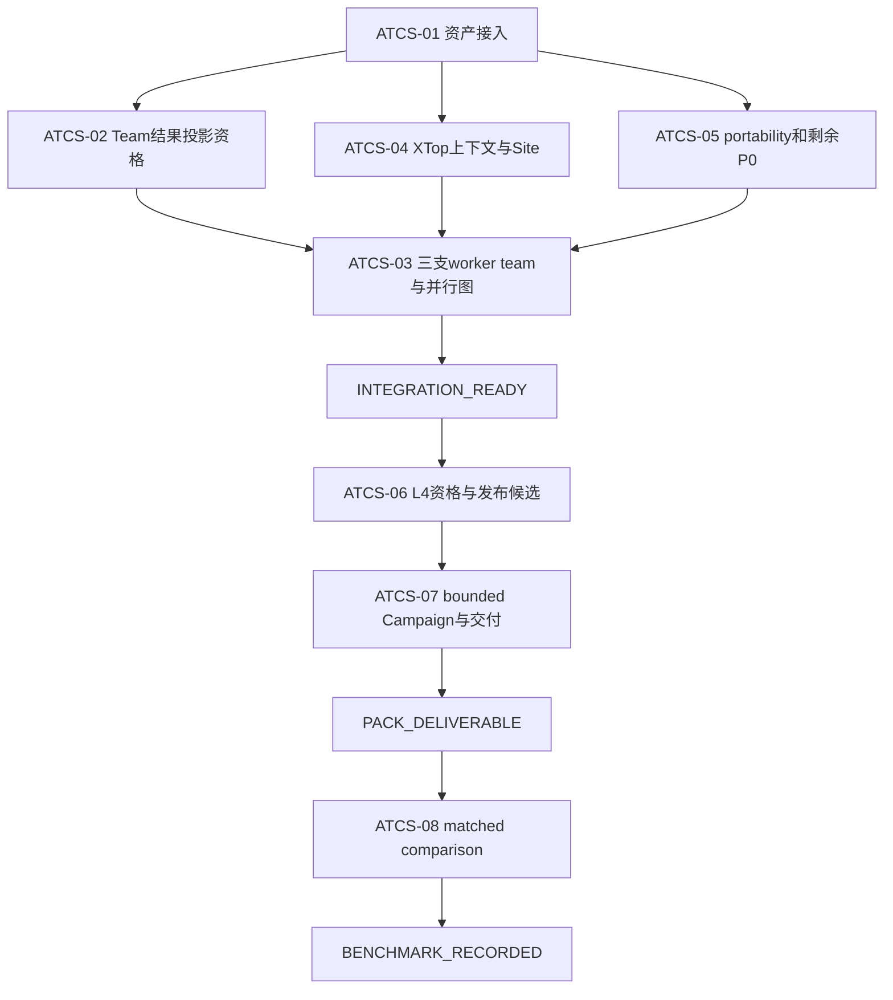

# ATCS 完善、Agent Team 集成与可交付 Pack 规格

状态：ready-for-agent

日期：2026-09-27

跟踪 Issue：[#63](https://github.com/lluzi/hima_harness_reforge_polishing/issues/63)

开发基线：`main@226e33a833d22e2e72b2bb2448a8d4192d3ac65a`

来源分支：`claude/himapack-development-c56369@a9b2e8812baac73b8a6f5e0eb861e67e15b85270`

## 任务

将 Claude Code 开发的 `agentic-timing-closure-system`（ATCS）迁入当前 HimaHarness，完成 Pack
原生 Agent Team 集成、真实工具资格、bounded Campaign、seal/release/App 交付，并在交付后用同一
Harness 对普通 `xtop-timing-closure` 方法做一次 matched comparison。

ATCS 的业务方法保持为：把当前 setup/hold 残余分成多个有界工作包，由独立研究者在私有
workspace 形成真实 ECO Contribution，语义合并后只做一次联合 Innovus/StarRC/PrimeTime 刷新，
再依据同一候选的完整证据决定 adoption、经验记录和下一步。它不是把一个人工 flow 交给 Agent
线性重复执行，也不是并行跑多条完整 P&R 后择优。

本规格由一个新 Agent 作为主集成者执行。实现可使用有明确文件所有权的 worker，但共享 Runtime
接线、Pack `contract.yml`/`graph.yml` 和发布身份始终只有一个写入者。

## 先读

按顺序读取：

1. 根 `AGENTS.md`、`docs/product-definition.md`、`docs/testing-strategy.md`、
   `docs/agents/polishing-discipline.md`、`docs/agents/model-policy.md`；
2. 本目录 [contracts.md](contracts.md)；
3. 来源分支的：
   - `docs/package-development/agentic-timing-closure-system/README.md`；
   - `packs/agentic-timing-closure-system/{INTENT,SPEC,FABRIC}.md`；
   - `docs/package-development/agentic-timing-closure-system/DEVELOPMENT_HISTORY.md`；
4. 当前 `main` 的 `packs/xtop-timing-closure/knowledge/agent-team.md`、
   `contract.yml` 中 `agentTeams`，以及 `packages/harness/src/{packs,index,delegation,delegation-runtime}.ts`。

来源分支是待集成资产，不是新的 Runtime authority。`main` 当前实现和本规格优先。

## 已证明的起点

- 来源 Pack 是 `agentic-timing-closure-system@0.1.0`，stage 为 `compiled`；没有 `TEST.md` 或
  `VERSION.yml`，没有真实 EDA Campaign，不能称为发布版。
- 资产规模约 123 个文件、3.2 万行；参考图 106 nodes / 143 edges。
- 来源分支 Python suite：810 PASS，13 skipped。
- 将来源 Pack/Site/test 叠加到当前 Harness 后，`loadPack`、`checkPack`、local Site、
  `linglong-atcs28` fit 和 Pack contract 已在 2026-09-27 的只读兼容探针中通过。
- 当前主要未闭合项是 FABRIC G1、G23、G33、G34：worker 串行、真实 Operator 未资格、
  scenario 名称写死、worker XTop 缺少合格 timing/placement 上下文。
- 历史 B_lazy Run 只提供背景证据；它缺少同口径 human time、完整物理分母和 endpoint lineage，
  不能直接作为新的收益对照。

## 固定架构

- Package 拥有 timing-closure 方法、工作包、Contribution、组合/adoption、经验和结束语义。
- Runtime 拥有 execution、child session、预算、身份、权限、Ledger、结果采用和最终化。
- Site 拥有路径、工具版本、wrapper、license、容量、Permit 和管理员 binding。
- Campaign Agent 是唯一 Run owner。Researcher、Reviewer、Operator 都是可打开 transcript 的业务
  Subagent，不取得第二份 Run 所有权。
- Agent Team recipe 是 Pack 方法数据。owner 显式 materialize、读取、采用和完成节点；不增加自动
  Team scheduler、第二图执行器、后台 daemon 或 ATCS 专用 Runtime 分支。
- 当前 `xtop-timing-closure` Pack、历史 Runs、`tmp/`、
  `/Users/lluzi/code/hima_harness_reforge_claude` 和 `/Users/lluzi/code/himaharness` 保持不变。

只有 [ATCS-02](ATCS-02-team-result-projection.md) 的最低层反例证明现有 delegation 接口不能把已采用
child result 安全交给 Pack 工具时，才允许在现有 delegation 模块内增加通用结果投影。其余业务行为
全部留在 Pack。

## 里程碑

### M1 — `INTEGRATION_READY`

ATCS 已迁入当前 `main`，使用 Pack-declared Agent Teams，三条 worker 分支可以在无 EDA 的 Host
fixture 中独立 materialize、采用、恢复和 join。Pack Python、contract、Host、seam 和 boundary 测试
通过。M1 不生成 TEST/VERSION，不作真实工具或 QoR 声明。

### M2 — `PACK_DELIVERABLE`

ATCS 的 PT、StarRC、Innovus、XTop 最小真实资格通过；一个 bounded post-route Campaign 从输入走到
Contribution、composition、一次联合物理刷新、evaluation、adoption/experience 或诚实 blocker；
Pack 通过 native TEST、seal、release，App 含精确 Pack/Site/Permit/binding 身份。

M2 只证明 Pack 可安装、可运行、可恢复、证据一致。Setup/hold 是否 clean、是否快于普通流程、
工程师时间或 ROI 都不是 M2 门。

### M3 — `BENCHMARK_RECORDED`

在同一 Harness/App、输入 checkpoint、Site、模型、工具版本和预算下，分别运行冻结的普通
`xtop-timing-closure` control 和 ATCS treatment，形成同口径结果。只有 M3 可以陈述该 SWERV28
场景内的时间、物理刷新或 timing-frontier 差异；一次结果不外推成普遍收益。

## 工作图

ATCS-02、ATCS-04、ATCS-05 可在 ATCS-01 后并行，但文件所有权不同。ATCS-03 是 Pack
`contract.yml`/`graph.yml` 的唯一集成点。真实 EDA 只在 M1 后启动。

## 任务索引

| 任务 | 结果 | 主要代码范围 | 最低门 |
| --- | --- | --- | --- |
| [ATCS-01](ATCS-01-import.md) | 来源资产在当前 main 上可构建 | `packs/agentic-timing-closure-system/**`、Site、contract test | L0/L2 |
| [ATCS-02](ATCS-02-team-result-projection.md) | 已采用 child result 可安全交给 Pack | 现有 delegation/packs/index 接口及 Host tests | L0/L2 |
| [ATCS-03](ATCS-03-agent-teams-and-parallel-graph.md) | 三支 Pack Team、资源感知 worker fork/join | ATCS contract/graph/readers/rules/team knowledge | L1/L2 |
| [ATCS-04](ATCS-04-xtop-context-and-site.md) | worker/replay 具有合格 XTop 上下文 | ATCS templates、adapter、Site wrapper/Permit | L0/L2，后续 L4 |
| [ATCS-05](ATCS-05-portability-and-correctness.md) | scenario 动态化和剩余 release blocker 关闭 | ATCS core/adapters/verification/refresh | L0/L2 |
| [ATCS-06](ATCS-06-qualification-and-release-candidate.md) | 工具资格、binding、候选身份 | qualification scripts/docs、Site admin、packaging | L4 |
| [ATCS-07](ATCS-07-bounded-campaign-and-delivery.md) | 一个 GUI 可见 Campaign 和正式 Pack/App | TEST/release/App/manual/report | L3/L5 |
| [ATCS-08](ATCS-08-matched-comparison.md) | same-oracle control/treatment 记录 | benchmark charter/audit/report | 两个 bounded L5 |

## 执行纪律

每个任务执行 `READ → DEFINE → REPRODUCE → ROOT CAUSE → IMPLEMENT → VERIFY → DOCUMENT`：

1. 先固定任务起始 SHA、拥有文件、预期/实际差异和最低失败测试；
2. 一次修改只关闭一个可观察缺口；
3. 先运行任务文件里的最低门，再按依赖升级；
4. 失败时保留原 evidence，回到最低可复现 seam，不用完整 Campaign 调试 parser、schema 或路径；
5. 每次 commit 立即 push，并核对远端 SHA；
6. 每个任务更新状态、证据、未测范围和下一任务输入；
7. `tmp/`、历史 Campaign workspace、客户/PDK内容不纳入提交。

## 全局停止条件

- 出现输入身份、权限、候选/报告同源性或工具结果真实性不明时，停止 adoption，保留 blocker。
- XTop/QuaLib 许可证互斥：ATCS 使用 XTop 时记录 `empyrean-license status`，切到 `old`；本规格不
  使用 QuaLib，不在同一阶段运行或切到 `new`。
- 真实 Job 的前置 L0/L2 未通过时，不启动商业工具。
- changed Pack/wrapper/binding/App bytes 必须产生新的精确 identity，旧资格不能继承。
- M2 通过后才运行 matched comparison；M3 负结果不撤销 M2 的可交付事实。

## 完成

总规格完成需同时留下：

1. M1、M2、M3 各自的固定 commit、Pack/App/Site/binding/Run 身份；
2. 每级测试的 PASS/FAIL/SKIP 和原始证据路径；
3. ATCS 的正式 `TEST.md`、native `VERSION.yml`、安装/回滚说明；
4. control/treatment 的同口径结果和明确 claim limits；
5. 没有开放的 P0 correctness、permission、identity、duplicate-effect 或 recovery 缺陷。
