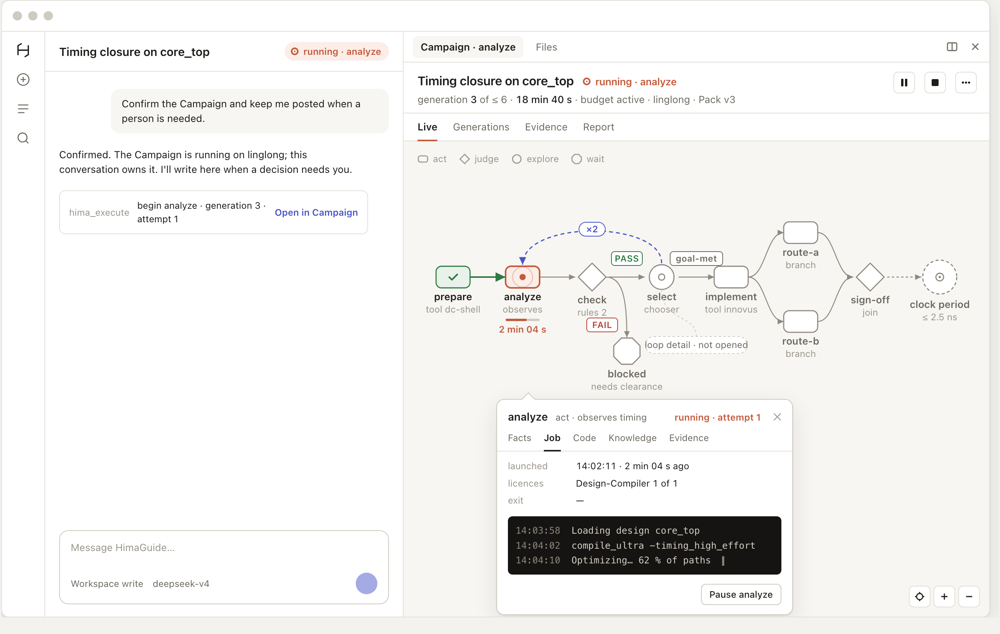
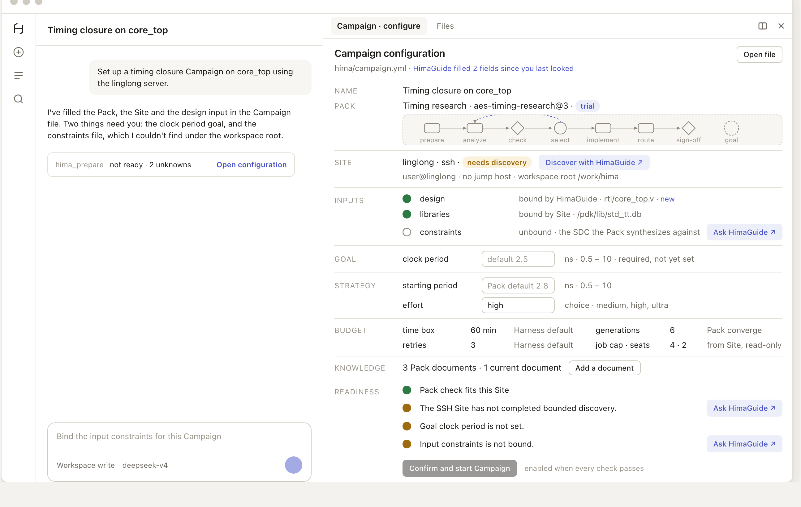
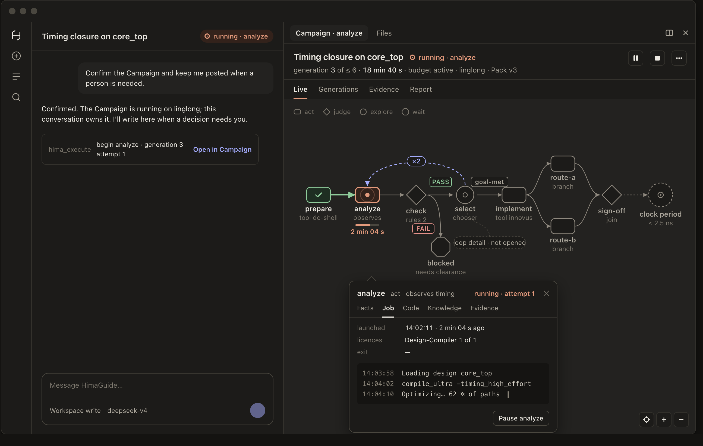
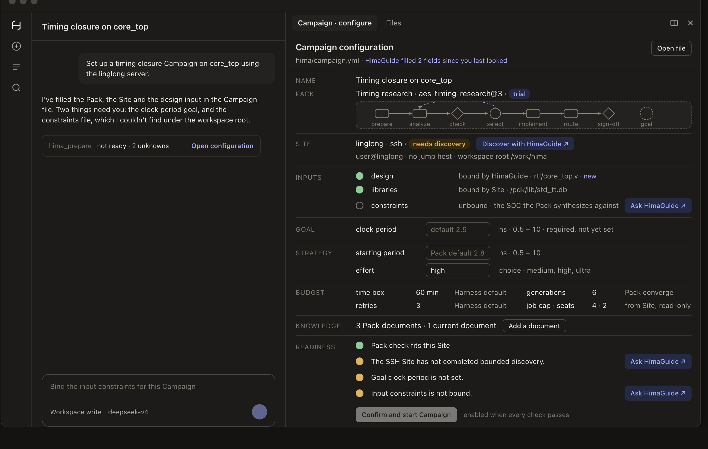

# Campaign Workspace UI

Status: ready-for-agent. Design authored 2026-09-15 against working tree `939770c`, within [Product Upgrade v2](../product-upgrade-v2/spec.md) and its fixed architecture. Product decisions come from the [upgrade interview](../../product-upgrade-interview.md) (Q47, Q48, Q49, Q63, Q74) and ADR-0008 through ADR-0011. This spec describes the target behaviour of the Campaign workspace; it does not claim any of it is implemented.

## Key references

| Reference | What it shows |
| --- | --- |
| [Interactive mockup (artifact)](https://claude.ai/artifact/7LZWs1qokcfTZrvkshNhx2) | Both frames at 1280 × 800 with a light/dark toggle. Source: [mockup/hima-campaign-mockup.html](mockup/hima-campaign-mockup.html). |
|  | Live view, running, generation 3, node card open on the running act node. |
|  | Configuration page, no Run yet, two fields filled by HimaGuide, readiness not met. |
|  | The same Live view in the dark theme. |
|  | The same Configuration page in the dark theme. |
| [Legacy Live Run redesign brief](/Users/lluzi/code/himaharness/docs/phase3/design/hima-live-run-redesign-brief.md) | Read-only reference the user named as the visual standard: three trust surfaces, state as shape and colour, a sealed ending. |
| [UI-02 unified workspace](../../assessment/2026-09-11/unified-ui/README.md) | The current layout's origin and its known defects. |

Example values in the mockup (`core_top`, `linglong`, `aes-timing-research`, `clock period`) are illustrative. Every form in the mockup belongs to HimaFabric; every word belongs to a Pack.

## Problem Statement

A chip design engineer who has installed a HimaPack and connected a Site cannot see their Campaign as a Campaign. The right-hand pane is a Run debugger: the only navigation is a dropdown of Pack ids with clock times and hash tails, the footer centres the Run id, and the owning session's UUID with epoch and revision is printed as body text. The Live view stacks nine sections at equal weight, so the run graph, a hash-prefix archive and a JSON node inspector compete for the same attention, and the three questions the engineer actually has — where are we, do you need me, what did we learn — are never answered on the primary surface.

The run graph itself is drawn in the Pack's terms rather than HimaFabric's. Node kind is a subtitle; outcome-labelled edges, the revisit edge that opens each generation, drill-down loops, forks and joins, growth graphs and revisions have no distinct form. A person watching a long EDA Campaign cannot see its progress unfold.

Starting a Campaign is a step-by-step form: two dropdowns, a proposal block and a confirm button, with the Host silently defaulting to the first Pack and the first Site. The interview decided that HimaGuide proposes and the user confirms once (Q47), and that Preparation carries no management object (Q63). Sites have no product surface at all: discovery and saving exist as functions but no tool, route or command reaches them. Ownership is invisible inside the conversation, so a Side Talk has no way to tell it is not the owner except a full-width button inside the pane.

The shipped visual system contradicts the one the user endorsed. The legible token sheet with a 14 px floor lives on a server-rendered page nobody navigates to, while the pane people use goes down to 9 px, uses unicode characters as icons, and carries seventy-four inline styles. Runtime-verified facts, the Agent's live claims and raw tool output share one texture.

## Solution

The conversation is the product and the HimaFabric canvas is the Campaign's face. The Live view becomes the run graph and nothing else, drawn in HimaFabric's own vocabulary so that every Pack renders the same way: four node forms for the four node kinds, outcome chips on edges, one dashed revisit arc carrying the generation count, forks fanning into labelled branch rows that meet at their join, drill-down loops as nested frames, accepted growth as attached frames, applied revisions as marks. State is shape plus colour. The route lights as it is traversed; only what is live moves. A Goal roundel at the far right carries the goal in the Pack's words and becomes the seal when the Run ends. Every fact a node owns is reached by hovering or clicking that node; a node card anchored to the node holds Facts, Job, Code, Knowledge and Evidence for an act, Rules and Verdicts for a judge, Decision, Strategy and Generations for an explore, Blocker and Clearance for a wait.

Campaign identity moves to where the shell puts identity: a Campaign chip in the owning conversation's session header and a dynamic dock tab title. Run id, owner session, epoch, revision and meters move to a Diagnostics sheet reached from the tab menu.

Preparation becomes a document, not a flow. One human-readable Campaign file in the session workspace is the unified configuration. The Configuration page renders that file with every section visible and editable in place: name and Pack, Site, inputs, goal, strategy, budget, knowledge and readiness. HimaGuide fills the same file with its ordinary file tools; the page shows which fields it changed. Any unbound input or unknown carries an "Ask HimaGuide" affordance that drafts a sentence into the composer for the person to send. One confirm button, enabled only when HimaFabric's own readiness check passes, creates the Campaign, and the page becomes the canvas. Site discovery gains its first product surface so HimaGuide can act on the Site section.

One token sheet with a 12 px floor, a 4 px rhythm, an inline SVG glyph set and three distinct trust surfaces applies to everything Hima renders, in both themes.

## User Stories

1. As a chip design engineer, I want the Live view to be the run graph and nothing else, so that I see the whole Campaign at a glance.
2. As a chip design engineer, I want each HimaFabric node kind to have one fixed form, so that any Pack reads the same way.
3. As a chip design engineer, I want outcome-labelled edges to carry PASS, FAIL and UNDETERMINED chips, so that I see how the judge routed the Run.
4. As a chip design engineer, I want the revisit edge drawn as a distinct arc with a generation count, so that I see the research loop turning.
5. As a chip design engineer, I want a fork to fan into labelled branch rows that meet at their join, so that parallel work is legible.
6. As a chip design engineer, I want a drill-down loop shown as a nested frame under its explore node, so that I know where the Run went deeper.
7. As a chip design engineer, I want accepted growth drawn as a frame attached at its parent node, so that added research is distinct from the reference method.
8. As a chip design engineer, I want applied revisions marked on changed and affected nodes, so that I know which records were invalidated.
9. As a chip design engineer, I want the reference graph shown hollow before execution, so that I understand what the Pack can do.
10. As a chip design engineer, I want each of HimaFabric's node states to have its own glyph, so that waiting for a licence seat is visibly different from running.
11. As a chip design engineer, I want a node that was reconciled after a Host restart to say so, so that recovery is honest.
12. As a chip design engineer, I want a done node that once waited for a slot to keep a small mark, so that a slow Site remains visible afterwards.
13. As a chip design engineer, I want traversed edges to light once as their source finishes, so that progress unfolds in front of me.
14. As a chip design engineer, I want only the running node to pulse and only its elapsed figure to tick, so that motion always means something is live.
15. As a chip design engineer, I want the last line of the live Job log under the running node, so that I can see the tool working without opening anything.
16. As a chip design engineer, I want a Goal roundel that shows the goal in the Pack's words and becomes the seal when the Run ends, so that the ending has ceremony.
17. As a chip design engineer, I want the seal to state why the Run ended, so that a budget exhaustion is never mistaken for a result.
18. As a chip design engineer, I want a canvas that fits the whole graph to width on open and then follows the running node, so that I never hunt for the current position.
19. As a chip design engineer, I want wheel zoom, drag pan and pinch zoom with locate and zoom controls, so that a fifty-node graph remains navigable.
20. As a chip design engineer, I want node labels to hide below sixty percent zoom while frame labels stay, so that the overview never becomes noise.
21. As a chip design engineer, I want hovering a node to show its id, kind, state and one caption, so that I can scan without clicking.
22. As a chip design engineer, I want clicking a node to open one card anchored to it, so that detail never clutters the canvas.
23. As a chip design engineer, I want an act node's card to show resolved inputs and the latest observation values with units, so that I can read what it measured.
24. As a chip design engineer, I want a node card's Job tab to fold the Job event stream into launched, finished, exit and licences, so that I do not read raw records.
25. As a chip design engineer, I want the live Job log to stream inside the running node's card on dark glass, so that raw output is unmistakably raw.
26. As a chip design engineer, I want research code rows in a node card to open in the Files tab, so that review stays in the workspace.
27. As a chip design engineer, I want a judge node's card to list its rules in order and its verdicts with the values as read, so that a FAIL is explainable.
28. As a chip design engineer, I want an explore node's card to show its decision, the current strategy in the Pack's words and its generation history, so that I understand why the loop turned.
29. As a chip design engineer, I want a wait node's card to show the blocker and who cleared it, so that human clearance is recorded and visible.
30. As a chip design engineer, I want every absent fact in a card stated as a sentence, so that I never see an empty tab or a JSON dump.
31. As a chip design engineer, I want a one-line masthead with the Campaign name, run status seal, current node, generation, elapsed and budget standing, so that the state is readable without the graph.
32. As a chip design engineer, I want Run id, owner session, epoch, revision and meters in a Diagnostics sheet reached from the tab menu, so that they never occupy the primary surface.
33. As a chip design engineer, I want a waiting Run to badge the stopped node and draw one strip across the top of the canvas with the full blocker sentence, so that attention is impossible to miss and never truncated.
34. As a chip design engineer, I want the attention strip to link to the Campaign Agent, so that I can return to the owning conversation in one step.
35. As a chip design engineer, I want the closing reserve, exhausted time box or spent attempt limit shown in the same strip in neutral, so that a fenced Run explains itself.
36. As a Campaign Agent user, I want a Campaign chip in the owning conversation's session header, so that the conversation announces what it owns.
37. As a Campaign Agent user, I want the chip to badge when the Run is waiting, so that I notice from the conversation.
38. As a Side Talk user, I want no Campaign chip in my session header, so that a non-owner conversation is not mistaken for the owner.
39. As a Side Talk user, I want the Campaign tab to say who owns the Run and offer one way there, so that navigation never claims control.
40. As a Side Talk user, I want human-origin emergency Pause and Stop under a confirmed overflow, so that I can halt a runaway Campaign without becoming its owner.
41. As a Side Talk user, I want Continue hidden, so that a non-owner cannot clear a blocker.
42. As a Campaign Agent user, I want node-scoped Pause and Continue in the node card footer, so that I can hold one node without stopping the Run.
43. As a chip design engineer, I want closing the tab, switching sessions or reloading to leave the Campaign untouched, so that navigation is not control.
44. As a chip design engineer, I want each control to confirm with its consequence sentence, so that I know Jobs already running will continue.
45. As a chip design engineer, I want the Campaign tab to reopen with my Run after a reload, so that the workspace does not collapse.
46. As a chip design engineer, I want the dock tab title to carry the current node while running and "configure" before a Run exists, so that the tab strip tells me the state.
47. As a chip design engineer, I want a stale read to keep the last snapshot, stop motion and show one banner line with the read time, so that a lost connection cannot masquerade as a live Run.
48. As a chip design engineer, I want a Generations view in place of Experiments, so that the unit I see matches HimaFabric's unit of research.
49. As a chip design engineer, I want the Evidence and Report views kept and restyled, so that review does not lose anything the pane already shows.
50. As a chip design engineer, I want a single Campaign file in the session workspace to be the whole configuration, so that there is one truth to read and edit.
51. As a chip design engineer, I want every section of the configuration visible at once and editable in place, so that I am never walked through dropdowns step by step.
52. As a chip design engineer, I want the Pack section to show title, id, version and author status, so that I know exactly what method I am confirming.
53. As a chip design engineer, I want the Pack's reference graph shown in miniature on the Configuration page, so that I see the method before I confirm.
54. As a chip design engineer, I want the Site section to show readiness and capacity, or an SSH destination and hints when no Site is saved, so that an empty installation has a real entry point.
55. As a chip design engineer, I want "Discover with HimaGuide" on a Site that needs discovery, so that HimaGuide does the Site work.
56. As a chip design engineer, I want one row per declared input with its description, bound value and state, so that I see what is missing.
57. As a chip design engineer, I want an unbound input to carry "Ask HimaGuide", so that I hand the gap to the Agent rather than fill a form.
58. As a chip design engineer, I want the goal shown with label, unit, range and precision from the Pack's words, so that I enter a real number in real units.
59. As a chip design engineer, I want a goal never filled in silently from a default, so that the Campaign runs toward my number.
60. As a chip design engineer, I want strategy knobs shown with their kind, unit, range or options, and to leave them empty for the Pack default, so that advanced parameters are optional.
61. As a chip design engineer, I want each budget value shown with its source, so that I know whether it came from my file, the Pack or the Harness default.
62. As a chip design engineer, I want job cap and licence seats shown read-only from Site capacity, so that I do not mistake them for my settings.
63. As a chip design engineer, I want to add a document as current knowledge from the Configuration page, so that I do not switch to another system.
64. As a chip design engineer, I want the readiness section computed live from Preparation, so that the page reflects the Host's own check.
65. As a chip design engineer, I want each unknown listed as one sentence with "Ask HimaGuide", so that every blocker has a next step.
66. As a chip design engineer, I want one confirm button enabled only when readiness passes, so that a Campaign is created once and correctly.
67. As a chip design engineer, I want confirming to turn the page into the canvas without switching views, so that the same graph fills in from where I left it.
68. As a chip design engineer, I want HimaGuide's edits to the Campaign file to appear on the page with a mark, so that hand-off is visible.
69. As a chip design engineer, I want "Ask HimaGuide" to place a draft in my composer rather than send it, so that nothing is sent on my behalf.
70. As a chip design engineer, I want a change to Pack bytes, Site file, permit, goal, strategy or inputs to mark readiness stale, so that an old check cannot start work.
71. As a chip design engineer, I want the Configuration page to be the entry point when no Pack or Site exists, so that an empty installation is not a dead end.
72. As a Pack Owner, I want Packs, Sites and current knowledge listed in a HimaHarness settings section, so that inventory and owner operations have a home outside the Campaign.
73. As a Pack Owner, I want installing from a folder to use the native folder picker, so that I never type an absolute path.
74. As a Pack Owner, I want the transfer review to be a table with a confirm, so that I never read JSON.
75. As a Site user, I want to rediscover a stale Site from settings, so that changed Site facts are refreshed on purpose.
76. As a user, I want nothing Hima renders below 12 px and nothing I read below 13 px, so that the product's own information is not typeset at caption size.
77. As a user, I want verified facts, live Agent work and raw tool output on three distinct surfaces, so that I can tell what the Runtime verified without reading.
78. As a user, I want state encoded as shape and colour together, so that the canvas is legible without colour vision.
79. As a user, I want both themes designed with equal care from one token set, so that dark mode is not an inversion.
80. As a user, I want reduced-motion preferences respected, so that the pulse and the lighting route can be switched off.
81. As a user, I want the shell's own system font and no imported icon font, so that Hima looks native inside DeepSeek Harness.
82. As a maintainer, I want the canvas layout to be a pure function of the reference graph, execution context and Run view, so that fork, loop, growth and revision cases are testable without a window.
83. As a maintainer, I want every new region and control to keep the existing desktop driver marker contract, so that Catsights runs keep working.
84. As a maintainer, I want the Campaign file schema round-tripped at L2, so that HimaGuide and the page cannot drift.
85. As a maintainer, I want the token sheet's floor asserted by a contract test, so that the 9 px regression cannot return.
86. As a maintainer, I want one client owner for the workspace components and one integrator for shared wiring, so that parallel work does not collide.
87. As a product owner, I want the seven acceptance states captured as screenshots in both themes on Catsights, so that sign-off is against real renders.

## Implementation Decisions

### Fixed architecture

- Everything is a projection inside the existing DeepSeek Harness shell and the existing Hima client bundle. No new service, no second graph engine, no Campaign management system, no Pack Runtime change.
- HimaFabric, Ledger, Judge, Jobs, Channel and Site Permit keep their authority (ADR-0009). The UI never bypasses the Permit; "Open file" and "Open permit" are read-only views.
- One visible Campaign Agent owns one persistent Run; a Side Talk is an ordinary session (ADR-0008). The UI shows owner business controls only to the owner session and exposes only the human-origin emergency operations HimaFabric already permits to any live session.
- No customer material leaves the machine (ADR-0011). The Campaign file, screenshots and logs stay local.
- Pack minimum Harness version and author status are displayed, never used to choose behaviour (ADR-0010).

### Where things live

| Surface | Shell extension point | Behaviour |
| --- | --- | --- |
| Owning conversation's session header | session header actions slot | Campaign chip: state glyph, run status word, current node id; badge when waiting; click opens the Campaign tab; absent on non-owner sessions |
| Dock tab title | dynamic tab title slot | `Campaign · ◉ ‹node›` while running; `Campaign · configure` before a Run exists |
| Dock tab menu | tab menu item slot | Diagnostics sheet: Run id, owner session, epoch, revision, meters, last Ledger read |
| Dock tab body | right pane tab slot | Campaign tab (canvas) or Configuration page, by whether the session has a Run |
| Transcript tool cards | tool call view slot | One compact receipt per Hima tool call: two lines and a link to the tab |
| Composer | conversation input service | "Ask HimaGuide" inserts a draft; nothing is sent on the person's behalf |
| Global settings | settings section slot | HimaHarness section: Packs, Sites, current knowledge |

The shell exposes no slot on the left sidebar's session rows, so Q48's overlay is realised on the session header and tab title, as the shell's own background-jobs surface does. The Hima bundle cannot import the shell's file-resource module, so the Configuration page polls its file through a Hima route.

### The canvas

- The canvas is the whole Live view under a 66 px masthead and a 36 px view switch. Views: Live, Generations, Evidence, Report.
- Node forms, one per HimaFabric kind: act as a rounded rectangle, judge as a diamond, explore as a circle with a chooser mark, wait as an octagon. The second line under each node names what HimaFabric knows: tool, observed output or workshop for an act; rule count for a judge; chooser, opened loop or growth for an explore; blocker text for a wait.
- Edge forms: dependency edges as hairlines with arrowheads; outcome edges carrying a chip above the edge; the revisit edge as a dashed accent arc above the spine with a generation badge; fork as an act with two or more unlabelled outgoing edges fanning into branch rows labelled by branch id, joining at the judge; a loop as a collapsed chip hanging from its explore node that expands in place while the Run is inside it; growth as a dashed frame attached at the parent node with a dashed return edge; revision as a mark on changed nodes and a hatch on affected nodes.
- Node states from the Ledger plus availability from the execution context: pending hollow, available hollow with accent stroke, running ringed dot with pulse and a determinate bar when progress is known, waiting-for-slot hourglass without pulse, retrying ring with curved arrow, blocked square with bar and badge, cancelled faded square with bar, done filled with check, reconciled ring with a dashed segment.
- The Goal roundel is the run status made visible: hollow and dashed while running with the goal in the Pack's words; the seal on ending with the ended-by sentence. It gets the only display-size type.
- Motion: a traversed edge lights once; the running node pulses; the revisit arc pulses once when a generation opens; the elapsed figure ticks. Nothing else moves. Reduced motion and stale snapshots stop everything.
- Attention: a waiting Run badges the stopped node and draws one 32 px strip across the top of the canvas with the blocker reason in full and an "Open Campaign Agent" link. Execution-context fence reasons use the same strip in neutral.
- Navigation: wheel zoom around the cursor, drag pan, pinch zoom; locate, zoom in, zoom out controls bottom-right; fit to width on open, then follow the running node; labels hide below 60 percent zoom; no label below 12 px at 100 percent.
- Node card: anchored to the node, about 384 × 300, clamped to the canvas, one at a time, Escape closes. Tabs by kind: Facts, Job, Code, Knowledge, Evidence for an act; Rules, Verdicts, Evidence for a judge; Decision, Strategy, Generations for an explore; Blocker, Clearance for a wait. Node-scoped Pause and Continue in the footer for the owner. The exact shell line of a Job stays in Diagnostics.

### The Campaign file and the Configuration page

- One file in the session workspace, `hima/campaign.yml`, schema `hima-campaign/1`, is the unified configuration. It is a workspace draft; the Ledger's proposal id remains the only confirmed fact, which keeps Q63 intact. Fields: name, pack (id, version pinned on confirmation), site (a saved name, or an SSH destination with jumps and hints for discovery), inputs (declared name to binding, overriding the Site's bindings), goal (declared name to number, complete or not ready), strategy (declared knob to value, omitted knobs take Pack defaults), budget (time box, retries, generations, optional), knowledge (files to import as current knowledge), notes (free text for HimaGuide).
- The page renders the file as a document in this order: name and Pack with the reference graph in miniature; Site; inputs; goal; strategy; budget with each value's source; knowledge; readiness with one confirm button.
- Two writers, one truth: the person edits in place; HimaGuide writes the same file with its ordinary file tools; the page polls the file and marks fields changed since the person last looked.
- Readiness is HimaFabric's own Preparation computed on the file's contents; invalidation follows the existing proposal facts identity.
- Confirming calls the existing run-start operation with the proposal token derived from the file; the page becomes the canvas.
- Empty installation: the Pack section offers "Install a Pack" through the native folder picker and "Ask HimaGuide what a Pack is"; the Site section offers the SSH form and "Discover with HimaGuide". There is no separate empty state.

### Host additions, integrator-owned

- A route that reads and writes the Campaign file under the session workspace.
- Preparation accepting the file's goal, strategy, inputs and budget overrides in addition to pack and site; the prepare tool gains an optional file argument.
- Site discovery's first product surface: a route wrapping the existing discovery and save functions, and a site tool for HimaGuide, bounded exactly as the existing functions are.
- A bounded read of the running Job's log tail for the canvas line.
- Desktop shell: the keyboard shortcut for the Campaign tab goes through an IPC message rather than a DOM selector; native folder and file pickers are exposed to the client.

### Visual system

- One token sheet, ported from the legacy page's sheet, applied to everything Hima renders. Type: display 20 for the seal only, title 16, body 14, label 13, eyebrow 12 with tracking. Nothing below 12 px; nothing a person reads below 13 px. Mono only for raw and hashes. Tabular figures wherever digits align.
- Space on a 4 px base; 16 px pane gutter. Surfaces: paper for verified facts, soft tint for live Agent work, dark glass for raw output in both themes.
- Palette: one green, one live orange, one amber, one red, one accent, one neutral, each paired with a shape. Warm-biased neutrals; contrast at WCAG AA in both themes; both themes from one token set with the shell's aliases as the first source and Hima fallbacks second.
- Icons: an inline SVG set of sixteen glyphs. No unicode characters as icons, no imported icon font, no inline styles.
- The system font stack of the host, because Hima lives inside DeepSeek Harness.

### Exact code map

The template avoids paths; the v2 spec records that the user requires stable symbol-level mapping so a second-tier model can implement without rediscovery. Symbols are fixed to working tree `939770c` and must be confirmed before editing.

| Feature | Existing symbols | Required modification | Owner |
| --- | --- | --- | --- |
| Canvas and node card | `client/HimaWorkbench.tsx` (`CampaignGraph`, `RunSummary`, `JobActivity`, `EvidenceTrail`), `client/HimaRunCard.tsx` sections, `card-labels.ts` `nodeStateLabel`, `runStatusLabel`, `endedByLabel` | Split into `CampaignTab`, `Masthead`, `FabricCanvas` (layout, edges, frames), `FabricNode`, `NodeCard`; delete the stacked Live sections | Client UI |
| Configuration page | `client/HimaWorkbench.tsx` `StartRunForm`, `PackOwnerPanel`; `workbench.ts` `PreparationView`, `StartChoices` | Replace with `ConfigurationPage` reading and writing the Campaign file; delete both forms | Client UI |
| Session chip, tab title, menu, settings section, composer drafts | `client/index.ts` `apply`, `Registration` union | Register the four new slots and widen the union; add a draft helper over the conversation service | Integrator |
| Token sheet | `client/workbench-style.ts`, legacy `workbench-style.ts` tokens block | One sheet with the 12 px floor; remove inline styles and colour strings from `card-labels.ts` | Client UI |
| Campaign file and Preparation overrides | `index.ts` `startPreparation`, `remote.ts` `startChoices`, `tools.ts` `hima_prepare`, `paths.ts`, `client/api.ts` | File route; overrides; optional file argument; client fetchers | Integrator |
| Site discovery surface | `sites.ts` `discoverSshSite`, `saveDiscoveredSite`, `discoveryIsStale` | Route and `hima_site` tool over the existing functions | Integrator |
| Job log tail | `fabric.ts` `executionAction` `read` with `@job-log` | Bounded read route for the running node | Integrator |
| Desktop shell | `desktop/src/main.ts` menu accelerator, preload | IPC for the Campaign tab; folder and file pickers | Desktop |

## Testing Decisions

A good test asserts what a person or the Host can observe at a seam: the scene a graph produces, the file a page writes, the projection a route returns, the pixels a window shows. No test re-implements layout, label or readiness logic to compute its own expected answer.

### Seams

1. **L1, new: canvas layout as a pure function.** Reference graph plus execution context plus Run view in, positioned nodes, edges and frames out. This is the only new seam. Fixtures: a linear graph, a revisit loop across three generations, a fork with two branches and its join, a drill-down loop open and closed, an accepted growth, an applied revision with affected nodes, and a fifty-one node graph.
2. **L2, existing: the real in-process Host.** The Campaign file round-trip, Preparation with overrides, readiness invalidation on each field, the Site discovery route against a stand-in, the log-tail read, and the label projections that the masthead, seal and cards render.
3. **L3, existing: the desktop driver on Catsights.** One path per acceptance state, light and dark, at 1280 × 800 with the dock at 760 px: Configuration page empty, Configuration page ready, running with a node card open, waiting with the attention strip, ended with the Goal seal, Side Talk non-owner, a fifty-one node graph fitted to width. Screenshots are the acceptance artefacts and replace the UI-02 image set.
4. **Contract: the token sheet floor.** No font size below 12 px anywhere in the sheet.

Prior art: the unified workbench desktop test and the campaign graph desktop test for L3; the start-form and input-admission Host tests for L2 Preparation; the agent-controls and conversation-execution Host tests for owner and Side Talk behaviour; the card-labels unit tests for projections.

Every new region and control keeps the existing `data-hima-region` and `data-hima-control` marker contract so the driver keeps working. Every task runs the narrowest relevant files after one fresh build; the full local group runs at integration checkpoints. Passing, failing, skipped and unrun remain distinct.

## Out of Scope

- Any change to HimaFabric semantics, the Ledger schema, Judge rules, Pack format or Site Permit.
- Removing the server-rendered legacy page; contract tests depend on it and its removal is a separate decision.
- Editing files inside the shell's native text-preview tab; the shell offers no editor.
- Multi-user collaboration, organisation views, a Campaign list across hosts, or any Campaign management system.
- Operating-system notifications (Q32).
- Mockups of the remaining five acceptance states; they follow this spec's approval.
- Linux or Windows Desktop.

## Further Notes

- The four rendered images and the mockup source in this directory are the visual standard for acceptance. The artifact is the interactive form of the same file.
- Tension recorded: Q63 says Preparation adds no management object. The Campaign file is a workspace draft the user asked for explicitly on 2026-09-15; the Ledger proposal id remains the only confirmed fact.
- Open decisions carried into implementation: the Campaign file's location (session workspace is proposed so HimaGuide's file tools reach it under workspace-write; the Hima home is the alternative), and whether the Site discovery route and tool belong in the first iteration or a following one.
- Routine implementation follows the v2 model and effort conventions; owner and control review uses the higher-effort model as the v2 spec states.
