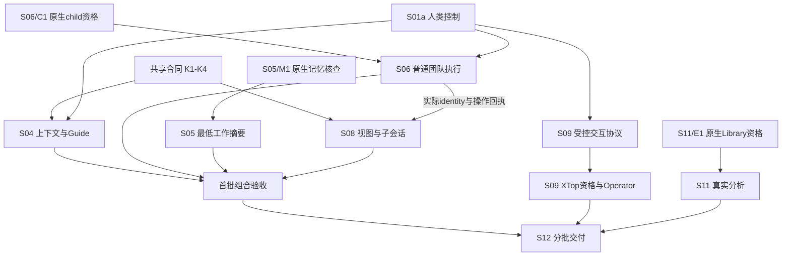

# 下一阶段可实施规格与并行工作图

> 本文保留规格阶段的范围与基线。首批代码及当时边界见 [Phase 1 实施记录](../../assessment/2026-09-23/next-stage/implementation-phase1.md) 与 [覆盖矩阵](../../assessment/2026-09-23/next-stage/phase1-coverage.md)；后续代码、当前本地资格与仍未解除的真实工具门见 [#52 后续实施记录](../../assessment/2026-09-23/next-stage/implementation-remaining.md)。以下“本轮只交付规格”是原规格编写时的历史描述。

日期：2026-09-23；核查基线：`1a79cb1514364aa049e775d7b18bbb063a223092`。用户通过 `/to-spec` 要求将已确认的 Q1～Q19 转成具体规格，并明确保持现有架构、代码归属与并行开发。本轮只交付规格与 Issue，不修改运行代码或恢复 trial30/Claude/EDA 测试。

## Problem Statement

原清单已归并为8个工作包29项，但实施者仍需猜测现有接口、改哪些文件及如何证明完成。若按功能名称各自造服务，开发会扩大并产生多个控制者；若所有工作都等待整个架构“完成”，又无法并行交付。

## Solution

按可独立验收的行为分成12份规格，原29项一一映射。每份明确现状证据、路径/符号、拟议增量、用户场景、输入输出及错误、正反验收、依赖、文件所有权和回滚。共享约定只扩展现有接口，不新增基础架构。

用户已确认测试边界：复用现有Host/Fabric公开接口与夹具；Desktop仅验证关键真人操作；真实模型与EDA分别资格验证。本文的“可派工”表示任务与边界足够清楚；受依赖/资格门阻塞的子切片不能提前执行，测试命令均为实施后的计划。

## User Stories

1. 作为工程师，我希望独立Guide帮我安排工作且随时可返回，从而不被长任务占住对话。
2. 作为工程师，我希望打开任何子Agent的真实上下文和轨迹，从而能检查、跟进和纠偏。
3. 作为工程师，我希望暂停、重开、退出和恢复语义可靠，从而能信任长时间无人盯守的任务。
4. 作为研究员，我希望每代使用实际反馈决定下一动作，从而减少重复和无效尝试。
5. 作为Library工程师，我希望有独立数据洞察视图，从而快速比较并查到原始依据。
6. 作为EDA工程师，我希望在同一工具进程内持续交互，从而能开展manual ECO。
7. 作为Pack作者，我希望已有SOP能变成可验证和交付的方法，从而减少客户适配成本。
8. 作为开发负责人，我希望每份spec有清晰文件归属与依赖，从而可以并行派工而不引入第二系统。
9. 作为用户，我希望收到可安装版本与真实验收范围，从而无需构建源码或猜测产品成熟度。

## Implementation Decisions

### 12份规格、29项任务

| Spec | 原任务（唯一主归属） | 当前可开始的子切片 | 主代码范围 |
| --- | --- | --- | --- |
| [S01 控制与恢复](S01-control-recovery.md) / [#53](https://github.com/lluzi/hima_harness_reforge_polishing/issues/53) | A1、A3 | human hold最小反例与合同 | Fabric/Ledger/recovery/Host；Desktop生命周期 |
| [S02 Site政策](S02-site-policy.md) / [#54](https://github.com/lluzi/hima_harness_reforge_polishing/issues/54) | A2 | Site再发现文件反例 | sites/Channel发现路径 |
| [S03 结果有效性](S03-result-validity.md) / [#55](https://github.com/lluzi/hima_harness_reforge_polishing/issues/55) | A5 | 建议/完成门四组合与best证据反例 | node-turns/choosers；XTop compare/Reader |
| [S04 Guide](S04-guide.md) / [#56](https://github.com/lluzi/hima_harness_reforge_polishing/issues/56) | B1、B2、B3 | 角色语言、context/address合同 | index/remote Preparation及原生会话 |
| [S05 工作记忆](S05-memory.md) / [#57](https://github.com/lluzi/hima_harness_reforge_polishing/issues/57) | M1、M2、H3 | M1真实API/载体核查；H3条件合同 | Session seam、workshop/experience |
| [S06 团队](S06-team.md) / [#58](https://github.com/lluzi/hima_harness_reforge_polishing/issues/58) | C1、C3 | 原生child API资格与委派合同 | DSH Agent、tools/Workshop、Fabric授权 |
| [S07 研究反馈](S07-feedback.md) / [#59](https://github.com/lluzi/hima_harness_reforge_polishing/issues/59) | H1 | 冻结反馈A/B与Reader反例 | DTCO研究合同；XTop endpoint反馈 |
| [S08 工作区](S08-workbench.md) / [#51](https://github.com/lluzi/hima_harness_reforge_polishing/issues/51) | D1、D2、C2 | 现有dock上的冻结视图和导航 | client/HimaWorkbench、NodeCard、原生Session UI |
| [S09 交互EDA](S09-interactive-eda.md) / [#50](https://github.com/lluzi/hima_harness_reforge_polishing/issues/50) | F1、F2、F3 | 精确terminal consumer与guard资格 | profile、Job/Channel、Pack XTop adapter |
| [S10 Pack作者](S10-pack-authoring.md) / [#60](https://github.com/lluzi/hima_harness_reforge_polishing/issues/60) | G1、G2、G3 | 五阶段模板/反例/恢复合同 | authoring/packs/release/现有skills |
| [S11 Library](S11-library.md) / [#49](https://github.com/lluzi/hima_harness_reforge_polishing/issues/49) | E1、E2、E3、E4 | 离线报告/失败fixture；E1阻塞记录 | 原生API局部adapter、原Reader/Insight renderer |
| [S12 验证与交付](S12-delivery.md) / [#61](https://github.com/lluzi/hima_harness_reforge_polishing/issues/61) | J1、J2、J3 | 回归矩阵、包身份/验收receipt | 现有test入口、package-trial、发布文档 |

原NXT前缀省略展示；总数29，无重复主归属。历史合并编号继续由 [backlog](../../polishing-backlog.md) 维护，不新建另一套任务语义。Issue编号及状态见 [issue-map.json](issue-map.json)。

### 保持架构稳定

[共享接口与文件所有权](contracts.md) 定义K1上下文/表达、K2记忆引用、K3控制/委派/交互回执、K4报告视图。它们是现有接口合同，不是四个新组件。

保留DSH Agent Loop、多会话、Pack、Fabric、Site、Job、Ledger、Workshop、Knowledge/Archive、现有Workbench。业务由一个Run owner负责，判据由原Judge决定，UI与memory投影事实。禁止因功能愿望新增agent框架、任务调度daemon、memory服务/向量库、分析runtime、控制数据库或图引擎。

新helper/renderer/adapter只能位于原职责内，spec写明其必要消费者；先复用已通过实现和证据，再补缺口。模型升级不弥补含糊规格，预算和权限由代码执法。对旧持久schema的变更必须走原显式版本/迁移纪律，不能静默让旧App读新home。

### 并行不是同时写公共文件

采用主集成者+最多3个worker，每波最多选3条无共享写入线。每个实施分支记录起始SHA、拥有文件、上游合同版本、最小测试与rollback；commit即push，合入后同步main。

1. **合同/反例波次**：S04语言与context、S05原生memory核查、S06原生child核查可并行；S01/S02/S03现状反例、S08冻结视图、S10作者材料可换班推进。具体启动不必等待三条调查全部完成。
2. **首批实现波次**：S01a控制、S04 context/独立任务接线、S06普通child、S05最低工作摘要、S08子会话/导航，按合同依赖集成。S02、S03、S10材料独立推进。图中依赖指输出合同/子切片，不要求整份spec完成。
3. **领域接入波次**：S07反馈、S09协议/工具资格、S11语义/renderer可分别推进；XTop共享文件按S03→S07→S09串行，Liberty真实数据必须等E1通过。
4. **交付波次**：S12随每个切片补验证与包身份；达到首批场景就形成候选版，不等所有领域能力完成。完整L5或恢复Claude测试须另行安排预算与授权。

M1与C1可以同版本读同一DSH API证据，但各自核实本消费者需要的语义。S04/S06/S08之间仅合同相互引用：不得将UI完成设成child创建的前置，也不得让普通团队等Operator。D1/D2及child只读样例可用冻结fixture并行；C2实际读取/跟进必须等S06提供真实identity/capabilities/回执，再做组合验收。

## Testing Decisions

首批验收场景：Guide发起独立任务 → 子Agent实际工作、可查看和跟进 → Guide仍可对话 → 结果有出处 → 人类暂停跨恢复保持 → 原授权和预算内接续。至少涵盖两工作区隔离、旧摘要与新暂停冲突、重复请求、原Job已完成、child旧输入、取消未知、UI迟到响应。

L0/L2使用现有测试入口，一次新构建供相关子集共用；新增测试登记 `test/contract-groups.json`。L3仅覆盖关键接收者、双模式、关窗/退出/重开、错误修复和证据下钻。L4模型与Site独立验证；L5用于业务闭环与客户价值，不能用replay或静态审查冒充。

每份spec列出的命令是未来实施验证计划；本轮只检查文件/符号、任务覆盖、文档引用、测试归组和依赖一致性，没有运行产品、真实模型或EDA。

## Out of Scope

恢复暂停试验、马上实现29项、架构重写、新云服务、自动更新活动Pack、扩大客户权限、以完整P&R阻塞普通发布、承诺普遍+5% Fmax收益。

## Further Notes

## 2026-09-23 Phase 1 implementation status

The current implementation is tracked in the [Phase 1 coverage matrix](../../assessment/2026-09-23/next-stage/phase1-coverage.md). It separates local mechanics, active corrections, blocked qualifications and future L4/L5 evidence; it does not mark all 29 tasks complete.

实施分配按现行模型政策：常规Terra/Medium，控制/权限/恢复/结果真实性复核Sol/High。规格编写采用主会话整合与两位Terra/Medium工作agent并行；未运行产品模型，开发token/成本未计量。

每个slice完成必须有用户可见增量、当前源SHA/构建身份、正反测试结果、未测范围、独立可恢复commit及远端SHA。资格门未过时交付精确阻塞和已能用的部分，不新增临时平台“绕过去”。

## 本轮规格核对记录

- 29个原NXT任务在12份spec中各有一个主归属；#49/#50/#51继续使用，新增#53～#61，#52保留总跟踪。
- 常规独立文档复核发现的测试错组、目标地址不一致及依赖歧义已修正；issue-map补齐。此复核不代表尚未实现的控制/权限已经通过安全验收。
- 按当前 `test/contract-groups.json` 静态校验所有具体测试命令，核对现有代码路径/关键符号、共享写入归属、模板章节、本地链接和差异空白。
- 一次仅列举测试清单的命令因默认Node 22而被版本门拒绝，未运行测试；后续依据JSON静态核对。实际实施使用README规定的Node 24。
- 无产品源码、依赖或部署配置变化；无产品模型/EDA调用。原生Library资格阻塞与trial暂停保持。
