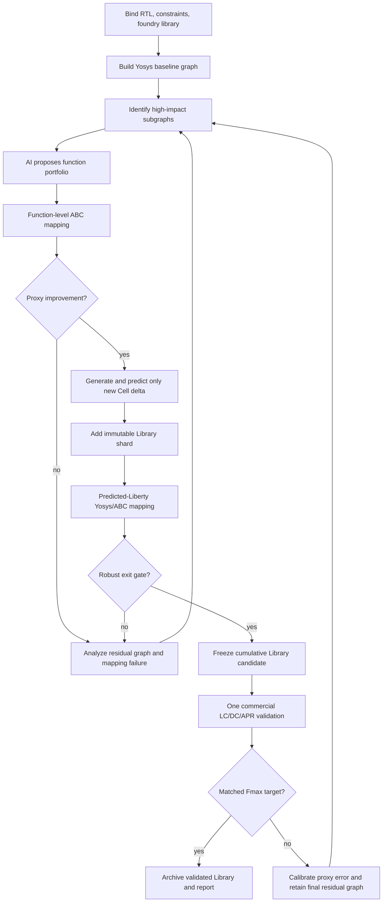

# Library Function Richness Optimization Framework

状态：方法论设计，尚未实施。本文定义 `custom-cell-fmax-dtco` Pack 下一阶段的业务方法，
不表示 5% Fmax 已达成，也不授权新增 Hima Runtime 组件。实现必须继续使用现有 Pack、
Fabric、Workshop、Job、Reader、Judge 和资产归档机制。

## 1. 背景与问题

本 Campaign 的目标不是生成很多定制 Cell，而是用持续增长的定制 Library，为综合器提供
能够改变目标 design 最大频率的新增映射选择。客户购买的是这项业务能力及最终收益。

现有试验已经给出三个重要事实：

1. 第一轮 47-Cell Library 在 DC 中采用 21 个候选、307 个实例，最终 route 仍保留 250 个
   定制实例，但 matched Fmax 只提升约 0.193%。这证明“大量采用”不等于“大幅影响关键
   timing graph”。
2. 修正 APR 压力和 DCCK clock tree 后，同一类 Library 在最终 route 保留 222 个定制实例，
   matched Fmax 反而下降约 0.179%。这证明单条 timing path、单颗 Cell delay 和总采用数都
   不能稳定预测最大频率收益。
3. 当前多代流程会重复生成、layout 和表征旧 Cell，并在每代重新运行 foundry DC/APR。
   它把昂贵的商业 EDA 当成试错引擎，没有把已经形成的 Cell 当作可复用资产。

现有 Pack 已经证明了输入绑定、候选 Boolean identity、Cell 生成、layout、预测表征、
Library Compiler、DC adoption、Innovus route 和 matched comparison 的技术链路。下一阶段
不重建这些能力，而是改变它们的顺序、复用规则和决策依据。

## 2. 正向目标

Framework 建设一个单调增长的定制 Library，并在商业 EDA 之前完成多轮无许可证优化：

- 从 RTL 和网表构建组合逻辑与 timing influence graph；
- 优先寻找能够改变多个关键 endpoint 的高影响力 subgraph；
- 将 subgraph 转成综合器可采用的候选 Library function；
- 使用 Yosys/ABC 对累计 Library 做真实 technology mapping；
- 根据映射采用、关键深度、残余瓶颈和代理 timing 继续生成新候选；
- 旧 Cell 及其 SPICE、GDS、LEF、Liberty 和映射证据按 hash 复用；
- 只有代理优化达到出口门时，才进行一次商业 LC/DC/APR 最终验证。

“Function richness”不是函数数量。它表示一个 Library 对目标 timing graph 提供的、可被
综合器实际使用且具有正边际价值的映射选择集合。一个函数只有满足以下条件才增加
richness：

- 与已有 Library function 不等价；
- 能覆盖一个已识别的高影响力 subgraph；
- 综合器能在当前累计 Library 中采用；
- 替换后能够降低关键逻辑深度或 delay，而不是只移动同样的瓶颈；
- 与已选候选共同使用时仍有边际收益。

## 3. 优化问题

设：

- `L0` 为 foundry Library；
- `Lk` 为第 k 轮已经形成的累计 custom Library；
- `ΔLk` 为本轮新增的 Library functions；
- `Gk` 为当前 RTL/映射网表与可用 timing evidence 构成的图；
- `P` 为目标 `reg2reg` timing path families；
- `D(p, L)` 为代理综合在 Library `L` 下对路径族 `p` 得到的 delay。

Library 的状态转移必须满足：

```text
L(k+1) = L(k) union DeltaL(k)
```

已经接纳的 Cell 不从 Library 中删除，也不重新生成。`MAX_CELLS` 应表示一轮允许新增的
Cell 数量，而不是累计 Library 的总容量。累计上限由 Campaign 时间、存储和代理综合成本
约束。

主目标是降低最差 timing frontier：

```text
minimize  max over p in P of D(p, L(k) union DeltaL(k))
```

候选 `c` 的边际价值是：

```text
MarginalValue(c | L) = Objective(L) - Objective(L union {c})
```

候选组合不能把重叠 cone 的收益重复相加。Portfolio 选择需要在同一个映射结果中计算，
并在必要时只对少量高价值、归因不清的候选做无许可证 ablation。商业 DC/APR 不用于
per-candidate ablation。

## 4. 高影响力 graph 发现

### 4.1 图模型

组合网表按以下方式表达：

- instance 是顶点；
- net 是有向 hyperedge；
- sequential Cell 是 graph boundary；
- 每个组合顶点保留 Cell function、逻辑级数、代理 delay、fanout、slew/load 信息；
- 每个路径样本保留 beginpoint、endpoint、path family、slack 和实例顺序；
- RTL elaboration graph 与 mapped graph 保留可追溯关系；无法追溯时明确标记未知。

已有 post-route evidence 可以作为 graph 校准输入，但不是首次使用 Pack 的必要输入。
没有商业网表时，Yosys 从 RTL 建立初始映射图。存在客户已有 baseline database/report 时，
Pack 可以读取其允许的网表和 timing evidence，加强初始图。

### 4.2 Influence vector

不使用一个不可解释的总分替代全部事实。每个 subgraph `S` 至少保留以下 influence vector：

| 维度 | 含义 |
| --- | --- |
| worst-endpoint relief | 理想替换后对当前最差 endpoint 的最大可释放 delay |
| criticality mass | 按负 slack 和接近 WNS 的程度加权的路径质量 |
| path-family coverage | 覆盖多少关键路径族及其路径样本 |
| dominator coverage | 是否支配多个关键 endpoint 或关键 reconvergence |
| removable depth | 可以由一个 Library function 消除的逻辑级数与现有 Cell delay |
| boundary compactness | cut 的输入、输出和跨边界 net 是否足够紧凑，便于综合映射 |
| repetition | 同一 Boolean/topology 在关键图中的非重叠出现次数 |
| fanout/load exposure | 新 Cell 需要承担的负载、slew 和潜在 buffer 代价 |
| overlap | 与其他候选共享多少逻辑，防止收益重复计算 |
| mapping feasibility | Yosys/ABC 是否实际采用，以及采用位置是否属于关键图 |

高 fanout、出现次数多或图中心度高都不能单独代表影响力。候选必须同时连接 timing
criticality、可替换 delay 和综合可用性。

### 4.3 反事实收益

对候选 `c` 替换 subgraph `S`，在路径族 `p` 上估算：

```text
Relief(c, p) = CurrentConeDelay(S, p)
             - PredictedCellDelay(c, load, slew)
             - BoundaryPenalty(c, fanout, wiring)
```

Framework 随后在整张代理 timing graph 上重新传播 arrival time，寻找新的最差 endpoint。
只有在考虑 path migration 后仍能降低最差 frontier 的候选，才具有主要收益。原来的
“假设整段 cone delay 归零”只保留为绝对上界，不能作为排序主体。

优先研究的结构包括：

- 多条关键路径共享的 dominator cone；
- 多个寄存器 endpoint 共用的逻辑前缀或中段；
- 具有 reconvergence、可以减少重复逻辑的 cone；
- 深度较大但 cut boundary 较小的 K-feasible cut；
- 同一 Boolean function 在多个关键 path family 中重复出现的 subgraph；
- 已接纳 custom Cell 周围仍能继续融合的上下游逻辑；
- 能够同时消除逻辑级数和关键 net fanout 的结构。

## 5. 无许可证综合代理

### 5.1 工具定位

Yosys/ABC 是收益评估代理，不是最终事实来源。它承担高频、低成本、可重复的
technology mapping 与逻辑优化。当前 Site 的既有 `iic-osic-celluzi:2026.06` 容器已经
提供 Yosys 0.66 和 `yosys-abc`；正式实现需要固定源码 commit、容器 digest、脚本和工具
输出。当前 `86f2ddebc-dirty` 二进制可以做兼容性 POC，不能单独成为可复现产品基线。

### 5.2 两级代理

**Function-level proxy** 在候选尚未物理实现时运行：

- 从 RTL/网表生成 AIG；
- 枚举目标区域的 K-cuts；
- 用 SIS Genlib 或精简 Liberty 表达候选 function、初始 area 和 delay 假设；
- 运行 ABC mapping，观察候选是否可达、是否采用、逻辑深度是否下降；
- 计算 break-even candidate delay，而不是假定新 Cell 为零 delay。

**Predicted-cell proxy** 在免费 Cell 生成和预测表征后运行：

- `bool2cmos` 只生成本轮新增 Cell；
- 开源 layout 只处理本轮新增 Cell；
- learned model 产生带 provenance 的预测 Liberty；
- Yosys/ABC 使用 `L0 + Lk + ΔLk` 的累计 Library 重新映射；
- 比较 function-level 假设与 predicted-cell mapping，淘汰不能保持收益的候选组合。

### 5.3 每轮最少映射

一轮不为每颗 Cell 启动一条综合链。最低需要：

1. 当前累计 Library `Lk` 的 reference mapping；
2. `Lk + ΔLk` 的 augmented mapping。

从 augmented netlist 直接统计候选采用位置、实例数、关键路径族覆盖和残余最差 cone。
只有多个候选共同出现且边际归因不清时，才对少量候选组做 bounded ablation。所有
ablation 仍使用 Yosys/ABC。

### 5.4 代理结果

每次代理评估必须输出：

- 输入 RTL、约束摘要、Library shards 和工具身份 hash；
- mapping script 与完整日志；
- mapped netlist；
- reference/augmented 关键深度和 proxy delay；
- 每个 custom Cell 的采用实例与所在 subgraph/path family；
- 新的最差 endpoint 与 path migration；
- 未采用候选及原因；
- 当前 proxy 与最近一次商业结果的相关性和误差范围。

代理只产生预测与筛选依据，不能写 `comparison_valid`、最终 Fmax 或 physical adoption。

## 6. Library 资产模型

累计 Library 使用现有 Pack 资产目录和 manifest，不建设另一套管理系统。每一轮产生一个
不可变 shard：

```text
custom-library/
  baseline-reference.json
  shards/
    0001/
      functions.json
      cells/
      predicted.lib
      mapping-evidence.json
    0002/
      ... only new cells ...
  cumulative-manifest.json
```

`cumulative-manifest.json` 只引用 shards、候选 identity、文件 hash、来源和状态。旧 shard
按字节复用，不重新运行 generator、layout 或 prediction。未被当前 design 采用的 Cell 仍是
Library 资产，保留其负结果和适用条件；未来其他 design 或新的 Library 组合仍可使用。

最终工具可以读取多个 Library shards。若 Library Compiler 或 P&R 要求单一文件，Pack 在
最终出口组装一次累计 Liberty/LEF，并记录每个输入 shard 的 hash；组装不是重新生成 Cell。

候选的生命周期沿用现有记录，不增加产品实体：

```text
discovered -> proxy-mapped -> materialized -> predicted -> cumulative
           -> proxy-rejected (retained as knowledge)
cumulative -> commercially-adopted -> route-retained -> final-benefit
```

状态描述证据成熟度，不改变 Pack runtime 逻辑，也不删除资产。

## 7. AI 的职责

AI 是 inner loop 的研究控制者，不是数值伪造者。它负责：

- 解释当前 residual timing graph；
- 提出新的高影响力 subgraph 搜索视角；
- 调整 K-cut、reconvergence、dominator、重复 cone 和 portfolio 策略；
- 根据 mapping failure 判断是 function 不可达、delay 不够、边界过宽还是与已有 Cell 冗余；
- 编写有界的候选生成和 portfolio 代码；
- 决定下一轮应扩大、缩小或改变哪些搜索区域；
- 说明预计收益、代理误差和商业出口理由。

Pack 的确定性实现负责：

- graph 与 Library identity；
- Boolean equivalence；
- Yosys/ABC 命令、预算和输出捕获；
- 代理 metric 的独立重算；
- shard 复用和累计 manifest；
- Judge 和最终商业证据。

这样第二梯队模型只需在明确的残余问题上研究，不必重新理解完整工具链。

## 8. Workflow



`M` 每次只验证一个已经通过代理收敛门的累计 Library candidate。商业结果失败后，不能
立即改变几个候选再重跑商业流程；必须先校准代理、完成新的无许可证优化闭环并形成新的
出口候选。

## 9. 代理收敛与商业出口

代理出口不能只看一个乐观分数。至少同时满足：

1. augmented mapping 的最差 reg2reg proxy delay 优于 reference mapping；
2. 改善覆盖目标关键 path families，没有只优化大量非瓶颈路径；
3. 新的最差 endpoint 仍在可解释范围内，path migration 已记录；
4. 候选在 mapped netlist 中实际采用；
5. portfolio 的收益去除了明显重叠；
6. optimistic、nominal、conservative 三组 candidate delay/load 假设下，改善方向一致；
7. 预测改善大于 5% 目标与已知代理误差之和；
8. 连续迭代的新增边际价值低于有证据的收敛阈值，或已达到目标。

代理误差没有校准时，不能假设为零。第一次方法校准使用已有 AES commercial evidence：
比较 Yosys/ABC 对已生成 47-Cell Library 的采用判断、关键图排序与 DC/Innovus 已知结果。
若采用相关性或收益方向不成立，先修正 Library model、约束和 graph metric，不进入新的
商业 Campaign。

最终商业验证保持控制变量：

- 同一 RTL、约束、工具、核数、floorplan、pin plan、APR pressure 和 DCCK CTS 方法；
- foundry arm 与 cumulative custom arm 的唯一变量是 Library；
- foundry baseline 在同一输入 identity 下只运行一次；
- 后续读取可以复用该 frozen baseline，除非输入或方法 hash 改变；
- custom arm 只为新的累计 Library candidate 运行一次；
- 只有 final database 的 matched Fmax 达到 5% 才完成目标。

## 10. 失败与知识资产

Framework 把失败定位到明确层级：

| 失败位置 | 可形成的结论 |
| --- | --- |
| function 不被 ABC 采用 | 当前 Library/脚本下缺少 mapper reachability |
| 被采用但 proxy frontier 不变 | 候选不影响最差 timing graph，或瓶颈迁移抵消收益 |
| function proxy 有效、predicted proxy 无效 | candidate delay、load 或物理边界不满足 break-even |
| proxy 达标、DC 不采用 | Yosys/ABC 与商业 mapper 的相关性模型不足 |
| DC 采用、route 无收益 | RC、fanout、CTS、拥塞或路径迁移抵消逻辑收益 |
| final Fmax 提升不足 | 本 Library candidate 未达目标；结果用于校准，不宣称成功 |

每轮保留 residual graph、候选算法、代理脚本、映射网表、采用事实、预测、校准误差与停止
原因。失败候选不进入下一轮新增集合，但其 function identity 和失败原因继续用于去重与
研究，避免重复试错。

## 11. 在现有代码架构中的落点

不新增 Hima Runtime、图引擎、资产服务或模型服务。修改集中在现有 Pack：

| 现有文件 | 方法升级 |
| --- | --- |
| `flow/domain/mine_timing_route.py` | 构建 influence graph、dominator/reconvergence/path-family metric、反事实 arrival propagation 和 path migration |
| `flow/domain/mine_patterns.py` | 只在高影响力区域枚举 K-cuts，保留 function identity、overlap 和 cut boundary |
| `flow/ai_research_runner.py` | 把 residual graph、break-even、proxy mapping、校准误差和累计 Library 状态交给 AI |
| `flow/stages.py` | 调用现有容器中的 Yosys/ABC；只生成本轮 delta；复用旧 shard 和 frozen baseline；最终才调用 LC/DC/APR |
| `flow/domain/_generation_projection.py` | 投影累计 manifest、delta jobs 和旧资产复用关系，不再把旧候选变成本轮 generation jobs |
| `flow/read-stage.py` | 独立重算 proxy mapping、Library growth、reuse identity 和最终商业证据 |
| `graph.yml` | 将多轮循环移到商业验证之前；commercial validate 不再位于每次候选迭代中 |
| `contract.yml`、`semantics.yml`、`rules/`、`choosers/` | 声明 proxy metric、累计 Library、出口门和预算；不改变 Runtime 语义 |
| `knowledge/full-mining-method.md` | 解释 graph influence、代理限制、Library 单调增长和商业出口纪律 |

Yosys/ABC adapter 是 `custom-cell-fmax-dtco` Pack 内部实现。其外部 interface 只接受当前
workspace、累计 Library manifest、候选 delta 和固定 proxy profile，返回 hash-bound mapping
record。复杂的脚本、临时格式、工具差异和解析逻辑留在该实现内部，避免让 Fabric、Desktop
或 AI 学习低层调用细节。

## 12. 验证分级

| 层级 | 本 Framework 的最低验证 |
| --- | --- |
| L0 | Pack schema、graph 引用、YAML、Python、发布副本和源码 provenance 检查 |
| L1 | influence graph、dominator、overlap、反事实传播、portfolio、累计 manifest 和 invalidation 纯逻辑测试 |
| L2 | 小型 RTL + 两个 Library shards 的真实 Yosys/ABC mapping；证明旧 Cell 不重建、reference 不重跑 |
| L3 | 只验证 Campaign 图、代理结果、Library growth 和最终出口状态的可见性；不运行 EDA |
| L4 | 当前 AES RTL/Library 上一次 Yosys/ABC 兼容性与相关性校准；零商业许可证 Job |
| L5 | 代理出口通过后，一次 LC/DC/APR matched final validation |

日常开发不使用 Desktop 或商业 EDA。L5 失败后先回到保留下来的 L4 proxy/calibration 数据，
不得原样重复 L5。

## 13. 实施前沿

方法升级按三个有明确退出条件的切片推进：

1. **代理校准 POC。** 使用现有 AES RTL、foundry Library 和已保存的 47-Cell predicted
   Liberty，完成 reference/augmented Yosys/ABC mapping。核对 21 个 DC-adopted candidates
   是否被代理识别，以及 proxy frontier 是否能解释最终 `-0.179%`。不启动 LC/DC/APR。
2. **累计 Library inner loop。** 在现有 Pack 中实现 influence graph、delta shard、两级
   mapping 和代理 Judge。用合成 RTL 及真实 AES L4 证明旧 Cell、旧 shard 和 baseline 不重跑。
3. **商业出口。** 只有代理相关性和出口门通过后，冻结一个累计 Library candidate，执行
   一次 matched LC/DC/APR。结果达不到 5% 时归档并回到代理校准，不立即重跑商业流程。

这三个切片完成前，不再把“完整 Campaign 跑起来”当作方法进展。完成标准是优化器能用
License-free feedback 改变 Library function portfolio，并能解释为什么某个累计 Library
值得占用最终商业验证预算。

## 14. 开源工具来源

- Yosys 官方源码：<https://github.com/YosysHQ/yosys>。主项目采用 ISC License；官方构建
  支持通过 submodule 带入匹配的 ABC 源码。
- Yosys 使用的 ABC submodule：<https://github.com/YosysHQ/abc>。
- Berkeley ABC 上游：<https://github.com/berkeley-abc/abc>。其 `copyright.txt` 允许免费
  使用、复制、修改和分发；实现固定所用 commit，并保留对应版权和许可文本。
- Yosys technology mapping 文档：
  <https://yosyshq.readthedocs.io/projects/yosys/en/latest/cmd/index_passes_techmap.html>。
  `abc` 支持 Liberty/Genlib、delay target、约束、外部 ABC executable 和映射调试材料。

产品基线优先从官方 Yosys release source archive 或递归 submodule checkout 构建，记录
Yosys commit、ABC commit、编译参数和容器 digest。Site 当前二进制只作为兼容性 POC。
